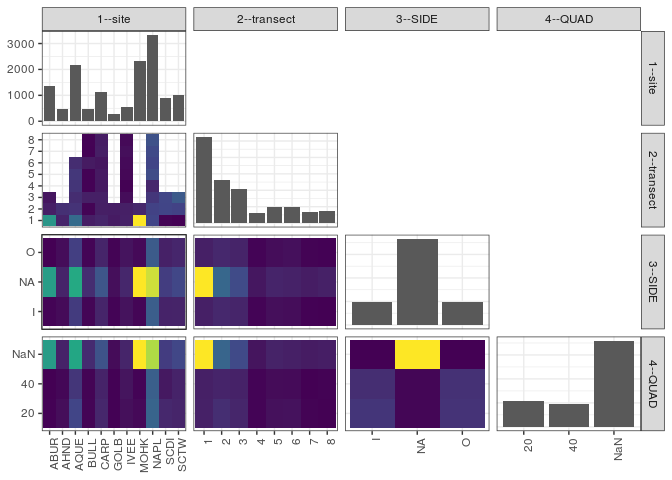

popler\_data\_organizatonal\_hierarchy
================
Hao Ye, Ellen Bledsoe
5/21/2019

``` r
library(tidyverse)

all_data <- readRDS("list_df_full.RDS")
df <- as_tibble(all_data[[params$dataset_index]])

cat("My project metadata key is ", 
    df$proj_metadata_key[1], "!!")
```

    ## My project metadata key is  2 !!

``` r
# figure out the spatial replication levels
df %>% 
  select(starts_with("spatial_replication_level")) %>%
  NCOL() %>%
  {./2} -> num_sr_levels
```

``` r
# transform the names of the variables
#   - get rid of the `spatial_replication_level_#_label` columns
sr_vars <- character(num_sr_levels)
for (i in seq(num_sr_levels))
{
  new_name <- paste0(i, "--", as.character(df[[1, paste0("spatial_replication_level_", i, "_label")]]))
  old_name <- paste0("spatial_replication_level_", i)
  sr_vars[i] <- new_name
  df <- rename(df, !!new_name := !!old_name)
}
```

``` r
# extract just the spatial replication level data
data_organization <- df %>%
  select(sr_vars)
```

``` r
# make pair-wise density plots to summarize organizational structure:
# 
library(GGally)
my_bin <- function(data, mapping, ...) {
  ggplot(data = data, mapping = mapping) +
    geom_bin2d(...) +
    scale_fill_viridis_c()
}

pm <- ggpairs(data_organization, 
                      lower = list(discrete = my_bin), 
                      upper = list(discrete = "blank"), 
              cardinality_threshold = NULL) + 
  theme_bw() + 
  theme(axis.text.x = element_text(angle = 90, hjust = 1))

print(pm)
```

    ## plot: [1,1] [==>------------------------------------------] 6% est: 0s
    ## plot: [1,2] [=====>---------------------------------------] 12% est: 1s
    ## plot: [1,3] [=======>-------------------------------------] 19% est: 0s
    ## plot: [1,4] [==========>----------------------------------] 25% est: 0s
    ## plot: [2,1] [=============>-------------------------------] 31% est: 0s
    ## plot: [2,2] [================>----------------------------] 38% est: 2s
    ## plot: [2,3] [===================>-------------------------] 44% est: 2s
    ## plot: [2,4] [=====================>-----------------------] 50% est: 1s
    ## plot: [3,1] [========================>--------------------] 56% est: 1s
    ## plot: [3,2] [===========================>-----------------] 62% est: 1s
    ## plot: [3,3] [==============================>--------------] 69% est: 1s
    ## plot: [3,4] [=================================>-----------] 75% est: 1s
    ## plot: [4,1] [====================================>--------] 81% est: 0s
    ## plot: [4,2] [======================================>------] 88% est: 0s
    ## plot: [4,3] [=========================================>---] 94% est: 0s
    ## plot: [4,4] [=============================================]100% est: 0s



``` r
# generate contingency tables to summarize organizational structure:
#   - level_i vs. level_j (i < j)

cols <- expand.grid(i = seq(num_sr_levels), 
                    j = seq(num_sr_levels)) %>%
  filter(i < j)

sr_tables <- purrr::pmap(cols, function(i, j) {
    data_organization %>%
      select(sr_vars[c(i, j)]) %>%
      table()
  })
```

``` r
# loop over tables and output
purrr::map(sr_tables, knitr::kable)
```

    ## [[1]]
    ## 
    ## 
    ##            1     2     3     4     5     6     7     8
    ## -----  -----  ----  ----  ----  ----  ----  ----  ----
    ## ABUR    1107   153    99     0     0     0     0     0
    ## AHND     188   274     0     0     0     0     0     0
    ## AQUE     740   293   250   308   323   251     0     0
    ## BULL     144    14   157     8     9   126     8    11
    ## CARP     193   151   156   114   121    98   150   140
    ## GOLB     130   146     0     0     0     0     0     0
    ## IVEE     164   159    51     6    31    41    62    38
    ## MOHK    2123   206     0     0     0     0     0     0
    ## NAPL     431   412   321   206   496   437   477   538
    ## SCDI      13   433   442     0     0     0     0     0
    ## SCTW       2   407   601     0     0     0     0     0
    ## 
    ## [[2]]
    ## 
    ## 
    ##           I     NA     O
    ## -----  ----  -----  ----
    ## ABUR     78   1216    65
    ## AHND    104    244   114
    ## AQUE    408   1318   439
    ## BULL     86    308    83
    ## CARP    251    620   252
    ## GOLB     78    122    76
    ## IVEE    142    263   147
    ## MOHK     86   2141   102
    ## NAPL    681   1979   658
    ## SCDI    240    424   224
    ## SCTW    243    506   261
    ## 
    ## [[3]]
    ## 
    ## 
    ##    I     NA     O
    ## ----  -----  ----
    ##  436   4358   441
    ##  556   1541   551
    ##  504   1082   491
    ##  158    328   156
    ##  249    501   230
    ##  229    465   259
    ##  137    408   152
    ##  128    458   141
    ## 
    ## [[4]]
    ## 
    ## 
    ##          20    40    NaN
    ## -----  ----  ----  -----
    ## ABUR     79    73   1207
    ## AHND    124    99    239
    ## AQUE    491   378   1296
    ## BULL     91    84    302
    ## CARP    275   245    603
    ## GOLB     79    79    118
    ## IVEE    135   158    259
    ## MOHK    105    87   2137
    ## NAPL    741   701   1876
    ## SCDI    276   184    428
    ## SCTW    259   245    506
    ## 
    ## [[5]]
    ## 
    ## 
    ##   20    40    NaN
    ## ----  ----  -----
    ##  461   442   4332
    ##  638   506   1504
    ##  531   475   1071
    ##  167   165    310
    ##  271   228    481
    ##  282   223    448
    ##  162   137    398
    ##  143   157    427
    ## 
    ## [[6]]
    ## 
    ## 
    ##         20     40    NaN
    ## ---  -----  -----  -----
    ## I     1315   1077      5
    ## NA      93     87   8961
    ## O     1247   1169      5
