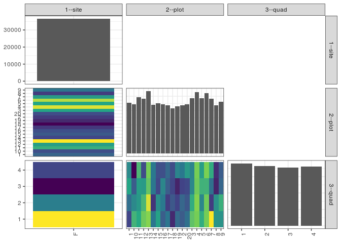

popler\_data\_organizatonal\_hierarchy
================
Hao Ye, Ellen Bledsoe
5/21/2019

``` r
library(tidyverse)

all_data <- readRDS("list_df_full.RDS")
df <- as_tibble(all_data[[params$dataset_index]])

cat("My project metadata key is ", 
    df$proj_metadata_key[1], "!!")
```

    ## My project metadata key is  29 !!

``` r
# figure out the spatial replication levels
df %>% 
  select(starts_with("spatial_replication_level")) %>%
  NCOL() %>%
  {./2} -> num_sr_levels
```

``` r
# transform the names of the variables
#   - get rid of the `spatial_replication_level_#_label` columns
sr_vars <- character(num_sr_levels)
for (i in seq(num_sr_levels))
{
  new_name <- paste0(i, "--", as.character(df[[1, paste0("spatial_replication_level_", i, "_label")]]))
  old_name <- paste0("spatial_replication_level_", i)
  sr_vars[i] <- new_name
  df <- rename(df, !!new_name := !!old_name)
}
```

``` r
# extract just the spatial replication level data
data_organization <- df %>%
  select(sr_vars)
```

``` r
# make pair-wise density plots to summarize organizational structure:
# 
library(GGally)
my_bin <- function(data, mapping, ...) {
  ggplot(data = data, mapping = mapping) +
    geom_bin2d(...) +
    scale_fill_viridis_c()
}

pm <- ggpairs(data_organization, 
                      lower = list(discrete = my_bin), 
                      upper = list(discrete = "blank"), 
              cardinality_threshold = NULL) + 
  theme_bw() + 
  theme(axis.text.x = element_text(angle = 90, hjust = 1))

print(pm)
```



``` r
# generate contingency tables to summarize organizational structure:
#   - level_i vs. level_j (i < j)

cols <- expand.grid(i = seq(num_sr_levels), 
                    j = seq(num_sr_levels)) %>%
  filter(i < j)

sr_tables <- purrr::pmap(cols, function(i, j) {
    data_organization %>%
      select(sr_vars[c(i, j)]) %>%
      table()
  })
```

``` r
# loop over tables and output
purrr::map(sr_tables, knitr::kable)
```

    ## [[1]]
    ## 
    ## 
    ##          1     10     11     12     13     14     15     16     17     18     19      2     20      3      4      5      6      7      8      9
    ## ---  -----  -----  -----  -----  -----  -----  -----  -----  -----  -----  -----  -----  -----  -----  -----  -----  -----  -----  -----  -----
    ## F     1777   1726   1958   1916   2179   1707   1750   1725   1675   1581   1644   1678   1720   1932   2147   1935   2110   1908   1682   1813
    ## 
    ## [[2]]
    ## 
    ## 
    ##          1      2      3      4
    ## ---  -----  -----  -----  -----
    ## F     9522   9152   8878   9011
    ## 
    ## [[3]]
    ## 
    ## 
    ##         1     2     3     4
    ## ---  ----  ----  ----  ----
    ## 1     394   434   488   461
    ## 10    504   460   417   345
    ## 11    493   475   481   509
    ## 12    530   507   477   402
    ## 13    544   574   524   537
    ## 14    441   380   442   444
    ## 15    485   464   397   404
    ## 16    418   445   457   405
    ## 17    441   388   418   428
    ## 18    371   412   396   402
    ## 19    430   393   366   455
    ## 2     416   426   393   443
    ## 20    435   411   398   476
    ## 3     521   496   459   456
    ## 4     536   543   531   537
    ## 5     496   457   502   480
    ## 6     536   532   503   539
    ## 7     589   387   436   496
    ## 8     472   468   367   375
    ## 9     470   500   426   417
