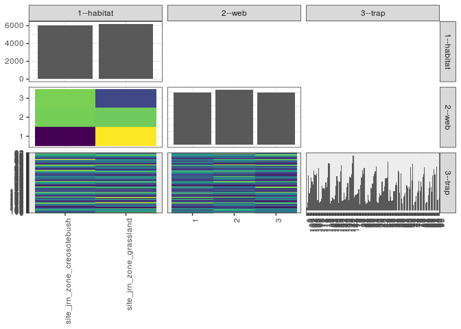

popler\_data\_organizatonal\_hierarchy
================
Hao Ye, Ellen Bledsoe
5/21/2019

``` r
library(tidyverse)

all_data <- readRDS("list_df_full.RDS")
df <- as_tibble(all_data[[params$dataset_index]])

cat("My project metadata key is ", 
    df$proj_metadata_key[1], "!!")
```

    ## My project metadata key is  697 !!

``` r
# figure out the spatial replication levels
df %>% 
  select(starts_with("spatial_replication_level")) %>%
  NCOL() %>%
  {./2} -> num_sr_levels
```

``` r
# transform the names of the variables
#   - get rid of the `spatial_replication_level_#_label` columns
sr_vars <- character(num_sr_levels)
for (i in seq(num_sr_levels))
{
  new_name <- paste0(i, "--", as.character(df[[1, paste0("spatial_replication_level_", i, "_label")]]))
  old_name <- paste0("spatial_replication_level_", i)
  sr_vars[i] <- new_name
  df <- rename(df, !!new_name := !!old_name)
}
```

``` r
# extract just the spatial replication level data
data_organization <- df %>%
  select(sr_vars)
```

``` r
# make pair-wise density plots to summarize organizational structure:
# 
library(GGally)
my_bin <- function(data, mapping, ...) {
  ggplot(data = data, mapping = mapping) +
    geom_bin2d(...) +
    scale_fill_viridis_c()
}

pm <- ggpairs(data_organization, 
                      lower = list(discrete = my_bin), 
                      upper = list(discrete = "blank"), 
              cardinality_threshold = NULL) + 
  theme_bw() + 
  theme(axis.text.x = element_text(angle = 90, hjust = 1))

print(pm)
```



``` r
# generate contingency tables to summarize organizational structure:
#   - level_i vs. level_j (i < j)

cols <- expand.grid(i = seq(num_sr_levels), 
                    j = seq(num_sr_levels)) %>%
  filter(i < j)

sr_tables <- purrr::pmap(cols, function(i, j) {
    data_organization %>%
      select(sr_vars[c(i, j)]) %>%
      table()
  })
```

``` r
# loop over tables and output
purrr::map(sr_tables, knitr::kable)
```

    ## [[1]]
    ## 
    ## 
    ##                                  1      2      3
    ## ---------------------------  -----  -----  -----
    ## site_jrn_zone_creosotebush    1822   2108   2113
    ## site_jrn_zone_grassland       2187   2100   1900
    ## 
    ## [[2]]
    ## 
    ## 
    ##                                0    1   10   100   101   102   103   104   105   106   107   108   109   11   110   111   112   113   114   115   116   117   118   119   12   120   121   122   123   124   125   126   127   128   129   13   130   131   132   133   134   135   136   137   138   139   14   140   141   142   143   144   145   15   16   17   18   19    2   20   21   22   23   24   25   26   27   28   29    3   30   31   32   33   34   35   36   37   38   39    4   40   41   42   43   44   45   46   47   48   49    5   50   51   52   53   54   55   56   57   58   59    6   60   61   62   63   64   65   66   67   68   69    7   70   71   72   73   74   75   76   77   78   79    8   80   81   82   83    84   85   86   87   88   89    9   90   91   92   93   94   95   96   97   98   99
    ## ---------------------------  ---  ---  ---  ----  ----  ----  ----  ----  ----  ----  ----  ----  ----  ---  ----  ----  ----  ----  ----  ----  ----  ----  ----  ----  ---  ----  ----  ----  ----  ----  ----  ----  ----  ----  ----  ---  ----  ----  ----  ----  ----  ----  ----  ----  ----  ----  ---  ----  ----  ----  ----  ----  ----  ---  ---  ---  ---  ---  ---  ---  ---  ---  ---  ---  ---  ---  ---  ---  ---  ---  ---  ---  ---  ---  ---  ---  ---  ---  ---  ---  ---  ---  ---  ---  ---  ---  ---  ---  ---  ---  ---  ---  ---  ---  ---  ---  ---  ---  ---  ---  ---  ---  ---  ---  ---  ---  ---  ---  ---  ---  ---  ---  ---  ---  ---  ---  ---  ---  ---  ---  ---  ---  ---  ---  ---  ---  ---  ---  ---  ----  ---  ---  ---  ---  ---  ---  ---  ---  ---  ---  ---  ---  ---  ---  ---  ---
    ## site_jrn_zone_creosotebush     6   10   49    45    22    55    50    49    78    69    52    61    26   63    17     5    19    38    37    37    43    56    51    60   91    68    19    16     8    17    26     9    45    53    38   19    49    43    82    21    29    25    14    31    42    46   14    58    69    63    81    91    27   29   26   29   33   41   12   53   49   68   61   87    7   12   13   23   18   16   45   51   43   62   71   65   89   20   10   28   28   31   43   45   36   35   54   39   60   98   19   43   25   22   23   28   37   54   48   39   59   84   30   88   31   13   16   25   19   39   44   43   32   55   89   34   75    7   15   20   32   22   23   54   34   31   41   68   70   103   14   21   23   32   39   58   39   36   64   64   60   66   85   25   29   32
    ## site_jrn_zone_grassland        5   19   76    17    59    62    52    45    64    59    74    71    11   90    10    27    24    51    42    44    32    44    33    58   79    99     6    18    38    28    13    46    43    70    68    8    55    98    80    14     7    40    25    19    42    51   24    62    49    66    87   106    20   25   30   29   28   34   11   39   68   76   70   66   24   11   13   33   19   16   36   27   53   60   60   74   68   13   16   18   32   22   59   59   32   51   62   77   58   75   16   30   24   12   15   42   33   37   53   53   83   54   35   45   10   11   32   29   45   51   45   38   55   22   66   75   92   13   14   13   19   41   49   51   35   71   45   52   61    52   11    9    7   22   41   45   45   30   61   84   68   63   71   11   11   15
    ## 
    ## [[3]]
    ## 
    ## 
    ##   0    1   10   100   101   102   103   104   105   106   107   108   109   11   110   111   112   113   114   115   116   117   118   119   12   120   121   122   123   124   125   126   127   128   129   13   130   131   132   133   134   135   136   137   138   139   14   140   141   142   143   144   145   15   16   17   18   19    2   20   21   22   23   24   25   26   27   28   29    3   30   31   32   33   34   35   36   37   38   39    4   40   41   42   43   44   45   46   47   48   49    5   50   51   52   53   54   55   56   57   58   59    6   60   61   62   63   64   65   66   67   68   69    7   70   71   72   73   74   75   76   77   78   79    8   80   81   82   83   84   85   86   87   88   89    9   90   91   92   93   94   95   96   97   98   99
    ## ---  ---  ---  ----  ----  ----  ----  ----  ----  ----  ----  ----  ----  ---  ----  ----  ----  ----  ----  ----  ----  ----  ----  ----  ---  ----  ----  ----  ----  ----  ----  ----  ----  ----  ----  ---  ----  ----  ----  ----  ----  ----  ----  ----  ----  ----  ---  ----  ----  ----  ----  ----  ----  ---  ---  ---  ---  ---  ---  ---  ---  ---  ---  ---  ---  ---  ---  ---  ---  ---  ---  ---  ---  ---  ---  ---  ---  ---  ---  ---  ---  ---  ---  ---  ---  ---  ---  ---  ---  ---  ---  ---  ---  ---  ---  ---  ---  ---  ---  ---  ---  ---  ---  ---  ---  ---  ---  ---  ---  ---  ---  ---  ---  ---  ---  ---  ---  ---  ---  ---  ---  ---  ---  ---  ---  ---  ---  ---  ---  ---  ---  ---  ---  ---  ---  ---  ---  ---  ---  ---  ---  ---  ---  ---  ---  ---
    ##   3   10   49    17    28    38    42    12    42    40    47    38    17   53    10     7    16    27    24    25    18    32    22    35   62    61    11    17    25    17    12    14    36    52    22    4    40    57    56    14     9    13    19    10    33    22    6    56    32    45    55    59    19   18   11   14   17   22   13   20   46   46   36   55   20   11    8   26   14   13   19   34   44   47   42   34   43    9   11    6   25    9   23   32   26   17   37   26   24   43   21   24   33   17   19   32   30   35   49   43   46   56   21   34    9    7   13   14   22   24   31   27   31   23   56   36   44   11    9   18   15   35   16   40   15   60   28   33   29   38   12    7   11   21   24   33   27   21   44   41   28   41   50   10   18    6
    ##   0    5   32    29    22    48    46    49    56    53    36    53    11   51    13    16    16    27    33    33    43    26    22    51   47    56     9     8     8    23    15    11    14    36    33    5    37    37    63    10     8    17    11     7    29    43    6    19    52    24    46    65    10   31   30   19   19   27    8   25   30   43   29   34    4   10    5   19    9   17   34   21   28   45   37   62   59   11   10   21   22   32   33   44   27   33   46   48   60   80    7   34   11   10    5   26   22   33   32   26   57   40   25   51   17   10   26   28   13   37   31   25   37   41   32   26   72    4    9    8   19   12   16   41   29   23   32   44   47   56    8   10    3   22   35   29   26   33   29   50   65   27   64   17   12   32
    ##   8   14   44    16    31    31    14    33    44    35    43    41     9   49     4     9    11    35    22    23    14    42    40    32   61    50     5     9    13     5    12    30    38    35    51   18    27    47    43    11    19    35     9    33    22    32   26    45    34    60    67    73    18    5   15   25   25   26    2   47   41   55   66   64    7    2   13   11   14    2   28   23   24   30   52   43   55   13    5   19   13   12   46   28   15   36   33   42   34   50    7   15    5    7   14   12   18   23   20   23   39   42   19   48   15    7    9   12   29   29   27   29   19   13   67   47   51    5   11    7   17   16   40   24   25   19   26   43   55   61    5   13   16   11   21   41   31   12   52   57   35   61   42    9   10    9
