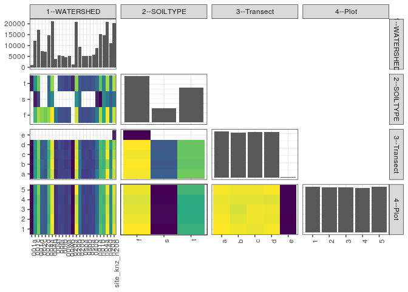

popler\_data\_organizatonal\_hierarchy
================
Hao Ye, Ellen Bledsoe
5/21/2019

``` r
library(tidyverse)

all_data <- readRDS("list_df_full.RDS")
df <- as_tibble(all_data[[params$dataset_index]])

cat("My project metadata key is ", 
    df$proj_metadata_key[1], "!!")
```

    ## My project metadata key is  748 !!

``` r
# figure out the spatial replication levels
df %>% 
  select(starts_with("spatial_replication_level")) %>%
  NCOL() %>%
  {./2} -> num_sr_levels
```

``` r
# transform the names of the variables
#   - get rid of the `spatial_replication_level_#_label` columns
sr_vars <- character(num_sr_levels)
for (i in seq(num_sr_levels))
{
  new_name <- paste0(i, "--", as.character(df[[1, paste0("spatial_replication_level_", i, "_label")]]))
  old_name <- paste0("spatial_replication_level_", i)
  sr_vars[i] <- new_name
  df <- rename(df, !!new_name := !!old_name)
}
```

``` r
# extract just the spatial replication level data
data_organization <- df %>%
  select(sr_vars)
```

``` r
# make pair-wise density plots to summarize organizational structure:
# 
library(GGally)
my_bin <- function(data, mapping, ...) {
  ggplot(data = data, mapping = mapping) +
    geom_bin2d(...) +
    scale_fill_viridis_c()
}

pm <- ggpairs(data_organization, 
                      lower = list(discrete = my_bin), 
                      upper = list(discrete = "blank"), 
              cardinality_threshold = NULL) + 
  theme_bw() + 
  theme(axis.text.x = element_text(angle = 90, hjust = 1))

print(pm)
```

    ## plot: [1,1] [==>------------------------------------------] 6% est: 0s
    ## plot: [1,2] [=====>---------------------------------------] 12% est: 2s
    ## plot: [1,3] [=======>-------------------------------------] 19% est: 1s
    ## plot: [1,4] [==========>----------------------------------] 25% est: 1s
    ## plot: [2,1] [=============>-------------------------------] 31% est: 1s
    ## plot: [2,2] [================>----------------------------] 38% est: 1s
    ## plot: [2,3] [===================>-------------------------] 44% est: 1s
    ## plot: [2,4] [=====================>-----------------------] 50% est: 1s
    ## plot: [3,1] [========================>--------------------] 56% est: 1s
    ## plot: [3,2] [===========================>-----------------] 62% est: 1s
    ## plot: [3,3] [==============================>--------------] 69% est: 1s
    ## plot: [3,4] [=================================>-----------] 75% est: 1s
    ## plot: [4,1] [====================================>--------] 81% est: 1s
    ## plot: [4,2] [======================================>------] 88% est: 0s
    ## plot: [4,3] [=========================================>---] 94% est: 0s
    ## plot: [4,4] [=============================================]100% est: 0s



``` r
# generate contingency tables to summarize organizational structure:
#   - level_i vs. level_j (i < j)

cols <- expand.grid(i = seq(num_sr_levels), 
                    j = seq(num_sr_levels)) %>%
  filter(i < j)

sr_tables <- purrr::pmap(cols, function(i, j) {
    data_organization %>%
      select(sr_vars[c(i, j)]) %>%
      table()
  })
```

``` r
# loop over tables and output
purrr::map(sr_tables, knitr::kable)
```

    ## [[1]]
    ## 
    ## 
    ##                     f      s      t
    ## --------------  -----  -----  -----
    ## 001a                0      0   1088
    ## 001c             6147   1047   4934
    ## 001d             7916   2214   7018
    ## 002c             7562      0      0
    ## 002d             7209      0      0
    ## 004a             7663   3617   3456
    ## 004b             9114   4485   7615
    ## 004f             3840      0      0
    ## 00fa             2707      0   2686
    ## 00fb             2667      0   2628
    ## 00wa             2440      0   2202
    ## 00wb             2792      0   2513
    ## 020a                0      0   1325
    ## 020b             8477   4897   7518
    ## 020d             2724   3597   3014
    ## 0spa             2558      0   2585
    ## 0spb             2472      0   2742
    ## 0sua             2655      0   2615
    ## 0sub             2881      0   2853
    ## n01a             4085   1152   3503
    ## n01b             8013    511   6721
    ## n04a             5703   4743   4314
    ## n04d             9022   3912   7935
    ## n20a             4273   3055   3827
    ## site_knz_n20b    8408   3786   8087
    ## 
    ## [[2]]
    ## 
    ## 
    ##                     a      b      c      d     e
    ## --------------  -----  -----  -----  -----  ----
    ## 001a              287    294    247    260     0
    ## 001c             3126   3025   2879   3098     0
    ## 001d             4195   4181   4378   4394     0
    ## 002c             1967   2046   1751   1798     0
    ## 002d             1642   1780   1869   1918     0
    ## 004a             3790   3656   3557   3733     0
    ## 004b             5203   5445   5231   5335     0
    ## 004f              853    974   1068    945     0
    ## 00fa             1270   1329   1329   1465     0
    ## 00fb             1311   1303   1395   1286     0
    ## 00wa             1262   1125   1200   1055     0
    ## 00wb             1356   1267   1371   1311     0
    ## 020a              324    311    343    347     0
    ## 020b             5131   5392   5239   5130     0
    ## 020d             2410   2313   2445   2167     0
    ## 0spa             1201   1394   1268   1280     0
    ## 0spb             1226   1322   1370   1296     0
    ## 0sua             1318   1322   1215   1415     0
    ## 0sub             1461   1324   1550   1399     0
    ## n01a             2494   1915   2047   2284     0
    ## n01b             3708   3777   3882   3878     0
    ## n04a             3809   3610   3693   3648     0
    ## n04d             5536   4645   5460   5228     0
    ## n20a             3014   2558   2543   3040     0
    ## site_knz_n20b    5082   5139   4803   4580   677
    ## 
    ## [[3]]
    ## 
    ## 
    ##           a       b       c       d     e
    ## ---  ------  ------  ------  ------  ----
    ## f     29981   30326   29918   30426   677
    ## s      9613    8845    9422    9136     0
    ## t     23382   22276   22793   22728     0
    ## 
    ## [[4]]
    ## 
    ## 
    ##                     1      2      3      4      5
    ## --------------  -----  -----  -----  -----  -----
    ## 001a              224    209    223    211    221
    ## 001c             2380   2444   2507   2321   2476
    ## 001d             3451   3392   3398   3334   3573
    ## 002c             1457   1483   1552   1559   1511
    ## 002d             1476   1418   1435   1439   1441
    ## 004a             3003   2848   2911   2966   3008
    ## 004b             4251   4394   4191   4183   4195
    ## 004f              779    751    756    757    797
    ## 00fa             1033   1056   1117   1065   1122
    ## 00fb             1089   1028   1053   1054   1071
    ## 00wa              974    933    934    907    894
    ## 00wb             1056   1036   1007   1148   1058
    ## 020a              268    299    260    224    274
    ## 020b             4314   4142   4102   3952   4382
    ## 020d             1819   1908   1867   1882   1859
    ## 0spa              996   1029    992   1130    996
    ## 0spb             1038   1097    970   1035   1074
    ## 0sua             1072   1026   1094   1098    980
    ## 0sub             1105   1173   1135   1116   1205
    ## n01a             1845   1813   1754   1636   1692
    ## n01b             3182   3027   3027   3049   2960
    ## n04a             2947   2898   2986   2904   3025
    ## n04d             4336   4202   4099   3955   4277
    ## n20a             2249   2320   2229   2135   2222
    ## site_knz_n20b    4151   3962   3965   4072   4131
    ## 
    ## [[5]]
    ## 
    ## 
    ##           1       2       3       4       5
    ## ---  ------  ------  ------  ------  ------
    ## f     24835   24387   24075   23736   24295
    ## s      7302    7456    7556    7410    7292
    ## t     18358   18045   17933   17986   18857
    ## 
    ## [[6]]
    ## 
    ## 
    ##           1       2       3       4       5
    ## ---  ------  ------  ------  ------  ------
    ## a     12793   12678   12538   12350   12617
    ## b     12548   12239   11935   12241   12484
    ## c     12383   12485   12524   12245   12496
    ## d     12627   12386   12437   12164   12676
    ## e       144     100     130     132     171
