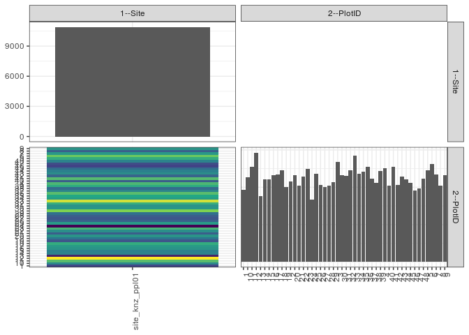

popler\_data\_organizatonal\_hierarchy
================
Hao Ye, Ellen Bledsoe
5/21/2019

``` r
library(tidyverse)

all_data <- readRDS("list_df_full.RDS")
df <- as_tibble(all_data[[params$dataset_index]])

cat("My project metadata key is ", 
    df$proj_metadata_key[1], "!!")
```

    ## My project metadata key is  752 !!

``` r
# figure out the spatial replication levels
df %>% 
  select(starts_with("spatial_replication_level")) %>%
  NCOL() %>%
  {./2} -> num_sr_levels
```

``` r
# transform the names of the variables
#   - get rid of the `spatial_replication_level_#_label` columns
sr_vars <- character(num_sr_levels)
for (i in seq(num_sr_levels))
{
  new_name <- paste0(i, "--", as.character(df[[1, paste0("spatial_replication_level_", i, "_label")]]))
  old_name <- paste0("spatial_replication_level_", i)
  sr_vars[i] <- new_name
  df <- rename(df, !!new_name := !!old_name)
}
```

``` r
# extract just the spatial replication level data
data_organization <- df %>%
  select(sr_vars)
```

``` r
# make pair-wise density plots to summarize organizational structure:
# 
library(GGally)
my_bin <- function(data, mapping, ...) {
  ggplot(data = data, mapping = mapping) +
    geom_bin2d(...) +
    scale_fill_viridis_c()
}

pm <- ggpairs(data_organization, 
                      lower = list(discrete = my_bin), 
                      upper = list(discrete = "blank"), 
              cardinality_threshold = NULL) + 
  theme_bw() + 
  theme(axis.text.x = element_text(angle = 90, hjust = 1))

print(pm)
```



``` r
# generate contingency tables to summarize organizational structure:
#   - level_i vs. level_j (i < j)

cols <- expand.grid(i = seq(num_sr_levels), 
                    j = seq(num_sr_levels)) %>%
  filter(i < j)

sr_tables <- purrr::pmap(cols, function(i, j) {
    data_organization %>%
      select(sr_vars[c(i, j)]) %>%
      table()
  })
```

``` r
# loop over tables and output
purrr::map(sr_tables, knitr::kable)
```

    ## [[1]]
    ## 
    ## 
    ##                     1    10    11    12    13    14    15    16    17    18    19     2    20    21    22    23    24    25    26    27    28    29     3    30    31    32    33    34    35    36    37    38    39     4    40    41    42    43    44    45    46    47    48     5     6     7     8     9
    ## ---------------  ----  ----  ----  ----  ----  ----  ----  ----  ----  ----  ----  ----  ----  ----  ----  ----  ----  ----  ----  ----  ----  ----  ----  ----  ----  ----  ----  ----  ----  ----  ----  ----  ----  ----  ----  ----  ----  ----  ----  ----  ----  ----  ----  ----  ----  ----  ----  ----
    ## site_knz_ppl01    193   226   255   293   176   222   221   232   235   245   200   216   232   204   229   250   166   236   206   200   204   213   268   233   231   246   284   236   242   255   223   211   244   251   204   254   207   228   221   211   191   196   223   245   262   234   205   232
