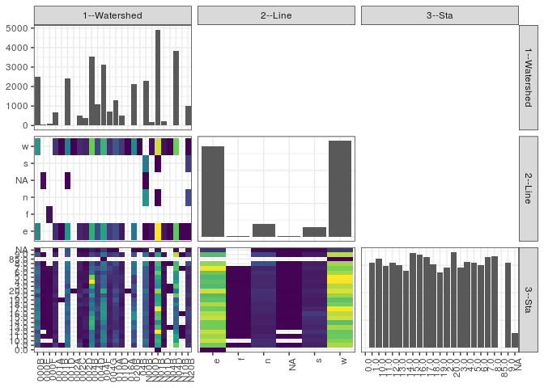

popler\_data\_organizatonal\_hierarchy
================
Hao Ye, Ellen Bledsoe
5/21/2019

``` r
library(tidyverse)

all_data <- readRDS("list_df_full.RDS")
df <- as_tibble(all_data[[params$dataset_index]])

cat("My project metadata key is ", 
    df$proj_metadata_key[1], "!!")
```

    ## My project metadata key is  754 !!

``` r
# figure out the spatial replication levels
df %>% 
  select(starts_with("spatial_replication_level")) %>%
  NCOL() %>%
  {./2} -> num_sr_levels
```

``` r
# transform the names of the variables
#   - get rid of the `spatial_replication_level_#_label` columns
sr_vars <- character(num_sr_levels)
for (i in seq(num_sr_levels))
{
  new_name <- paste0(i, "--", as.character(df[[1, paste0("spatial_replication_level_", i, "_label")]]))
  old_name <- paste0("spatial_replication_level_", i)
  sr_vars[i] <- new_name
  df <- rename(df, !!new_name := !!old_name)
}
```

``` r
# extract just the spatial replication level data
data_organization <- df %>%
  select(sr_vars)
```

``` r
# make pair-wise density plots to summarize organizational structure:
# 
library(GGally)
my_bin <- function(data, mapping, ...) {
  ggplot(data = data, mapping = mapping) +
    geom_bin2d(...) +
    scale_fill_viridis_c()
}

pm <- ggpairs(data_organization, 
                      lower = list(discrete = my_bin), 
                      upper = list(discrete = "blank"), 
              cardinality_threshold = NULL) + 
  theme_bw() + 
  theme(axis.text.x = element_text(angle = 90, hjust = 1))

print(pm)
```



``` r
# generate contingency tables to summarize organizational structure:
#   - level_i vs. level_j (i < j)

cols <- expand.grid(i = seq(num_sr_levels), 
                    j = seq(num_sr_levels)) %>%
  filter(i < j)

sr_tables <- purrr::pmap(cols, function(i, j) {
    data_organization %>%
      select(sr_vars[c(i, j)]) %>%
      table()
  })
```

``` r
# loop over tables and output
purrr::map(sr_tables, knitr::kable)
```

    ## [[1]]
    ## 
    ## 
    ##            e    f      n   NA      s      w
    ## -----  -----  ---  -----  ---  -----  -----
    ## 000B    1153    0      0    0      0   1347
    ## 000E       0    0      0   64      0      0
    ## 000F       0   77      0    0      0      0
    ## 001A     296    0      0    0      0    367
    ## 001B       1    0      0    0      0      1
    ## 001D    1322    0      0    2      0   1080
    ## 002A       0    0      0    0      0      2
    ## 002C     251    0      0    0      0    262
    ## 002D     159    0      0    0      0    218
    ## 004B    1587    0      0    0      0   1936
    ## 004D     552    0      0    0      0    522
    ## 004F    1463    0      0    0      0   1641
    ## 004G     412    0      0    0      0    308
    ## 010A     593    0      0    0      0    716
    ## 010D     129    0      0    0      0    377
    ## 016A       0    0      0    0      0      1
    ## 020B     974    0      0    0      0   1158
    ## 04B        0    0      0    0      0      1
    ## N00B       1    0   1281    2   1028      0
    ## N00D      99    0      0    0      0     79
    ## N01B    2552    0      4    0      8   2347
    ## N01D     126    0      0    0      0     94
    ## N04B       4    0      0    0      0      1
    ## N04D    1867    0      0    0      0   1953
    ## N10B       6    0      0    0      0      0
    ## N20B      10    0    573    0    434      5
    ## 
    ## [[2]]
    ## 
    ## 
    ##         0.0   1.0   10.0   11.0   12.0   13.0   14.0   15.0   16.0   17.0   18.0   19.0   2.0   20.0   3.0   4.0   5.0   6.0   7.0   8.0   85.0   9.0   NA
    ## -----  ----  ----  -----  -----  -----  -----  -----  -----  -----  -----  -----  -----  ----  -----  ----  ----  ----  ----  ----  ----  -----  ----  ---
    ## 000B      0    94    141    112     86    160    122    175    168    143    132    145    71    163   114    98   108   141   125    86      0    93   23
    ## 000E      0     6      0      5      0      2      2      3      4      2      2      2     5      1     5     4     6     5     6     2      0     2    0
    ## 000F      0     6      0      2      4      2      3      5      5      5      6      5     6      5     5     3     4     4     7     0      0     0    0
    ## 001A      0    61     22     37     20     32     27     30     30     29     36     16    45     26    35    38    37    29    43    36      0    32    2
    ## 001B      0     1      0      0      0      0      0      0      0      0      0      1     0      0     0     0     0     0     0     0      0     0    0
    ## 001D      0   128    145    134    115    110     91    128    106    134    117    102    89    135    77   111   111   108   130   148      0    94   91
    ## 002A      0     0      0      0      0      0      0      0      0      0      0      0     0      2     0     0     0     0     0     0      0     0    0
    ## 002C      0    65     35     13     16     14     16     11     23     19     41     22    53     32    24    21    14    18    29    29      0    15    3
    ## 002D      0     6      3     22     11     28     31     28     17     13     32     28    17     56     6    17    15    16    10     6      0    11    4
    ## 004B      0   167    144    142    132    230    241    228    186    132    150    108   195    130   222   361   296   140   125   101      0    72   21
    ## 004D      0    35     53     28     43     33     40     67     57     92     65     55    47     51    46    61    63    44   101    38      0    48    7
    ## 004F      0   131    164    163    156    125    166    191    197    194    189    166   102    227   120   118   122    82   138   152      1   143   57
    ## 004G      0    23     40     29     23     35     27     26     30     24     28     28    26     32    24    36    45    59    79    50      0    52    4
    ## 010A      0    61    101     83     75     41     43     56     55     56     66    100    66     90    56    50    50    43    50    89      0    75    3
    ## 010D      0    28     27     18     29     20     20     17     31     23     11     18    23     38    30    34    44    28    18    22      0    27    0
    ## 016A      0     0      0      0      0      0      0      0      0      0      0      0     0      1     0     0     0     0     0     0      0     0    0
    ## 020B      0    58    117     91     89    141    110    189    181    126    104     86    35     88    97    54    65   141   123   141      0    92    4
    ## 04B       0     0      0      0      0      0      0      0      0      0      0      0     0      0     0     0     0     0     0     0      0     0    1
    ## N00B      0   118    149    103    107     88    109    104    122    101     99    107   108    138    99   102   106   111   110   173      0   144   14
    ## N00D      0     7      7      8     21     10      4      5      6      7     10      9    11      6     8     9    12     6    10     8      0    14    0
    ## N01B      1   216    235    223    371    247    180    269    259    367    232    223   216    307   174   192   225   279   225   247      0   213   10
    ## N01D      0    10      5     17     23     13     11     10      6     14      5      5    12     10    12    11    13     7    21     7      0     8    0
    ## N04B      0     0      0      0      0      1      0      0      0      0      0      0     0      2     1     0     0     0     0     1      0     0    0
    ## N04D      0   280    199    221    166    125    110    108    127    100    159    105   277    154   258   207   181   194   261   246      0   330   12
    ## N10B      0     0      0      1      1      1      0      0      1      0      0      0     0      0     0     0     0     0     1     0      0     1    0
    ## N20B      0    50     36     42     60     38     49     66     83     66     34     37    56     45    41    41    30    40    37    88      0    73   10
    ## 
    ## [[3]]
    ## 
    ## 
    ##       0.0   1.0   10.0   11.0   12.0   13.0   14.0   15.0   16.0   17.0   18.0   19.0   2.0   20.0   3.0   4.0   5.0   6.0   7.0   8.0   85.0   9.0    NA
    ## ---  ----  ----  -----  -----  -----  -----  -----  -----  -----  -----  -----  -----  ----  -----  ----  ----  ----  ----  ----  ----  -----  ----  ----
    ## e       1   648    762    709    757    649    650    762    737    643    722    609   580    765   573   598   567   617   820   697      0   577   114
    ## f       0     6      0      2      4      2      3      5      5      5      6      5     6      5     5     3     4     4     7     0      0     0     0
    ## n       0    98     99     73     58     52     67     64     69     86     82     97    98    106    84    83    81   101    79   201      0   168    12
    ## NA      0     6      0      5      0      2      2      3      4      2      2      2     6      1     5     4     6     5     6     2      0     2     3
    ## s       0    69     85     72    110     74     90    104    137     81     52     50    65     78    55    59    54    50    67    58      0    49    11
    ## w       0   724    677    633    619    717    590    778    742    830    654    605   705    784   732   821   835   718   670   712      1   743   126
