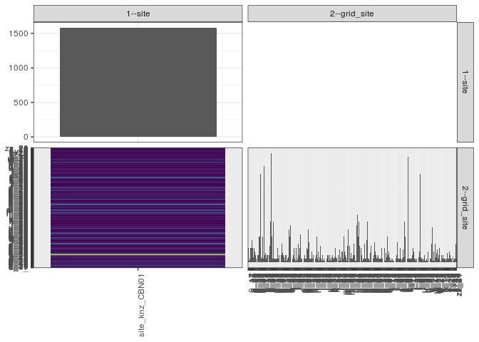

popler\_data\_organizatonal\_hierarchy
================
Hao Ye, Ellen Bledsoe
5/21/2019

``` r
library(tidyverse)

all_data <- readRDS("list_df_full.RDS")
df <- as_tibble(all_data[[params$dataset_index]])

cat("My project metadata key is ", 
    df$proj_metadata_key[1], "!!")
```

    ## My project metadata key is  761 !!

``` r
# figure out the spatial replication levels
df %>% 
  select(starts_with("spatial_replication_level")) %>%
  NCOL() %>%
  {./2} -> num_sr_levels
```

``` r
# transform the names of the variables
#   - get rid of the `spatial_replication_level_#_label` columns
sr_vars <- character(num_sr_levels)
for (i in seq(num_sr_levels))
{
  new_name <- paste0(i, "--", as.character(df[[1, paste0("spatial_replication_level_", i, "_label")]]))
  old_name <- paste0("spatial_replication_level_", i)
  sr_vars[i] <- new_name
  df <- rename(df, !!new_name := !!old_name)
}
```

``` r
# extract just the spatial replication level data
data_organization <- df %>%
  select(sr_vars)
```

``` r
# make pair-wise density plots to summarize organizational structure:
# 
library(GGally)
my_bin <- function(data, mapping, ...) {
  ggplot(data = data, mapping = mapping) +
    geom_bin2d(...) +
    scale_fill_viridis_c()
}

pm <- ggpairs(data_organization, 
                      lower = list(discrete = my_bin), 
                      upper = list(discrete = "blank"), 
              cardinality_threshold = NULL) + 
  theme_bw() + 
  theme(axis.text.x = element_text(angle = 90, hjust = 1))

print(pm)
```



``` r
# generate contingency tables to summarize organizational structure:
#   - level_i vs. level_j (i < j)

cols <- expand.grid(i = seq(num_sr_levels), 
                    j = seq(num_sr_levels)) %>%
  filter(i < j)

sr_tables <- purrr::pmap(cols, function(i, j) {
    data_organization %>%
      select(sr_vars[c(i, j)]) %>%
      table()
  })
```

``` r
# loop over tables and output
purrr::map(sr_tables, knitr::kable)
```

    ## [[1]]
    ## 
    ## 
    ##                    _   0_17   a_17   a_28   a_29   a_30   a_31   b_12   b_16   b_17   b_18   b_19   b_25   b_27   b_28   b_29   b_30   b_31   c_13   c_14   c_15   c_16   c_17   c_18   c_23   c_25   c_27   c_28   c_29   c_30   c_31   d_13   d_14   d_15   d_17   d_18   d_23   d_25   d_27   d_28   d_29   d_30   d_31   e_13   e_14   e_15   e_16   e_17   e_18   e_21   e_23   e_27   e_28   e_29   e_30   f_14   f_15   f_18   f_19   f_20   f_21   f_22   f_24   f_26   f_28   f_29   f_30   f_31   g_15   g_16   g_19   g_21   g_23   g_24   g_26   g_28   g_29   g_31   h_14   h_15   h_17   h_18   h_19   h_20   h_24   h_25   h_26   h_28   h_30   h_31   i_15   i_21   i_22   i_29   i_30   i_31   j_14   j_18   j_20   j_21   j_22   j_24   j_29   j_30   j_31   k_12   k_15   k_16   k_17   k_20   k_21   k_25   k_29   k_31   l_15   l_16   l_19   l_20   l_21   l_22   l_23   l_24   l_25   l_30   m_16   m_20   m_21   m_22   m_24   m_25   m_26   m_28   m_30   m_31   n_14   n_16   n_17   n_19   n_21   n_22   n_23   n_24   n_25   n_28   n_29   n_30   n_31   o_16   o_17   o_18   o_20   o_21   o_22   o_24   o_25   o_27   o_30   o_31   o_32   p_15   p_16   p_18   p_19   p_22   p_23   p_24   p_25   p_26   p_28   p_29   p_30   p_31   q_12   q_15   q_17   q_18   q_19   q_21   q_23   q_25   q_28   q_29   q_30   q_31   r_11   r_13   r_15   r_16   r_17   r_18   r_19   r_22   r_24   r_25   r_26   r_29   r_30   r_31   s_10   s_15   s_19   s_20   s_23   s_24   s_25   s_26   s_27   s_28   s_29   s_30   s_31   s_9   t_10   t_12   t_13   t_14   t_15   t_19   t_20   t_22   t_23   t_25   t_26   t_27   t_28   t_29   t_31   u_10   u_11   u_16   u_20   u_21   u_24   u_25   u_26   u_27   v_11   v_14   v_15   v_18   v_19   v_27   v_28   w_13   w_14   w_15   w_17   w_18   w_26   w_27   w_28   x_11   x_12   x_14   x_15   x_17   x_xx   y_10   y_12   y_13   y_14   y_15   y_20   y_23   y_26   y_7   y_8   z_10   z_11   z_12   z_19   z_22   z_24   zz_20   zz_21
    ## ---------------  ---  -----  -----  -----  -----  -----  -----  -----  -----  -----  -----  -----  -----  -----  -----  -----  -----  -----  -----  -----  -----  -----  -----  -----  -----  -----  -----  -----  -----  -----  -----  -----  -----  -----  -----  -----  -----  -----  -----  -----  -----  -----  -----  -----  -----  -----  -----  -----  -----  -----  -----  -----  -----  -----  -----  -----  -----  -----  -----  -----  -----  -----  -----  -----  -----  -----  -----  -----  -----  -----  -----  -----  -----  -----  -----  -----  -----  -----  -----  -----  -----  -----  -----  -----  -----  -----  -----  -----  -----  -----  -----  -----  -----  -----  -----  -----  -----  -----  -----  -----  -----  -----  -----  -----  -----  -----  -----  -----  -----  -----  -----  -----  -----  -----  -----  -----  -----  -----  -----  -----  -----  -----  -----  -----  -----  -----  -----  -----  -----  -----  -----  -----  -----  -----  -----  -----  -----  -----  -----  -----  -----  -----  -----  -----  -----  -----  -----  -----  -----  -----  -----  -----  -----  -----  -----  -----  -----  -----  -----  -----  -----  -----  -----  -----  -----  -----  -----  -----  -----  -----  -----  -----  -----  -----  -----  -----  -----  -----  -----  -----  -----  -----  -----  -----  -----  -----  -----  -----  -----  -----  -----  -----  -----  -----  -----  -----  -----  -----  -----  -----  -----  -----  -----  -----  -----  -----  -----  -----  -----  -----  -----  ----  -----  -----  -----  -----  -----  -----  -----  -----  -----  -----  -----  -----  -----  -----  -----  -----  -----  -----  -----  -----  -----  -----  -----  -----  -----  -----  -----  -----  -----  -----  -----  -----  -----  -----  -----  -----  -----  -----  -----  -----  -----  -----  -----  -----  -----  -----  -----  -----  -----  -----  -----  -----  -----  ----  ----  -----  -----  -----  -----  -----  -----  ------  ------
    ## site_knz_CBN01     8      1      2      8      8     12      8      3      8      6      4      2      4      4     14     14     48      2      3     14      2     52      4      5      2      4      4      4      9     22     59     14      2     22      2      2      2      2      2      8      2      4      8      4     10      5      4      3      1      4      4      1      2      3     18     14     20      2      2      4      8      2      1      8      1      2     10      4      8     15      2      2      1      2      4      2      2      8      7     18     11      2      2      2      6      2      4      2      2      4     14      2      6      1      3      9      2      1      4      1      2      1      4      2      4      4      1      4      2      1      3      4      2      2      3      8      3      2      4      1      7      3      1      6      6      2     14      6      4      3      1      9     18      9      2      5      2      2      4     10      4      1      1     20     26     14     22      9      8      4      1      2      2     10      2      2     12     22      2      2      1      5      9      3      2      4     11      6      4      2      3      4      2      2      2      2      8      2     10      8      1      5      3     14      4      6      3      1      2      1      2      1      1      2      2      4     11      2      2      2      8      2      1      2      7      3     22     14      2      2     57     2      2      2      2      2      4      8      6      2      2      1      2      9      3      6     48      3      2      2      1      2      4      1      1      2      1      6      2      2      2     10     19      1      6      1     10      3      5      7      2      4      8      1      4      2      4      2      2      2      1      2      5      2      2     6     4      2      2      3      1      2      2      10       2
