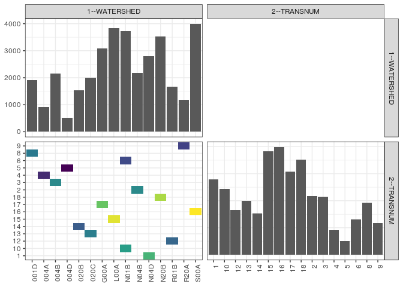

popler\_data\_organizatonal\_hierarchy
================
Hao Ye, Ellen Bledsoe
5/21/2019

``` r
library(tidyverse)

all_data <- readRDS("list_df_full.RDS")
df <- as_tibble(all_data[[params$dataset_index]])

cat("My project metadata key is ", 
    df$proj_metadata_key[1], "!!")
```

    ## My project metadata key is  762 !!

``` r
# figure out the spatial replication levels
df %>% 
  select(starts_with("spatial_replication_level")) %>%
  NCOL() %>%
  {./2} -> num_sr_levels
```

``` r
# transform the names of the variables
#   - get rid of the `spatial_replication_level_#_label` columns
sr_vars <- character(num_sr_levels)
for (i in seq(num_sr_levels))
{
  new_name <- paste0(i, "--", as.character(df[[1, paste0("spatial_replication_level_", i, "_label")]]))
  old_name <- paste0("spatial_replication_level_", i)
  sr_vars[i] <- new_name
  df <- rename(df, !!new_name := !!old_name)
}
```

``` r
# extract just the spatial replication level data
data_organization <- df %>%
  select(sr_vars)
```

``` r
# make pair-wise density plots to summarize organizational structure:
# 
library(GGally)
my_bin <- function(data, mapping, ...) {
  ggplot(data = data, mapping = mapping) +
    geom_bin2d(...) +
    scale_fill_viridis_c()
}

pm <- ggpairs(data_organization, 
                      lower = list(discrete = my_bin), 
                      upper = list(discrete = "blank"), 
              cardinality_threshold = NULL) + 
  theme_bw() + 
  theme(axis.text.x = element_text(angle = 90, hjust = 1))

print(pm)
```



``` r
# generate contingency tables to summarize organizational structure:
#   - level_i vs. level_j (i < j)

cols <- expand.grid(i = seq(num_sr_levels), 
                    j = seq(num_sr_levels)) %>%
  filter(i < j)

sr_tables <- purrr::pmap(cols, function(i, j) {
    data_organization %>%
      select(sr_vars[c(i, j)]) %>%
      table()
  })
```

``` r
# loop over tables and output
purrr::map(sr_tables, knitr::kable)
```

    ## [[1]]
    ## 
    ## 
    ##            1     10     12     13     14     15     16     17     18      2      3     4     5      6      8      9
    ## -----  -----  -----  -----  -----  -----  -----  -----  -----  -----  -----  -----  ----  ----  -----  -----  -----
    ## 001D       0      0      0      0      0      0      0      0      0      0      0     0     0      0   1919      0
    ## 004A       0      0      0      0      0      0      0      0      0      0      0   906     0      0      0      0
    ## 004B       0      0      0      0      0      0      0      0      0      0   2158     0     0      0      0      0
    ## 004D       0      0      0      0      0      0      0      0      0      0      0     0   507      0      0      0
    ## 020B       0      0      0      0   1535      0      0      0      0      0      0     0     0      0      0      0
    ## 020C       0      0      0   1993      0      0      0      0      0      0      0     0     0      0      0      0
    ## G00A       0      0      0      0      0      0      0   3078      0      0      0     0     0      0      0      0
    ## L00A       0      0      0      0      0   3829      0      0      0      0      0     0     0      0      0      0
    ## N01B       0   2439      0      0      0      0      0      0      0      0      0     0     0   1297      0      0
    ## N04B       0      0      0      0      0      0      0      0      0   2170      0     0     0      0      0      0
    ## N04D    2797      0      0      0      0      0      0      0      0      0      0     0     0      0      0      0
    ## N20B       0      0      0      0      0      0      0      0   3527      0      0     0     0      0      0      0
    ## R01B       0      0   1664      0      0      0      0      0      0      0      0     0     0      0      0      0
    ## R20A       0      0      0      0      0      0      0      0      0      0      0     0     0      0      0   1173
    ## S00A       0      0      0      0      0      0   3991      0      0      0      0     0     0      0      0      0
