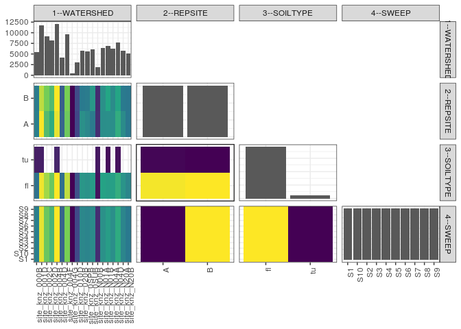

popler\_data\_organizatonal\_hierarchy
================
Hao Ye, Ellen Bledsoe
5/21/2019

``` r
library(tidyverse)

all_data <- readRDS("list_df_full.RDS")
df <- as_tibble(all_data[[params$dataset_index]])

cat("My project metadata key is ", 
    df$proj_metadata_key[1], "!!")
```

    ## My project metadata key is  765 !!

``` r
# figure out the spatial replication levels
df %>% 
  select(starts_with("spatial_replication_level")) %>%
  NCOL() %>%
  {./2} -> num_sr_levels
```

``` r
# transform the names of the variables
#   - get rid of the `spatial_replication_level_#_label` columns
sr_vars <- character(num_sr_levels)
for (i in seq(num_sr_levels))
{
  new_name <- paste0(i, "--", as.character(df[[1, paste0("spatial_replication_level_", i, "_label")]]))
  old_name <- paste0("spatial_replication_level_", i)
  sr_vars[i] <- new_name
  df <- rename(df, !!new_name := !!old_name)
}
```

``` r
# extract just the spatial replication level data
data_organization <- df %>%
  select(sr_vars)
```

``` r
# make pair-wise density plots to summarize organizational structure:
# 
library(GGally)
my_bin <- function(data, mapping, ...) {
  ggplot(data = data, mapping = mapping) +
    geom_bin2d(...) +
    scale_fill_viridis_c()
}

pm <- ggpairs(data_organization, 
                      lower = list(discrete = my_bin), 
                      upper = list(discrete = "blank"), 
              cardinality_threshold = NULL) + 
  theme_bw() + 
  theme(axis.text.x = element_text(angle = 90, hjust = 1))

print(pm)
```

    ## plot: [1,1] [==>------------------------------------------] 6% est: 0s
    ## plot: [1,2] [=====>---------------------------------------] 12% est: 1s
    ## plot: [1,3] [=======>-------------------------------------] 19% est: 1s
    ## plot: [1,4] [==========>----------------------------------] 25% est: 1s
    ## plot: [2,1] [=============>-------------------------------] 31% est: 0s
    ## plot: [2,2] [================>----------------------------] 38% est: 1s
    ## plot: [2,3] [===================>-------------------------] 44% est: 1s
    ## plot: [2,4] [=====================>-----------------------] 50% est: 1s
    ## plot: [3,1] [========================>--------------------] 56% est: 1s
    ## plot: [3,2] [===========================>-----------------] 62% est: 1s
    ## plot: [3,3] [==============================>--------------] 69% est: 1s
    ## plot: [3,4] [=================================>-----------] 75% est: 1s
    ## plot: [4,1] [====================================>--------] 81% est: 0s
    ## plot: [4,2] [======================================>------] 88% est: 0s
    ## plot: [4,3] [=========================================>---] 94% est: 0s
    ## plot: [4,4] [=============================================]100% est: 0s



``` r
# generate contingency tables to summarize organizational structure:
#   - level_i vs. level_j (i < j)

cols <- expand.grid(i = seq(num_sr_levels), 
                    j = seq(num_sr_levels)) %>%
  filter(i < j)

sr_tables <- purrr::pmap(cols, function(i, j) {
    data_organization %>%
      select(sr_vars[c(i, j)]) %>%
      table()
  })
```

``` r
# loop over tables and output
purrr::map(sr_tables, knitr::kable)
```

    ## [[1]]
    ## 
    ## 
    ##                     A      B
    ## --------------  -----  -----
    ## site_knz_000B    2790   2700
    ## site_knz_001D    6120   5540
    ## site_knz_002C    4330   4860
    ## site_knz_002D    3870   4280
    ## site_knz_004B    5940   6160
    ## site_knz_004D    2170   2030
    ## site_knz_004F    4750   4920
    ## site_knz_004G     230    240
    ## site_knz_010D    1480   1590
    ## site_knz_020B    3200   2650
    ## site_knz_0SPB    2990   2700
    ## site_knz_0SUB    2680   3380
    ## site_knz_N00B     950    890
    ## site_knz_N01A    3150   3200
    ## site_knz_N01B    3170   3730
    ## site_knz_N04A    3140   3090
    ## site_knz_N04D    3910   3720
    ## site_knz_N20A    3090   2650
    ## site_knz_N20B    2610   2570
    ## 
    ## [[2]]
    ## 
    ## 
    ##                     fl     tu
    ## --------------  ------  -----
    ## site_knz_000B     4300   1190
    ## site_knz_001D    10430   1230
    ## site_knz_002C     9190      0
    ## site_knz_002D     8150      0
    ## site_knz_004B    10690   1410
    ## site_knz_004D     4200      0
    ## site_knz_004F     9670      0
    ## site_knz_004G      470      0
    ## site_knz_010D     3070      0
    ## site_knz_020B     5850      0
    ## site_knz_0SPB     5690      0
    ## site_knz_0SUB     6060      0
    ## site_knz_N00B      850    990
    ## site_knz_N01A     6350      0
    ## site_knz_N01B     6200    700
    ## site_knz_N04A     6230      0
    ## site_knz_N04D     6840    790
    ## site_knz_N20A     5740      0
    ## site_knz_N20B     5180      0
    ## 
    ## [[3]]
    ## 
    ## 
    ##          fl     tu
    ## ---  ------  -----
    ## A     57160   3410
    ## B     58000   2900
    ## 
    ## [[4]]
    ## 
    ## 
    ##                    S1    S10     S2     S3     S4     S5     S6     S7     S8     S9
    ## --------------  -----  -----  -----  -----  -----  -----  -----  -----  -----  -----
    ## site_knz_000B     549    549    549    549    549    549    549    549    549    549
    ## site_knz_001D    1166   1166   1166   1166   1166   1166   1166   1166   1166   1166
    ## site_knz_002C     919    919    919    919    919    919    919    919    919    919
    ## site_knz_002D     815    815    815    815    815    815    815    815    815    815
    ## site_knz_004B    1210   1210   1210   1210   1210   1210   1210   1210   1210   1210
    ## site_knz_004D     420    420    420    420    420    420    420    420    420    420
    ## site_knz_004F     967    967    967    967    967    967    967    967    967    967
    ## site_knz_004G      47     47     47     47     47     47     47     47     47     47
    ## site_knz_010D     307    307    307    307    307    307    307    307    307    307
    ## site_knz_020B     585    585    585    585    585    585    585    585    585    585
    ## site_knz_0SPB     569    569    569    569    569    569    569    569    569    569
    ## site_knz_0SUB     606    606    606    606    606    606    606    606    606    606
    ## site_knz_N00B     184    184    184    184    184    184    184    184    184    184
    ## site_knz_N01A     635    635    635    635    635    635    635    635    635    635
    ## site_knz_N01B     690    690    690    690    690    690    690    690    690    690
    ## site_knz_N04A     623    623    623    623    623    623    623    623    623    623
    ## site_knz_N04D     763    763    763    763    763    763    763    763    763    763
    ## site_knz_N20A     574    574    574    574    574    574    574    574    574    574
    ## site_knz_N20B     518    518    518    518    518    518    518    518    518    518
    ## 
    ## [[5]]
    ## 
    ## 
    ##         S1    S10     S2     S3     S4     S5     S6     S7     S8     S9
    ## ---  -----  -----  -----  -----  -----  -----  -----  -----  -----  -----
    ## A     6057   6057   6057   6057   6057   6057   6057   6057   6057   6057
    ## B     6090   6090   6090   6090   6090   6090   6090   6090   6090   6090
    ## 
    ## [[6]]
    ## 
    ## 
    ##          S1     S10      S2      S3      S4      S5      S6      S7      S8      S9
    ## ---  ------  ------  ------  ------  ------  ------  ------  ------  ------  ------
    ## fl    11516   11516   11516   11516   11516   11516   11516   11516   11516   11516
    ## tu      631     631     631     631     631     631     631     631     631     631
