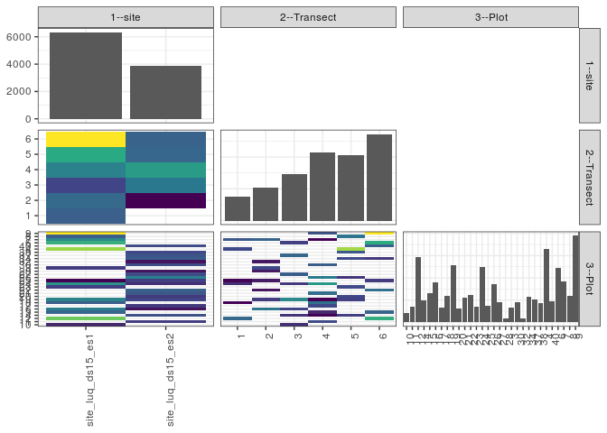

popler\_data\_organizatonal\_hierarchy
================
Hao Ye, Ellen Bledsoe
5/21/2019

``` r
library(tidyverse)

all_data <- readRDS("list_df_full.RDS")
df <- as_tibble(all_data[[params$dataset_index]])

cat("My project metadata key is ", 
    df$proj_metadata_key[1], "!!")
```

    ## My project metadata key is  769 !!

``` r
# figure out the spatial replication levels
df %>% 
  select(starts_with("spatial_replication_level")) %>%
  NCOL() %>%
  {./2} -> num_sr_levels
```

``` r
# transform the names of the variables
#   - get rid of the `spatial_replication_level_#_label` columns
sr_vars <- character(num_sr_levels)
for (i in seq(num_sr_levels))
{
  new_name <- paste0(i, "--", as.character(df[[1, paste0("spatial_replication_level_", i, "_label")]]))
  old_name <- paste0("spatial_replication_level_", i)
  sr_vars[i] <- new_name
  df <- rename(df, !!new_name := !!old_name)
}
```

``` r
# extract just the spatial replication level data
data_organization <- df %>%
  select(sr_vars)
```

``` r
# make pair-wise density plots to summarize organizational structure:
# 
library(GGally)
my_bin <- function(data, mapping, ...) {
  ggplot(data = data, mapping = mapping) +
    geom_bin2d(...) +
    scale_fill_viridis_c()
}

pm <- ggpairs(data_organization, 
                      lower = list(discrete = my_bin), 
                      upper = list(discrete = "blank"), 
              cardinality_threshold = NULL) + 
  theme_bw() + 
  theme(axis.text.x = element_text(angle = 90, hjust = 1))

print(pm)
```



``` r
# generate contingency tables to summarize organizational structure:
#   - level_i vs. level_j (i < j)

cols <- expand.grid(i = seq(num_sr_levels), 
                    j = seq(num_sr_levels)) %>%
  filter(i < j)

sr_tables <- purrr::pmap(cols, function(i, j) {
    data_organization %>%
      select(sr_vars[c(i, j)]) %>%
      table()
  })
```

``` r
# loop over tables and output
purrr::map(sr_tables, knitr::kable)
```

    ## [[1]]
    ## 
    ## 
    ##                        1     2     3      4      5      6
    ## ------------------  ----  ----  ----  -----  -----  -----
    ## site_luq_ds15_es1    743   814   558    982   1273   1958
    ## site_luq_ds15_es2      0   210   912   1162    791    766
    ## 
    ## [[2]]
    ## 
    ## 
    ##                       10    11    12    14    15    16    17    18    19    20    21    22    23    24    25    26    27   28     3    30   32    34    37    38     4    40     6     7     8     9
    ## ------------------  ----  ----  ----  ----  ----  ----  ----  ----  ----  ----  ----  ----  ----  ----  ----  ----  ----  ---  ----  ----  ---  ----  ----  ----  ----  ----  ----  ----  ----  ----
    ## site_luq_ds15_es1    102     0   738     0   323   418     0   293   439     0     0     0   178   501     6     0     0    0   169     0    0     0     0     0   820     0   613   461   294   973
    ## site_luq_ds15_es2      0   178     0   248     0    36   165     0   199   159   276   312     0   122   182   425   226   46     0   229   44   292   258   212     0   232     0     0     0     0
    ## 
    ## [[3]]
    ## 
    ## 
    ##   10    11    12    14    15    16    17    18    19    20    21    22    23    24    25    26    27   28     3    30   32    34    37    38     4    40     6     7     8     9
    ## ----  ----  ----  ----  ----  ----  ----  ----  ----  ----  ----  ----  ----  ----  ----  ----  ----  ---  ----  ----  ---  ----  ----  ----  ----  ----  ----  ----  ----  ----
    ##    0     0   262     0     0     0     0     3     0     0     0     0     0    95     6     0     0    0     0     0    0     0     0     0   165     0     0   212     0     0
    ##    0     0     0     0     0   300     0     0   133     0     0    34     0     0    50     0     0   46   169     0   44     0     0     0     0     0     0   248     0     0
    ##  102     0     0   107     0   154     0     0   358     0     0     0     0   122     0     0   226    0     0     0    0     0   258     0     0     0   143     0     0     0
    ##    0   178     0     2    77     0   165   290     1     0   276     0     0   406     0   312     0    0     0   229    0     0     0     0     0     0     0     1     0   207
    ##    0     0     0   139     0     0     0     0   146   159     0     0   178     0     0   113     0    0     0     0    0   168     0   212   655     0     0     0   294     0
    ##    0     0   476     0   246     0     0     0     0     0     0   278     0     0   132     0     0    0     0     0    0   124     0     0     0   232   470     0     0   766
