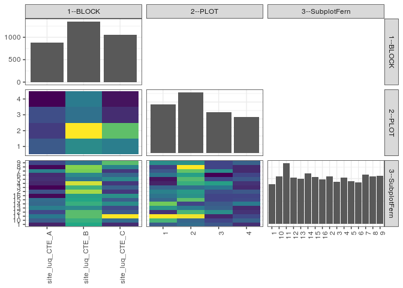

popler\_data\_organizatonal\_hierarchy
================
Hao Ye, Ellen Bledsoe
5/21/2019

``` r
library(tidyverse)

all_data <- readRDS("list_df_full.RDS")
df <- as_tibble(all_data[[params$dataset_index]])

cat("My project metadata key is ", 
    df$proj_metadata_key[1], "!!")
```

    ## My project metadata key is  793 !!

``` r
# figure out the spatial replication levels
df %>% 
  select(starts_with("spatial_replication_level")) %>%
  NCOL() %>%
  {./2} -> num_sr_levels
```

``` r
# transform the names of the variables
#   - get rid of the `spatial_replication_level_#_label` columns
sr_vars <- character(num_sr_levels)
for (i in seq(num_sr_levels))
{
  new_name <- paste0(i, "--", as.character(df[[1, paste0("spatial_replication_level_", i, "_label")]]))
  old_name <- paste0("spatial_replication_level_", i)
  sr_vars[i] <- new_name
  df <- rename(df, !!new_name := !!old_name)
}
```

``` r
# extract just the spatial replication level data
data_organization <- df %>%
  select(sr_vars)
```

``` r
# make pair-wise density plots to summarize organizational structure:
# 
library(GGally)
my_bin <- function(data, mapping, ...) {
  ggplot(data = data, mapping = mapping) +
    geom_bin2d(...) +
    scale_fill_viridis_c()
}

pm <- ggpairs(data_organization, 
                      lower = list(discrete = my_bin), 
                      upper = list(discrete = "blank"), 
              cardinality_threshold = NULL) + 
  theme_bw() + 
  theme(axis.text.x = element_text(angle = 90, hjust = 1))

print(pm)
```



``` r
# generate contingency tables to summarize organizational structure:
#   - level_i vs. level_j (i < j)

cols <- expand.grid(i = seq(num_sr_levels), 
                    j = seq(num_sr_levels)) %>%
  filter(i < j)

sr_tables <- purrr::pmap(cols, function(i, j) {
    data_organization %>%
      select(sr_vars[c(i, j)]) %>%
      table()
  })
```

``` r
# loop over tables and output
purrr::map(sr_tables, knitr::kable)
```

    ## [[1]]
    ## 
    ## 
    ##                     1     2     3     4
    ## ---------------  ----  ----  ----  ----
    ## site_luq_CTE_A    253   219   239   168
    ## site_luq_CTE_B    312   467   280   291
    ## site_luq_CTE_C    295   382   203   180
    ## 
    ## [[2]]
    ## 
    ## 
    ##                    1   10    11   12   13   14   15   16     2    3     4    5    6    7    8    9
    ## ---------------  ---  ---  ----  ---  ---  ---  ---  ---  ----  ---  ----  ---  ---  ---  ---  ---
    ## site_luq_CTE_A    46   61    68   55   70   64   65   41    58   40    47   49   48   71   41   55
    ## site_luq_CTE_B    82   84    89   89   73   84   81   79   100   85   105   67   73   95   97   67
    ## site_luq_CTE_C    48   65   110   60   56   74   61   75    51   62    51   73   63   51   71   89
    ## 
    ## [[3]]
    ## 
    ## 
    ##   1   10   11   12   13   14   15   16    2    3    4    5    6    7    8    9
    ## ---  ---  ---  ---  ---  ---  ---  ---  ---  ---  ---  ---  ---  ---  ---  ---
    ##  46   73   98   35   63   81   49   53   57   49   31   28   53   45   38   61
    ##  51   49   96   73   55   40   77   62   64   51   71   75   66   78   98   62
    ##  45   40   32   61   48   46   40   40   43   54   66   41   25   61   40   40
    ##  34   48   41   35   33   55   41   40   45   33   35   45   40   33   33   48
