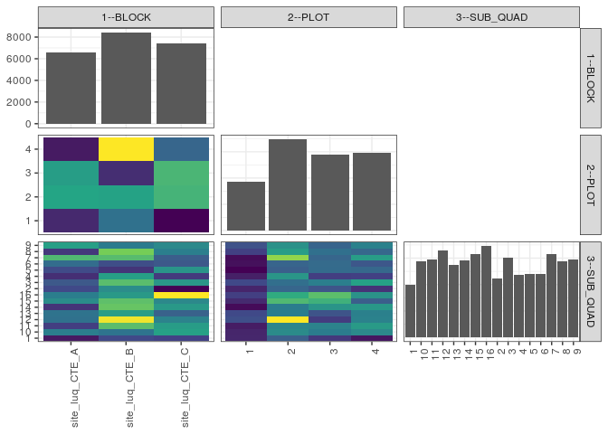

popler\_data\_organizatonal\_hierarchy
================
Hao Ye, Ellen Bledsoe
5/21/2019

``` r
library(tidyverse)

all_data <- readRDS("list_df_full.RDS")
df <- as_tibble(all_data[[params$dataset_index]])

cat("My project metadata key is ", 
    df$proj_metadata_key[1], "!!")
```

    ## My project metadata key is  794 !!

``` r
# figure out the spatial replication levels
df %>% 
  select(starts_with("spatial_replication_level")) %>%
  NCOL() %>%
  {./2} -> num_sr_levels
```

``` r
# transform the names of the variables
#   - get rid of the `spatial_replication_level_#_label` columns
sr_vars <- character(num_sr_levels)
for (i in seq(num_sr_levels))
{
  new_name <- paste0(i, "--", as.character(df[[1, paste0("spatial_replication_level_", i, "_label")]]))
  old_name <- paste0("spatial_replication_level_", i)
  sr_vars[i] <- new_name
  df <- rename(df, !!new_name := !!old_name)
}
```

``` r
# extract just the spatial replication level data
data_organization <- df %>%
  select(sr_vars)
```

``` r
# make pair-wise density plots to summarize organizational structure:
# 
library(GGally)
my_bin <- function(data, mapping, ...) {
  ggplot(data = data, mapping = mapping) +
    geom_bin2d(...) +
    scale_fill_viridis_c()
}

pm <- ggpairs(data_organization, 
                      lower = list(discrete = my_bin), 
                      upper = list(discrete = "blank"), 
              cardinality_threshold = NULL) + 
  theme_bw() + 
  theme(axis.text.x = element_text(angle = 90, hjust = 1))

print(pm)
```



``` r
# generate contingency tables to summarize organizational structure:
#   - level_i vs. level_j (i < j)

cols <- expand.grid(i = seq(num_sr_levels), 
                    j = seq(num_sr_levels)) %>%
  filter(i < j)

sr_tables <- purrr::pmap(cols, function(i, j) {
    data_organization %>%
      select(sr_vars[c(i, j)]) %>%
      table()
  })
```

``` r
# loop over tables and output
purrr::map(sr_tables, knitr::kable)
```

    ## [[1]]
    ## 
    ## 
    ##                      1      2      3      4
    ## ---------------  -----  -----  -----  -----
    ## site_luq_CTE_A    1111   2267   2197    999
    ## site_luq_CTE_B    1758   2245   1152   3260
    ## site_luq_CTE_C     861   2428   2458   1652
    ## 
    ## [[2]]
    ## 
    ## 
    ##                     1    10    11    12    13    14    15    16     2     3     4     5     6     7     8     9
    ## ---------------  ----  ----  ----  ----  ----  ----  ----  ----  ----  ----  ----  ----  ----  ----  ----  ----
    ## site_luq_CTE_A    284   463   343   439   442   326   492   464   363   393   318   367   431   587   332   530
    ## site_luq_CTE_B    364   444   599   731   527   615   604   519   494   598   531   327   373   595   637   457
    ## site_luq_CTE_C    351   535   524   475   410   517   484   743   257   513   336   508   391   403   465   487
    ## 
    ## [[3]]
    ## 
    ## 
    ##    1    10    11    12    13    14    15    16     2     3     4     5     6     7     8     9
    ## ----  ----  ----  ----  ----  ----  ----  ----  ----  ----  ----  ----  ----  ----  ----  ----
    ##  221   220   206   296   285   182   227   265   219   284   211   172   189   183   267   303
    ##  328   419   406   688   390   388   522   490   342   360   443   331   341   600   459   433
    ##  253   388   403   260   307   440   503   537   309   394   264   353   352   343   362   339
    ##  197   415   451   401   397   448   328   434   244   466   267   346   313   459   346   399
