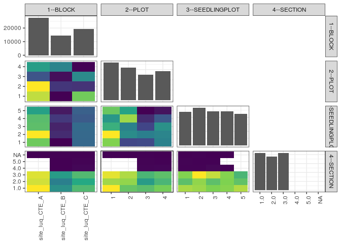

popler\_data\_organizatonal\_hierarchy
================
Hao Ye, Ellen Bledsoe
5/21/2019

``` r
library(tidyverse)

all_data <- readRDS("list_df_full.RDS")
df <- as_tibble(all_data[[params$dataset_index]])

cat("My project metadata key is ", 
    df$proj_metadata_key[1], "!!")
```

    ## My project metadata key is  795 !!

``` r
# figure out the spatial replication levels
df %>% 
  select(starts_with("spatial_replication_level")) %>%
  NCOL() %>%
  {./2} -> num_sr_levels
```

``` r
# transform the names of the variables
#   - get rid of the `spatial_replication_level_#_label` columns
sr_vars <- character(num_sr_levels)
for (i in seq(num_sr_levels))
{
  new_name <- paste0(i, "--", as.character(df[[1, paste0("spatial_replication_level_", i, "_label")]]))
  old_name <- paste0("spatial_replication_level_", i)
  sr_vars[i] <- new_name
  df <- rename(df, !!new_name := !!old_name)
}
```

``` r
# extract just the spatial replication level data
data_organization <- df %>%
  select(sr_vars)
```

``` r
# make pair-wise density plots to summarize organizational structure:
# 
library(GGally)
my_bin <- function(data, mapping, ...) {
  ggplot(data = data, mapping = mapping) +
    geom_bin2d(...) +
    scale_fill_viridis_c()
}

pm <- ggpairs(data_organization, 
                      lower = list(discrete = my_bin), 
                      upper = list(discrete = "blank"), 
              cardinality_threshold = NULL) + 
  theme_bw() + 
  theme(axis.text.x = element_text(angle = 90, hjust = 1))

print(pm)
```

    ## plot: [1,1] [==>------------------------------------------] 6% est: 0s
    ## plot: [1,2] [=====>---------------------------------------] 12% est: 1s
    ## plot: [1,3] [=======>-------------------------------------] 19% est: 1s
    ## plot: [1,4] [==========>----------------------------------] 25% est: 0s
    ## plot: [2,1] [=============>-------------------------------] 31% est: 0s
    ## plot: [2,2] [================>----------------------------] 38% est: 1s
    ## plot: [2,3] [===================>-------------------------] 44% est: 1s
    ## plot: [2,4] [=====================>-----------------------] 50% est: 0s
    ## plot: [3,1] [========================>--------------------] 56% est: 0s
    ## plot: [3,2] [===========================>-----------------] 62% est: 0s
    ## plot: [3,3] [==============================>--------------] 69% est: 1s
    ## plot: [3,4] [=================================>-----------] 75% est: 0s
    ## plot: [4,1] [====================================>--------] 81% est: 0s
    ## plot: [4,2] [======================================>------] 88% est: 0s
    ## plot: [4,3] [=========================================>---] 94% est: 0s
    ## plot: [4,4] [=============================================]100% est: 0s



``` r
# generate contingency tables to summarize organizational structure:
#   - level_i vs. level_j (i < j)

cols <- expand.grid(i = seq(num_sr_levels), 
                    j = seq(num_sr_levels)) %>%
  filter(i < j)

sr_tables <- purrr::pmap(cols, function(i, j) {
    data_organization %>%
      select(sr_vars[c(i, j)]) %>%
      table()
  })
```

``` r
# loop over tables and output
purrr::map(sr_tables, knitr::kable)
```

    ## [[1]]
    ## 
    ## 
    ##                      1      2      3      4
    ## ---------------  -----  -----  -----  -----
    ## site_luq_CTE_A    8322   8969   4264   6116
    ## site_luq_CTE_B    2562   3515   2736   5459
    ## site_luq_CTE_C    7489   3459   5603   2580
    ## 
    ## [[2]]
    ## 
    ## 
    ##                      1      2      3      4      5
    ## ---------------  -----  -----  -----  -----  -----
    ## site_luq_CTE_A    5583   6551   5384   5342   4811
    ## site_luq_CTE_B    2517   2978   2873   3162   2742
    ## site_luq_CTE_C    3875   3894   3928   3670   3764
    ## 
    ## [[3]]
    ## 
    ## 
    ##     1      2      3      4      5
    ## -----  -----  -----  -----  -----
    ##  3811   4213   3443   3222   3684
    ##  2556   3128   3031   3897   3331
    ##  2580   3016   2542   2355   2110
    ##  3028   3066   3169   2700   2192
    ## 
    ## [[4]]
    ## 
    ## 
    ##                    1.0    2.0    3.0   4.0   5.0   NA
    ## ---------------  -----  -----  -----  ----  ----  ---
    ## site_luq_CTE_A    9628   8920   9110     0     0   13
    ## site_luq_CTE_B    4834   4156   5260     2     2   18
    ## site_luq_CTE_C    6558   5812   6578   114    54   15
    ## 
    ## [[5]]
    ## 
    ## 
    ##   1.0    2.0    3.0   4.0   5.0   NA
    ## -----  -----  -----  ----  ----  ---
    ##  6530   5568   6253     0     0   22
    ##  4810   5427   5702     0     0    4
    ##  4595   3558   4347    48    36   19
    ##  5085   4335   4646    68    20    1
    ## 
    ## [[6]]
    ## 
    ## 
    ##   1.0    2.0    3.0   4.0   5.0   NA
    ## -----  -----  -----  ----  ----  ---
    ##  4317   3557   4040    23    27   11
    ##  4224   4145   4997    22    16   19
    ##  4013   3559   4528    70    13    2
    ##  4079   4022   4058     1     0   14
    ##  4387   3605   3325     0     0    0
