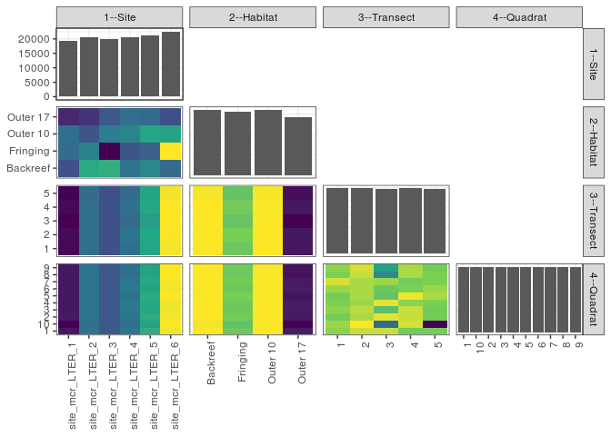

popler\_data\_organizatonal\_hierarchy
================
Hao Ye, Ellen Bledsoe
5/21/2019

``` r
library(tidyverse)

all_data <- readRDS("list_df_full.RDS")
df <- as_tibble(all_data[[params$dataset_index]])

cat("My project metadata key is ", 
    df$proj_metadata_key[1], "!!")
```

    ## My project metadata key is  798 !!

``` r
# figure out the spatial replication levels
df %>% 
  select(starts_with("spatial_replication_level")) %>%
  NCOL() %>%
  {./2} -> num_sr_levels
```

``` r
# transform the names of the variables
#   - get rid of the `spatial_replication_level_#_label` columns
sr_vars <- character(num_sr_levels)
for (i in seq(num_sr_levels))
{
  new_name <- paste0(i, "--", as.character(df[[1, paste0("spatial_replication_level_", i, "_label")]]))
  old_name <- paste0("spatial_replication_level_", i)
  sr_vars[i] <- new_name
  df <- rename(df, !!new_name := !!old_name)
}
```

``` r
# extract just the spatial replication level data
data_organization <- df %>%
  select(sr_vars)
```

``` r
# make pair-wise density plots to summarize organizational structure:
# 
library(GGally)
my_bin <- function(data, mapping, ...) {
  ggplot(data = data, mapping = mapping) +
    geom_bin2d(...) +
    scale_fill_viridis_c()
}

pm <- ggpairs(data_organization, 
                      lower = list(discrete = my_bin), 
                      upper = list(discrete = "blank"), 
              cardinality_threshold = NULL) + 
  theme_bw() + 
  theme(axis.text.x = element_text(angle = 90, hjust = 1))

print(pm)
```

    ## plot: [1,1] [==>------------------------------------------] 6% est: 0s
    ## plot: [1,2] [=====>---------------------------------------] 12% est: 1s
    ## plot: [1,3] [=======>-------------------------------------] 19% est: 1s
    ## plot: [1,4] [==========>----------------------------------] 25% est: 1s
    ## plot: [2,1] [=============>-------------------------------] 31% est: 0s
    ## plot: [2,2] [================>----------------------------] 38% est: 1s
    ## plot: [2,3] [===================>-------------------------] 44% est: 1s
    ## plot: [2,4] [=====================>-----------------------] 50% est: 1s
    ## plot: [3,1] [========================>--------------------] 56% est: 0s
    ## plot: [3,2] [===========================>-----------------] 62% est: 1s
    ## plot: [3,3] [==============================>--------------] 69% est: 1s
    ## plot: [3,4] [=================================>-----------] 75% est: 0s
    ## plot: [4,1] [====================================>--------] 81% est: 0s
    ## plot: [4,2] [======================================>------] 88% est: 0s
    ## plot: [4,3] [=========================================>---] 94% est: 0s
    ## plot: [4,4] [=============================================]100% est: 0s



``` r
# generate contingency tables to summarize organizational structure:
#   - level_i vs. level_j (i < j)

cols <- expand.grid(i = seq(num_sr_levels), 
                    j = seq(num_sr_levels)) %>%
  filter(i < j)

sr_tables <- purrr::pmap(cols, function(i, j) {
    data_organization %>%
      select(sr_vars[c(i, j)]) %>%
      table()
  })
```

``` r
# loop over tables and output
purrr::map(sr_tables, knitr::kable)
```

    ## [[1]]
    ## 
    ## 
    ##                    Backreef   Fringing   Outer 10   Outer 17
    ## ----------------  ---------  ---------  ---------  ---------
    ## site_mcr_LTER_1        4752       5080       5100       4300
    ## site_mcr_LTER_2        5850       5350       4800       4441
    ## site_mcr_LTER_3        5900       4000       5300       4850
    ## site_mcr_LTER_4        5154       4819       5356       5118
    ## site_mcr_LTER_5        5407       4931       5806       5052
    ## site_mcr_LTER_6        5052       7044       5752       4751
    ## 
    ## [[2]]
    ## 
    ## 
    ##                       1      2      3      4      5
    ## ----------------  -----  -----  -----  -----  -----
    ## site_mcr_LTER_1    3850   3852   3839   3850   3841
    ## site_mcr_LTER_2    4090   4090   4090   4090   4081
    ## site_mcr_LTER_3    4010   4010   4010   4010   4010
    ## site_mcr_LTER_4    4091   4109   4075   4097   4075
    ## site_mcr_LTER_5    4245   4250   4217   4248   4236
    ## site_mcr_LTER_6    4515   4522   4526   4524   4512
    ## 
    ## [[3]]
    ## 
    ## 
    ##                1      2      3      4      5
    ## ---------  -----  -----  -----  -----  -----
    ## Backreef    6422   6425   6426   6426   6416
    ## Fringing    6243   6269   6231   6257   6224
    ## Outer 10    6424   6423   6424   6422   6421
    ## Outer 17    5712   5716   5676   5714   5694
    ## 
    ## [[4]]
    ## 
    ## 
    ##                       1     10      2      3      4      5      6      7      8      9
    ## ----------------  -----  -----  -----  -----  -----  -----  -----  -----  -----  -----
    ## site_mcr_LTER_1    1925   1906   1926   1925   1925   1925   1925   1925   1925   1925
    ## site_mcr_LTER_2    2045   2036   2045   2045   2045   2045   2045   2045   2045   2045
    ## site_mcr_LTER_3    2005   2005   2005   2005   2005   2005   2005   2005   2005   2005
    ## site_mcr_LTER_4    2047   2035   2047   2051   2050   2041   2052   2048   2035   2041
    ## site_mcr_LTER_5    2127   2110   2126   2119   2123   2125   2114   2123   2114   2115
    ## site_mcr_LTER_6    2255   2264   2259   2255   2257   2264   2259   2259   2264   2263
    ## 
    ## [[5]]
    ## 
    ## 
    ##                1     10      2      3      4      5      6      7      8      9
    ## ---------  -----  -----  -----  -----  -----  -----  -----  -----  -----  -----
    ## Backreef    3213   3206   3212   3213   3213   3211   3213   3211   3211   3212
    ## Fringing    3121   3107   3128   3119   3124   3135   3120   3128   3118   3124
    ## Outer 10    3213   3210   3213   3211   3212   3211   3210   3211   3213   3210
    ## Outer 17    2857   2833   2855   2857   2856   2848   2857   2855   2846   2848
    ## 
    ## [[6]]
    ## 
    ## 
    ##     1     10      2      3      4      5      6      7      8      9
    ## -----  -----  -----  -----  -----  -----  -----  -----  -----  -----
    ##  2480   2481   2478   2480   2479   2478   2481   2485   2479   2480
    ##  2484   2488   2482   2483   2481   2482   2482   2482   2484   2485
    ##  2484   2459   2486   2475   2486   2476   2477   2481   2464   2469
    ##  2478   2485   2484   2484   2480   2487   2479   2478   2482   2482
    ##  2478   2443   2478   2478   2479   2482   2481   2479   2479   2478
