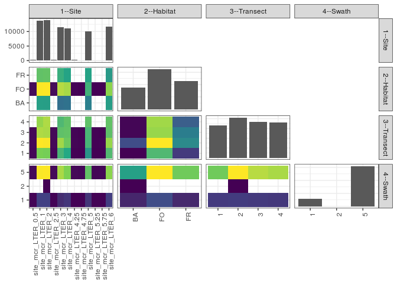

popler\_data\_organizatonal\_hierarchy
================
Hao Ye, Ellen Bledsoe
5/21/2019

``` r
library(tidyverse)

all_data <- readRDS("list_df_full.RDS")
df <- as_tibble(all_data[[params$dataset_index]])

cat("My project metadata key is ", 
    df$proj_metadata_key[1], "!!")
```

    ## My project metadata key is  799 !!

``` r
# figure out the spatial replication levels
df %>% 
  select(starts_with("spatial_replication_level")) %>%
  NCOL() %>%
  {./2} -> num_sr_levels
```

``` r
# transform the names of the variables
#   - get rid of the `spatial_replication_level_#_label` columns
sr_vars <- character(num_sr_levels)
for (i in seq(num_sr_levels))
{
  new_name <- paste0(i, "--", as.character(df[[1, paste0("spatial_replication_level_", i, "_label")]]))
  old_name <- paste0("spatial_replication_level_", i)
  sr_vars[i] <- new_name
  df <- rename(df, !!new_name := !!old_name)
}
```

``` r
# extract just the spatial replication level data
data_organization <- df %>%
  select(sr_vars)
```

``` r
# make pair-wise density plots to summarize organizational structure:
# 
library(GGally)
my_bin <- function(data, mapping, ...) {
  ggplot(data = data, mapping = mapping) +
    geom_bin2d(...) +
    scale_fill_viridis_c()
}

pm <- ggpairs(data_organization, 
                      lower = list(discrete = my_bin), 
                      upper = list(discrete = "blank"), 
              cardinality_threshold = NULL) + 
  theme_bw() + 
  theme(axis.text.x = element_text(angle = 90, hjust = 1))

print(pm)
```

    ## plot: [1,1] [==>------------------------------------------] 6% est: 0s
    ## plot: [1,2] [=====>---------------------------------------] 12% est: 1s
    ## plot: [1,3] [=======>-------------------------------------] 19% est: 1s
    ## plot: [1,4] [==========>----------------------------------] 25% est: 0s
    ## plot: [2,1] [=============>-------------------------------] 31% est: 0s
    ## plot: [2,2] [================>----------------------------] 38% est: 1s
    ## plot: [2,3] [===================>-------------------------] 44% est: 1s
    ## plot: [2,4] [=====================>-----------------------] 50% est: 1s
    ## plot: [3,1] [========================>--------------------] 56% est: 0s
    ## plot: [3,2] [===========================>-----------------] 62% est: 1s
    ## plot: [3,3] [==============================>--------------] 69% est: 1s
    ## plot: [3,4] [=================================>-----------] 75% est: 0s
    ## plot: [4,1] [====================================>--------] 81% est: 0s
    ## plot: [4,2] [======================================>------] 88% est: 0s
    ## plot: [4,3] [=========================================>---] 94% est: 0s
    ## plot: [4,4] [=============================================]100% est: 0s



``` r
# generate contingency tables to summarize organizational structure:
#   - level_i vs. level_j (i < j)

cols <- expand.grid(i = seq(num_sr_levels), 
                    j = seq(num_sr_levels)) %>%
  filter(i < j)

sr_tables <- purrr::pmap(cols, function(i, j) {
    data_organization %>%
      select(sr_vars[c(i, j)]) %>%
      table()
  })
```

``` r
# loop over tables and output
purrr::map(sr_tables, knitr::kable)
```

    ## [[1]]
    ## 
    ## 
    ##                         BA     FO     FR
    ## -------------------  -----  -----  -----
    ## site_mcr_LTER_0.5        0    304      0
    ## site_mcr_LTER_1       3444   5972   4383
    ## site_mcr_LTER_2       3428   5999   4426
    ## site_mcr_LTER_2.5        0    305      0
    ## site_mcr_LTER_3       2303   5331   3846
    ## site_mcr_LTER_4       2362   5196   3540
    ## site_mcr_LTER_4.25       0    208      0
    ## site_mcr_LTER_4.75       0    167      0
    ## site_mcr_LTER_5       2695   3937   3524
    ## site_mcr_LTER_5.25       0    181      0
    ## site_mcr_LTER_5.75       0    176      0
    ## site_mcr_LTER_6       3415   4969   3309
    ## 
    ## [[2]]
    ## 
    ## 
    ##                          1      2      3      4
    ## -------------------  -----  -----  -----  -----
    ## site_mcr_LTER_0.5       96    106    102      0
    ## site_mcr_LTER_1       3133   3932   3441   3293
    ## site_mcr_LTER_2       3092   3909   3414   3438
    ## site_mcr_LTER_2.5       77    109    119      0
    ## site_mcr_LTER_3       2610   3360   2834   2676
    ## site_mcr_LTER_4       2386   2992   2872   2848
    ## site_mcr_LTER_4.25      59     76     73      0
    ## site_mcr_LTER_4.75      48     64     55      0
    ## site_mcr_LTER_5       2082   2606   2628   2840
    ## site_mcr_LTER_5.25      55     63     63      0
    ## site_mcr_LTER_5.75      53     74     49      0
    ## site_mcr_LTER_6       2699   3303   2828   2863
    ## 
    ## [[3]]
    ## 
    ## 
    ##          1      2      3      4
    ## ---  -----  -----  -----  -----
    ## BA    4107   5236   4152   4152
    ## FO    7389   8948   8170   8238
    ## FR    4894   6410   6156   5568
    ## 
    ## [[4]]
    ## 
    ## 
    ##                          1    2       5
    ## -------------------  -----  ---  ------
    ## site_mcr_LTER_0.5       77    0     227
    ## site_mcr_LTER_1       2165    0   11634
    ## site_mcr_LTER_2       2159    1   11693
    ## site_mcr_LTER_2.5       78    0     227
    ## site_mcr_LTER_3       1353    0   10127
    ## site_mcr_LTER_4       1707    0    9391
    ## site_mcr_LTER_4.25      30    0     178
    ## site_mcr_LTER_4.75      33    0     134
    ## site_mcr_LTER_5       1683    0    8473
    ## site_mcr_LTER_5.25      61    0     120
    ## site_mcr_LTER_5.75      41    0     135
    ## site_mcr_LTER_6       2093    0    9600
    ## 
    ## [[5]]
    ## 
    ## 
    ##          1    2       5
    ## ---  -----  ---  ------
    ## BA    2571    1   15075
    ## FO    6206    0   26539
    ## FR    2703    0   20325
    ## 
    ## [[6]]
    ## 
    ## 
    ##     1    2       5
    ## -----  ---  ------
    ##  2893    0   13497
    ##  2991    1   17602
    ##  2866    0   15612
    ##  2730    0   15228
