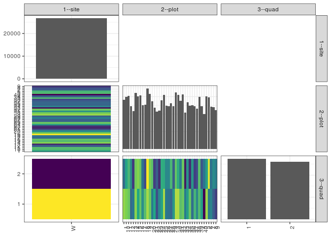

popler\_data\_organizatonal\_hierarchy
================
Hao Ye, Ellen Bledsoe
5/21/2019

``` r
library(tidyverse)

all_data <- readRDS("list_df_full.RDS")
df <- as_tibble(all_data[[params$dataset_index]])

cat("My project metadata key is ", 
    df$proj_metadata_key[1], "!!")
```

    ## My project metadata key is  34 !!

``` r
# figure out the spatial replication levels
df %>% 
  select(starts_with("spatial_replication_level")) %>%
  NCOL() %>%
  {./2} -> num_sr_levels
```

``` r
# transform the names of the variables
#   - get rid of the `spatial_replication_level_#_label` columns
sr_vars <- character(num_sr_levels)
for (i in seq(num_sr_levels))
{
  new_name <- paste0(i, "--", as.character(df[[1, paste0("spatial_replication_level_", i, "_label")]]))
  old_name <- paste0("spatial_replication_level_", i)
  sr_vars[i] <- new_name
  df <- rename(df, !!new_name := !!old_name)
}
```

``` r
# extract just the spatial replication level data
data_organization <- df %>%
  select(sr_vars)
```

``` r
# make pair-wise density plots to summarize organizational structure:
# 
library(GGally)
my_bin <- function(data, mapping, ...) {
  ggplot(data = data, mapping = mapping) +
    geom_bin2d(...) +
    scale_fill_viridis_c()
}

pm <- ggpairs(data_organization, 
                      lower = list(discrete = my_bin), 
                      upper = list(discrete = "blank"), 
              cardinality_threshold = NULL) + 
  theme_bw() + 
  theme(axis.text.x = element_text(angle = 90, hjust = 1))

print(pm)
```



``` r
# generate contingency tables to summarize organizational structure:
#   - level_i vs. level_j (i < j)

cols <- expand.grid(i = seq(num_sr_levels), 
                    j = seq(num_sr_levels)) %>%
  filter(i < j)

sr_tables <- purrr::pmap(cols, function(i, j) {
    data_organization %>%
      select(sr_vars[c(i, j)]) %>%
      table()
  })
```

``` r
# loop over tables and output
purrr::map(sr_tables, knitr::kable)
```

    ## [[1]]
    ## 
    ## 
    ##         1    10    11    12    13    14    15    16    17    18    19     2    20    21    22    23    24    25    26    27    28    29     3    30    31    32    33    34    35    36    37    38    39     4    40     5     6     7     8     9
    ## ---  ----  ----  ----  ----  ----  ----  ----  ----  ----  ----  ----  ----  ----  ----  ----  ----  ----  ----  ----  ----  ----  ----  ----  ----  ----  ----  ----  ----  ----  ----  ----  ----  ----  ----  ----  ----  ----  ----  ----  ----
    ## W     702   748   757   612   544   799   754   769   624   637   866   785   683   595   537   550   700   773   619   613   653   611   807   776   687   778   521   667   620   626   613   578   749   611   503   754   742   609   599   556
    ## 
    ## [[2]]
    ## 
    ## 
    ##           1       2
    ## ---  ------  ------
    ## W     13730   12997
    ## 
    ## [[3]]
    ## 
    ## 
    ##         1     2
    ## ---  ----  ----
    ## 1     409   293
    ## 10    401   347
    ## 11    389   368
    ## 12    288   324
    ## 13    301   243
    ## 14    406   393
    ## 15    350   404
    ## 16    384   385
    ## 17    326   298
    ## 18    376   261
    ## 19    415   451
    ## 2     388   397
    ## 20    304   379
    ## 21    349   246
    ## 22    262   275
    ## 23    318   232
    ## 24    344   356
    ## 25    418   355
    ## 26    302   317
    ## 27    295   318
    ## 28    285   368
    ## 29    334   277
    ## 3     421   386
    ## 30    420   356
    ## 31    379   308
    ## 32    389   389
    ## 33    304   217
    ## 34    341   326
    ## 35    387   233
    ## 36    293   333
    ## 37    366   247
    ## 38    316   262
    ## 39    372   377
    ## 4     342   269
    ## 40    202   301
    ## 5     412   342
    ## 6     305   437
    ## 7     313   296
    ## 8     276   323
    ## 9     248   308
