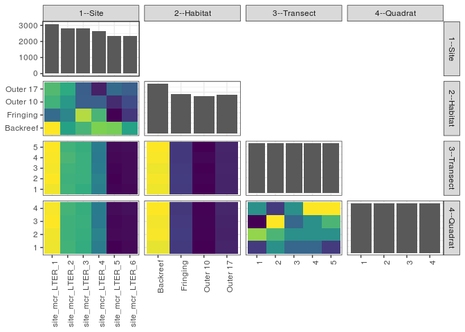

popler\_data\_organizatonal\_hierarchy
================
Hao Ye, Ellen Bledsoe
5/21/2019

``` r
library(tidyverse)

all_data <- readRDS("list_df_full.RDS")
df <- as_tibble(all_data[[params$dataset_index]])

cat("My project metadata key is ", 
    df$proj_metadata_key[1], "!!")
```

    ## My project metadata key is  804 !!

``` r
# figure out the spatial replication levels
df %>% 
  select(starts_with("spatial_replication_level")) %>%
  NCOL() %>%
  {./2} -> num_sr_levels
```

``` r
# transform the names of the variables
#   - get rid of the `spatial_replication_level_#_label` columns
sr_vars <- character(num_sr_levels)
for (i in seq(num_sr_levels))
{
  new_name <- paste0(i, "--", as.character(df[[1, paste0("spatial_replication_level_", i, "_label")]]))
  old_name <- paste0("spatial_replication_level_", i)
  sr_vars[i] <- new_name
  df <- rename(df, !!new_name := !!old_name)
}
```

``` r
# extract just the spatial replication level data
data_organization <- df %>%
  select(sr_vars)
```

``` r
# make pair-wise density plots to summarize organizational structure:
# 
library(GGally)
my_bin <- function(data, mapping, ...) {
  ggplot(data = data, mapping = mapping) +
    geom_bin2d(...) +
    scale_fill_viridis_c()
}

pm <- ggpairs(data_organization, 
                      lower = list(discrete = my_bin), 
                      upper = list(discrete = "blank"), 
              cardinality_threshold = NULL) + 
  theme_bw() + 
  theme(axis.text.x = element_text(angle = 90, hjust = 1))

print(pm)
```

    ## plot: [1,1] [==>------------------------------------------] 6% est: 0s
    ## plot: [1,2] [=====>---------------------------------------] 12% est: 1s
    ## plot: [1,3] [=======>-------------------------------------] 19% est: 0s
    ## plot: [1,4] [==========>----------------------------------] 25% est: 0s
    ## plot: [2,1] [=============>-------------------------------] 31% est: 0s
    ## plot: [2,2] [================>----------------------------] 38% est: 1s
    ## plot: [2,3] [===================>-------------------------] 44% est: 1s
    ## plot: [2,4] [=====================>-----------------------] 50% est: 0s
    ## plot: [3,1] [========================>--------------------] 56% est: 0s
    ## plot: [3,2] [===========================>-----------------] 62% est: 0s
    ## plot: [3,3] [==============================>--------------] 69% est: 0s
    ## plot: [3,4] [=================================>-----------] 75% est: 0s
    ## plot: [4,1] [====================================>--------] 81% est: 0s
    ## plot: [4,2] [======================================>------] 88% est: 0s
    ## plot: [4,3] [=========================================>---] 94% est: 0s
    ## plot: [4,4] [=============================================]100% est: 0s



``` r
# generate contingency tables to summarize organizational structure:
#   - level_i vs. level_j (i < j)

cols <- expand.grid(i = seq(num_sr_levels), 
                    j = seq(num_sr_levels)) %>%
  filter(i < j)

sr_tables <- purrr::pmap(cols, function(i, j) {
    data_organization %>%
      select(sr_vars[c(i, j)]) %>%
      table()
  })
```

``` r
# loop over tables and output
purrr::map(sr_tables, knitr::kable)
```

    ## [[1]]
    ## 
    ## 
    ##                    Backreef   Fringing   Outer 10   Outer 17
    ## ----------------  ---------  ---------  ---------  ---------
    ## site_mcr_LTER_1         946        603        760        780
    ## site_mcr_LTER_2         723        661        701        742
    ## site_mcr_LTER_3         767        884        581        580
    ## site_mcr_LTER_4         842        768        581        460
    ## site_mcr_LTER_5         833        420        480        604
    ## site_mcr_LTER_6         722        501        541        581
    ## 
    ## [[2]]
    ## 
    ## 
    ##                      1     2     3     4     5
    ## ----------------  ----  ----  ----  ----  ----
    ## site_mcr_LTER_1    616   619   617   618   619
    ## site_mcr_LTER_2    565   564   565   568   565
    ## site_mcr_LTER_3    561   563   563   563   562
    ## site_mcr_LTER_4    532   533   529   528   529
    ## site_mcr_LTER_5    467   466   467   468   469
    ## site_mcr_LTER_6    468   469   469   469   470
    ## 
    ## [[3]]
    ## 
    ## 
    ##               1     2     3     4     5
    ## ---------  ----  ----  ----  ----  ----
    ## Backreef    964   967   964   968   970
    ## Fringing    768   769   768   766   766
    ## Outer 10    728   729   728   731   728
    ## Outer 17    749   749   750   749   750
    ## 
    ## [[4]]
    ## 
    ## 
    ##                      1     2     3     4
    ## ----------------  ----  ----  ----  ----
    ## site_mcr_LTER_1    770   771   775   773
    ## site_mcr_LTER_2    707   706   706   708
    ## site_mcr_LTER_3    702   703   704   703
    ## site_mcr_LTER_4    663   667   660   661
    ## site_mcr_LTER_5    582   585   584   586
    ## site_mcr_LTER_6    585   586   586   588
    ## 
    ## [[5]]
    ## 
    ## 
    ##                1      2      3      4
    ## ---------  -----  -----  -----  -----
    ## Backreef    1202   1210   1208   1213
    ## Fringing     960    962    959    956
    ## Outer 10     910    911    912    911
    ## Outer 17     937    935    936    939
    ## 
    ## [[6]]
    ## 
    ## 
    ##    1     2     3     4
    ## ----  ----  ----  ----
    ##  801   805   800   803
    ##  803   804   806   801
    ##  802   803   802   803
    ##  802   803   803   806
    ##  801   803   804   806
