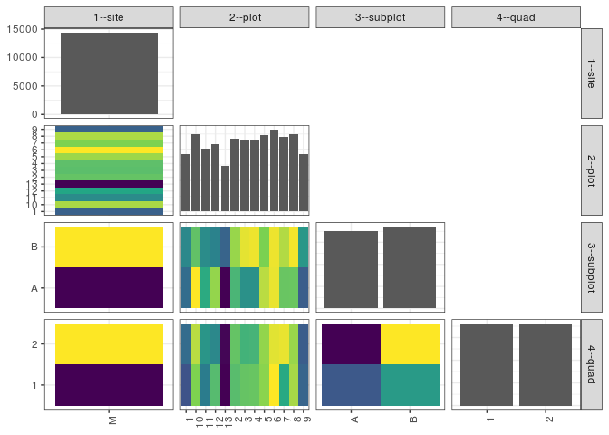

popler\_data\_organizatonal\_hierarchy
================
Hao Ye, Ellen Bledsoe
5/21/2019

``` r
library(tidyverse)

all_data <- readRDS("list_df_full.RDS")
df <- as_tibble(all_data[[params$dataset_index]])

cat("My project metadata key is ", 
    df$proj_metadata_key[1], "!!")
```

    ## My project metadata key is  37 !!

``` r
# figure out the spatial replication levels
df %>% 
  select(starts_with("spatial_replication_level")) %>%
  NCOL() %>%
  {./2} -> num_sr_levels
```

``` r
# transform the names of the variables
#   - get rid of the `spatial_replication_level_#_label` columns
sr_vars <- character(num_sr_levels)
for (i in seq(num_sr_levels))
{
  new_name <- paste0(i, "--", as.character(df[[1, paste0("spatial_replication_level_", i, "_label")]]))
  old_name <- paste0("spatial_replication_level_", i)
  sr_vars[i] <- new_name
  df <- rename(df, !!new_name := !!old_name)
}
```

``` r
# extract just the spatial replication level data
data_organization <- df %>%
  select(sr_vars)
```

``` r
# make pair-wise density plots to summarize organizational structure:
# 
library(GGally)
my_bin <- function(data, mapping, ...) {
  ggplot(data = data, mapping = mapping) +
    geom_bin2d(...) +
    scale_fill_viridis_c()
}

pm <- ggpairs(data_organization, 
                      lower = list(discrete = my_bin), 
                      upper = list(discrete = "blank"), 
              cardinality_threshold = NULL) + 
  theme_bw() + 
  theme(axis.text.x = element_text(angle = 90, hjust = 1))

print(pm)
```

    ## plot: [1,1] [==>------------------------------------------] 6% est: 0s
    ## plot: [1,2] [=====>---------------------------------------] 12% est: 0s
    ## plot: [1,3] [=======>-------------------------------------] 19% est: 0s
    ## plot: [1,4] [==========>----------------------------------] 25% est: 0s
    ## plot: [2,1] [=============>-------------------------------] 31% est: 0s
    ## plot: [2,2] [================>----------------------------] 38% est: 1s
    ## plot: [2,3] [===================>-------------------------] 44% est: 1s
    ## plot: [2,4] [=====================>-----------------------] 50% est: 1s
    ## plot: [3,1] [========================>--------------------] 56% est: 0s
    ## plot: [3,2] [===========================>-----------------] 62% est: 0s
    ## plot: [3,3] [==============================>--------------] 69% est: 0s
    ## plot: [3,4] [=================================>-----------] 75% est: 0s
    ## plot: [4,1] [====================================>--------] 81% est: 0s
    ## plot: [4,2] [======================================>------] 88% est: 0s
    ## plot: [4,3] [=========================================>---] 94% est: 0s
    ## plot: [4,4] [=============================================]100% est: 0s



``` r
# generate contingency tables to summarize organizational structure:
#   - level_i vs. level_j (i < j)

cols <- expand.grid(i = seq(num_sr_levels), 
                    j = seq(num_sr_levels)) %>%
  filter(i < j)

sr_tables <- purrr::pmap(cols, function(i, j) {
    data_organization %>%
      select(sr_vars[c(i, j)]) %>%
      table()
  })
```

``` r
# loop over tables and output
purrr::map(sr_tables, knitr::kable)
```

    ## [[1]]
    ## 
    ## 
    ##         1     10     11     12    13      2      3      4      5      6      7      8     9
    ## ---  ----  -----  -----  -----  ----  -----  -----  -----  -----  -----  -----  -----  ----
    ## M     920   1248   1020   1086   739   1168   1154   1158   1235   1326   1211   1250   923
    ## 
    ## [[2]]
    ## 
    ## 
    ##          A      B
    ## ---  -----  -----
    ## M     6991   7447
    ## 
    ## [[3]]
    ## 
    ## 
    ##         A     B
    ## ---  ----  ----
    ## 1     440   480
    ## 10    674   574
    ## 11    533   487
    ## 12    614   472
    ## 13    311   428
    ## 2     552   616
    ## 3     495   659
    ## 4     494   664
    ## 5     634   601
    ## 6     662   664
    ## 7     581   630
    ## 8     582   668
    ## 9     419   504
    ## 
    ## [[4]]
    ## 
    ## 
    ##          1      2
    ## ---  -----  -----
    ## M     7187   7251
    ## 
    ## [[5]]
    ## 
    ## 
    ##         1     2
    ## ---  ----  ----
    ## 1     445   475
    ## 10    611   637
    ## 11    494   526
    ## 12    577   509
    ## 13    368   371
    ## 2     579   589
    ## 3     590   564
    ## 4     592   566
    ## 5     616   619
    ## 6     670   656
    ## 7     551   660
    ## 8     628   622
    ## 9     466   457
    ## 
    ## [[6]]
    ## 
    ## 
    ##          1      2
    ## ---  -----  -----
    ## A     3546   3445
    ## B     3641   3806
