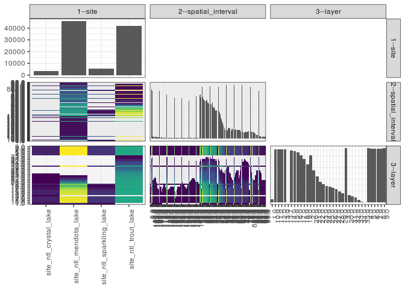

popler\_data\_organizatonal\_hierarchy
================
Hao Ye, Ellen Bledsoe
5/21/2019

``` r
library(tidyverse)

all_data <- readRDS("list_df_full.RDS")
df <- as_tibble(all_data[[params$dataset_index]])

cat("My project metadata key is ", 
    df$proj_metadata_key[1], "!!")
```

    ## My project metadata key is  830 !!

``` r
# figure out the spatial replication levels
df %>% 
  select(starts_with("spatial_replication_level")) %>%
  NCOL() %>%
  {./2} -> num_sr_levels
```

``` r
# transform the names of the variables
#   - get rid of the `spatial_replication_level_#_label` columns
sr_vars <- character(num_sr_levels)
for (i in seq(num_sr_levels))
{
  new_name <- paste0(i, "--", as.character(df[[1, paste0("spatial_replication_level_", i, "_label")]]))
  old_name <- paste0("spatial_replication_level_", i)
  sr_vars[i] <- new_name
  df <- rename(df, !!new_name := !!old_name)
}
```

``` r
# extract just the spatial replication level data
data_organization <- df %>%
  select(sr_vars)
```

``` r
# make pair-wise density plots to summarize organizational structure:
# 
library(GGally)
my_bin <- function(data, mapping, ...) {
  ggplot(data = data, mapping = mapping) +
    geom_bin2d(...) +
    scale_fill_viridis_c()
}

pm <- ggpairs(data_organization, 
                      lower = list(discrete = my_bin), 
                      upper = list(discrete = "blank"), 
              cardinality_threshold = NULL) + 
  theme_bw() + 
  theme(axis.text.x = element_text(angle = 90, hjust = 1))

print(pm)
```



``` r
# generate contingency tables to summarize organizational structure:
#   - level_i vs. level_j (i < j)

cols <- expand.grid(i = seq(num_sr_levels), 
                    j = seq(num_sr_levels)) %>%
  filter(i < j)

sr_tables <- purrr::pmap(cols, function(i, j) {
    data_organization %>%
      select(sr_vars[c(i, j)]) %>%
      table()
  })
```

``` r
# loop over tables and output
purrr::map(sr_tables, knitr::kable)
```

    ## [[1]]
    ## 
    ## 
    ##                            0.0   -1.0    1.0   10.0   100.0   101.0   102.0   103.0   104.0   105.0   106.0   107.0   108.0   109.0   11.0   110.0   111.0   112.0   113.0   114.0   115.0   116.0   117.0   118.0   119.0   12.0   120.0   121.0   122.0   123.0   124.0   125.0   126.0   127.0   128.0   129.0   13.0   130.0   131.0   132.0   133.0   134.0   135.0   136.0   137.0   138.0   139.0   14.0   140.0   141.0   142.0   143.0   144.0   145.0   146.0   147.0   148.0   149.0   15.0   150.0   151.0   152.0   153.0   154.0   155.0   156.0   157.0   158.0   159.0   16.0   160.0   161.0   162.0   163.0   17.0   18.0   19.0   -2.0    2.0   20.0   21.0   22.0   23.0   24.0   25.0   26.0   27.0   28.0   29.0   -3.0    3.0   30.0   31.0   32.0   33.0   34.0   35.0   36.0   37.0   38.0   39.0   -4.0    4.0   40.0   41.0   42.0   43.0   44.0   45.0   46.0   47.0   48.0   49.0   -5.0    5.0   50.0   51.0   52.0   53.0   54.0   55.0   56.0   57.0   58.0   59.0   -6.0    6.0   60.0   61.0   62.0   63.0   64.0   65.0   66.0   67.0   68.0   69.0   -7.0    7.0   70.0   71.0   72.0   73.0   74.0   75.0   76.0   77.0   78.0   79.0   -8.0    8.0   80.0   81.0   810.1   82.0   83.0   84.0   85.0   86.0   87.0   88.0   89.0   -9.0    9.0   90.0   91.0   92.0   93.0   94.0   95.0   96.0   97.0   98.0   99.0
    ## ------------------------  ----  -----  -----  -----  ------  ------  ------  ------  ------  ------  ------  ------  ------  ------  -----  ------  ------  ------  ------  ------  ------  ------  ------  ------  ------  -----  ------  ------  ------  ------  ------  ------  ------  ------  ------  ------  -----  ------  ------  ------  ------  ------  ------  ------  ------  ------  ------  -----  ------  ------  ------  ------  ------  ------  ------  ------  ------  ------  -----  ------  ------  ------  ------  ------  ------  ------  ------  ------  ------  -----  ------  ------  ------  ------  -----  -----  -----  -----  -----  -----  -----  -----  -----  -----  -----  -----  -----  -----  -----  -----  -----  -----  -----  -----  -----  -----  -----  -----  -----  -----  -----  -----  -----  -----  -----  -----  -----  -----  -----  -----  -----  -----  -----  -----  -----  -----  -----  -----  -----  -----  -----  -----  -----  -----  -----  -----  -----  -----  -----  -----  -----  -----  -----  -----  -----  -----  -----  -----  -----  -----  -----  -----  -----  -----  -----  -----  -----  -----  -----  -----  -----  -----  -----  ------  -----  -----  -----  -----  -----  -----  -----  -----  -----  -----  -----  -----  -----  -----  -----  -----  -----  -----  -----  -----
    ## site_ntl_crystal_lake        0      0    418     76       0       0       0       0       0       0       0       0       0       0     88       0       0       0       0       0       0       0       0       0       0     65       0       0       0       0       0       0       0       0       0       0     32       0       0       0       0       0       0       0       0       0       0     29       0       0       0       0       0       0       0       0       0       0     12       0       0       0       0       0       0       0       0       0       0     16       0       0       0       0     19     19      0      0    422      0      0      0      0      0      0      0      0      0      0      0    409      0      0      0      0      0      0      0      0      0      0      0    394      0      0      0      0      0      0      0      0      0      0      0    391      0      0      0      0      0      0      0      0      0      0      0    374      0      0      0      0      0      0      0      0      0      0      0    310      0      0      0      0      0      0      0      0      0      0      0    232      0      0       2      0      0      0      0      0      0      0      0      0     88      0      0      0      0      0      0      0      0      0      0
    ## site_ntl_mendota_lake        8      0    552    663      80      82      84      84      82      76      72      64      62      58    651      60      60      58      32      34      36      36      36      34      32    670      30      30      32      32      34      34      34      34      34      34    676      28      22      24      30      34      34      34      34      36      36    683      38      36      36      36      34      34      32      34      36      36    700      38      38      40      40      42      42      42      42      40      38    698      38      38      38      36    687    681    674      0    587    654    650    649    643    615    618    627    633    621    617      0    616    609    610    601    572    566    543    531    526    561    571      0    642    597    618    612    607    608    588    595    484    478    355      0    674    346    332    338    346    356    354    330    404    400    406      0    697    374    374    376    384    364    356    360    354    354    286      0    708    296    256    248    254    268    276    272    272    286    290      0    697    290    290       0    284    274    256    230    204    132    136    132      0    685     78     74     72     62     64     70     80     80     80     78
    ## site_ntl_sparkling_lake     18     17    241    279       0       0       0       0       0       0       0       0       0       0    288       0       0       0       0       0       0       0       0       0       0    272       0       0       0       0       0       0       0       0       0       0    289       0       0       0       0       0       0       0       0       0       0    293       0       0       0       0       0       0       0       0       0       0    264       0       0       0       0       0       0       0       0       0       0    246       0       0       0       0    241    225    125     16    257    108     96     47     46     30     28     29     31     28     27     18    260     33     14      0      0      0      0      0      0      0      0     18    272      0      0      0      0      0      0      0      0      0      0     16    276      0      0      0      0      0      0      0      0      0      0     16    276      0      0      0      0      0      0      0      0      0      0     16    282      0      0      0      0      0      0      0      0      0      0     15    292      0      0       0      0      0      0      0      0      0      0      0     15    274      0      0      0      0      0      0      0      0      0      0
    ## site_ntl_trout_lake          0      0   1007   1125       0       0       0       0       0       0       0       0       0       0   1101       0       0       0       0       0       0       0       0       0       0    961       0       0       0       0       0       0       0       0       0       0    842       0       0       0       0       0       0       0       0       0       0    806       0       0       0       0       0       0       0       0       0       0    728       0       0       0       0       0       0       0       0       0       0    932       0       0       0       0    997   1043   1057      0   1066   1097   1047   1034   1023   1040   1065   1077    925    939    920      0   1065    908    897   1025    842    823    868    787    713    690    698      0   1031    615    556    482    307    264    170    122    122     24     26      0   1070     27     28    136    139    117    119     22     21     19     20      0   1065     22     24     25     26     26     26     21     23     26     28      0   1106     30     31     32     32     31     31     30     30     30     29      0   1109     28     25       0     18     17     16     18     23     26     26     26      0   1096     26     26     25     24     20     13      0      0      0      0
    ## 
    ## [[2]]
    ## 
    ## 
    ##                            1.0   10.0   11.0   12.0   13.0   13.7   14.0   15.0   16.0   17.0   18.0   19.0    2.0   20.0   21.0   22.0   23.0   24.0   25.0   26.0   27.0   28.0   29.0    3.0   30.0   31.0   32.0   33.0   34.0   35.0    4.0    5.0    6.0    7.0    8.0    9.0
    ## ------------------------  ----  -----  -----  -----  -----  -----  -----  -----  -----  -----  -----  -----  -----  -----  -----  -----  -----  -----  -----  -----  -----  -----  -----  -----  -----  -----  -----  -----  -----  -----  -----  -----  -----  -----  -----  -----
    ## site_ntl_crystal_lake       18    210    210    209    208      2    202    197    191    133     88     32    210      6      2      2      2      2      2      0      0      0      0    210      0      0      0      0      0      0    210    210    210    210    210    210
    ## site_ntl_mendota_lake      224   2498   2494   2484   2464      0   2414   2377   2323   2238   2072   1708   2096   1239    745    326    140     18      0      0      0      0      0   2560      0      0      0      0      0      0   2562   2562   2562   2562   2562   2562
    ## site_ntl_sparkling_lake     14    367    366    366    363      0    356    336    292    161     78      9    350      0      0      0      0      0      0      0      0      0      0    368      0      0      0      0      0      0    368    368    368    368    368    368
    ## site_ntl_trout_lake          0   1535   1535   1535   1535      0   1535   1534   1531   1531   1530   1523   1407   1516   1500   1461   1423   1374   1321   1240   1135    915    757   1536    629    526    407    210     50      4   1536   1524   1508   1508   1525   1535
    ## 
    ## [[3]]
    ## 
    ## 
    ##          1.0   10.0   11.0   12.0   13.0   13.7   14.0   15.0   16.0   17.0   18.0   19.0   2.0   20.0   21.0   22.0   23.0   24.0   25.0   26.0   27.0   28.0   29.0   3.0   30.0   31.0   32.0   33.0   34.0   35.0   4.0   5.0   6.0   7.0   8.0   9.0
    ## ------  ----  -----  -----  -----  -----  -----  -----  -----  -----  -----  -----  -----  ----  -----  -----  -----  -----  -----  -----  -----  -----  -----  -----  ----  -----  -----  -----  -----  -----  -----  ----  ----  ----  ----  ----  ----
    ## 0.0        0      1      1      1      1      0      1      1      1      1      1      1     2      0      0      0      0      0      0      0      0      0      0     2      0      0      0      0      0      0     2     2     2     2     2     2
    ## -1.0       0      1      1      1      1      0      1      1      1      1      1      0     1      0      0      0      0      0      0      0      0      0      0     1      0      0      0      0      0      0     1     1     1     1     1     1
    ## 1.0        4    113    113    113    112      0    107    100     94     92     78     50   103     41     39     38     38     37     33     28     28     10     10   115     10     10      8      4      0      0   115   115   115   115   115   115
    ## 10.0       4     95     95     95     95      0     95     93     89     78     73     72    84     70     61     40     40     38     38     38     34     32     29    96     29     25     19      7      6      0    96    95    95    95    96    96
    ## 100.0      2      4      4      4      4      0      4      4      4      4      4      4     4      4      2      0      0      0      0      0      0      0      0     4      0      0      0      0      0      0     4     4     4     4     4     4
    ## 101.0      2      4      4      4      4      0      4      4      4      4      4      4     4      4      4      0      0      0      0      0      0      0      0     4      0      0      0      0      0      0     4     4     4     4     4     4
    ## 102.0      2      4      4      4      4      0      4      4      4      4      4      4     4      4      4      2      0      0      0      0      0      0      0     4      0      0      0      0      0      0     4     4     4     4     4     4
    ## 103.0      2      4      4      4      4      0      4      4      4      4      4      4     4      4      2      2      2      0      0      0      0      0      0     4      0      0      0      0      0      0     4     4     4     4     4     4
    ## 104.0      2      4      4      4      4      0      4      4      4      4      4      4     4      4      2      2      0      0      0      0      0      0      0     4      0      0      0      0      0      0     4     4     4     4     4     4
    ## 105.0      2      4      4      4      4      0      4      4      4      4      4      4     4      2      0      0      0      0      0      0      0      0      0     4      0      0      0      0      0      0     4     4     4     4     4     4
    ## 106.0      2      4      4      4      4      0      4      4      4      4      4      2     4      0      0      0      0      0      0      0      0      0      0     4      0      0      0      0      0      0     4     4     4     4     4     4
    ## 107.0      2      4      4      4      4      0      4      4      4      2      0      0     4      0      0      0      0      0      0      0      0      0      0     4      0      0      0      0      0      0     4     4     4     4     4     4
    ## 108.0      2      4      4      4      4      0      4      4      2      2      0      0     4      0      0      0      0      0      0      0      0      0      0     4      0      0      0      0      0      0     4     4     4     4     4     4
    ## 109.0      2      4      4      4      4      0      4      2      2      0      0      0     4      0      0      0      0      0      0      0      0      0      0     4      0      0      0      0      0      0     4     4     4     4     4     4
    ## 11.0       4     95     95     95     95      0     95     95     95     85     75     70    84     69     56     39     39     39     39     38     34     29     24    96     20     15     14      9      9      3    96    95    95    95    96    96
    ## 110.0      2      4      4      4      4      0      2      2      2      2      2      0     4      0      0      0      0      0      0      0      0      0      0     4      0      0      0      0      0      0     4     4     4     4     4     4
    ## 111.0      2      4      4      4      4      0      2      2      2      2      2      0     4      0      0      0      0      0      0      0      0      0      0     4      0      0      0      0      0      0     4     4     4     4     4     4
    ## 112.0      2      4      4      4      4      0      4      4      0      0      0      0     4      0      0      0      0      0      0      0      0      0      0     4      0      0      0      0      0      0     4     4     4     4     4     4
    ## 113.0      0      2      2      2      2      0      2      2      2      2      0      0     2      0      0      0      0      0      0      0      0      0      0     2      0      0      0      0      0      0     2     2     2     2     2     2
    ## 114.0      0      2      2      2      2      0      2      2      2      2      2      0     2      0      0      0      0      0      0      0      0      0      0     2      0      0      0      0      0      0     2     2     2     2     2     2
    ## 115.0      0      2      2      2      2      0      2      2      2      2      2      2     2      0      0      0      0      0      0      0      0      0      0     2      0      0      0      0      0      0     2     2     2     2     2     2
    ## 116.0      0      2      2      2      2      0      2      2      2      2      2      2     2      0      0      0      0      0      0      0      0      0      0     2      0      0      0      0      0      0     2     2     2     2     2     2
    ## 117.0      0      2      2      2      2      0      2      2      2      2      2      2     2      0      0      0      0      0      0      0      0      0      0     2      0      0      0      0      0      0     2     2     2     2     2     2
    ## 118.0      0      2      2      2      2      0      2      2      2      2      2      0     2      0      0      0      0      0      0      0      0      0      0     2      0      0      0      0      0      0     2     2     2     2     2     2
    ## 119.0      0      2      2      2      2      0      2      2      2      2      0      0     2      0      0      0      0      0      0      0      0      0      0     2      0      0      0      0      0      0     2     2     2     2     2     2
    ## 12.0       4     89     89     89     89      0     89     88     88     84     72     67    78     64     55     43     34     34     30     29     28     24     19    90     18     13     11      9      4      0    90    89    89    89    90    90
    ## 120.0      0      2      2      2      2      0      2      2      2      0      0      0     2      0      0      0      0      0      0      0      0      0      0     2      0      0      0      0      0      0     2     2     2     2     2     2
    ## 121.0      0      2      2      2      2      0      2      2      2      0      0      0     2      0      0      0      0      0      0      0      0      0      0     2      0      0      0      0      0      0     2     2     2     2     2     2
    ## 122.0      0      2      2      2      2      0      2      2      2      2      0      0     2      0      0      0      0      0      0      0      0      0      0     2      0      0      0      0      0      0     2     2     2     2     2     2
    ## 123.0      0      2      2      2      2      0      2      2      2      2      0      0     2      0      0      0      0      0      0      0      0      0      0     2      0      0      0      0      0      0     2     2     2     2     2     2
    ## 124.0      0      2      2      2      2      0      2      2      2      2      2      0     2      0      0      0      0      0      0      0      0      0      0     2      0      0      0      0      0      0     2     2     2     2     2     2
    ## 125.0      0      2      2      2      2      0      2      2      2      2      2      0     2      0      0      0      0      0      0      0      0      0      0     2      0      0      0      0      0      0     2     2     2     2     2     2
    ## 126.0      0      2      2      2      2      0      2      2      2      2      2      0     2      0      0      0      0      0      0      0      0      0      0     2      0      0      0      0      0      0     2     2     2     2     2     2
    ## 127.0      0      2      2      2      2      0      2      2      2      2      2      0     2      0      0      0      0      0      0      0      0      0      0     2      0      0      0      0      0      0     2     2     2     2     2     2
    ## 128.0      0      2      2      2      2      0      2      2      2      2      2      0     2      0      0      0      0      0      0      0      0      0      0     2      0      0      0      0      0      0     2     2     2     2     2     2
    ## 129.0      0      2      2      2      2      0      2      2      2      2      2      0     2      0      0      0      0      0      0      0      0      0      0     2      0      0      0      0      0      0     2     2     2     2     2     2
    ## 13.0       4     84     84     84     84      0     84     83     83     78     68     62    73     62     47     45     32     28     28     28     27     22     18    85     12     10      9      6      2      0    85    84    84    84    85    85
    ## 130.0      0      2      2      2      2      0      2      2      0      0      0      0     2      0      0      0      0      0      0      0      0      0      0     2      0      0      0      0      0      0     2     2     2     2     2     2
    ## 131.0      0      2      2      2      0      0      0      0      0      0      0      0     2      0      0      0      0      0      0      0      0      0      0     2      0      0      0      0      0      0     2     2     2     2     2     2
    ## 132.0      0      2      2      2      2      0      0      0      0      0      0      0     2      0      0      0      0      0      0      0      0      0      0     2      0      0      0      0      0      0     2     2     2     2     2     2
    ## 133.0      0      2      2      2      2      0      2      2      2      0      0      0     2      0      0      0      0      0      0      0      0      0      0     2      0      0      0      0      0      0     2     2     2     2     2     2
    ## 134.0      0      2      2      2      2      0      2      2      2      2      2      0     2      0      0      0      0      0      0      0      0      0      0     2      0      0      0      0      0      0     2     2     2     2     2     2
    ## 135.0      0      2      2      2      2      0      2      2      2      2      2      0     2      0      0      0      0      0      0      0      0      0      0     2      0      0      0      0      0      0     2     2     2     2     2     2
    ## 136.0      0      2      2      2      2      0      2      2      2      2      2      0     2      0      0      0      0      0      0      0      0      0      0     2      0      0      0      0      0      0     2     2     2     2     2     2
    ## 137.0      0      2      2      2      2      0      2      2      2      2      2      0     2      0      0      0      0      0      0      0      0      0      0     2      0      0      0      0      0      0     2     2     2     2     2     2
    ## 138.0      0      2      2      2      2      0      2      2      2      2      2      2     2      0      0      0      0      0      0      0      0      0      0     2      0      0      0      0      0      0     2     2     2     2     2     2
    ## 139.0      0      2      2      2      2      0      2      2      2      2      2      2     2      0      0      0      0      0      0      0      0      0      0     2      0      0      0      0      0      0     2     2     2     2     2     2
    ## 14.0       4     84     84     84     84      0     83     82     82     81     73     61    73     61     48     43     32     28     28     28     19     14     12    85     10     10      7      2      2      0    85    84    84    84    85    85
    ## 140.0      0      2      2      2      2      0      2      2      2      2      2      2     2      2      0      0      0      0      0      0      0      0      0     2      0      0      0      0      0      0     2     2     2     2     2     2
    ## 141.0      0      2      2      2      2      0      2      2      2      2      2      2     2      0      0      0      0      0      0      0      0      0      0     2      0      0      0      0      0      0     2     2     2     2     2     2
    ## 142.0      0      2      2      2      2      0      2      2      2      2      2      2     2      0      0      0      0      0      0      0      0      0      0     2      0      0      0      0      0      0     2     2     2     2     2     2
    ## 143.0      0      2      2      2      2      0      2      2      2      2      2      2     2      0      0      0      0      0      0      0      0      0      0     2      0      0      0      0      0      0     2     2     2     2     2     2
    ## 144.0      0      2      2      2      2      0      2      2      2      2      2      0     2      0      0      0      0      0      0      0      0      0      0     2      0      0      0      0      0      0     2     2     2     2     2     2
    ## 145.0      0      2      2      2      2      0      2      2      2      2      2      0     2      0      0      0      0      0      0      0      0      0      0     2      0      0      0      0      0      0     2     2     2     2     2     2
    ## 146.0      0      2      2      2      2      0      2      2      2      2      0      0     2      0      0      0      0      0      0      0      0      0      0     2      0      0      0      0      0      0     2     2     2     2     2     2
    ## 147.0      0      2      2      2      2      0      2      2      2      2      2      0     2      0      0      0      0      0      0      0      0      0      0     2      0      0      0      0      0      0     2     2     2     2     2     2
    ## 148.0      0      2      2      2      2      0      2      2      2      2      2      2     2      0      0      0      0      0      0      0      0      0      0     2      0      0      0      0      0      0     2     2     2     2     2     2
    ## 149.0      0      2      2      2      2      0      2      2      2      2      2      2     2      0      0      0      0      0      0      0      0      0      0     2      0      0      0      0      0      0     2     2     2     2     2     2
    ## 15.0       3     82     82     82     80      0     80     80     79     74     69     64    71     62     60     39     31     19     19     12     12     10      7    83      3      3      3      0      0      0    83    82    82    82    83    83
    ## 150.0      0      2      2      2      2      0      2      2      2      2      2      2     2      2      0      0      0      0      0      0      0      0      0     2      0      0      0      0      0      0     2     2     2     2     2     2
    ## 151.0      0      2      2      2      2      0      2      2      2      2      2      2     2      2      0      0      0      0      0      0      0      0      0     2      0      0      0      0      0      0     2     2     2     2     2     2
    ## 152.0      0      2      2      2      2      0      2      2      2      2      2      2     2      2      2      0      0      0      0      0      0      0      0     2      0      0      0      0      0      0     2     2     2     2     2     2
    ## 153.0      0      2      2      2      2      0      2      2      2      2      2      2     2      2      2      0      0      0      0      0      0      0      0     2      0      0      0      0      0      0     2     2     2     2     2     2
    ## 154.0      0      2      2      2      2      0      2      2      2      2      2      2     2      2      2      2      0      0      0      0      0      0      0     2      0      0      0      0      0      0     2     2     2     2     2     2
    ## 155.0      0      2      2      2      2      0      2      2      2      2      2      2     2      2      2      2      0      0      0      0      0      0      0     2      0      0      0      0      0      0     2     2     2     2     2     2
    ## 156.0      0      2      2      2      2      0      2      2      2      2      2      2     2      2      2      2      0      0      0      0      0      0      0     2      0      0      0      0      0      0     2     2     2     2     2     2
    ## 157.0      0      2      2      2      2      0      2      2      2      2      2      2     2      2      2      2      0      0      0      0      0      0      0     2      0      0      0      0      0      0     2     2     2     2     2     2
    ## 158.0      0      2      2      2      2      0      2      2      2      2      2      2     2      2      2      0      0      0      0      0      0      0      0     2      0      0      0      0      0      0     2     2     2     2     2     2
    ## 159.0      0      2      2      2      2      0      2      2      2      2      2      2     2      2      0      0      0      0      0      0      0      0      0     2      0      0      0      0      0      0     2     2     2     2     2     2
    ## 16.0       3     89     89     89     89      0     89     89     88     77     75     70    78     68     64     53     38     32     24     20     15     11      7    90      6      1      1      0      0      0    90    89    89    89    90    90
    ## 160.0      0      2      2      2      2      0      2      2      2      2      2      2     2      2      0      0      0      0      0      0      0      0      0     2      0      0      0      0      0      0     2     2     2     2     2     2
    ## 161.0      0      2      2      2      2      0      2      2      2      2      2      2     2      2      0      0      0      0      0      0      0      0      0     2      0      0      0      0      0      0     2     2     2     2     2     2
    ## 162.0      0      2      2      2      2      0      2      2      2      2      2      2     2      2      0      0      0      0      0      0      0      0      0     2      0      0      0      0      0      0     2     2     2     2     2     2
    ## 163.0      0      2      2      2      2      0      2      2      2      2      2      2     2      0      0      0      0      0      0      0      0      0      0     2      0      0      0      0      0      0     2     2     2     2     2     2
    ## 17.0       3     89     89     89     89      0     89     88     86     79     73     71    78     68     63     56     37     33     33     33     31     18     10    90      7      5      0      0      0      0    90    89    89    89    90    90
    ## 18.0       3     88     88     88     88      0     88     86     82     79     74     71    77     68     62     53     40     37     37     35     35     22     21    89     15      9      1      1      0      0    89    88    88    88    89    89
    ## 19.0       2     80     80     80     80      0     80     80     79     75     75     70    70     64     62     50     38     38     38     34     29     25     21    81     20     13      8      0      0      0    81    81    80    80    81    81
    ## -2.0       0      1      1      1      1      0      1      1      1      1      0      0     1      0      0      0      0      0      0      0      0      0      0     1      0      0      0      0      0      0     1     1     1     1     1     1
    ## 2.0        4    115    114    114    114      0    114    112    105     94     85     53   104     45     38     38     38     38     38     38     36     26     20   116     14     10     10      3      0      0   116   116   116   116   116   116
    ## 20.0       2     79     79     79     79      0     79     79     78     71     69     68    69     64     62     40     38     38     38     37     35     33     28    80     28     21      7      1      0      0    80    80    79    79    80    80
    ## 21.0       2     79     79     79     79      0     78     75     73     69     69     68    69     62     62     36     36     36     28     28     28     24     20    80     20     19     12      5      0      0    80    80    79    79    80    80
    ## 22.0       2     75     75     75     75      0     75     75     74     74     73     70    65     66     47     38     38     38     34     34     28     19     18    76     14      9      6      4      0      0    76    76    75    75    75    76
    ## 23.0       2     75     75     75     75      0     75     75     74     73     71     66    65     63     50     37     37     35     35     27     23     16     16    76     15     11      9      8      0      0    76    76    75    75    75    76
    ## 24.0       2     74     74     74     74      0     74     72     71     71     70     62    64     49     46     38     34     31     31     30     30     25     21    75     14     11      9      8      4      0    75    75    74    74    74    75
    ## 25.0       2     74     74     72     72      0     71     71     71     71     66     66    64     62     42     38     38     34     34     32     31     25     25    75     15     15     10     10      4      0    75    75    74    74    74    75
    ## 26.0       2     74     74     74     72      0     72     72     71     68     68     68    64     61     48     38     35     34     34     34     34     28     22    75     19     15     15     10      5      0    75    75    74    74    74    75
    ## 27.0       2     69     69     69     69      0     69     69     69     66     62     62    59     52     41     37     30     30     30     30     28     22     18    70     18     16     10      5      1      0    70    70    69    69    69    70
    ## 28.0       2     69     69     69     69      0     69     68     68     63     60     56    59     54     41     33     31     31     27     27     24     23     23    70     21     21     19      5      0      0    70    70    69    69    69    70
    ## 29.0       2     69     69     69     69      0     68     68     64     63     60     54    59     52     39     27     27     27     27     27     27     23     22    70     17     17     16     14      1      0    70    70    69    69    69    70
    ## -3.0       0      1      1      1      1      0      1      1      1      1      1      1     1      0      0      0      0      0      0      0      0      0      0     1      0      0      0      0      0      0     1     1     1     1     1     1
    ## 3.0        4    115    115    115    114      0    112    111    106     96     75     61   104     49     47     43     35     34     34     34     34     27     24   116     19     19     11      2      0      0   116   115   115   116   116   116
    ## 30.0       2     69     69     69     69      0     69     69     69     64     58     55    59     47     35     31     31     30     30     22     21     18     18    70     18     17     17      6      1      0    70    70    69    69    69    70
    ## 31.0       2     68     68     68     68      0     68     68     67     67     61     59    58     43     29     28     26     26     26     26     25     21     18    69     18     14     14      4      0      0    69    69    69    68    68    69
    ## 32.0       2     71     71     71     71      0     71     71     71     67     63     60    61     47     37     36     36     36     36     30     26     18     18    72     18     17     13      2      1      1    72    72    72    72    72    72
    ## 33.0       2     65     65     65     65      0     65     65     59     53     50     44    55     42     30     30     30     30     29     29     25     19     12    66      8      8      4      3      0      0    66    66    66    66    66    66
    ## 34.0       2     64     64     64     64      0     64     60     57     54     46     41    54     37     31     29     29     29     29     25     23     20     15    65     15      7      7      4      0      0    65    65    65    65    65    65
    ## 35.0       2     64     64     64     64      0     64     55     48     48     46     38    54     37     31     29     29     29     29     29     29     27     20    65     20     16     12      8      0      0    65    65    65    65    65    65
    ## 36.0       2     61     61     61     61      0     51     49     49     45     42     36    52     34     29     29     27     27     23     22     22     22     18    63     18     18     12      8      0      0    63    63    63    63    62    62
    ## 37.0       2     61     61     61     61      0     55     45     45     45     45     36    51     30     28     24     22     22     22     22     18     14     14    62      7      7      7      0      0      0    62    62    62    62    62    62
    ## 38.0       2     61     61     61     61      0     55     55     51     51     51     42    51     29     28     24     22     18     18     18     15     11     10    62      6      6      6      4      0      0    62    62    62    62    62    62
    ## 39.0       2     61     61     61     61      0     55     55     54     54     52     42    51     29     28     28     22     22     22     18     14     14     11    62      6      6      6      0      0      0    62    62    62    62    62    62
    ## -4.0       0      1      1      1      1      0      1      1      1      1      1      1     1      0      0      0      0      0      0      0      0      0      0     1      0      0      0      0      0      0     1     1     1     1     1     1
    ## 4.0        4    115    115    115    115      0    114    114    112     85     72     60   104     53     53     47     46     37     28     28     27     23     18   116     15     13     13      3      0      0   116   116   115   115   116   116
    ## 40.0       2     57     57     57     57      0     57     57     57     49     49     46    47     31     24     22     22     22     22     17     17     17     10    58      6      2      2      0      0      0    58    58    58    58    58    58
    ## 41.0       2     57     57     57     57      0     57     57     57     57     55     53    47     31     24     21     17     17     13     13     13      6      0    58      0      0      0      0      0      0    58    58    58    58    58    58
    ## 42.0       2     56     56     56     56      0     56     56     54     54     54     48    46     34     20     12     11      7      7      7      3      0      0    57      0      0      0      0      0      0    57    57    57    57    57    57
    ## 43.0       2     48     48     48     46      0     46     46     46     46     43     40    38     26     10      7      7      6      6      6      6      0      0    49      0      0      0      0      0      0    49    49    49    49    49    49
    ## 44.0       2     45     43     43     43      0     43     43     43     43     43     39    38     27     11     11     11      6      6      6      2      2      0    46      0      0      0      0      0      0    46    46    46    46    46    46
    ## 45.0       2     41     39     39     39      0     39     39     39     39     39     29    32     13      7      7      7      6      6      2      2      0      0    40      0      0      0      0      0      0    42    42    42    42    42    42
    ## 46.0       2     39     39     37     37      0     37     37     37     37     37     24    32     11      7      7      5      4      4      4      0      0      0    40      0      0      0      0      0      0    40    40    40    40    40    40
    ## 47.0       2     33     33     33     31      0     31     31     31     27     26     20    30      7      7      7      7      4      4      4      0      0      0    34      0      0      0      0      0      0    34    34    34    34    34    34
    ## 48.0       2     29     29     29     29      0     27     27     27     26     20      7    26      3      3      3      3      1      1      0      0      0      0    30      0      0      0      0      0      0    30    30    30    30    30    30
    ## 49.0       2     22     22     22     22      0     22     22     20     17     13      3    19      3      3      3      1      1      1      1      1      0      0    23      0      0      0      0      0      0    23    23    23    23    23    23
    ## -5.0       0      1      1      1      1      0      1      1      1      1      0      0     1      0      0      0      0      0      0      0      0      0      0     1      0      0      0      0      0      0     1     1     1     1     1     1
    ## 5.0        4    115    115    115    115      0    115    114    112     87     75     65   104     56     56     53     53     45     37     36     32     32     20   116     13     13     13      6      0      0   116   116   115   115   116   116
    ## 50.0       2     21     21     21     21      0     21     21     21     21     13      7    18      3      1      1      1      1      1      1      1      1      0    22      0      0      0      0      0      0    22    22    22    22    22    22
    ## 51.0       2     21     21     21     21      0     21     21     15     15     13      7    18      1      1      1      1      1      1      1      1      1      1    22      0      0      0      0      0      0    22    22    22    22    22    22
    ## 52.0       2     25     25     25     25      0     25     25     25     19     17     11    22      5      5      5      5      5      5      5      5      5      1    26      0      0      0      0      0      0    26    26    26    26    26    26
    ## 53.0       2     25     25     25     25      0     25     25     25     25     19     11    22      5      5      5      5      5      5      5      5      5      4    26      0      0      0      0      0      0    26    26    26    26    26    26
    ## 54.0       2     25     25     25     25      0     25     25     25     25     25     11    22      9      5      5      5      5      1      1      0      0      0    26      0      0      0      0      0      0    26    26    26    26    26    26
    ## 55.0       2     25     25     25     25      0     25     25     25     25     25      9    22      9      5      5      5      5      4      0      0      0      0    26      0      0      0      0      0      0    26    26    26    26    26    26
    ## 56.0       2     19     19     19     19      0     19     19     19     19     19     11    16      5      5      1      1      0      0      0      0      0      0    20      0      0      0      0      0      0    20    20    20    20    20    20
    ## 57.0       2     23     23     23     23      0     23     23     23     21     19     15    20      9      9      1      0      0      0      0      0      0      0    24      0      0      0      0      0      0    24    24    24    24    24    24
    ## 58.0       2     23     23     23     23      0     23     23     21     21     21     15    20      9      4      0      0      0      0      0      0      0      0    24      0      0      0      0      0      0    24    24    24    24    24    24
    ## 59.0       2     23     23     23     23      0     23     23     23     23     23     19    20      9      1      0      0      0      0      0      0      0      0    24      0      0      0      0      0      0    24    24    24    24    24    24
    ## -6.0       0      1      1      1      1      0      1      1      1      1      0      0     1      0      0      0      0      0      0      0      0      0      0     1      0      0      0      0      0      0     1     1     1     1     1     1
    ## 6.0        4    114    114    113    113      0    112    111    110     86     81     71   103     64     62     55     54     43     37     34     30     29     26   115     16     12      8      6      1      0   115   115   114   114   115   115
    ## 60.0       2     21     21     21     21      0     21     21     21     21     21     19    18     11      1      1      1      0      0      0      0      0      0    22      0      0      0      0      0      0    22    22    22    22    22    22
    ## 61.0       2     21     21     21     21      0     21     21     21     21     21     19    18     11      1      1      1      1      1      0      0      0      0    22      0      0      0      0      0      0    22    22    22    22    22    22
    ## 62.0       2     21     21     21     21      0     21     21     21     21     21     19    18      5      5      5      1      1      1      1      0      0      0    22      0      0      0      0      0      0    22    22    22    22    22    22
    ## 63.0       2     21     21     21     21      0     21     21     21     21     21     19    18      9      5      5      5      1      1      1      1      0      0    22      0      0      0      0      0      0    22    22    22    22    22    22
    ## 64.0       2     21     21     21     21      0     21     21     21     21     19     13    17      9      5      5      1      1      1      1      1      0      0    21      0      0      0      0      0      0    21    21    21    21    21    21
    ## 65.0       2     21     21     21     21      0     19     19     19     19     19      9    17      9      9      5      1      1      1      1      1      0      0    21      0      0      0      0      0      0    21    21    21    21    21    21
    ## 66.0       2     21     21     21     21      0     19     19     19     19     19     13    17      9      9      5      0      0      0      0      0      0      0    21      0      0      0      0      0      0    21    21    21    21    21    21
    ## 67.0       2     21     21     21     21      0     19     19     19     19     15     15    17      9      5      5      1      1      0      0      0      0      0    21      0      0      0      0      0      0    21    21    21    21    21    21
    ## 68.0       2     21     21     21     19      0     19     19     19     19     15     15    17     11      5      5      1      1      1      1      1      0      0    21      0      0      0      0      0      0    21    21    21    21    21    21
    ## 69.0       2     17     17     17     15      0     15     15     15     15     15     11    13     11      5      5      1      1      1      1      1      1      1    17      0      0      0      0      0      0    17    17    17    17    17    17
    ## -7.0       0      1      1      1      1      0      1      1      1      1      0      0     1      0      0      0      0      0      0      0      0      0      0     1      0      0      0      0      0      0     1     1     1     1     1     1
    ## 7.0        4    109    109    109    109      0    109    107    105     96     84     72    98     70     68     61     53     38     38     38     38     27     27   110     25     21     16      7      0      0   110   110   109   109   110   110
    ## 70.0       2     17     17     17     17      0     15     15     15     15     15     15    13     11      5      5      5      1      1      1      1      1      1    17      1      1      0      0      0      0    17    17    17    17    17    17
    ## 71.0       2     15     15     15     15      0     13     13     13     11     11     11    15     11     11      1      1      1      1      1      1      1      1    15      1      1      1      0      0      0    15    15    15    15    15    15
    ## 72.0       2     15     15     15     15      0     13     13     13     11     11     11    15      7      7      1      1      1      1      1      1      1      1    15      1      1      1      1      0      0    15    15    15    15    15    15
    ## 73.0       2     15     15     15     15      0     15     15     13     13     11     11    15      7      7      1      1      1      1      1      1      1      1    15      1      1      1      1      0      0    15    15    15    15    15    15
    ## 74.0       2     15     15     15     15      0     15     15     15     15     15     13    15     11      7      1      1      1      1      1      1      1      1    15      1      1      1      0      0      0    15    15    15    15    15    15
    ## 75.0       2     15     15     15     15      0     15     15     15     15     15     15    15     13      9      3      1      1      1      1      1      1      1    15      1      1      1      0      0      0    15    15    15    15    15    15
    ## 76.0       2     15     15     15     15      0     15     15     15     15     15     15    15     13      3      3      3      1      1      1      1      1      1    15      1      1      0      0      0      0    15    15    15    15    15    15
    ## 77.0       2     15     15     15     15      0     15     15     15     15     15     15    15     13      3      3      3      1      1      1      1      1      1    15      1      1      0      0      0      0    15    15    15    15    15    15
    ## 78.0       2     15     15     15     15      0     15     15     15     15     15     15    15     15     13      7      1      1      1      1      1      1      1    15      1      1      0      0      0      0    15    15    15    15    15    15
    ## 79.0       2     15     15     15     15      0     15     15     15     15     15     15    15     15     11      7      7      1      1      1      1      1      1    15      1      0      0      0      0      0    15    15    15    15    15    15
    ## -8.0       0      1      1      1      1      0      1      1      1      0      0      0     1      0      0      0      0      0      0      0      0      0      0     1      0      0      0      0      0      0     1     1     1     1     1     1
    ## 8.0        4    104    104    104    104      0    104    104    104     96     85     74    93     68     67     55     49     38     38     34     32     32     24   105     21     20     19     17      4      0   105   104   104   104   105   105
    ## 80.0       2     15     15     15     15      0     15     15     15     15     15     15    15     15     11      7      7      1      1      1      1      1      1    15      0      0      0      0      0      0    15    15    15    15    15    15
    ## 81.0       2     15     15     15     15      0     15     15     15     15     15     15    15     15     11      7      7      1      1      1      0      0      0    15      0      0      0      0      0      0    15    15    15    15    15    15
    ## 810.1      0      0      0      0      0      2      0      0      0      0      0      0     0      0      0      0      0      0      0      0      0      0      0     0      0      0      0      0      0      0     0     0     0     0     0     0
    ## 82.0       2     15     15     15     15      0     15     15     15     15     15     15    15     14     10      6      0      0      0      0      0      0      0    15      0      0      0      0      0      0    15    15    15    15    15    15
    ## 83.0       2     15     15     15     15      0     15     15     15     15     15     14    15     14      6      0      0      0      0      0      0      0      0    15      0      0      0      0      0      0    15    15    15    15    15    15
    ## 84.0       2     15     15     15     15      0     15     15     15     15      8      8    15      8      6      0      0      0      0      0      0      0      0    15      0      0      0      0      0      0    15    15    15    15    15    15
    ## 85.0       2     15     15     15     15      0     15      9      9      7      7      7    15      6      6      0      0      0      0      0      0      0      0    15      0      0      0      0      0      0    15    15    15    15    15    15
    ## 86.0       2     15     15     13      7      0      7      7      7      7      7      7    15      7      3      1      1      1      0      0      0      0      0    15      0      0      0      0      0      0    15    15    15    15    15    15
    ## 87.0       2      9      9      7      7      0      7      7      7      7      7      7     9      3      1      1      1      1      1      1      1      0      0     9      0      0      0      0      0      0     9     9     9     9     9     9
    ## 88.0       2      9      9      9      9      0      9      9      7      7      7      3     9      3      1      1      1      1      1      1      1      0      0     9      0      0      0      0      0      0     9     9     9     9     9     9
    ## 89.0       2      9      9      9      9      0      9      9      5      5      5      5     9      3      1      1      1      1      1      1      1      0      0     9      0      0      0      0      0      0     9     9     9     9     9     9
    ## -9.0       0      1      1      1      1      0      1      1      1      0      0      0     1      0      0      0      0      0      0      0      0      0      0     1      0      0      0      0      0      0     1     1     1     1     1     1
    ## 9.0        4     96     96     96     96      0     94     93     89     80     75     72    85     70     63     46     45     31     31     31     31     31     25    97     25     22     18     17      5      0    97    96    96    96    97    97
    ## 90.0       2      5      5      5      5      0      5      5      5      5      5      5     5      3      3      1      1      1      1      1      1      0      0     5      0      0      0      0      0      0     5     5     5     5     5     5
    ## 91.0       2      5      5      5      5      0      5      5      5      5      3      3     5      3      3      1      1      1      1      1      1      0      0     5      0      0      0      0      0      0     5     5     5     5     5     5
    ## 92.0       2      5      5      5      5      0      5      5      3      3      3      3     5      3      3      3      1      1      1      1      0      0      0     5      0      0      0      0      0      0     5     5     5     5     5     5
    ## 93.0       2      5      5      3      3      0      3      3      3      3      3      3     5      3      3      1      1      1      1      0      0      0      0     5      0      0      0      0      0      0     5     5     5     5     5     5
    ## 94.0       2      5      5      5      3      0      3      3      3      3      3      3     5      3      3      0      0      0      0      0      0      0      0     5      0      0      0      0      0      0     5     5     5     5     5     5
    ## 95.0       2      5      5      5      5      0      5      4      2      2      2      2     5      2      2      0      0      0      0      0      0      0      0     5      0      0      0      0      0      0     5     5     5     5     5     5
    ## 96.0       2      4      4      4      4      0      4      4      4      4      4      4     4      4      2      0      0      0      0      0      0      0      0     4      0      0      0      0      0      0     4     4     4     4     4     4
    ## 97.0       2      4      4      4      4      0      4      4      4      4      4      4     4      4      2      0      0      0      0      0      0      0      0     4      0      0      0      0      0      0     4     4     4     4     4     4
    ## 98.0       2      4      4      4      4      0      4      4      4      4      4      4     4      4      2      0      0      0      0      0      0      0      0     4      0      0      0      0      0      0     4     4     4     4     4     4
    ## 99.0       2      4      4      4      4      0      4      4      4      4      4      4     4      2      2      0      0      0      0      0      0      0      0     4      0      0      0      0      0      0     4     4     4     4     4     4
