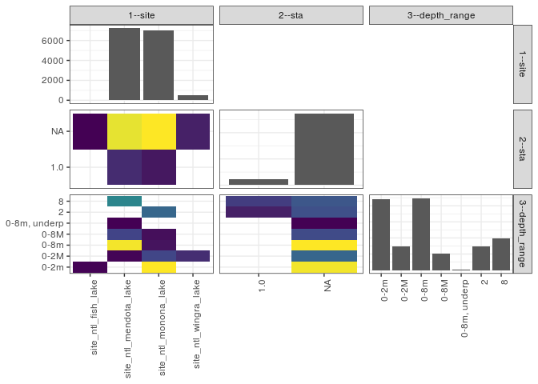

popler\_data\_organizatonal\_hierarchy
================
Hao Ye, Ellen Bledsoe
5/21/2019

``` r
library(tidyverse)

all_data <- readRDS("list_df_full.RDS")
df <- as_tibble(all_data[[params$dataset_index]])

cat("My project metadata key is ", 
    df$proj_metadata_key[1], "!!")
```

    ## My project metadata key is  831 !!

``` r
# figure out the spatial replication levels
df %>% 
  select(starts_with("spatial_replication_level")) %>%
  NCOL() %>%
  {./2} -> num_sr_levels
```

``` r
# transform the names of the variables
#   - get rid of the `spatial_replication_level_#_label` columns
sr_vars <- character(num_sr_levels)
for (i in seq(num_sr_levels))
{
  new_name <- paste0(i, "--", as.character(df[[1, paste0("spatial_replication_level_", i, "_label")]]))
  old_name <- paste0("spatial_replication_level_", i)
  sr_vars[i] <- new_name
  df <- rename(df, !!new_name := !!old_name)
}
```

``` r
# extract just the spatial replication level data
data_organization <- df %>%
  select(sr_vars)
```

``` r
# make pair-wise density plots to summarize organizational structure:
# 
library(GGally)
my_bin <- function(data, mapping, ...) {
  ggplot(data = data, mapping = mapping) +
    geom_bin2d(...) +
    scale_fill_viridis_c()
}

pm <- ggpairs(data_organization, 
                      lower = list(discrete = my_bin), 
                      upper = list(discrete = "blank"), 
              cardinality_threshold = NULL) + 
  theme_bw() + 
  theme(axis.text.x = element_text(angle = 90, hjust = 1))

print(pm)
```



``` r
# generate contingency tables to summarize organizational structure:
#   - level_i vs. level_j (i < j)

cols <- expand.grid(i = seq(num_sr_levels), 
                    j = seq(num_sr_levels)) %>%
  filter(i < j)

sr_tables <- purrr::pmap(cols, function(i, j) {
    data_organization %>%
      select(sr_vars[c(i, j)]) %>%
      table()
  })
```

``` r
# loop over tables and output
purrr::map(sr_tables, knitr::kable)
```

    ## [[1]]
    ## 
    ## 
    ##                          1.0     NA
    ## ----------------------  ----  -----
    ## site_ntl_fish_lake         0     25
    ## site_ntl_mendota_lake    780   6437
    ## site_ntl_monona_lake     356   6691
    ## site_ntl_wingra_lake       0    532
    ## 
    ## [[2]]
    ## 
    ## 
    ##                          0-2m   0-2M   0-8m   0-8M   0-8m, underp      2      8
    ## ----------------------  -----  -----  -----  -----  -------------  -----  -----
    ## site_ntl_fish_lake         25      0      0      0              0      0      0
    ## site_ntl_mendota_lake       0     40   4292    884              7      0   1994
    ## site_ntl_monona_lake     4365    912    180    130              0   1460      0
    ## site_ntl_wingra_lake        0    532      0      0              0      0      0
    ## 
    ## [[3]]
    ## 
    ## 
    ##        0-2m   0-2M   0-8m   0-8M   0-8m, underp      2      8
    ## ----  -----  -----  -----  -----  -------------  -----  -----
    ## 1.0       0      0      0      0              0    356    780
    ## NA     4390   1484   4472   1014              7   1104   1214
