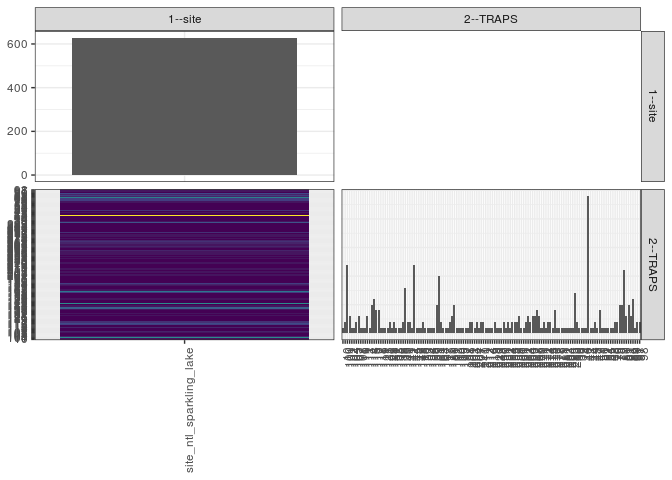

popler\_data\_organizatonal\_hierarchy
================
Hao Ye, Ellen Bledsoe
5/21/2019

``` r
library(tidyverse)

all_data <- readRDS("list_df_full.RDS")
df <- as_tibble(all_data[[params$dataset_index]])

cat("My project metadata key is ", 
    df$proj_metadata_key[1], "!!")
```

    ## My project metadata key is  833 !!

``` r
# figure out the spatial replication levels
df %>% 
  select(starts_with("spatial_replication_level")) %>%
  NCOL() %>%
  {./2} -> num_sr_levels
```

``` r
# transform the names of the variables
#   - get rid of the `spatial_replication_level_#_label` columns
sr_vars <- character(num_sr_levels)
for (i in seq(num_sr_levels))
{
  new_name <- paste0(i, "--", as.character(df[[1, paste0("spatial_replication_level_", i, "_label")]]))
  old_name <- paste0("spatial_replication_level_", i)
  sr_vars[i] <- new_name
  df <- rename(df, !!new_name := !!old_name)
}
```

``` r
# extract just the spatial replication level data
data_organization <- df %>%
  select(sr_vars)
```

``` r
# make pair-wise density plots to summarize organizational structure:
# 
library(GGally)
my_bin <- function(data, mapping, ...) {
  ggplot(data = data, mapping = mapping) +
    geom_bin2d(...) +
    scale_fill_viridis_c()
}

pm <- ggpairs(data_organization, 
                      lower = list(discrete = my_bin), 
                      upper = list(discrete = "blank"), 
              cardinality_threshold = NULL) + 
  theme_bw() + 
  theme(axis.text.x = element_text(angle = 90, hjust = 1))

print(pm)
```



``` r
# generate contingency tables to summarize organizational structure:
#   - level_i vs. level_j (i < j)

cols <- expand.grid(i = seq(num_sr_levels), 
                    j = seq(num_sr_levels)) %>%
  filter(i < j)

sr_tables <- purrr::pmap(cols, function(i, j) {
    data_organization %>%
      select(sr_vars[c(i, j)]) %>%
      table()
  })
```

``` r
# loop over tables and output
purrr::map(sr_tables, knitr::kable)
```

    ## [[1]]
    ## 
    ## 
    ##                            10   100   101   102   104   105   107   108   110   111   112   113   114   115   116   117   118   119   121   125   126   128   131   132   135   136   138   139   140   141   142   144   145   146   148   15   150   153   154   156   158   159   161   162   163   167   17   179   180   181   182   19   190   195   197   198   201   202   203   204   207   21   210   211   212   214   216   219   220   233   248   250   251   252   253   254   255   256   258   260   261   262   263   264   266   267   268   269   270   271   272   273   274   275   276   277   278   279   281   282   283   284   285   289   30   33   39    4   40   42   43   44   45   47   49   50   51   52   54   55   68   70   76   78   79   80   81   82   83   89   90   91   97   98
    ## ------------------------  ---  ----  ----  ----  ----  ----  ----  ----  ----  ----  ----  ----  ----  ----  ----  ----  ----  ----  ----  ----  ----  ----  ----  ----  ----  ----  ----  ----  ----  ----  ----  ----  ----  ----  ----  ---  ----  ----  ----  ----  ----  ----  ----  ----  ----  ----  ---  ----  ----  ----  ----  ---  ----  ----  ----  ----  ----  ----  ----  ----  ----  ---  ----  ----  ----  ----  ----  ----  ----  ----  ----  ----  ----  ----  ----  ----  ----  ----  ----  ----  ----  ----  ----  ----  ----  ----  ----  ----  ----  ----  ----  ----  ----  ----  ----  ----  ----  ----  ----  ----  ----  ----  ----  ----  ---  ---  ---  ---  ---  ---  ---  ---  ---  ---  ---  ---  ---  ---  ---  ---  ---  ---  ---  ---  ---  ---  ---  ---  ---  ---  ---  ---  ---  ---
    ## site_ntl_sparkling_lake     2     4    24     6     2     2     4     6     2     2     2     6     2    10    12     8     8     2     2     2     2     4     2     4     2     2     2     4    16     4     4     2    24     2     2    2     4     2     2     2     2     2    10    20     4     2    2     2     4     6    10    2     2     2     2     2     2     4     4     2     4    2     4     4     2     2     2     2     4     2     2     2     4     2     4     2     4     4     4     6     2     2     4     6     4     6     6     8     6     2     4     2     4     4     2     8     2     2     2     2     2     2     2     2   14    4    2    2    2    2   48    2    2    4    2    8    2    2    2    2    2    2    4    4   10   10   22    6   10    6   12    2    4    4
