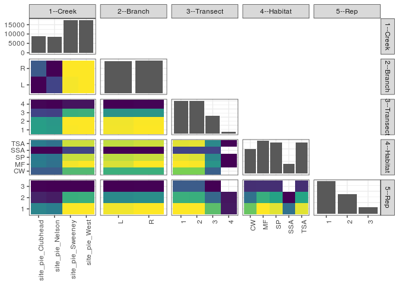

popler\_data\_organizatonal\_hierarchy
================
Hao Ye, Ellen Bledsoe
5/21/2019

``` r
library(tidyverse)

all_data <- readRDS("list_df_full.RDS")
df <- as_tibble(all_data[[params$dataset_index]])

cat("My project metadata key is ", 
    df$proj_metadata_key[1], "!!")
```

    ## My project metadata key is  862 !!

``` r
# figure out the spatial replication levels
df %>% 
  select(starts_with("spatial_replication_level")) %>%
  NCOL() %>%
  {./2} -> num_sr_levels
```

``` r
# transform the names of the variables
#   - get rid of the `spatial_replication_level_#_label` columns
sr_vars <- character(num_sr_levels)
for (i in seq(num_sr_levels))
{
  new_name <- paste0(i, "--", as.character(df[[1, paste0("spatial_replication_level_", i, "_label")]]))
  old_name <- paste0("spatial_replication_level_", i)
  sr_vars[i] <- new_name
  df <- rename(df, !!new_name := !!old_name)
}
```

``` r
# extract just the spatial replication level data
data_organization <- df %>%
  select(sr_vars)
```

``` r
# make pair-wise density plots to summarize organizational structure:
# 
library(GGally)
my_bin <- function(data, mapping, ...) {
  ggplot(data = data, mapping = mapping) +
    geom_bin2d(...) +
    scale_fill_viridis_c()
}

pm <- ggpairs(data_organization, 
                      lower = list(discrete = my_bin), 
                      upper = list(discrete = "blank"), 
              cardinality_threshold = NULL) + 
  theme_bw() + 
  theme(axis.text.x = element_text(angle = 90, hjust = 1))

print(pm)
```

    ## plot: [1,1] [=>-------------------------------------------] 4% est: 0s
    ## plot: [1,2] [===>-----------------------------------------] 8% est: 1s
    ## plot: [1,3] [====>----------------------------------------] 12% est: 1s
    ## plot: [1,4] [======>--------------------------------------] 16% est: 1s
    ## plot: [1,5] [========>------------------------------------] 20% est: 1s
    ## plot: [2,1] [==========>----------------------------------] 24% est: 0s
    ## plot: [2,2] [============>--------------------------------] 28% est: 1s
    ## plot: [2,3] [=============>-------------------------------] 32% est: 1s
    ## plot: [2,4] [===============>-----------------------------] 36% est: 1s
    ## plot: [2,5] [=================>---------------------------] 40% est: 1s
    ## plot: [3,1] [===================>-------------------------] 44% est: 1s
    ## plot: [3,2] [=====================>-----------------------] 48% est: 1s
    ## plot: [3,3] [======================>----------------------] 52% est: 1s
    ## plot: [3,4] [========================>--------------------] 56% est: 1s
    ## plot: [3,5] [==========================>------------------] 60% est: 1s
    ## plot: [4,1] [============================>----------------] 64% est: 1s
    ## plot: [4,2] [==============================>--------------] 68% est: 1s
    ## plot: [4,3] [===============================>-------------] 72% est: 1s
    ## plot: [4,4] [=================================>-----------] 76% est: 1s
    ## plot: [4,5] [===================================>---------] 80% est: 0s
    ## plot: [5,1] [=====================================>-------] 84% est: 0s
    ## plot: [5,2] [=======================================>-----] 88% est: 0s
    ## plot: [5,3] [========================================>----] 92% est: 0s
    ## plot: [5,4] [==========================================>--] 96% est: 0s
    ## plot: [5,5] [=============================================]100% est: 0s



``` r
# generate contingency tables to summarize organizational structure:
#   - level_i vs. level_j (i < j)

cols <- expand.grid(i = seq(num_sr_levels), 
                    j = seq(num_sr_levels)) %>%
  filter(i < j)

sr_tables <- purrr::pmap(cols, function(i, j) {
    data_organization %>%
      select(sr_vars[c(i, j)]) %>%
      table()
  })
```

``` r
# loop over tables and output
purrr::map(sr_tables, knitr::kable)
```

    ## [[1]]
    ## 
    ## 
    ##                         L      R
    ## ------------------  -----  -----
    ## site_pie_Clubhead    3744   5152
    ## site_pie_Nelson      4736   3744
    ## site_pie_Sweeney     8672   8736
    ## site_pie_West        8736   8736
    ## 
    ## [[2]]
    ## 
    ## 
    ##                         1      2      3     4
    ## ------------------  -----  -----  -----  ----
    ## site_pie_Clubhead    3680   3648   1376   192
    ## site_pie_Nelson      3552   3488   1312   128
    ## site_pie_Sweeney     6432   6464   4128   384
    ## site_pie_West        6464   6464   4160   384
    ## 
    ## [[3]]
    ## 
    ## 
    ##           1       2      3     4
    ## ---  ------  ------  -----  ----
    ## L      9984    9952   5440   512
    ## R     10144   10112   5536   576
    ## 
    ## [[4]]
    ## 
    ## 
    ##                        CW     MF     SP    SSA    TSA
    ## ------------------  -----  -----  -----  -----  -----
    ## site_pie_Clubhead    1728   2208   2176    576   2208
    ## site_pie_Nelson      1728   2048   2080    576   2048
    ## site_pie_Sweeney     3264   4448   4160   1344   4192
    ## site_pie_West        3264   4512   4160   1344   4192
    ## 
    ## [[5]]
    ## 
    ## 
    ##         CW     MF     SP    SSA    TSA
    ## ---  -----  -----  -----  -----  -----
    ## L     4992   6464   6240   1920   6272
    ## R     4992   6752   6336   1920   6368
    ## 
    ## [[6]]
    ## 
    ## 
    ##    CW     MF     SP    SSA    TSA
    ## -----  -----  -----  -----  -----
    ##  4096   5056   4864   1280   4832
    ##  4096   5024   4800   1280   4864
    ##  1792   2784   2560   1280   2560
    ##     0    352    352      0    384
    ## 
    ## [[7]]
    ## 
    ## 
    ##                         1      2      3
    ## ------------------  -----  -----  -----
    ## site_pie_Clubhead    5120   2208   1568
    ## site_pie_Nelson      4896   2048   1536
    ## site_pie_Sweeney     9376   6496   1536
    ## site_pie_West        9408   6528   1536
    ## 
    ## [[8]]
    ## 
    ## 
    ##           1      2      3
    ## ---  ------  -----  -----
    ## L     14272   8544   3072
    ## R     14528   8736   3104
    ## 
    ## [[9]]
    ## 
    ## 
    ##      1      2      3
    ## ------  -----  -----
    ##  10432   6624   3072
    ##  10400   6592   3072
    ##   7392   3552     32
    ##    576    512      0
    ## 
    ## [[10]]
    ## 
    ## 
    ##           1      2      3
    ## ----  -----  -----  -----
    ## CW     5376   3072   1536
    ## MF     6976   4672   1568
    ## SP     6688   4352   1536
    ## SSA    3072    768      0
    ## TSA    6688   4416   1536
