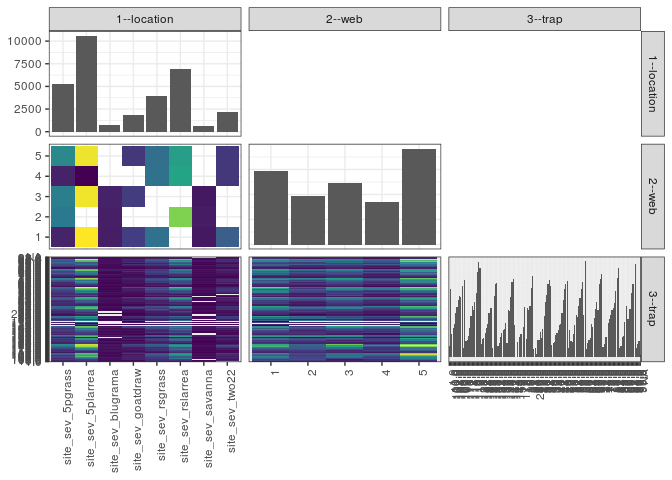

popler\_data\_organizatonal\_hierarchy
================
Hao Ye, Ellen Bledsoe
5/21/2019

``` r
library(tidyverse)

all_data <- readRDS("list_df_full.RDS")
df <- as_tibble(all_data[[params$dataset_index]])

cat("My project metadata key is ", 
    df$proj_metadata_key[1], "!!")
```

    ## My project metadata key is  58 !!

``` r
# figure out the spatial replication levels
df %>% 
  select(starts_with("spatial_replication_level")) %>%
  NCOL() %>%
  {./2} -> num_sr_levels
```

``` r
# transform the names of the variables
#   - get rid of the `spatial_replication_level_#_label` columns
sr_vars <- character(num_sr_levels)
for (i in seq(num_sr_levels))
{
  new_name <- paste0(i, "--", as.character(df[[1, paste0("spatial_replication_level_", i, "_label")]]))
  old_name <- paste0("spatial_replication_level_", i)
  sr_vars[i] <- new_name
  df <- rename(df, !!new_name := !!old_name)
}
```

``` r
# extract just the spatial replication level data
data_organization <- df %>%
  select(sr_vars)
```

``` r
# make pair-wise density plots to summarize organizational structure:
# 
library(GGally)
my_bin <- function(data, mapping, ...) {
  ggplot(data = data, mapping = mapping) +
    geom_bin2d(...) +
    scale_fill_viridis_c()
}

pm <- ggpairs(data_organization, 
                      lower = list(discrete = my_bin), 
                      upper = list(discrete = "blank"), 
              cardinality_threshold = NULL) + 
  theme_bw() + 
  theme(axis.text.x = element_text(angle = 90, hjust = 1))

print(pm)
```



``` r
# generate contingency tables to summarize organizational structure:
#   - level_i vs. level_j (i < j)

cols <- expand.grid(i = seq(num_sr_levels), 
                    j = seq(num_sr_levels)) %>%
  filter(i < j)

sr_tables <- purrr::pmap(cols, function(i, j) {
    data_organization %>%
      select(sr_vars[c(i, j)]) %>%
      table()
  })
```

``` r
# loop over tables and output
purrr::map(sr_tables, knitr::kable)
```

    ## [[1]]
    ## 
    ## 
    ##                         1      2      3      4      5
    ## ------------------  -----  -----  -----  -----  -----
    ## site_sev_5pgrass      307   1452   1537    285   1692
    ## site_sev_5plarrea    3587      0   3515      1   3484
    ## site_sev_blugrama     248    254    284      0      0
    ## site_sev_goatdraw     634      0    615      0    546
    ## site_sev_rsgrass     1334      0      0   1345   1307
    ## site_sev_rslarrea       0   2893      0   2088   1992
    ## site_sev_savanna      195    230    195      0      0
    ## site_sev_two22       1066      0      0    557    565
    ## 
    ## [[2]]
    ## 
    ## 
    ##                      1.0   10.0   100.0   101.0   102.0   103.0   104.0   105.0   106.0   107.0   108.0   109.0   11.0   110.0   111.0   112.0   113.0   114.0   115.0   116.0   117.0   118.0   119.0   12.0   120.0   121.0   122.0   123.0   124.0   125.0   126.0   127.0   128.0   129.0   13.0   130.0   131.0   132.0   133.0   134.0   135.0   136.0   137.0   138.0   139.0   14.0   140.0   141.0   142.0   143.0   144.0   145.0   146.0   15.0   159.0   16.0   17.0   172.0   18.0   19.0   2.0   20.0   21.0   22.0   23.0   24.0   25.0   26.0   260.0   27.0   28.0   29.0   3.0   30.0   31.0   32.0   33.0   34.0   35.0   36.0   37.0   38.0   39.0   4.0   40.0   41.0   42.0   43.0   44.0   45.0   46.0   47.0   48.0   49.0   5.0   50.0   51.0   52.0   53.0   54.0   55.0   56.0   57.0   58.0   59.0   6.0   60.0   61.0   62.0   63.0   64.0   65.0   66.0   67.0   68.0   69.0   7.0   70.0   71.0   72.0   73.0   74.0   75.0   76.0   77.0   78.0   79.0   8.0   80.0   81.0   82.0   83.0   84.0   85.0   86.0   87.0   88.0   89.0   9.0   90.0   91.0   92.0   93.0   94.0   95.0   96.0   97.0   98.0   99.0   NA
    ## ------------------  ----  -----  ------  ------  ------  ------  ------  ------  ------  ------  ------  ------  -----  ------  ------  ------  ------  ------  ------  ------  ------  ------  ------  -----  ------  ------  ------  ------  ------  ------  ------  ------  ------  ------  -----  ------  ------  ------  ------  ------  ------  ------  ------  ------  ------  -----  ------  ------  ------  ------  ------  ------  ------  -----  ------  -----  -----  ------  -----  -----  ----  -----  -----  -----  -----  -----  -----  -----  ------  -----  -----  -----  ----  -----  -----  -----  -----  -----  -----  -----  -----  -----  -----  ----  -----  -----  -----  -----  -----  -----  -----  -----  -----  -----  ----  -----  -----  -----  -----  -----  -----  -----  -----  -----  -----  ----  -----  -----  -----  -----  -----  -----  -----  -----  -----  -----  ----  -----  -----  -----  -----  -----  -----  -----  -----  -----  -----  ----  -----  -----  -----  -----  -----  -----  -----  -----  -----  -----  ----  -----  -----  -----  -----  -----  -----  -----  -----  -----  -----  ---
    ## site_sev_5pgrass      17     54      18      33      34      21      43      38      43      30      57       5     62      10       8      25      22      25      28      42      47      45      73     82      91       7      16      16      24      24      31      26      20      40     12      46      48      80      13      17      32      28      18      33      34     15      34      30      33      44      62      57       0     15       0      6     16       0     22     37    19     39     37     66     76     95     10      4       4     14     19     19    20     30     32     56     58     62     89     64     19     19     20    21     27     27     19     25     38     54     52     50     66     15    32     23     24     25     14     28     33     39     40     46     56    51     63      8     16     18     19     24     17     21     47     44    51     81     80     90     10     14     22     23     32     46     56    41     39     31     63     89     89      6      6     12     26     40    41     43     53     67     62     51     52     61     17      9     25    3
    ## site_sev_5plarrea     19    121      28      32      35      67      91     134     118     114     125      22    133      23      30      20      46      73      97      93     121     133     162    169     174      24      33      32      47      53      48      75      95     100     11     128     131     109      27      28      31      36      35      51      59     21      87      83     116     129     144      46       3     33       1     43     48       0     39     87    33     88     79     81    112    138     12     17       4     33     23     46    39     54     70     97    134    126    134    117     16     17     24    28     48     50     59     55     64     92    118    121    140     17    45     14     22     37     47     84     71     98    132    124    152    80    190     10     23     22     34     56     52     83     97    112    69    130    159    166     18      6     35     26     70     58     70    83     83    100    142    139    160     16     16     35     24     40    69     53     60     49    125    132    136    182     16     18     18    0
    ## site_sev_blugrama      2      3       5       7       6       8      10       5       7       3       7       4      4       4       5       8       8       7       8       8      10      10       5     12       9       4       3       7       0      12       2       9       4      11      0       5       8      13       5       2       8       8       6       4       9      4       6       4       9      11       7      13       0      3       0      6      0       0      9      4     2      7      7      1      6      6      0      0       0      3      0      0     4      5      3      5      3      6      5      8      1      2      2     4      7      1      5      6      5      7      9      8      9      1     3      4      5      5      4     10      2      6      9      1      4     3      5      1      5      3      5      3      1      2      5      6     3      6      9     11      1      5      5      6     10      6      4     2      4      5     14     12     11      6      3      4      3      6     4      3      9      7      6      8      7      8      0      3      4    0
    ## site_sev_goatdraw      2     15       4      18       9      16      19      15       8      18       9       6     30      13       9       6       7      14      14       9      16      20      27     36      42       7      10       5       2      12       1      17      20       8      5      13      24      13       1       2       6      10       5       2       9      3       3       9       9      34      38       3       0      3       0      2      7       1     11     24     3     15     12     21     24     27      4      1       0      1      4      6     6      6      9     32     31     40     13     25      1      3     12     8      8      3     14     15     12     13     16     37     20      2     4      5      4      6     18      7     11     14      9     17     14     4     45      5      4      0      4      7      4     10      8      5    10     13     19     42      5      7      9      4      5     15      9     8     24     11      8     26     40      2      4      7      5     15    27      5      6     24     23     17     16     23      3      5      7    1
    ## site_sev_rsgrass      11     41      24      23      30      32      28      40      37      47      54       6     51       6      12      11      28      20      25      31      20      24      52     48      58       9      19      12      25      20      28      31      35      30      4      50      49      59       6       5      10      16      31      18      18     12      28      44      50      51      57      15       0     10       0     11     21       0     34     24    14     29     32     34     46     43      7     10       4      9     14     14    13     28     48     39     31     42     45     47     12      8      6    22     15     23     21     15     31     38     46     58     45      5    23     12     13     14     23     26     35     32     35     52     42    31     53      5     16     10     13     11     26     33     28     34    42     47     42     39     10     13     16      9     31     23     26    38     38     47     30     38     48      8      9      8     13     21    34     33     18     36     40     43     55     53      5     12      8    1
    ## site_sev_rslarrea      7     90      25      37      47      75      53      53      90      86     107       7     92      24      26      32      40      63      62      55      53      79      94    106      83       8      10      23      26      27      59      62      66      56     11      62     101      76       4      18      17      26      46      32      39     16      72      56      82      82      75      29       0     16       0     32     21       0     29     70    13     45     52     37     68     43      9      9       4     14     24     40    16     17     27     27     53     85     93     83     10     18      8    26     20     27     43     46     69     75    104     87     96      8    28     21     10     26     48     48     35     54     58     84    101    39    131      8      8     27     25     44     42     43     42     73    55     85     91     80      6     17     16     27     22     41     47    63     56     72     75     85     99      7     14     29     26     39    80     51     49     61     76    106     94    141      5      9     20    3
    ## site_sev_savanna       1      6       4       0       3       4       5       9       7       4       6       0      6       1       1       5       3       4       5       3       5       5       5     10       3       1       4       1       5       3       1       1       7       3      3       4      10      13       1       0       0       3       1       1       8      2       5       7       3      11       9       2       0      3       0      3      1       0      1      3     0      6      8      7      2     17      0      0       0      6      1      5     1      6      4      7      4      5      5      7      1      1      1     1      4      2      0      3      4      6      5      3      8      0     1      2      6      1      2      7      7      4      9     10      7     7      5      2      3      3      1      7      4      6      8      2     4      5      9      7      1      5      3      4      5      6      6     4      8      6      5     11      3      3      4      1      4     11     3      4      6      3      2      9     10      3      1      5      0    0
    ## site_sev_two22         0     37      17       9      15      15      19      13      16      22      18       1     35       4       4       6       4      13      33      11      24      30      36     45      16       9       4       6       3       6      10      14      15      16      5      20      22      33       1       3       5       4       4      10       6      4      16      17      20      39      26       7       0      1       0      5      9       0     19     19    12     33     26     27     35     64      4      9       1     10      5      8     7      8     26     31     21     24     29     30      4     10      9     8      3     14     13     12     14     22     13     30     26      3    12      8      0      9     16     18     24     30     23     30     27    12     21      8      2      8      5     25     15     13     24     18    20     24     12     13      3      2      3      8      6     11     11    12     12     20     18     23     30      4      7     14     15     15    16     12      6      9      8     25     21     28      4      9      5    2
    ## 
    ## [[3]]
    ## 
    ## 
    ##  1.0   10.0   100.0   101.0   102.0   103.0   104.0   105.0   106.0   107.0   108.0   109.0   11.0   110.0   111.0   112.0   113.0   114.0   115.0   116.0   117.0   118.0   119.0   12.0   120.0   121.0   122.0   123.0   124.0   125.0   126.0   127.0   128.0   129.0   13.0   130.0   131.0   132.0   133.0   134.0   135.0   136.0   137.0   138.0   139.0   14.0   140.0   141.0   142.0   143.0   144.0   145.0   146.0   15.0   159.0   16.0   17.0   172.0   18.0   19.0   2.0   20.0   21.0   22.0   23.0   24.0   25.0   26.0   260.0   27.0   28.0   29.0   3.0   30.0   31.0   32.0   33.0   34.0   35.0   36.0   37.0   38.0   39.0   4.0   40.0   41.0   42.0   43.0   44.0   45.0   46.0   47.0   48.0   49.0   5.0   50.0   51.0   52.0   53.0   54.0   55.0   56.0   57.0   58.0   59.0   6.0   60.0   61.0   62.0   63.0   64.0   65.0   66.0   67.0   68.0   69.0   7.0   70.0   71.0   72.0   73.0   74.0   75.0   76.0   77.0   78.0   79.0   8.0   80.0   81.0   82.0   83.0   84.0   85.0   86.0   87.0   88.0   89.0   9.0   90.0   91.0   92.0   93.0   94.0   95.0   96.0   97.0   98.0   99.0   NA
    ## ----  -----  ------  ------  ------  ------  ------  ------  ------  ------  ------  ------  -----  ------  ------  ------  ------  ------  ------  ------  ------  ------  ------  -----  ------  ------  ------  ------  ------  ------  ------  ------  ------  ------  -----  ------  ------  ------  ------  ------  ------  ------  ------  ------  ------  -----  ------  ------  ------  ------  ------  ------  ------  -----  ------  -----  -----  ------  -----  -----  ----  -----  -----  -----  -----  -----  -----  -----  ------  -----  -----  -----  ----  -----  -----  -----  -----  -----  -----  -----  -----  -----  -----  ----  -----  -----  -----  -----  -----  -----  -----  -----  -----  -----  ----  -----  -----  -----  -----  -----  -----  -----  -----  -----  -----  ----  -----  -----  -----  -----  -----  -----  -----  -----  -----  -----  ----  -----  -----  -----  -----  -----  -----  -----  -----  -----  -----  ----  -----  -----  -----  -----  -----  -----  -----  -----  -----  -----  ----  -----  -----  -----  -----  -----  -----  -----  -----  -----  -----  ---
    ##    7     83      37      32      40      54      69      76      51      53      57      17     89      15      24      22      27      39      83      52      73      81     114    107     105      22      27      18      29      37      28      66      67      52     14      78      91      77      16      15      24      31      28      32      43     18      77      50      67      90      83      41       1     15       0     28     32       1     33     55    27     66     70     57     93    128      6     15       5     22     22     30    24     43     63     74     75     82     95     98     11     13     25    32     29     39     33     33     40     66     67     98     98     12    36     22     19     33     51     75     82     76     63     53    102    56    139     15     19     21     18     34     26     58     58     60    43     90     72    107     13     11     33     20     60     46     48    71     60     76     88    105    114     14     10     29     26     54    53     44     32     40     80     83     80    105     19     24     19    2
    ##   10     47      30      43      31      34      41      33      50      33      37       7     41      21      25      28      30      44      58      48      50      61      52     55      57      10      14      19      25      22      32      32      48      37      4      31      88      75       9      16      27      24      21      25      15     11      31      42      46      51      30      28       0     11       0     19     16       0     33     68    11     55     55     56     65     61      7      3       2     12     19     34    11     25     35     43     57     70     64     40      6     10      9    14     12     13     18     32     33     43     54     65     66     10    19     18     12     13     15     30     39     38     26     52     29    24     53      9     10     14     22     28     26     17     41     32    32     66     80     67      8     11      9     21     22     48     35    46     31     44     61     69     48      6     12     22     18     22    55     27     31     31     41     72     63     86     10      9     23    0
    ##   15     67      13      10      27      35      52      73      48      60      65       9     67      16      12      21      18      39      34      61      66      75     104     89     132      10      15      12      27      33      14      30      43      48     14      61      84      90      10       8      14      25      22      18      35     18      38      53      67      80     101      47       0     19       0     21     28       0     30     54    16     56     29     33     48     53     11     10       2     19     15     23    29     35     34     63     76     80     70     54     18     21     20    26     30     36     37     43     51     67     75     85     90     11    40     24     28     33     20     35     25     56     79     76     85    58     99     12     19     12     25     35     26     38     47     40    60     84     99     93     17     18     21     19     34     31     43    43     53     46     69     88    110     13     13     15     25     26    46     17     32     66     59     50     76     79      7     16     21    2
    ##    2     64      21      18      33      38      31      34      47      55      63       4     74       9       6      19      34      21      35      28      25      44      45     84      43       8       8      12      18      23      32      24      31      29      7      35      43      50       5       7       4      15      32      18      30     10      26      43      51      59      83      14       0     10       0      9     19       0     31     26     7     33     29     25     45     49      7      5       4     12     11     11    11     19     29     25     32     50     73     73     12     10      2    17     20     23     23     20     41     44     63     67     60      7    17     11      7     26     35     32     21     32     56     71     73    24     73      3     11     13     10     30     24     19     27     46    40     54     42     32      7     11     15     15     11     16     24    41     21     44     41     62     54      5     13      5     11     23    54     31     25     42     43     46     53     65      5      4      9    3
    ##   25    106      24      56      48      77      75      91     130     123     161      14    142      24      28      23      49      76      62      63      82      85     139    173     139      19      35      41      33      42      74      83      73      98     12     123      87     104      18      29      40      36      43      58      59     20      79      62      91     121     121      42       2     29       1     31     28       0     37     65    35     52     70    103    118    142     15     17       4     25     23     40    31     32     58     89     95    108    111    116     17     24     26    29     41     36     63     49     72     87    104     79     96     11    36     14     18     18     51     56     51     75     91    112    114    65    149      8     18     31     31     50     59     79     86    116    79     97    128    149      9     18     31     32     54     65     79    50     99     82     96     99    154     14     15     39     36     62    66     85     87     77    119    140    119    164     10     17     15    3
