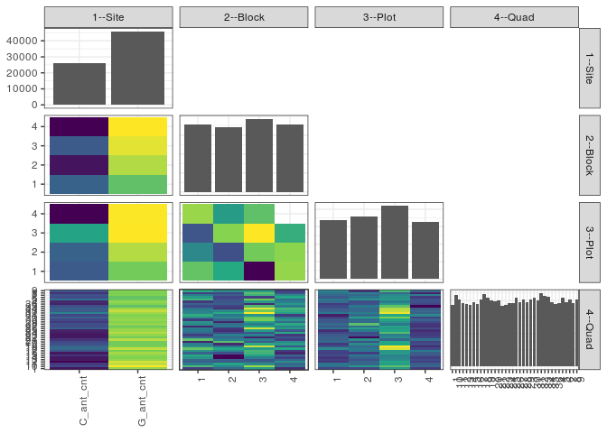

popler\_data\_organizatonal\_hierarchy
================
Hao Ye, Ellen Bledsoe
5/21/2019

``` r
library(tidyverse)

all_data <- readRDS("list_df_full.RDS")
df <- as_tibble(all_data[[params$dataset_index]])

cat("My project metadata key is ", 
    df$proj_metadata_key[1], "!!")
```

    ## My project metadata key is  62 !!

``` r
# figure out the spatial replication levels
df %>% 
  select(starts_with("spatial_replication_level")) %>%
  NCOL() %>%
  {./2} -> num_sr_levels
```

``` r
# transform the names of the variables
#   - get rid of the `spatial_replication_level_#_label` columns
sr_vars <- character(num_sr_levels)
for (i in seq(num_sr_levels))
{
  new_name <- paste0(i, "--", as.character(df[[1, paste0("spatial_replication_level_", i, "_label")]]))
  old_name <- paste0("spatial_replication_level_", i)
  sr_vars[i] <- new_name
  df <- rename(df, !!new_name := !!old_name)
}
```

``` r
# extract just the spatial replication level data
data_organization <- df %>%
  select(sr_vars)
```

``` r
# make pair-wise density plots to summarize organizational structure:
# 
library(GGally)
my_bin <- function(data, mapping, ...) {
  ggplot(data = data, mapping = mapping) +
    geom_bin2d(...) +
    scale_fill_viridis_c()
}

pm <- ggpairs(data_organization, 
                      lower = list(discrete = my_bin), 
                      upper = list(discrete = "blank"), 
              cardinality_threshold = NULL) + 
  theme_bw() + 
  theme(axis.text.x = element_text(angle = 90, hjust = 1))

print(pm)
```

    ## plot: [1,1] [==>------------------------------------------] 6% est: 0s
    ## plot: [1,2] [=====>---------------------------------------] 12% est: 1s
    ## plot: [1,3] [=======>-------------------------------------] 19% est: 1s
    ## plot: [1,4] [==========>----------------------------------] 25% est: 0s
    ## plot: [2,1] [=============>-------------------------------] 31% est: 0s
    ## plot: [2,2] [================>----------------------------] 38% est: 1s
    ## plot: [2,3] [===================>-------------------------] 44% est: 1s
    ## plot: [2,4] [=====================>-----------------------] 50% est: 1s
    ## plot: [3,1] [========================>--------------------] 56% est: 1s
    ## plot: [3,2] [===========================>-----------------] 62% est: 0s
    ## plot: [3,3] [==============================>--------------] 69% est: 1s
    ## plot: [3,4] [=================================>-----------] 75% est: 0s
    ## plot: [4,1] [====================================>--------] 81% est: 0s
    ## plot: [4,2] [======================================>------] 88% est: 0s
    ## plot: [4,3] [=========================================>---] 94% est: 0s
    ## plot: [4,4] [=============================================]100% est: 0s



``` r
# generate contingency tables to summarize organizational structure:
#   - level_i vs. level_j (i < j)

cols <- expand.grid(i = seq(num_sr_levels), 
                    j = seq(num_sr_levels)) %>%
  filter(i < j)

sr_tables <- purrr::pmap(cols, function(i, j) {
    data_organization %>%
      select(sr_vars[c(i, j)]) %>%
      table()
  })
```

``` r
# loop over tables and output
purrr::map(sr_tables, knitr::kable)
```

    ## [[1]]
    ## 
    ## 
    ##                  1       2       3       4
    ## ----------  ------  ------  ------  ------
    ## C_ant_cnt     7578    5750    7379    5483
    ## G_ant_cnt    10307   11371   11894   12187
    ## 
    ## [[2]]
    ## 
    ## 
    ##                  1       2       3       4
    ## ----------  ------  ------  ------  ------
    ## C_ant_cnt     6474    6688    8834    4194
    ## G_ant_cnt    10339   11181   12126   12113
    ## 
    ## [[3]]
    ## 
    ## 
    ##     1      2      3      4
    ## -----  -----  -----  -----
    ##  5672   3635   2064   6514
    ##  4668   1899   6307   4247
    ##     5   5982   7740   5546
    ##  6468   6353   4849      0
    ## 
    ## [[4]]
    ## 
    ## 
    ##                 1     10     11     12     13     14     15     16     17     18     19      2     20     21     22     23     24     25     26     27     28     29      3     30     31     32     33     34     35     36      4      5      6      7      8      9
    ## ----------  -----  -----  -----  -----  -----  -----  -----  -----  -----  -----  -----  -----  -----  -----  -----  -----  -----  -----  -----  -----  -----  -----  -----  -----  -----  -----  -----  -----  -----  -----  -----  -----  -----  -----  -----  -----
    ## C_ant_cnt     601    749    703    564    614    610    688    607    781    860    846    773    744    688    611    605    619    632    823    756    772    704    749    825    744    941    814    823    770    637    655    875    765    783    677    782
    ## G_ant_cnt    1278   1419   1334   1362   1276   1255   1267   1296   1243   1337   1245   1227   1224   1327   1224   1274   1316   1284   1265   1205   1276   1257   1277   1264   1259   1290   1337   1284   1183   1254   1272   1204   1192   1253   1243   1256
    ## 
    ## [[5]]
    ## 
    ## 
    ##    1    10    11    12    13    14    15    16    17    18    19     2    20    21    22    23    24    25    26    27    28    29     3    30    31    32    33    34    35    36     4     5     6     7     8     9
    ## ----  ----  ----  ----  ----  ----  ----  ----  ----  ----  ----  ----  ----  ----  ----  ----  ----  ----  ----  ----  ----  ----  ----  ----  ----  ----  ----  ----  ----  ----  ----  ----  ----  ----  ----  ----
    ##  441   562   502   470   479   524   543   475   522   578   516   500   418   573   481   440   478   495   498   420   513   525   437   511   549   508   505   488   450   473   435   556   531   500   442   547
    ##  480   511   541   465   472   396   395   455   504   544   491   423   572   502   478   503   450   427   437   495   486   418   478   512   493   546   510   429   442   468   463   455   445   470   447   518
    ##  533   604   515   475   462   501   539   556   561   531   622   546   467   500   417   501   461   530   624   541   502   534   590   577   525   644   586   631   563   422   528   585   440   555   572   533
    ##  425   491   479   516   477   444   478   417   437   544   462   531   511   440   459   435   546   464   529   505   547   484   521   489   436   533   550   559   498   528   501   483   541   511   459   440
    ## 
    ## [[6]]
    ## 
    ## 
    ##    1    10    11    12    13    14    15    16    17    18    19     2    20    21    22    23    24    25    26    27    28    29     3    30    31    32    33    34    35    36     4     5     6     7     8     9
    ## ----  ----  ----  ----  ----  ----  ----  ----  ----  ----  ----  ----  ----  ----  ----  ----  ----  ----  ----  ----  ----  ----  ----  ----  ----  ----  ----  ----  ----  ----  ----  ----  ----  ----  ----  ----
    ##  443   503   508   421   436   419   452   435   439   538   460   425   490   483   479   471   442   411   508   467   494   466   469   429   394   511   481   466   447   428   497   509   472   488   506   526
    ##  445   558   487   487   458   481   512   432   509   510   493   541   459   544   372   455   451   514   570   501   623   493   497   569   492   521   492   489   512   458   454   548   510   489   524   419
    ##  563   622   568   583   542   531   527   562   561   704   728   584   582   487   541   523   616   580   560   578   509   551   580   651   582   718   692   683   626   563   518   562   547   540   491   605
    ##  428   485   474   435   454   434   464   474   515   445   410   450   437   501   443   430   426   411   450   415   422   451   480   440   535   481   486   469   368   442   458   460   428   519   399   488
