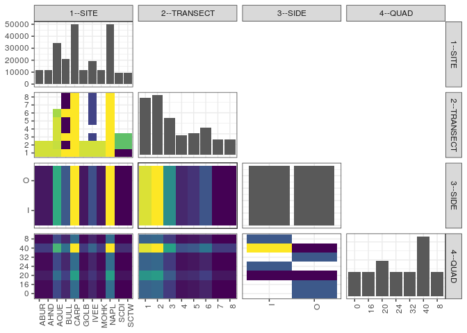

popler\_data\_organizatonal\_hierarchy
================
Hao Ye, Ellen Bledsoe
5/21/2019

``` r
library(tidyverse)

all_data <- readRDS("list_df_full.RDS")
df <- as_tibble(all_data[[params$dataset_index]])

cat("My project metadata key is ", 
    df$proj_metadata_key[1], "!!")
```

    ## My project metadata key is  3 !!

``` r
# figure out the spatial replication levels
df %>% 
  select(starts_with("spatial_replication_level")) %>%
  NCOL() %>%
  {./2} -> num_sr_levels
```

``` r
# transform the names of the variables
#   - get rid of the `spatial_replication_level_#_label` columns
sr_vars <- character(num_sr_levels)
for (i in seq(num_sr_levels))
{
  new_name <- paste0(i, "--", as.character(df[[1, paste0("spatial_replication_level_", i, "_label")]]))
  old_name <- paste0("spatial_replication_level_", i)
  sr_vars[i] <- new_name
  df <- rename(df, !!new_name := !!old_name)
}
```

``` r
# extract just the spatial replication level data
data_organization <- df %>%
  select(sr_vars)
```

``` r
# make pair-wise density plots to summarize organizational structure:
# 
library(GGally)
my_bin <- function(data, mapping, ...) {
  ggplot(data = data, mapping = mapping) +
    geom_bin2d(...) +
    scale_fill_viridis_c()
}

pm <- ggpairs(data_organization, 
                      lower = list(discrete = my_bin), 
                      upper = list(discrete = "blank")) + 
  theme_bw() + 
  theme(axis.text.x = element_text(angle = 90, hjust = 1))

print(pm)
```

    ## plot: [1,1] [==>------------------------------------------] 6% est: 0s
    ## plot: [1,2] [=====>---------------------------------------] 12% est: 2s
    ## plot: [1,3] [=======>-------------------------------------] 19% est: 1s
    ## plot: [1,4] [==========>----------------------------------] 25% est: 1s
    ## plot: [2,1] [=============>-------------------------------] 31% est: 1s
    ## plot: [2,2] [================>----------------------------] 38% est: 1s
    ## plot: [2,3] [===================>-------------------------] 44% est: 1s
    ## plot: [2,4] [=====================>-----------------------] 50% est: 1s
    ## plot: [3,1] [========================>--------------------] 56% est: 1s
    ## plot: [3,2] [===========================>-----------------] 62% est: 1s
    ## plot: [3,3] [==============================>--------------] 69% est: 1s
    ## plot: [3,4] [=================================>-----------] 75% est: 1s
    ## plot: [4,1] [====================================>--------] 81% est: 0s
    ## plot: [4,2] [======================================>------] 88% est: 1s
    ## plot: [4,3] [=========================================>---] 94% est: 0s
    ## plot: [4,4] [=============================================]100% est: 0s



``` r
# generate contingency tables to summarize organizational structure:
#   - level_i vs. level_j (i < j)

cols <- expand.grid(i = seq(num_sr_levels), 
                    j = seq(num_sr_levels)) %>%
  filter(i < j)

sr_tables <- purrr::pmap(cols, function(i, j) {
    data_organization %>%
      select(sr_vars[c(i, j)]) %>%
      table()
  })
```

``` r
# loop over tables and output
purrr::map(sr_tables, knitr::kable)
```

    ## [[1]]
    ## 
    ## 
    ##            1      2      3      4      5      6      7      8
    ## -----  -----  -----  -----  -----  -----  -----  -----  -----
    ## ABUR    5816   5816      0      0      0      0      0      0
    ## AHND    5816   5816      0      0      0      0      0      0
    ## AQUE    5816   5705   5816   5816   5816   5404      0      0
    ## BULL    6228    412   6228    412    412   6228    412    412
    ## CARP    6228   6228   6229   6228   6228   6228   6228   6228
    ## GOLB    5816   5816      0      0      0      0      0      0
    ## IVEE    5816   5816   1560      0   1560   1560   1560   1560
    ## MOHK    5816   5816      0      0      0      0      0      0
    ## NAPL    6228   6228   6228   6228   6228   6228   6228   6228
    ## SCDI     412   4580   4580      0      0      0      0      0
    ## SCTW     412   4580   4580      0      0      0      0      0
    ## 
    ## [[2]]
    ## 
    ## 
    ##             I       O
    ## -----  ------  ------
    ## ABUR     5816    5816
    ## AHND     5816    5816
    ## AQUE    17186   17187
    ## BULL    10372   10372
    ## CARP    24913   24912
    ## GOLB     5816    5816
    ## IVEE     9716    9716
    ## MOHK     5816    5816
    ## NAPL    24912   24912
    ## SCDI     4786    4786
    ## SCTW     4786    4786
    ## 
    ## [[3]]
    ## 
    ## 
    ##      I       O
    ## ------  ------
    ##  27202   27202
    ##  28406   28407
    ##  17611   17610
    ##   9342    9342
    ##  10122   10122
    ##  12824   12824
    ##   7214    7214
    ##   7214    7214
    ## 
    ## [[4]]
    ## 
    ## 
    ##            0     16     20     24     32      40      8
    ## -----  -----  -----  -----  -----  -----  ------  -----
    ## ABUR    1304   1304   1904   1304   1304    3208   1304
    ## AHND    1304   1304   1904   1304   1304    3208   1304
    ## AQUE    3866   3866   5593   3866   3866    9450   3866
    ## BULL    2324   2324   3400   2324   2324    5724   2324
    ## CARP    5584   5584   8160   5584   5584   13745   5584
    ## GOLB    1304   1304   1904   1304   1304    3208   1304
    ## IVEE    2264   2264   2924   2264   2264    5188   2264
    ## MOHK    1304   1304   1904   1304   1304    3208   1304
    ## NAPL    5584   5584   8160   5584   5584   13744   5584
    ## SCDI    1074   1074   1564   1074   1074    2638   1074
    ## SCTW    1074   1074   1564   1074   1074    2638   1074
    ## 
    ## [[5]]
    ## 
    ## 
    ##     0     16     20     24     32      40      8
    ## -----  -----  -----  -----  -----  ------  -----
    ##  6098   6098   8908   6098   6098   15006   6098
    ##  6382   6382   9265   6382   6382   15638   6382
    ##  3966   3966   5712   3966   3966    9679   3966
    ##  2094   2094   3060   2094   2094    5154   2094
    ##  2286   2286   3264   2286   2286    5550   2286
    ##  2892   2892   4148   2892   2892    7040   2892
    ##  1634   1634   2312   1634   1634    3946   1634
    ##  1634   1634   2312   1634   1634    3946   1634
    ## 
    ## [[6]]
    ## 
    ## 
    ##           0      16      20      24      32      40       8
    ## ---  ------  ------  ------  ------  ------  ------  ------
    ## I         0       0   19490   26986       0   46473   26986
    ## O     26986   26986   19491       0   26986   19486       0
