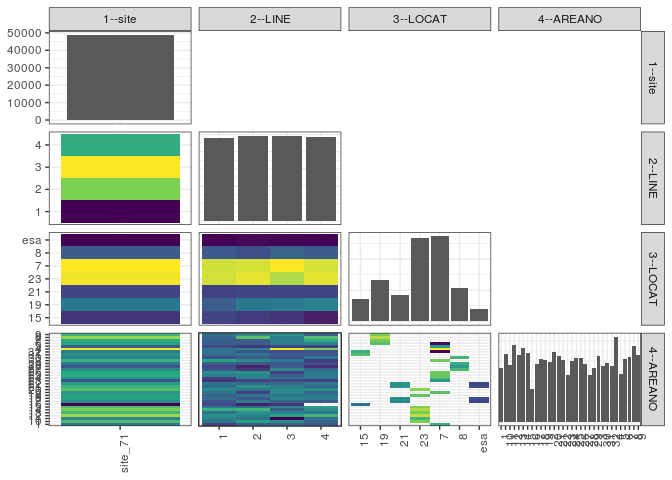

popler\_data\_organizatonal\_hierarchy
================
Hao Ye, Ellen Bledsoe
5/21/2019

``` r
library(tidyverse)

all_data <- readRDS("list_df_full.RDS")
df <- as_tibble(all_data[[params$dataset_index]])

cat("My project metadata key is ", 
    df$proj_metadata_key[1], "!!")
```

    ## My project metadata key is  71 !!

``` r
# figure out the spatial replication levels
df %>% 
  select(starts_with("spatial_replication_level")) %>%
  NCOL() %>%
  {./2} -> num_sr_levels
```

``` r
# transform the names of the variables
#   - get rid of the `spatial_replication_level_#_label` columns
sr_vars <- character(num_sr_levels)
for (i in seq(num_sr_levels))
{
  new_name <- paste0(i, "--", as.character(df[[1, paste0("spatial_replication_level_", i, "_label")]]))
  old_name <- paste0("spatial_replication_level_", i)
  sr_vars[i] <- new_name
  df <- rename(df, !!new_name := !!old_name)
}
```

``` r
# extract just the spatial replication level data
data_organization <- df %>%
  select(sr_vars)
```

``` r
# make pair-wise density plots to summarize organizational structure:
# 
library(GGally)
my_bin <- function(data, mapping, ...) {
  ggplot(data = data, mapping = mapping) +
    geom_bin2d(...) +
    scale_fill_viridis_c()
}

pm <- ggpairs(data_organization, 
                      lower = list(discrete = my_bin), 
                      upper = list(discrete = "blank"), 
              cardinality_threshold = NULL) + 
  theme_bw() + 
  theme(axis.text.x = element_text(angle = 90, hjust = 1))

print(pm)
```

    ## plot: [1,1] [==>------------------------------------------] 6% est: 0s
    ## plot: [1,2] [=====>---------------------------------------] 12% est: 1s
    ## plot: [1,3] [=======>-------------------------------------] 19% est: 0s
    ## plot: [1,4] [==========>----------------------------------] 25% est: 0s
    ## plot: [2,1] [=============>-------------------------------] 31% est: 0s
    ## plot: [2,2] [================>----------------------------] 38% est: 1s
    ## plot: [2,3] [===================>-------------------------] 44% est: 1s
    ## plot: [2,4] [=====================>-----------------------] 50% est: 1s
    ## plot: [3,1] [========================>--------------------] 56% est: 0s
    ## plot: [3,2] [===========================>-----------------] 62% est: 0s
    ## plot: [3,3] [==============================>--------------] 69% est: 0s
    ## plot: [3,4] [=================================>-----------] 75% est: 0s
    ## plot: [4,1] [====================================>--------] 81% est: 0s
    ## plot: [4,2] [======================================>------] 88% est: 0s
    ## plot: [4,3] [=========================================>---] 94% est: 0s
    ## plot: [4,4] [=============================================]100% est: 0s



``` r
# generate contingency tables to summarize organizational structure:
#   - level_i vs. level_j (i < j)

cols <- expand.grid(i = seq(num_sr_levels), 
                    j = seq(num_sr_levels)) %>%
  filter(i < j)

sr_tables <- purrr::pmap(cols, function(i, j) {
    data_organization %>%
      select(sr_vars[c(i, j)]) %>%
      table()
  })
```

``` r
# loop over tables and output
purrr::map(sr_tables, knitr::kable)
```

    ## [[1]]
    ## 
    ## 
    ##                1       2       3       4
    ## --------  ------  ------  ------  ------
    ## site_71    11944   12234   12305   12168
    ## 
    ## [[2]]
    ## 
    ## 
    ##              15     19     21      23       7      8    esa
    ## --------  -----  -----  -----  ------  ------  -----  -----
    ## site_71    3585   6607   4248   13399   13621   5297   1894
    ## 
    ## [[3]]
    ## 
    ## 
    ##    15     19     21     23      7      8   esa
    ## -----  -----  -----  -----  -----  -----  ----
    ##  1078   1394   1038   3347   3332   1309   446
    ##   958   1684   1076   3446   3364   1208   498
    ##   883   1702   1070   3163   3567   1437   483
    ##   666   1827   1064   3443   3358   1343   467
    ## 
    ## [[4]]
    ## 
    ## 
    ##               1     10     11     12     13     14     15    16     17     18     19      2     20     21     22     23     24     25     26     27     28     29      3     30     31     32      4      5      6      7      8      9
    ## --------  -----  -----  -----  -----  -----  -----  -----  ----  -----  -----  -----  -----  -----  -----  -----  -----  -----  -----  -----  -----  -----  -----  -----  -----  -----  -----  -----  -----  -----  -----  -----  -----
    ## site_71    1337   1687   1395   1897   1649   1831   1691   812   1434   1545   1537   1482   1712   1629   1534   1149   1492   1585   1586   1421   1152   1338   1624   1386   1441   1370   2093   1173   1552   1601   1877   1639
    ## 
    ## [[5]]
    ## 
    ## 
    ##    1    10    11    12    13    14    15    16    17    18    19     2    20    21    22    23    24    25    26    27    28    29     3    30    31    32     4     5     6     7     8     9
    ## ----  ----  ----  ----  ----  ----  ----  ----  ----  ----  ----  ----  ----  ----  ----  ----  ----  ----  ----  ----  ----  ----  ----  ----  ----  ----  ----  ----  ----  ----  ----  ----
    ##  293   390   422   449   387   514   394   313   328   378   354   392   437   383   395   264   290   413   438   334   302   354   494   319   370   395   380   306   356   348   364   388
    ##  347   490   387   425   451   524   388   235   411   335   390   293   391   457   371   295   412   426   452   283   245   335   439   345   392   331   421   279   355   341   550   438
    ##  357   443   199   497   414   348   433   264   349   420   391   434   438   418   366   303   391   348   291   441   343   333   405   320   341   316   700   300   416   407   418   461
    ##  340   364   387   526   397   445   476     0   346   412   402   363   446   371   402   287   399   398   405   363   262   316   286   402   338   328   592   288   425   505   545   352
    ## 
    ## [[6]]
    ## 
    ## 
    ##           1     10     11     12     13     14     15    16    17     18     19      2     20     21     22     23     24     25     26     27     28     29      3     30     31     32      4      5      6      7      8      9
    ## ----  -----  -----  -----  -----  -----  -----  -----  ----  ----  -----  -----  -----  -----  -----  -----  -----  -----  -----  -----  -----  -----  -----  -----  -----  -----  -----  -----  -----  -----  -----  -----  -----
    ## 15        0      0      0      0      0      0      0   812     0      0      0      0      0      0      0      0      0      0      0      0      0      0      0      0   1441   1332      0      0      0      0      0      0
    ## 19        0      0      0      0      0      0      0     0     0      0      0      0      0      0      0      0      0      0      0      0      0      0      0      0      0      0      0      0   1490   1601   1877   1639
    ## 21        0      0      0      0      0      0      0     0   984   1053      0      0      0   1112   1099      0      0      0      0      0      0      0      0      0      0      0      0      0      0      0      0      0
    ## 23        0   1687   1395   1897   1649   1831   1691     0     0      0   1537      0   1712      0      0      0      0      0      0      0      0      0      0      0      0      0      0      0      0      0      0      0
    ## 7      1337      0      0      0      0      0      0     0     0      0      0   1482      0      0      0   1149   1492   1585   1586      0      0      0   1624      0      0     38   2093   1173     62      0      0      0
    ## 8         0      0      0      0      0      0      0     0     0      0      0      0      0      0      0      0      0      0      0   1421   1152   1338      0   1386      0      0      0      0      0      0      0      0
    ## esa       0      0      0      0      0      0      0     0   450    492      0      0      0    517    435      0      0      0      0      0      0      0      0      0      0      0      0      0      0      0      0      0
