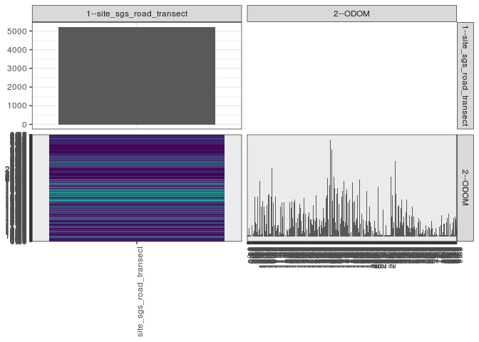

popler\_data\_organizatonal\_hierarchy
================
Hao Ye, Ellen Bledsoe
5/21/2019

``` r
library(tidyverse)

all_data <- readRDS("list_df_full.RDS")
df <- as_tibble(all_data[[params$dataset_index]])

cat("My project metadata key is ", 
    df$proj_metadata_key[1], "!!")
```

    ## My project metadata key is  82 !!

``` r
# figure out the spatial replication levels
df %>% 
  select(starts_with("spatial_replication_level")) %>%
  NCOL() %>%
  {./2} -> num_sr_levels
```

``` r
# transform the names of the variables
#   - get rid of the `spatial_replication_level_#_label` columns
sr_vars <- character(num_sr_levels)
for (i in seq(num_sr_levels))
{
  new_name <- paste0(i, "--", as.character(df[[1, paste0("spatial_replication_level_", i, "_label")]]))
  old_name <- paste0("spatial_replication_level_", i)
  sr_vars[i] <- new_name
  df <- rename(df, !!new_name := !!old_name)
}
```

``` r
# extract just the spatial replication level data
data_organization <- df %>%
  select(sr_vars)
```

``` r
# make pair-wise density plots to summarize organizational structure:
# 
library(GGally)
my_bin <- function(data, mapping, ...) {
  ggplot(data = data, mapping = mapping) +
    geom_bin2d(...) +
    scale_fill_viridis_c()
}

pm <- ggpairs(data_organization, 
                      lower = list(discrete = my_bin), 
                      upper = list(discrete = "blank"), 
              cardinality_threshold = NULL) + 
  theme_bw() + 
  theme(axis.text.x = element_text(angle = 90, hjust = 1))

print(pm)
```



``` r
# generate contingency tables to summarize organizational structure:
#   - level_i vs. level_j (i < j)

cols <- expand.grid(i = seq(num_sr_levels), 
                    j = seq(num_sr_levels)) %>%
  filter(i < j)

sr_tables <- purrr::pmap(cols, function(i, j) {
    data_organization %>%
      select(sr_vars[c(i, j)]) %>%
      table()
  })
```

``` r
# loop over tables and output
purrr::map(sr_tables, knitr::kable)
```

    ## [[1]]
    ## 
    ## 
    ##                           0.0   0.01   0.03   0.05   0.1   0.15   0.2   0.25   0.3   0.35   0.4   0.45   0.5   0.55   0.6   0.65   0.7   0.75   0.8   0.85   0.9   0.95   1.0   10.0   10.04   10.05   10.07   10.1   10.11   10.15   10.2   10.24   10.25   10.3   10.35   10.37   10.4   10.43   10.45   1.05   10.5   10.55   10.6   10.65   10.69   10.7   10.75   10.8   10.82   10.85   10.88   10.9   10.95   1.1   11.0   11.05   11.1   11.15   11.2   11.25   11.29   11.3   11.35   11.4   11.45   1.15   11.5   11.55   11.56   11.6   11.65   11.7   11.75   1.18   11.8   11.85   11.9   11.95   1.2   12.0   12.05   12.1   12.12   12.15   12.2   12.25   12.3   12.35   12.38   12.4   12.45   1.25   12.5   12.55   12.6   12.65   12.7   12.75   12.8   12.85   12.9   12.95   1.3   13.0   13.1   13.15   1.32   13.2   13.25   13.3   13.35   13.4   13.45   1.35   13.5   13.55   13.6   13.65   13.7   13.75   13.8   13.85   13.9   13.95   1.4   14.0   14.05   14.1   14.15   14.2   14.25   14.3   14.35   14.4   14.45   1.45   14.5   14.55   14.57   14.6   14.65   14.68   14.7   14.75   14.8   14.85   14.9   14.95   1.5   15.0   15.04   15.05   15.1   15.15   15.2   15.25   15.3   15.35   15.4   15.45   1.55   15.5   15.55   15.6   15.65   15.7   15.75   15.8   15.85   15.9   15.95   1.6   16.0   16.04   16.05   16.1   16.15   16.2   16.25   16.3   16.34   16.35   16.4   16.45   16.47   1.65   16.5   16.55   16.6   16.65   16.7   16.75   16.8   16.85   16.9   16.95   1.7   17.0   17.05   17.1   17.15   17.2   17.25   17.3   17.35   17.4   17.45   1.75   17.5   17.55   17.6   17.65   17.7   17.75   17.8   17.85   17.88   17.9   17.95   1.8   18.0   18.05   18.1   18.15   18.2   18.25   18.3   18.35   18.4   18.45   1.85   18.5   18.55   18.6   18.65   18.7   18.75   18.8   18.85   18.9   18.95   1.9   19.0   19.05   19.1   19.15   19.2   19.25   19.3   19.35   19.4   19.45   1.95   19.5   19.55   19.6   19.65   19.7   19.75   19.8   19.84   19.85   19.9   2.0   20.0   20.02   20.1   20.15   20.2   20.3   20.35   20.4   20.45   2.05   20.5   20.55   20.6   20.7   20.8   20.9   20.95   2.1   21.1   21.2   21.3   21.35   21.4   21.45   2.15   21.5   21.7   21.9   2.2   2.25   22.8   22.9   2.3   23.4   2.35   23.7   23.8   23.9   2.4   24.0   24.15   24.2   24.4   24.45   2.45   2.5   2.55   2.56   2.6   2.65   2.7   2.75   2.8   2.85   2.9   2.95   3.0   3.05   3.1   3.15   3.2   3.25   3.3   3.35   3.4   3.45   3.5   3.55   3.6   3.65   3.7   3.75   3.8   3.85   3.86   3.9   3.95   4.0   4.05   4.1   4.15   4.2   4.25   4.3   4.35   4.4   4.45   4.5   4.55   4.6   4.65   4.7   4.75   4.76   4.8   4.85   4.9   4.95   5.0   5.05   5.1   5.2   5.25   5.3   5.35   5.4   5.45   5.5   5.6   5.65   5.7   5.75   5.8   5.85   6.0   6.05   6.1   6.15   6.2   6.25   6.3   6.4   6.45   6.5   6.55   6.6   6.7   6.75   6.8   6.85   6.9   7.0   7.1   7.15   7.2   7.25   7.3   7.35   7.4   7.5   7.6   7.7   7.75   7.8   7.85   7.9   8.0   8.1   8.2   8.3   8.4   8.45   8.5   8.55   8.6   8.65   8.7   8.75   8.8   8.85   8.9   8.95   9.0   9.05   9.1   9.15   9.2   9.22   9.25   9.3   9.35   9.36   9.4   9.45   9.46   9.47   9.5   9.55   9.6   9.65   9.7   9.71   9.75   9.8   9.85   9.9   9.95
    ## -----------------------  ----  -----  -----  -----  ----  -----  ----  -----  ----  -----  ----  -----  ----  -----  ----  -----  ----  -----  ----  -----  ----  -----  ----  -----  ------  ------  ------  -----  ------  ------  -----  ------  ------  -----  ------  ------  -----  ------  ------  -----  -----  ------  -----  ------  ------  -----  ------  -----  ------  ------  ------  -----  ------  ----  -----  ------  -----  ------  -----  ------  ------  -----  ------  -----  ------  -----  -----  ------  ------  -----  ------  -----  ------  -----  -----  ------  -----  ------  ----  -----  ------  -----  ------  ------  -----  ------  -----  ------  ------  -----  ------  -----  -----  ------  -----  ------  -----  ------  -----  ------  -----  ------  ----  -----  -----  ------  -----  -----  ------  -----  ------  -----  ------  -----  -----  ------  -----  ------  -----  ------  -----  ------  -----  ------  ----  -----  ------  -----  ------  -----  ------  -----  ------  -----  ------  -----  -----  ------  ------  -----  ------  ------  -----  ------  -----  ------  -----  ------  ----  -----  ------  ------  -----  ------  -----  ------  -----  ------  -----  ------  -----  -----  ------  -----  ------  -----  ------  -----  ------  -----  ------  ----  -----  ------  ------  -----  ------  -----  ------  -----  ------  ------  -----  ------  ------  -----  -----  ------  -----  ------  -----  ------  -----  ------  -----  ------  ----  -----  ------  -----  ------  -----  ------  -----  ------  -----  ------  -----  -----  ------  -----  ------  -----  ------  -----  ------  ------  -----  ------  ----  -----  ------  -----  ------  -----  ------  -----  ------  -----  ------  -----  -----  ------  -----  ------  -----  ------  -----  ------  -----  ------  ----  -----  ------  -----  ------  -----  ------  -----  ------  -----  ------  -----  -----  ------  -----  ------  -----  ------  -----  ------  ------  -----  ----  -----  ------  -----  ------  -----  -----  ------  -----  ------  -----  -----  ------  -----  -----  -----  -----  ------  ----  -----  -----  -----  ------  -----  ------  -----  -----  -----  -----  ----  -----  -----  -----  ----  -----  -----  -----  -----  -----  ----  -----  ------  -----  -----  ------  -----  ----  -----  -----  ----  -----  ----  -----  ----  -----  ----  -----  ----  -----  ----  -----  ----  -----  ----  -----  ----  -----  ----  -----  ----  -----  ----  -----  ----  -----  -----  ----  -----  ----  -----  ----  -----  ----  -----  ----  -----  ----  -----  ----  -----  ----  -----  ----  -----  -----  ----  -----  ----  -----  ----  -----  ----  ----  -----  ----  -----  ----  -----  ----  ----  -----  ----  -----  ----  -----  ----  -----  ----  -----  ----  -----  ----  ----  -----  ----  -----  ----  ----  -----  ----  -----  ----  ----  ----  -----  ----  -----  ----  -----  ----  ----  ----  ----  -----  ----  -----  ----  ----  ----  ----  ----  ----  -----  ----  -----  ----  -----  ----  -----  ----  -----  ----  -----  ----  -----  ----  -----  ----  -----  -----  ----  -----  -----  ----  -----  -----  -----  ----  -----  ----  -----  ----  -----  -----  ----  -----  ----  -----
    ## site_sgs_road_transect      5      1      1      2     6      1     7      1     8      4     8      3    21      2    20      4    28      9    10      9    25      3    28     32       1       5       1     39       1      17     21       2      14     25      10       1     21       1      15      4     31       9     22      10       1     29       6     30       2       8       2     28       5    48      7       2     24       2     13       8       1     28       4     17       6      8     21       8       1     26       3     21       6      2     24       8     14       2    31     24       3     16       1       4     18       5     22       4       1     17       5     24     12       6     20      12     25      13     28       7     24       1    26     19     14      10      2     17      13     12       6     16       4     23     20       5     11       2     16       4     16       5     27       3    30     16       3     10       5     12       7     14       7     17       2     15     12      12       2      9       8       2     22      12      9       4     11       3    29     13       1       5      9       5      7       3     12       2     11       8     11     10       6     20       8     13       7     14      10     27      13    29     41       3      12     38      20     36      14     68       1      21     61      25       1     13     42      21     34      10     40       5     30      11     34       4    24     23       1     33       9     29      13     28       6     32      11      6     39       7     34      10     30      10     33       8       1     24       2    26     26       8     28       3     24       7     38      18     24      10     12     25       8     17      11     13       7     29       6     17       3    40     22       9     26      11     16       8     19      12     16       5      1     17       2     11       7     32       8     19       3      11     14    21     10       1      7       4      2      4       1      2       2      9     11       6      4      3      3      1       1    35      1      1      4       2      1       2      5      1      1      1    19     11      1      1    23      1      8      1      1      1    29      1       1      1      1       1     12    42     14      1    29      6    28     10    16     18    53     10    30      7    29      6    21      5    22      6    22     10    20      9    26      8    39     10    14     11      1    19      4    17      1    26      8    21      7     6      9    15      3    12      6    14      2    21      6      1    14      7    21      5    17      1     6     6      9    10      4    13      2    20    11      2     6      2     3      6     5      1     5      2     4      2     8     4      1     5      1     2     7      1     6      1     5     5    11      1     6      1     1      1     3     2     1     6      1     2      1     5     1     7     7     7     8      1     8      2    15      1    19      3     9      3     9      1    10      1    10      4    13      1      4    16      4      1     9      3      1      2     8      5    10      6    13      1      6    14     12    24      6
