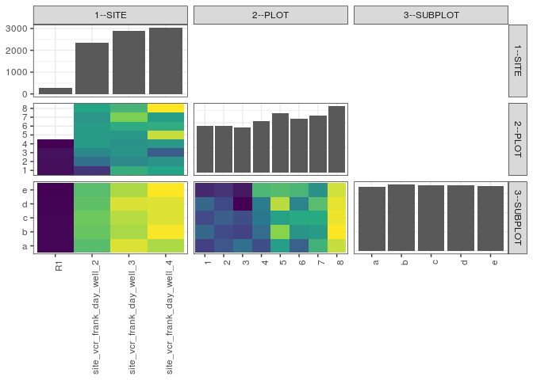

popler\_data\_organizatonal\_hierarchy
================
Hao Ye, Ellen Bledsoe
5/21/2019

``` r
library(tidyverse)

all_data <- readRDS("list_df_full.RDS")
df <- as_tibble(all_data[[params$dataset_index]])

cat("My project metadata key is ", 
    df$proj_metadata_key[1], "!!")
```

    ## My project metadata key is  97 !!

``` r
# figure out the spatial replication levels
df %>% 
  select(starts_with("spatial_replication_level")) %>%
  NCOL() %>%
  {./2} -> num_sr_levels
```

``` r
# transform the names of the variables
#   - get rid of the `spatial_replication_level_#_label` columns
sr_vars <- character(num_sr_levels)
for (i in seq(num_sr_levels))
{
  new_name <- paste0(i, "--", as.character(df[[1, paste0("spatial_replication_level_", i, "_label")]]))
  old_name <- paste0("spatial_replication_level_", i)
  sr_vars[i] <- new_name
  df <- rename(df, !!new_name := !!old_name)
}
```

``` r
# extract just the spatial replication level data
data_organization <- df %>%
  select(sr_vars)
```

``` r
# make pair-wise density plots to summarize organizational structure:
# 
library(GGally)
my_bin <- function(data, mapping, ...) {
  ggplot(data = data, mapping = mapping) +
    geom_bin2d(...) +
    scale_fill_viridis_c()
}

pm <- ggpairs(data_organization, 
                      lower = list(discrete = my_bin), 
                      upper = list(discrete = "blank"), 
              cardinality_threshold = NULL) + 
  theme_bw() + 
  theme(axis.text.x = element_text(angle = 90, hjust = 1))

print(pm)
```



``` r
# generate contingency tables to summarize organizational structure:
#   - level_i vs. level_j (i < j)

cols <- expand.grid(i = seq(num_sr_levels), 
                    j = seq(num_sr_levels)) %>%
  filter(i < j)

sr_tables <- purrr::pmap(cols, function(i, j) {
    data_organization %>%
      select(sr_vars[c(i, j)]) %>%
      table()
  })
```

``` r
# loop over tables and output
purrr::map(sr_tables, knitr::kable)
```

    ## [[1]]
    ## 
    ## 
    ##                                1     2     3     4     5     6     7     8
    ## --------------------------  ----  ----  ----  ----  ----  ----  ----  ----
    ## R1                            68    70    73    53     0     0     0     0
    ## site_vcr_frank_day_well_2    128   242   297   337   337   339   325   361
    ## site_vcr_frank_day_well_3    379   301   322   315   330   373   467   396
    ## site_vcr_frank_day_well_4    360   319   207   329   526   374   344   573
    ## 
    ## [[2]]
    ## 
    ## 
    ##                                a     b     c     d     e
    ## --------------------------  ----  ----  ----  ----  ----
    ## R1                            54    56    54    51    49
    ## site_vcr_frank_day_well_2    456   485   495   470   460
    ## site_vcr_frank_day_well_3    603   556   567   600   557
    ## site_vcr_frank_day_well_4    558   630   604   605   635
    ## 
    ## [[3]]
    ## 
    ## 
    ##    a     b     c     d     e
    ## ----  ----  ----  ----  ----
    ##  181   198   186   198   172
    ##  191   186   194   185   176
    ##  202   182   187   161   167
    ##  187   200   205   207   235
    ##  222   251   224   259   237
    ##  195   218   228   211   234
    ##  232   221   228   238   217
    ##  261   271   268   267   263
