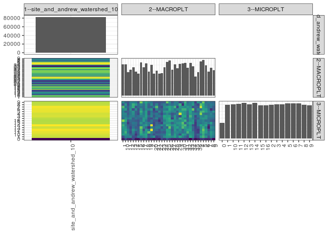

popler\_data\_organizatonal\_hierarchy
================
Hao Ye, Ellen Bledsoe
5/21/2019

``` r
library(tidyverse)

all_data <- readRDS("list_df_full.RDS")
df <- as_tibble(all_data[[params$dataset_index]])

cat("My project metadata key is ", 
    df$proj_metadata_key[1], "!!")
```

    ## My project metadata key is  140 !!

``` r
# figure out the spatial replication levels
df %>% 
  select(starts_with("spatial_replication_level")) %>%
  NCOL() %>%
  {./2} -> num_sr_levels
```

``` r
# transform the names of the variables
#   - get rid of the `spatial_replication_level_#_label` columns
sr_vars <- character(num_sr_levels)
for (i in seq(num_sr_levels))
{
  new_name <- paste0(i, "--", as.character(df[[1, paste0("spatial_replication_level_", i, "_label")]]))
  old_name <- paste0("spatial_replication_level_", i)
  sr_vars[i] <- new_name
  df <- rename(df, !!new_name := !!old_name)
}
```

``` r
# extract just the spatial replication level data
data_organization <- df %>%
  select(sr_vars)
```

``` r
# make pair-wise density plots to summarize organizational structure:
# 
library(GGally)
my_bin <- function(data, mapping, ...) {
  ggplot(data = data, mapping = mapping) +
    geom_bin2d(...) +
    scale_fill_viridis_c()
}

pm <- ggpairs(data_organization, 
                      lower = list(discrete = my_bin), 
                      upper = list(discrete = "blank"), 
              cardinality_threshold = NULL) + 
  theme_bw() + 
  theme(axis.text.x = element_text(angle = 90, hjust = 1))

print(pm)
```



``` r
# generate contingency tables to summarize organizational structure:
#   - level_i vs. level_j (i < j)

cols <- expand.grid(i = seq(num_sr_levels), 
                    j = seq(num_sr_levels)) %>%
  filter(i < j)

sr_tables <- purrr::pmap(cols, function(i, j) {
    data_organization %>%
      select(sr_vars[c(i, j)]) %>%
      table()
  })
```

``` r
# loop over tables and output
purrr::map(sr_tables, knitr::kable)
```

    ## [[1]]
    ## 
    ## 
    ##                                    1     10     11     12     13     14     15     16     17     18     19      2     20     21     22     23     24     25     26     27     28     29      3     30     31     32     33     34     35     36      4      5      6      7      8      9
    ## -----------------------------  -----  -----  -----  -----  -----  -----  -----  -----  -----  -----  -----  -----  -----  -----  -----  -----  -----  -----  -----  -----  -----  -----  -----  -----  -----  -----  -----  -----  -----  -----  -----  -----  -----  -----  -----  -----
    ## site_and_andrew_watershed_10    2566   2549   1909   2110   2310   1939   1815   2697   2298   2647   1954   2494   1790   2053   1797   1838   2321   2747   2851   2122   2559   2249   2577   2614   2669   2260   2678   2404   1563   1931   2774   2913   2484   1963   2278   2073
    ## 
    ## [[2]]
    ## 
    ## 
    ##                                    0      1     10     11     12     13     14     15     16      2      3      4      5      6      7      8      9
    ## -----------------------------  -----  -----  -----  -----  -----  -----  -----  -----  -----  -----  -----  -----  -----  -----  -----  -----  -----
    ## site_and_andrew_watershed_10    2291   4967   5033   5111   5189   4997   5227   4888   4873   4917   5037   5021   5118   5125   5175   4936   4891
    ## 
    ## [[3]]
    ## 
    ## 
    ##         0     1    10    11    12    13    14    15    16     2     3     4     5     6     7     8     9
    ## ---  ----  ----  ----  ----  ----  ----  ----  ----  ----  ----  ----  ----  ----  ----  ----  ----  ----
    ## 1      54    97   173   154   158   171   191   156   238   124   142   149   142   157   204   106   150
    ## 10     93   144   166   193   177   160   145   147   186   158   143   148   107   172   134   160   116
    ## 11     65   142   148   127   135   114   107    77   102   141   122   107   112   104   112    95    99
    ## 12     60   150   112    92   101    88   107   113   124   152   143   135   139   158   151   143   142
    ## 13     85    97   127   145   160   131   124   133   116   108   144   157   162    96   189   192   144
    ## 14     46    94    73    94   132   108   124   128   108   133   119   110   112   151   104   167   136
    ## 15     44   141   111   116   110   110    97   106   101   118   126    93   102   100   120   120   100
    ## 16     73   135   180   190   193   220   134   161   132   120   142   163   188   163   129   148   226
    ## 17     55   151   164   139    98   150   155   132   168   167   144   135   135   114   120   125   146
    ## 18     78   169   180   164   169   119   172   149   133   157   172   168   171   150   160   162   174
    ## 19     53   109   102   215   138    71   127   132    97    96   118    93    97   143   109   113   141
    ## 2      52   134   124   146   281   153   278   122   129    92   146   140   133   164   112   153   135
    ## 20     43   157    97   116   125   118    92    88   103   122   102   116    96    79   133   103   100
    ## 21     56    83   117    96   122   140   122   118   100   144   128   133    96   146   205   144   103
    ## 22     47    95   116    99   101   137   130    98    70    93   136   112   152   114   104    95    98
    ## 23     87   115   126   110   129    94   155    82   107   101   109    89   106   112    91   119   106
    ## 24     71   152   132   105   121   134   132   157   139   163   181   134   160   141   153   139   107
    ## 25    103   171   182   172   179   121   190   161   169   179   166   153   172   133   165   115   216
    ## 26     76   169   189   171   171   219   185   160   185   188   175   131   164   185   184   140   159
    ## 27     63   153   124   118   109   122   155   117   170    81   110   101   147   159   162   124   107
    ## 28     60   174   167   154   168   166   173   146   151   161   162   117   149   134   194   143   140
    ## 29     66   136   135   149   135   176   143   161   145   122   115   141   109   151    91   133   141
    ## 3      66   184    98   139   156   146   156   167   148   191    89   262   177   154   165   191    88
    ## 30     68   148   177   126   118   202   191   206   168   167   178   171   168   192   156    68   110
    ## 31     69   124   157   139   153   167   201   116   192   139   182   156   160   192   150   180   192
    ## 32     66    97   124   196   177   147   130   153   118   126   108   120   126   149   164   137   122
    ## 33     35   184   163   155   176   165   158   181   153   161   195   169   181   169   152   141   140
    ## 34     77   154   153   146   115   121    96   161   161   143   148   146   137   218   101   171   156
    ## 35     42    85    95    90    88    83    77    75    87   107    88   141   101   106   114   104    80
    ## 36     55   104   117    80    77   104   135   131   137   108   130   132   120   146   108    87   160
    ## 4      71   175   138   168   153   152   182   130   135   156   154   236   195   127   256   210   136
    ## 5      80   196   188   195   219   191   155   143   145   165   143   138   198   176   176   185   220
    ## 6      61   159   137   167   166   141   176   153   124   161   163   125   172   171   147   138   123
    ## 7      60   107   132   128   102    56    73   135   125   127   137   130   141   130   122   120   138
    ## 8      74   151   164   169   144   157   138   174   107   126   141   146   130    66   131   137   123
    ## 9      37   131   145   148   133   143   121   119   100   120   136   124   161   103   107   128   117
