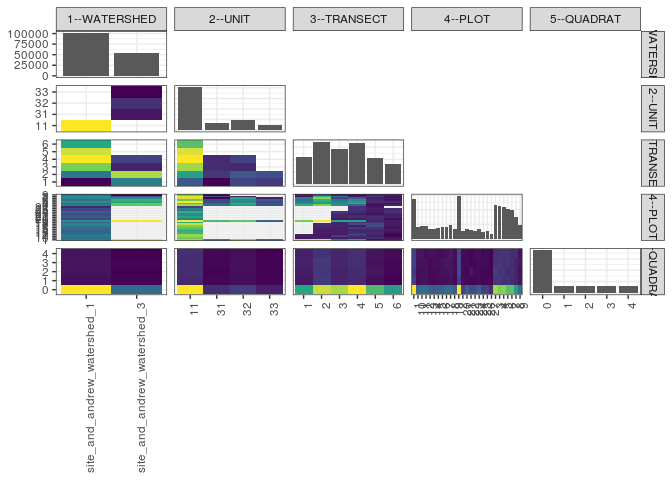

popler\_data\_organizatonal\_hierarchy
================
Hao Ye, Ellen Bledsoe
5/21/2019

``` r
library(tidyverse)

all_data <- readRDS("list_df_full.RDS")
df <- as_tibble(all_data[[params$dataset_index]])

cat("My project metadata key is ", 
    df$proj_metadata_key[1], "!!")
```

    ## My project metadata key is  141 !!

``` r
# figure out the spatial replication levels
df %>% 
  select(starts_with("spatial_replication_level")) %>%
  NCOL() %>%
  {./2} -> num_sr_levels
```

``` r
# transform the names of the variables
#   - get rid of the `spatial_replication_level_#_label` columns
sr_vars <- character(num_sr_levels)
for (i in seq(num_sr_levels))
{
  new_name <- paste0(i, "--", as.character(df[[1, paste0("spatial_replication_level_", i, "_label")]]))
  old_name <- paste0("spatial_replication_level_", i)
  sr_vars[i] <- new_name
  df <- rename(df, !!new_name := !!old_name)
}
```

``` r
# extract just the spatial replication level data
data_organization <- df %>%
  select(sr_vars)
```

``` r
# make pair-wise density plots to summarize organizational structure:
# 
library(GGally)
my_bin <- function(data, mapping, ...) {
  ggplot(data = data, mapping = mapping) +
    geom_bin2d(...) +
    scale_fill_viridis_c()
}

pm <- ggpairs(data_organization, 
                      lower = list(discrete = my_bin), 
                      upper = list(discrete = "blank"), 
              cardinality_threshold = NULL) + 
  theme_bw() + 
  theme(axis.text.x = element_text(angle = 90, hjust = 1))

print(pm)
```

    ## plot: [1,1] [=>-------------------------------------------] 4% est: 0s
    ## plot: [1,2] [===>-----------------------------------------] 8% est: 2s
    ## plot: [1,3] [====>----------------------------------------] 12% est: 1s
    ## plot: [1,4] [======>--------------------------------------] 16% est: 1s
    ## plot: [1,5] [========>------------------------------------] 20% est: 1s
    ## plot: [2,1] [==========>----------------------------------] 24% est: 1s
    ## plot: [2,2] [============>--------------------------------] 28% est: 1s
    ## plot: [2,3] [=============>-------------------------------] 32% est: 4s
    ## plot: [2,4] [===============>-----------------------------] 36% est: 3s
    ## plot: [2,5] [=================>---------------------------] 40% est: 3s
    ## plot: [3,1] [===================>-------------------------] 44% est: 2s
    ## plot: [3,2] [=====================>-----------------------] 48% est: 2s
    ## plot: [3,3] [======================>----------------------] 52% est: 2s
    ## plot: [3,4] [========================>--------------------] 56% est: 2s
    ## plot: [3,5] [==========================>------------------] 60% est: 2s
    ## plot: [4,1] [============================>----------------] 64% est: 1s
    ## plot: [4,2] [==============================>--------------] 68% est: 1s
    ## plot: [4,3] [===============================>-------------] 72% est: 1s
    ## plot: [4,4] [=================================>-----------] 76% est: 1s
    ## plot: [4,5] [===================================>---------] 80% est: 1s
    ## plot: [5,1] [=====================================>-------] 84% est: 1s
    ## plot: [5,2] [=======================================>-----] 88% est: 1s
    ## plot: [5,3] [========================================>----] 92% est: 0s
    ## plot: [5,4] [==========================================>--] 96% est: 0s
    ## plot: [5,5] [=============================================]100% est: 0s



``` r
# generate contingency tables to summarize organizational structure:
#   - level_i vs. level_j (i < j)

cols <- expand.grid(i = seq(num_sr_levels), 
                    j = seq(num_sr_levels)) %>%
  filter(i < j)

sr_tables <- purrr::pmap(cols, function(i, j) {
    data_organization %>%
      select(sr_vars[c(i, j)]) %>%
      table()
  })
```

``` r
# loop over tables and output
purrr::map(sr_tables, knitr::kable)
```

    ## [[1]]
    ## 
    ## 
    ##                                    11      31      32      33
    ## ----------------------------  -------  ------  ------  ------
    ## site_and_andrew_watershed_1    100989       0       0       0
    ## site_and_andrew_watershed_3         0   16998   24585   12749
    ## 
    ## [[2]]
    ## 
    ## 
    ##                                    1       2       3       4       5       6
    ## ----------------------------  ------  ------  ------  ------  ------  ------
    ## site_and_andrew_watershed_1     7848   13691   19331   22401   21212   16506
    ## site_and_andrew_watershed_3    14098   20529    9044   10661       0       0
    ## 
    ## [[3]]
    ## 
    ## 
    ##          1       2       3       4       5       6
    ## ---  -----  ------  ------  ------  ------  ------
    ## 11    7848   13691   19331   22401   21212   16506
    ## 31    2340    5385    4665    4608       0       0
    ## 32    6205    7948    4379    6053       0       0
    ## 33    5553    7196       0       0       0       0
    ## 
    ## [[4]]
    ## 
    ## 
    ##                                   1     10     11     12     13     14     15     16     17     18     19      2     20     21     22     23     24     25     26     27      3      4      5      6      7      8      9
    ## ----------------------------  -----  -----  -----  -----  -----  -----  -----  -----  -----  -----  -----  -----  -----  -----  -----  -----  -----  -----  -----  -----  -----  -----  -----  -----  -----  -----  -----
    ## site_and_andrew_watershed_1    4378   4062   4357   4322   3513   3415   3611   3879   4191   4710   3370   5075   2578   3239   2827   2778   3397   2368   2507   1498   4426   3716   5085   3968   4798   4930   3991
    ## site_and_andrew_watershed_3    9461      0      0      0      0      0      0      0      0      0      0   9652      0      0      0      0      0      0      0      0   7188   7432   5990   6304   4927   2720    658
    ## 
    ## [[5]]
    ## 
    ## 
    ##          1     10     11     12     13     14     15     16     17     18     19      2     20     21     22     23     24     25     26     27      3      4      5      6      7      8      9
    ## ---  -----  -----  -----  -----  -----  -----  -----  -----  -----  -----  -----  -----  -----  -----  -----  -----  -----  -----  -----  -----  -----  -----  -----  -----  -----  -----  -----
    ## 11    4378   4062   4357   4322   3513   3415   3611   3879   4191   4710   3370   5075   2578   3239   2827   2778   3397   2368   2507   1498   4426   3716   5085   3968   4798   4930   3991
    ## 31    2661      0      0      0      0      0      0      0      0      0      0   3662      0      0      0      0      0      0      0      0   2225   2176   1624   1626    660   1706    658
    ## 32    4315      0      0      0      0      0      0      0      0      0      0   3913      0      0      0      0      0      0      0      0   3151   3447   2716   2795   3234   1014      0
    ## 33    2485      0      0      0      0      0      0      0      0      0      0   2077      0      0      0      0      0      0      0      0   1812   1809   1650   1883   1033      0      0
    ## 
    ## [[6]]
    ## 
    ## 
    ##     1    10     11     12    13    14    15     16     17     18     19      2    20    21    22    23     24    25    26    27      3      4      5      6      7      8      9
    ## -----  ----  -----  -----  ----  ----  ----  -----  -----  -----  -----  -----  ----  ----  ----  ----  -----  ----  ----  ----  -----  -----  -----  -----  -----  -----  -----
    ##  3970   589    664    736     0     0     0      0      0      0      0   3520     0     0     0     0      0     0     0     0   2842   2403   2044   1864   2083    565    666
    ##  4028   688    607    588   662   646   660    750    842    813      0   4363     0     0     0     0      0     0     0     0   3573   2435   2726   2902   3636   2860   1441
    ##  1968   638   1108    543   662   674   678    673    763    712    824   2729   623   756   719   826   1017     0     0     0   2348   2290   2123   1876   1191   1992    642
    ##  2655   720    891   1317   828   766   767   1025    653   1287    958   2711   633   889   783   654    851   876   950   903   1680   2814   2506   2275   1552    645    473
    ##   557   857    686    753   848   738   825    918   1354   1235   1018    715   833   878   697   565    580   625   697   595    485    613    865    787    673   1082    733
    ##   661   570    401    385   513   591   681    513    579    663    570    689   489   716   628   733    949   867   860     0    686    593    811    568    590    506    694
    ## 
    ## [[7]]
    ## 
    ## 
    ##                                    0      1      2      3      4
    ## ----------------------------  ------  -----  -----  -----  -----
    ## site_and_andrew_watershed_1    66103   8077   8837   8912   9060
    ## site_and_andrew_watershed_3    27715   6774   6462   6891   6490
    ## 
    ## [[8]]
    ## 
    ## 
    ##           0      1      2      3      4
    ## ---  ------  -----  -----  -----  -----
    ## 11    66103   8077   8837   8912   9060
    ## 31     8993   2075   1760   1966   2204
    ## 32    12341   2915   3042   3302   2985
    ## 33     6381   1784   1660   1623   1301
    ## 
    ## [[9]]
    ## 
    ## 
    ##      0      1      2      3      4
    ## ------  -----  -----  -----  -----
    ##  12510   2157   2261   2578   2440
    ##  18477   4201   3914   4040   3588
    ##  17433   2718   2663   2807   2754
    ##  20114   3062   3177   3343   3366
    ##  13980   1644   1973   1685   1930
    ##  11304   1069   1311   1350   1472
    ## 
    ## [[10]]
    ## 
    ## 
    ##          0      1      2      3      4
    ## ---  -----  -----  -----  -----  -----
    ## 1     7839   1510   1343   1618   1529
    ## 10    2619    321    281    389    452
    ## 11    2870    364    325    337    461
    ## 12    2932    383    397    343    267
    ## 13    2522    261    210    203    317
    ## 14    2337    225    233    312    308
    ## 15    2456    290    283    312    270
    ## 16    2524    298    389    397    271
    ## 17    2732    288    366    483    322
    ## 18    2800    409    491    423    587
    ## 19    2356    219    270    218    307
    ## 2     7731   1523   1818   1941   1714
    ## 20    1612    266    241    212    247
    ## 21    2365    221    207    240    206
    ## 22    1774    185    496    189    183
    ## 23    1847    201    223    211    296
    ## 24    2356    257    231    257    296
    ## 25    1543    197    199    244    185
    ## 26    1615    206    158    267    261
    ## 27     987    129    140    100    142
    ## 3     6669   1271   1409   1192   1073
    ## 4     6262   1275   1211   1281   1119
    ## 5     6427   1102   1258   1089   1199
    ## 6     5628   1193    974   1268   1209
    ## 7     5657   1059   1036   1010    963
    ## 8     4294    800    769    776   1011
    ## 9     3064    398    341    491    355
