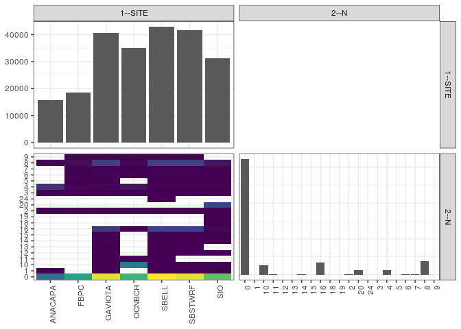

popler\_data\_organizatonal\_hierarchy
================
Hao Ye, Ellen Bledsoe
5/21/2019

``` r
library(tidyverse)

all_data <- readRDS("list_df_full.RDS")
df <- as_tibble(all_data[[params$dataset_index]])

cat("My project metadata key is ", 
    df$proj_metadata_key[1], "!!")
```

    ## My project metadata key is  12 !!

``` r
# figure out the spatial replication levels
df %>% 
  select(starts_with("spatial_replication_level")) %>%
  NCOL() %>%
  {./2} -> num_sr_levels
```

``` r
# transform the names of the variables
#   - get rid of the `spatial_replication_level_#_label` columns
sr_vars <- character(num_sr_levels)
for (i in seq(num_sr_levels))
{
  new_name <- paste0(i, "--", as.character(df[[1, paste0("spatial_replication_level_", i, "_label")]]))
  old_name <- paste0("spatial_replication_level_", i)
  sr_vars[i] <- new_name
  df <- rename(df, !!new_name := !!old_name)
}
```

``` r
# extract just the spatial replication level data
data_organization <- df %>%
  select(sr_vars)
```

``` r
# make pair-wise density plots to summarize organizational structure:
# 
library(GGally)
my_bin <- function(data, mapping, ...) {
  ggplot(data = data, mapping = mapping) +
    geom_bin2d(...) +
    scale_fill_viridis_c()
}

pm <- ggpairs(data_organization, 
                      lower = list(discrete = my_bin), 
                      upper = list(discrete = "blank"), 
              cardinality_threshold = NULL) + 
  theme_bw() + 
  theme(axis.text.x = element_text(angle = 90, hjust = 1))

print(pm)
```



``` r
# generate contingency tables to summarize organizational structure:
#   - level_i vs. level_j (i < j)

cols <- expand.grid(i = seq(num_sr_levels), 
                    j = seq(num_sr_levels)) %>%
  filter(i < j)

sr_tables <- purrr::pmap(cols, function(i, j) {
    data_organization %>%
      select(sr_vars[c(i, j)]) %>%
      table()
  })
```

``` r
# loop over tables and output
purrr::map(sr_tables, knitr::kable)
```

    ## [[1]]
    ## 
    ## 
    ##                0    1      10    11   12   13   14   15     16   18   19     2     20   24    3      4    5     6    7      8    9
    ## --------  ------  ---  ------  ----  ---  ---  ---  ---  -----  ---  ---  ----  -----  ---  ---  -----  ---  ----  ---  -----  ---
    ## ANACAPA    11267   16       0     0    0    0    0    0      0    0    0    83      0    0   59   4187    0     0    0     23    0
    ## FBPC       17509    0       0     0    0    0    0    0      0    0    0    27      0    0    8    240    4    61   53    645    3
    ## GAVIOTA    29580    7       4     2   49    1   71   30   4858    0    0    15      0    0   11    370   17   246   81   5250    6
    ## OCNBCH     20038    0   12661   209    0    0    0    0     12    0    0   198      0    0   17   1290    0    90    3    448   14
    ## SBELL      31080   28      29     3   27    7   41   42   5667    0    0    15      0   18   10    102   16    83   67   5588    1
    ## SBSTWRF    29524    2       8     0   15    7    7   15   5929    0    0     2      0    0    4    136   11   135   59   5797    7
    ## SIO        22453    3     222     0    3    0   83    4    363   75   53    12   6066    0    3    221    3   123   16   1461    0
