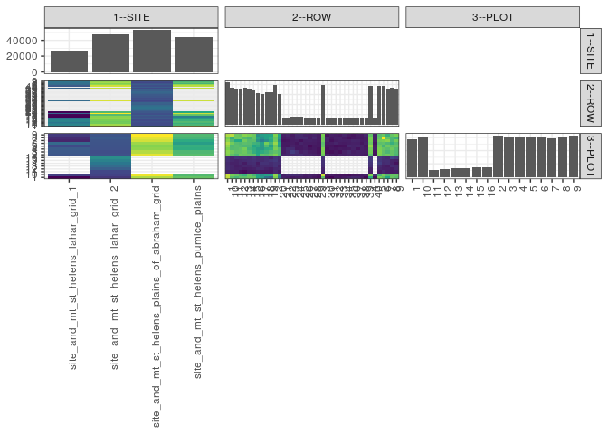

popler\_data\_organizatonal\_hierarchy
================
Hao Ye, Ellen Bledsoe
5/21/2019

``` r
library(tidyverse)

all_data <- readRDS("list_df_full.RDS")
df <- as_tibble(all_data[[params$dataset_index]])

cat("My project metadata key is ", 
    df$proj_metadata_key[1], "!!")
```

    ## My project metadata key is  146 !!

``` r
# figure out the spatial replication levels
df %>% 
  select(starts_with("spatial_replication_level")) %>%
  NCOL() %>%
  {./2} -> num_sr_levels
```

``` r
# transform the names of the variables
#   - get rid of the `spatial_replication_level_#_label` columns
sr_vars <- character(num_sr_levels)
for (i in seq(num_sr_levels))
{
  new_name <- paste0(i, "--", as.character(df[[1, paste0("spatial_replication_level_", i, "_label")]]))
  old_name <- paste0("spatial_replication_level_", i)
  sr_vars[i] <- new_name
  df <- rename(df, !!new_name := !!old_name)
}
```

``` r
# extract just the spatial replication level data
data_organization <- df %>%
  select(sr_vars)
```

``` r
# make pair-wise density plots to summarize organizational structure:
# 
library(GGally)
my_bin <- function(data, mapping, ...) {
  ggplot(data = data, mapping = mapping) +
    geom_bin2d(...) +
    scale_fill_viridis_c()
}

pm <- ggpairs(data_organization, 
                      lower = list(discrete = my_bin), 
                      upper = list(discrete = "blank"), 
              cardinality_threshold = NULL) + 
  theme_bw() + 
  theme(axis.text.x = element_text(angle = 90, hjust = 1))

print(pm)
```



``` r
# generate contingency tables to summarize organizational structure:
#   - level_i vs. level_j (i < j)

cols <- expand.grid(i = seq(num_sr_levels), 
                    j = seq(num_sr_levels)) %>%
  filter(i < j)

sr_tables <- purrr::pmap(cols, function(i, j) {
    data_organization %>%
      select(sr_vars[c(i, j)]) %>%
      table()
  })
```

``` r
# loop over tables and output
purrr::map(sr_tables, knitr::kable)
```

    ## [[1]]
    ## 
    ## 
    ##                                                    1     10     11     12     13     14     15     16     17     18     19      2     20     21     22     23     24     25     26     27     28     29      3     30     31     32     33     34     35     36     37     38     39      4     40      5      6      7      8      9
    ## ---------------------------------------------  -----  -----  -----  -----  -----  -----  -----  -----  -----  -----  -----  -----  -----  -----  -----  -----  -----  -----  -----  -----  -----  -----  -----  -----  -----  -----  -----  -----  -----  -----  -----  -----  -----  -----  -----  -----  -----  -----  -----  -----
    ## site_and_mt_st_helens_lahar_grid_1              1455   1668   1611   1541   1652   1662   1518    776    770    783    787   1413    775      0      0      0      0      0      0      0      0      0   1459      0      0      0      0      0      0      0      0      0      0   1413      0   1339   1467   1489   1503   1536
    ## site_and_mt_st_helens_lahar_grid_2              2667   2448   2293   2302   2275   2333   2404   2408   2387   2140   2134   2746   2116      0      0      0      0      0      0      0      0      0   2623      0      0      0      0      0      0      0      0      0      0   2565      0   2598   2435   2362   2463   2406
    ## site_and_mt_st_helens_plains_of_abraham_grid    1518   1221   1214   1232   1269   1215   1326   1269   1280   1349   1249   1255   1316   1373   1476   1558   1521   1482   1462   1371   1390   1248   1179   1264   1236   1301   1296   1331   1388   1422   1427   1362   1358   1207   1354   1248   1340   1276   1177   1235
    ## site_and_mt_st_helens_pumice_plains             2729   2084   2023   2110   2123   2028   1824   1754   1621   2171   2234   2583   1962      0      0      0      0      0      0      0      0      0   2581      0      0      0      0      0      0      0      0      0      0   2550      0   2528   2419   2066   2173   2079
    ## 
    ## [[2]]
    ## 
    ## 
    ##                                                    1     10     11     12     13     14     15     16      2      3      4      5      6      7      8      9
    ## ---------------------------------------------  -----  -----  -----  -----  -----  -----  -----  -----  -----  -----  -----  -----  -----  -----  -----  -----
    ## site_and_mt_st_helens_lahar_grid_1              1938   2607      0      0      0      0      0      0   2931   2968   3013   2759   3213   2288   2362   2538
    ## site_and_mt_st_helens_lahar_grid_2              2502   2657   2726   3066   3255   3413   3574   3756   2857   2813   2872   2896   2905   2913   2984   2916
    ## site_and_mt_st_helens_plains_of_abraham_grid    5177   5541      0      0      0      0      0      0   5488   5215   5010   4958   5077   5390   5489   5650
    ## site_and_mt_st_helens_pumice_plains             4647   4484      0      0      0      0      0      0   4531   4444   4233   4260   3991   4214   4378   4460
    ## 
    ## [[3]]
    ## 
    ## 
    ##         1    10    11    12    13    14    15    16     2     3     4     5     6     7     8     9
    ## ---  ----  ----  ----  ----  ----  ----  ----  ----  ----  ----  ----  ----  ----  ----  ----  ----
    ## 1     776   785   153   178   176   170   184   188   706   717   699   722   755   715   692   753
    ## 10    627   686   146   158   161   148   164   163   639   675   616   608   677   608   574   771
    ## 11    592   655   147   145   138   148   152   189   601   637   622   626   617   547   664   661
    ## 12    632   603   113   152   144   165   164   181   667   643   636   613   606   547   671   648
    ## 13    628   571   100   134   160   135   172   187   652   665   683   602   630   674   613   713
    ## 14    658   650   128   141   156   175   178   177   644   616   585   602   619   618   596   695
    ## 15    646   596   127   149   170   179   187   194   637   564   560   539   584   627   650   663
    ## 16    537   537   137   170   151   137   175   174   550   530   511   557   571   474   528   468
    ## 17    498   470   130   166   170   191   170   173   636   558   492   504   518   407   468   507
    ## 18    368   522   127   148   169   191   185   182   619   576   556   606   684   460   522   528
    ## 19    326   526   123   137   169   175   198   159   649   611   564   527   591   551   561   537
    ## 2     702   724   163   166   190   189   211   201   696   639   693   666   727   669   659   702
    ## 20    378   448   129   165   151   182   172   176   606   610   607   502   537   448   512   546
    ## 21    149   146     0     0     0     0     0     0   151   135   144   129   129   117   131   142
    ## 22    138   171     0     0     0     0     0     0   162   160   171   125   130   123   141   155
    ## 23    126   177     0     0     0     0     0     0   174   221   172   147   136   135   139   131
    ## 24    136   175     0     0     0     0     0     0   175   185   128   133   121   142   160   166
    ## 25    136   165     0     0     0     0     0     0   181   142   130   129   153   113   165   168
    ## 26    127   139     0     0     0     0     0     0   157   159   138   143   138   144   168   149
    ## 27    140   152     0     0     0     0     0     0   155   136   121   103   140   147   136   141
    ## 28    122   139     0     0     0     0     0     0   145   134   129   128   137   142   163   151
    ## 29    109   124     0     0     0     0     0     0   130   115   115   127   128   133   132   135
    ## 3     641   790   149   157   178   188   185   188   666   696   698   644   631   674   666   691
    ## 30     95   117     0     0     0     0     0     0   156   113   109   120   133   150   155   116
    ## 31     87   133     0     0     0     0     0     0   137   106   127   122   139   114   127   144
    ## 32    126   122     0     0     0     0     0     0   127   121   121   108   155   136   145   140
    ## 33    121   118     0     0     0     0     0     0   149   106   131   113   137   144   147   130
    ## 34    131   116     0     0     0     0     0     0   141   143   127   115   133   142   129   154
    ## 35    148   108     0     0     0     0     0     0   153   165   131   162   139   141   111   130
    ## 36    162   125     0     0     0     0     0     0   149   140   150   151   145   155   126   119
    ## 37    159   129     0     0     0     0     0     0   148   149   118   156   144   153   133   138
    ## 38    140   135     0     0     0     0     0     0   139   142   146   149   122   133   126   130
    ## 39     97   148     0     0     0     0     0     0   127   139   134   126   148   140   140   159
    ## 4     557   705   143   148   181   196   211   208   629   679   677   721   660   687   695   638
    ## 40    107   179     0     0     0     0     0     0   115   119   141   137   120   141   146   149
    ## 5     688   602   136   158   170   222   205   208   695   703   692   669   629   675   640   621
    ## 6     629   690   167   144   144   172   179   184   635   638   649   589   639   688   852   662
    ## 7     547   610   139   144   134   180   181   174   661   600   623   664   602   712   648   574
    ## 8     656   650   131   140   175   154   155   238   648   642   669   640   568   600   602   648
    ## 9     622   651   138   166   168   116   146   212   600   611   613   649   614   679   580   691
