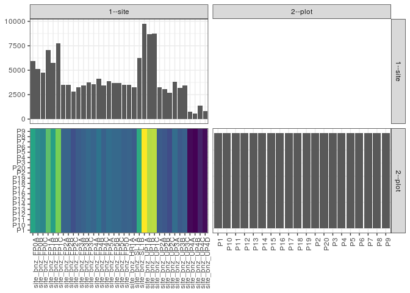

popler\_data\_organizatonal\_hierarchy
================
Hao Ye, Ellen Bledsoe
5/21/2019

``` r
library(tidyverse)

all_data <- readRDS("list_df_full.RDS")
df <- as_tibble(all_data[[params$dataset_index]])

cat("My project metadata key is ", 
    df$proj_metadata_key[1], "!!")
```

    ## My project metadata key is  194 !!

``` r
# figure out the spatial replication levels
df %>% 
  select(starts_with("spatial_replication_level")) %>%
  NCOL() %>%
  {./2} -> num_sr_levels
```

``` r
# transform the names of the variables
#   - get rid of the `spatial_replication_level_#_label` columns
sr_vars <- character(num_sr_levels)
for (i in seq(num_sr_levels))
{
  new_name <- paste0(i, "--", as.character(df[[1, paste0("spatial_replication_level_", i, "_label")]]))
  old_name <- paste0("spatial_replication_level_", i)
  sr_vars[i] <- new_name
  df <- rename(df, !!new_name := !!old_name)
}
```

``` r
# extract just the spatial replication level data
data_organization <- df %>%
  select(sr_vars)
```

``` r
# make pair-wise density plots to summarize organizational structure:
# 
library(GGally)
my_bin <- function(data, mapping, ...) {
  ggplot(data = data, mapping = mapping) +
    geom_bin2d(...) +
    scale_fill_viridis_c()
}

pm <- ggpairs(data_organization, 
                      lower = list(discrete = my_bin), 
                      upper = list(discrete = "blank"), 
              cardinality_threshold = NULL) + 
  theme_bw() + 
  theme(axis.text.x = element_text(angle = 90, hjust = 1))

print(pm)
```



``` r
# generate contingency tables to summarize organizational structure:
#   - level_i vs. level_j (i < j)

cols <- expand.grid(i = seq(num_sr_levels), 
                    j = seq(num_sr_levels)) %>%
  filter(i < j)

sr_tables <- purrr::pmap(cols, function(i, j) {
    data_organization %>%
      select(sr_vars[c(i, j)]) %>%
      table()
  })
```

``` r
# loop over tables and output
purrr::map(sr_tables, knitr::kable)
```

    ## [[1]]
    ## 
    ## 
    ##                   P1   P10   P11   P12   P13   P14   P15   P16   P17   P18   P19    P2   P20    P3    P4    P5    P6    P7    P8    P9
    ## --------------  ----  ----  ----  ----  ----  ----  ----  ----  ----  ----  ----  ----  ----  ----  ----  ----  ----  ----  ----  ----
    ## site_bnz_FP0A    296   296   296   296   296   296   296   296   296   296   296   296   296   296   296   296   296   296   296   296
    ## site_bnz_FP0B    256   256   256   256   256   256   256   256   256   256   256   256   256   256   256   256   256   256   256   256
    ## site_bnz_FP0C    239   239   239   239   239   239   239   239   239   239   239   239   239   239   239   239   239   239   239   239
    ## site_bnz_FP1A    354   354   354   354   354   354   354   354   354   354   354   354   354   354   354   354   354   354   354   354
    ## site_bnz_FP1B    287   287   287   287   287   287   287   287   287   287   287   287   287   287   287   287   287   287   287   287
    ## site_bnz_FP1C    389   389   389   389   389   389   389   389   389   389   389   389   389   389   389   389   389   389   389   389
    ## site_bnz_FP2A    176   176   176   176   176   176   176   176   176   176   176   176   176   176   176   176   176   176   176   176
    ## site_bnz_FP2B    176   176   176   176   176   176   176   176   176   176   176   176   176   176   176   176   176   176   176   176
    ## site_bnz_FP2C    142   142   142   142   142   142   142   142   142   142   142   142   142   142   142   142   142   142   142   142
    ## site_bnz_FP3A    164   164   164   164   164   164   164   164   164   164   164   164   164   164   164   164   164   164   164   164
    ## site_bnz_FP3B    173   173   173   173   173   173   173   173   173   173   173   173   173   173   173   173   173   173   173   173
    ## site_bnz_FP3C    187   187   187   187   187   187   187   187   187   187   187   187   187   187   187   187   187   187   187   187
    ## site_bnz_FP4A    178   178   178   178   178   178   178   178   178   178   178   178   178   178   178   178   178   178   178   178
    ## site_bnz_FP4B    205   205   205   205   205   205   205   205   205   205   205   205   205   205   205   205   205   205   205   205
    ## site_bnz_FP4C    173   173   173   173   173   173   173   173   173   173   173   173   173   173   173   173   173   173   173   173
    ## site_bnz_FP5A    194   194   194   194   194   194   194   194   194   194   194   194   194   194   194   194   194   194   194   194
    ## site_bnz_FP5B    186   186   186   186   186   186   186   186   186   186   186   186   186   186   186   186   186   186   186   186
    ## site_bnz_FP5C    186   186   186   186   186   186   186   186   186   186   186   186   186   186   186   186   186   186   186   186
    ## site_bnz_FP5D    174   174   174   174   174   174   174   174   174   174   174   174   174   174   174   174   174   174   174   174
    ## site_bnz_HR1A    176   176   176   176   176   176   176   176   176   176   176   176   176   176   176   176   176   176   176   176
    ## site_bnz_SL1A    162   162   162   162   162   162   162   162   162   162   162   162   162   162   162   162   162   162   162   162
    ## site_bnz_SL1B    311   311   311   311   311   311   311   311   311   311   311   311   311   311   311   311   311   311   311   311
    ## site_bnz_UP1A    488   488   488   488   488   488   488   488   488   488   488   488   488   488   488   488   488   488   488   488
    ## site_bnz_UP1B    434   434   434   434   434   434   434   434   434   434   434   434   434   434   434   434   434   434   434   434
    ## site_bnz_UP1C    438   438   438   438   438   438   438   438   438   438   438   438   438   438   438   438   438   438   438   438
    ## site_bnz_UP2A    162   162   162   162   162   162   162   162   162   162   162   162   162   162   162   162   162   162   162   162
    ## site_bnz_UP2B    154   154   154   154   154   154   154   154   154   154   154   154   154   154   154   154   154   154   154   154
    ## site_bnz_UP2C    135   135   135   135   135   135   135   135   135   135   135   135   135   135   135   135   135   135   135   135
    ## site_bnz_UP3A    192   192   192   192   192   192   192   192   192   192   192   192   192   192   192   192   192   192   192   192
    ## site_bnz_UP3B    160   160   160   160   160   160   160   160   160   160   160   160   160   160   160   160   160   160   160   160
    ## site_bnz_UP3C    172   172   172   172   172   172   172   172   172   172   172   172   172   172   172   172   172   172   172   172
    ## site_bnz_UP4A     37    37    37    37    37    37    37    37    37    37    37    37    37    37    37    37    37    37    37    37
    ## site_bnz_UP4B     29    29    29    29    29    29    29    29    29    29    29    29    29    29    29    29    29    29    29    29
    ## site_bnz_UP4C     68    68    68    68    68    68    68    68    68    68    68    68    68    68    68    68    68    68    68    68
    ## site_bnz_UP4D     40    40    40    40    40    40    40    40    40    40    40    40    40    40    40    40    40    40    40    40
