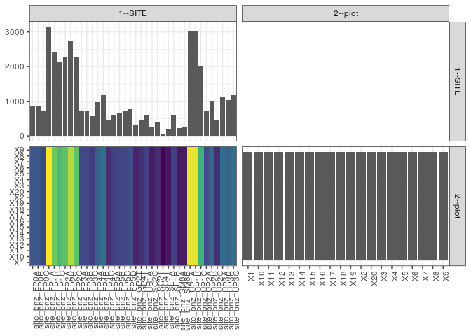

popler\_data\_organizatonal\_hierarchy
================
Hao Ye, Ellen Bledsoe
5/21/2019

``` r
library(tidyverse)

all_data <- readRDS("list_df_full.RDS")
df <- as_tibble(all_data[[params$dataset_index]])

cat("My project metadata key is ", 
    df$proj_metadata_key[1], "!!")
```

    ## My project metadata key is  195 !!

``` r
# figure out the spatial replication levels
df %>% 
  select(starts_with("spatial_replication_level")) %>%
  NCOL() %>%
  {./2} -> num_sr_levels
```

``` r
# transform the names of the variables
#   - get rid of the `spatial_replication_level_#_label` columns
sr_vars <- character(num_sr_levels)
for (i in seq(num_sr_levels))
{
  new_name <- paste0(i, "--", as.character(df[[1, paste0("spatial_replication_level_", i, "_label")]]))
  old_name <- paste0("spatial_replication_level_", i)
  sr_vars[i] <- new_name
  df <- rename(df, !!new_name := !!old_name)
}
```

``` r
# extract just the spatial replication level data
data_organization <- df %>%
  select(sr_vars)
```

``` r
# make pair-wise density plots to summarize organizational structure:
# 
library(GGally)
my_bin <- function(data, mapping, ...) {
  ggplot(data = data, mapping = mapping) +
    geom_bin2d(...) +
    scale_fill_viridis_c()
}

pm <- ggpairs(data_organization, 
                      lower = list(discrete = my_bin), 
                      upper = list(discrete = "blank"), 
              cardinality_threshold = NULL) + 
  theme_bw() + 
  theme(axis.text.x = element_text(angle = 90, hjust = 1))

print(pm)
```



``` r
# generate contingency tables to summarize organizational structure:
#   - level_i vs. level_j (i < j)

cols <- expand.grid(i = seq(num_sr_levels), 
                    j = seq(num_sr_levels)) %>%
  filter(i < j)

sr_tables <- purrr::pmap(cols, function(i, j) {
    data_organization %>%
      select(sr_vars[c(i, j)]) %>%
      table()
  })
```

``` r
# loop over tables and output
purrr::map(sr_tables, knitr::kable)
```

    ## [[1]]
    ## 
    ## 
    ##                   X1   X10   X11   X12   X13   X14   X15   X16   X17   X18   X19    X2   X20    X3    X4    X5    X6    X7    X8    X9
    ## --------------  ----  ----  ----  ----  ----  ----  ----  ----  ----  ----  ----  ----  ----  ----  ----  ----  ----  ----  ----  ----
    ## site_bnz_FP0A     44    44    44    44    44    44    44    44    44    44    44    44    44    44    44    44    44    44    44    44
    ## site_bnz_FP0B     44    44    44    44    44    44    44    44    44    44    44    44    44    44    44    44    44    44    44    44
    ## site_bnz_FP0C     36    36    36    36    36    36    36    36    36    36    36    36    36    36    36    36    36    36    36    36
    ## site_bnz_FP1A    157   157   157   157   157   157   157   157   157   157   157   157   157   157   157   157   157   157   157   157
    ## site_bnz_FP1B    120   120   120   120   120   120   120   120   120   120   120   120   120   120   120   120   120   120   120   120
    ## site_bnz_FP1C    107   107   107   107   107   107   107   107   107   107   107   107   107   107   107   107   107   107   107   107
    ## site_bnz_FP2A    113   113   113   113   113   113   113   113   113   113   113   113   113   113   113   113   113   113   113   113
    ## site_bnz_FP2B    137   137   137   137   137   137   137   137   137   137   137   137   137   137   137   137   137   137   137   137
    ## site_bnz_FP2C    114   114   114   114   114   114   114   114   114   114   114   114   114   114   114   114   114   114   114   114
    ## site_bnz_FP3A     37    37    37    37    37    37    37    37    37    37    37    37    37    37    37    37    37    37    37    37
    ## site_bnz_FP3B     35    35    35    35    35    35    35    35    35    35    35    35    35    35    35    35    35    35    35    35
    ## site_bnz_FP3C     29    29    29    29    29    29    29    29    29    29    29    29    29    29    29    29    29    29    29    29
    ## site_bnz_FP4A     49    49    49    49    49    49    49    49    49    49    49    49    49    49    49    49    49    49    49    49
    ## site_bnz_FP4B     59    59    59    59    59    59    59    59    59    59    59    59    59    59    59    59    59    59    59    59
    ## site_bnz_FP4C     22    22    22    22    22    22    22    22    22    22    22    22    22    22    22    22    22    22    22    22
    ## site_bnz_FP5A     30    30    30    30    30    30    30    30    30    30    30    30    30    30    30    30    30    30    30    30
    ## site_bnz_FP5B     33    33    33    33    33    33    33    33    33    33    33    33    33    33    33    33    33    33    33    33
    ## site_bnz_FP5C     35    35    35    35    35    35    35    35    35    35    35    35    35    35    35    35    35    35    35    35
    ## site_bnz_FP5D     39    39    39    39    39    39    39    39    39    39    39    39    39    39    39    39    39    39    39    39
    ## site_bnz_GP2T     16    16    16    16    16    16    16    16    16    16    16    16    16    16    16    16    16    16    16    16
    ## site_bnz_GP4T     22    22    22    22    22    22    22    22    22    22    22    22    22    22    22    22    22    22    22    22
    ## site_bnz_HR1A     30    30    30    30    30    30    30    30    30    30    30    30    30    30    30    30    30    30    30    30
    ## site_bnz_SC2C     12    12    12    12    12    12    12    12    12    12    12    12    12    12    12    12    12    12    12    12
    ## site_bnz_SC2T     20    20    20    20    20    20    20    20    20    20    20    20    20    20    20    20    20    20    20    20
    ## site_bnz_SC4T      2     2     2     2     2     2     2     2     2     2     2     2     2     2     2     2     2     2     2     2
    ## site_bnz_SL1A     10    10    10    10    10    10    10    10    10    10    10    10    10    10    10    10    10    10    10    10
    ## site_bnz_SL1B     30    30    30    30    30    30    30    30    30    30    30    30    30    30    30    30    30    30    30    30
    ## site_bnz_SM8A     11    11    11    11    11    11    11    11    11    11    11    11    11    11    11    11    11    11    11    11
    ## site_bnz_SM8B     12    12    12    12    12    12    12    12    12    12    12    12    12    12    12    12    12    12    12    12
    ## site_bnz_UP1A    152   152   152   152   152   152   152   152   152   152   152   152   152   152   152   152   152   152   152   152
    ## site_bnz_UP1B    151   151   151   151   151   151   151   151   151   151   151   151   151   151   151   151   151   151   151   151
    ## site_bnz_UP1C    101   101   101   101   101   101   101   101   101   101   101   101   101   101   101   101   101   101   101   101
    ## site_bnz_UP2A     37    37    37    37    37    37    37    37    37    37    37    37    37    37    37    37    37    37    37    37
    ## site_bnz_UP2B     51    51    51    51    51    51    51    51    51    51    51    51    51    51    51    51    51    51    51    51
    ## site_bnz_UP2C     22    22    22    22    22    22    22    22    22    22    22    22    22    22    22    22    22    22    22    22
    ## site_bnz_UP3A     56    56    56    56    56    56    56    56    56    56    56    56    56    56    56    56    56    56    56    56
    ## site_bnz_UP3B     52    52    52    52    52    52    52    52    52    52    52    52    52    52    52    52    52    52    52    52
    ## site_bnz_UP3C     59    59    59    59    59    59    59    59    59    59    59    59    59    59    59    59    59    59    59    59
