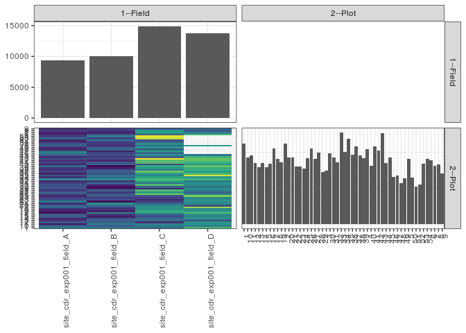

popler\_data\_organizatonal\_hierarchy
================
Hao Ye, Ellen Bledsoe
5/21/2019

``` r
library(tidyverse)

all_data <- readRDS("list_df_full.RDS")
df <- as_tibble(all_data[[params$dataset_index]])

cat("My project metadata key is ", 
    df$proj_metadata_key[1], "!!")
```

    ## My project metadata key is  221 !!

``` r
# figure out the spatial replication levels
df %>% 
  select(starts_with("spatial_replication_level")) %>%
  NCOL() %>%
  {./2} -> num_sr_levels
```

``` r
# transform the names of the variables
#   - get rid of the `spatial_replication_level_#_label` columns
sr_vars <- character(num_sr_levels)
for (i in seq(num_sr_levels))
{
  new_name <- paste0(i, "--", as.character(df[[1, paste0("spatial_replication_level_", i, "_label")]]))
  old_name <- paste0("spatial_replication_level_", i)
  sr_vars[i] <- new_name
  df <- rename(df, !!new_name := !!old_name)
}
```

``` r
# extract just the spatial replication level data
data_organization <- df %>%
  select(sr_vars)
```

``` r
# make pair-wise density plots to summarize organizational structure:
# 
library(GGally)
my_bin <- function(data, mapping, ...) {
  ggplot(data = data, mapping = mapping) +
    geom_bin2d(...) +
    scale_fill_viridis_c()
}

pm <- ggpairs(data_organization, 
                      lower = list(discrete = my_bin), 
                      upper = list(discrete = "blank"), 
              cardinality_threshold = NULL) + 
  theme_bw() + 
  theme(axis.text.x = element_text(angle = 90, hjust = 1))

print(pm)
```



``` r
# generate contingency tables to summarize organizational structure:
#   - level_i vs. level_j (i < j)

cols <- expand.grid(i = seq(num_sr_levels), 
                    j = seq(num_sr_levels)) %>%
  filter(i < j)

sr_tables <- purrr::pmap(cols, function(i, j) {
    data_organization %>%
      select(sr_vars[c(i, j)]) %>%
      table()
  })
```

``` r
# loop over tables and output
purrr::map(sr_tables, knitr::kable)
```

    ## [[1]]
    ## 
    ## 
    ##                              1    10    11    12    13    14    15    16    17    18    19     2    20    21    22    23    24    25    26    27    28    29     3    30    31    32    33    34    35    36    37    38    39     4    40    41    42    43    44    45    46    47    48    49     5    50    51    52    53    54     6     7     8     9
    ## ------------------------  ----  ----  ----  ----  ----  ----  ----  ----  ----  ----  ----  ----  ----  ----  ----  ----  ----  ----  ----  ----  ----  ----  ----  ----  ----  ----  ----  ----  ----  ----  ----  ----  ----  ----  ----  ----  ----  ----  ----  ----  ----  ----  ----  ----  ----  ----  ----  ----  ----  ----  ----  ----  ----  ----
    ## site_cdr_exp001_field_A    258   207   106   211   143   123   206   208   101   119   140   223   218   139   256   184   174   131   170   221   150   182   196   192   165   133   280   148   197   124   164   150   147   230   120   168   145   201   137   211   258   235   127   142   231   202   141   123   223   165   129   119   160   130
    ## site_cdr_exp001_field_B    262   201   269   218   215   189   124   147   268   125   145   171   235   286    98   190   162   199   211   153   214   116    96   147   235   149   282   234   253   188   216   195   128    90   225   198   133   187   153   187   173   118   231   200   136   155   169   260   168   262   197   126   143   165
    ## site_cdr_exp001_field_C    238   257   277   139   233   236   189   211   317   344   294   292   284   221   159   127   169   182   401   313   362   135   213   366   235   325   367   328   275   303   389   261   301   341   173   371   369   493   207   283   228   330   212   295   234   290   211   174   453   481   208   304   324   191
    ## site_cdr_exp001_field_D    359   261   307   288   200   308   277   281   372   317   278   434   190   281   291   301   274   407   269   218   269   298   243   281   297   257   348   300   468   356   313   348   340   384   299   343   375   387   356   248     0     0     0     0   306     0     0     0     0     0   355   269   201   221
