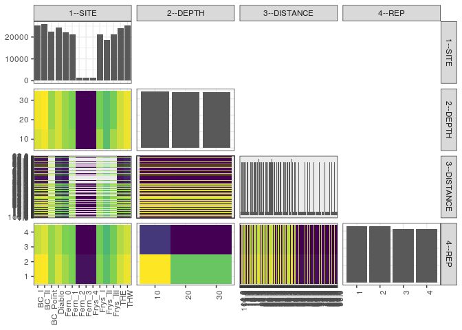

popler\_data\_organizatonal\_hierarchy
================
Hao Ye, Ellen Bledsoe
5/21/2019

``` r
library(tidyverse)

all_data <- readRDS("list_df_full.RDS")
df <- as_tibble(all_data[[params$dataset_index]])

cat("My project metadata key is ", 
    df$proj_metadata_key[1], "!!")
```

    ## My project metadata key is  14 !!

``` r
# figure out the spatial replication levels
df %>% 
  select(starts_with("spatial_replication_level")) %>%
  NCOL() %>%
  {./2} -> num_sr_levels
```

``` r
# transform the names of the variables
#   - get rid of the `spatial_replication_level_#_label` columns
sr_vars <- character(num_sr_levels)
for (i in seq(num_sr_levels))
{
  new_name <- paste0(i, "--", as.character(df[[1, paste0("spatial_replication_level_", i, "_label")]]))
  old_name <- paste0("spatial_replication_level_", i)
  sr_vars[i] <- new_name
  df <- rename(df, !!new_name := !!old_name)
}
```

``` r
# extract just the spatial replication level data
data_organization <- df %>%
  select(sr_vars)
```

``` r
# make pair-wise density plots to summarize organizational structure:
# 
library(GGally)
my_bin <- function(data, mapping, ...) {
  ggplot(data = data, mapping = mapping) +
    geom_bin2d(...) +
    scale_fill_viridis_c()
}

pm <- ggpairs(data_organization, 
                      lower = list(discrete = my_bin), 
                      upper = list(discrete = "blank"), 
              cardinality_threshold = NULL) + 
  theme_bw() + 
  theme(axis.text.x = element_text(angle = 90, hjust = 1))

print(pm)
```

    ## plot: [1,1] [==>------------------------------------------] 6% est: 0s
    ## plot: [1,2] [=====>---------------------------------------] 12% est: 2s
    ## plot: [1,3] [=======>-------------------------------------] 19% est: 1s
    ## plot: [1,4] [==========>----------------------------------] 25% est: 1s
    ## plot: [2,1] [=============>-------------------------------] 31% est: 1s
    ## plot: [2,2] [================>----------------------------] 38% est: 3s
    ## plot: [2,3] [===================>-------------------------] 44% est: 3s
    ## plot: [2,4] [=====================>-----------------------] 50% est: 2s
    ## plot: [3,1] [========================>--------------------] 56% est: 2s
    ## plot: [3,2] [===========================>-----------------] 62% est: 5s
    ## plot: [3,3] [==============================>--------------] 69% est: 4s
    ## plot: [3,4] [=================================>-----------] 75% est: 3s
    ## plot: [4,1] [====================================>--------] 81% est: 2s
    ## plot: [4,2] [======================================>------] 88% est: 1s
    ## plot: [4,3] [=========================================>---] 94% est: 1s
    ## plot: [4,4] [=============================================]100% est: 0s



``` r
# generate contingency tables to summarize organizational structure:
#   - level_i vs. level_j (i < j)

cols <- expand.grid(i = seq(num_sr_levels), 
                    j = seq(num_sr_levels)) %>%
  filter(i < j)

sr_tables <- purrr::pmap(cols, function(i, j) {
    data_organization %>%
      select(sr_vars[c(i, j)]) %>%
      table()
  })
```

``` r
# loop over tables and output
purrr::map(sr_tables, knitr::kable)
```

    ## [[1]]
    ## 
    ## 
    ##               10     20     30
    ## ---------  -----  -----  -----
    ## BC_I        8200   8520   8520
    ## BC_II       8520   8680   8680
    ## BC_Point    7680   7359   7360
    ## Diablo      8120   8119   8120
    ## Fern_0      7400   7400   7400
    ## Fern_1      7200   7039   7040
    ## Fern_2       480    480    480
    ## Fern_3       480    480    480
    ## Frys_4       480    480    480
    ## Frys_I      7520   6880   6880
    ## Frys_II     6240   6240   6240
    ## Frys_III    7520   6880   6880
    ## THE         8040   8040   8038
    ## THW         8440   8439   8440
    ## 
    ## [[2]]
    ## 
    ## 
    ##             1.0   10.0   100.0   10.4   10.8   11.0   11.2   11.8   1.2   12.0   12.4   12.9   13.0   13.5   13.9   14.0   14.3   14.6   15.0   15.1   15.7   16.0   16.2   16.8   17.0   17.2   17.6   18.0   18.6   1.9   19.0   19.2   19.6   2.0   20.0   20.2   2.1   21.0   21.1   21.8   22.0   22.5   22.7   23.0   23.6   24.0   24.1   24.6   25.0   25.4   25.7   26.0   26.3   26.6   27.0   27.2   27.8   28.0   28.8   2.9   29.0   29.1   29.8   3.0   30.0   30.1   30.8   31.0   31.4   31.8   3.2   32.0   32.5   32.7   33.0   33.3   33.9   34.0   34.3   34.7   35.0   35.2   35.9   36.0   36.2   36.4   37.0   37.2   37.9   3.8   38.0   38.1   38.6   39.0   39.8   4.0   40.0   40.2   40.9   4.1   41.0   42.0   43.0   44.0   45.0   4.6   46.0   47.0   48.0   49.0   5.0   50.0   51.0   52.0   53.0   54.0   5.5   55.0   56.0   57.0   58.0   5.9   59.0   6.0   60.0   6.1   61.0   62.0   63.0   64.0   65.0   66.0   6.7   67.0   68.0   69.0   7.0   70.0   71.0   72.0   73.0   74.0   7.5   75.0   76.0   77.0   7.8   78.0   79.0   8.0   80.0   81.0   8.2   82.0   83.0   84.0   85.0   86.0   87.0   88.0   8.9   89.0   9.0   90.0   9.1   91.0   92.0   93.0   94.0   9.5   95.0   96.0   97.0   98.0   99.0
    ## ---------  ----  -----  ------  -----  -----  -----  -----  -----  ----  -----  -----  -----  -----  -----  -----  -----  -----  -----  -----  -----  -----  -----  -----  -----  -----  -----  -----  -----  -----  ----  -----  -----  -----  ----  -----  -----  ----  -----  -----  -----  -----  -----  -----  -----  -----  -----  -----  -----  -----  -----  -----  -----  -----  -----  -----  -----  -----  -----  -----  ----  -----  -----  -----  ----  -----  -----  -----  -----  -----  -----  ----  -----  -----  -----  -----  -----  -----  -----  -----  -----  -----  -----  -----  -----  -----  -----  -----  -----  -----  ----  -----  -----  -----  -----  -----  ----  -----  -----  -----  ----  -----  -----  -----  -----  -----  ----  -----  -----  -----  -----  ----  -----  -----  -----  -----  -----  ----  -----  -----  -----  -----  ----  -----  ----  -----  ----  -----  -----  -----  -----  -----  -----  ----  -----  -----  -----  ----  -----  -----  -----  -----  -----  ----  -----  -----  -----  ----  -----  -----  ----  -----  -----  ----  -----  -----  -----  -----  -----  -----  -----  ----  -----  ----  -----  ----  -----  -----  -----  -----  ----  -----  -----  -----  -----  -----
    ## BC_I         30     30      30    278    278     30    278    278   278     30    278    278     30    278    278     30    278    278     30    278    278     30    278    278     30    278    278    308    278   278     30    278    278    30    308    278   278     30    278    278     30    278    278    308    278     30    278    278     30    278    278     30    278    278     30    278    278    308    278   278     30    278    278    30     30    278    278     30    278    278   278     30    278    278     30    278    278     30    278    278     30    278    278     30    278    278     30    278    278   278     30    278    278    308    278    30     30    278    278   278     30     30     30     30     30   278     30     30     30     30    30     30     30     30     30     30   278     30     30     30     30   278     30    30     30   278     30     30     30     30     30     30   278     30     30     30    30     30     30     30     30     30   278     30     30     30   278     30     30    30     30     30   278     30     30     30     30     30     30     30   278     30    30     30   278     30     30     30     30   278     30     30     30     30     30
    ## BC_II        30     30      30    286    286     30    286    286   286     30    286    286     30    286    286     30    286    286     30    286    286     30    286    286     30    286    286    316    286   286     30    286    286    30    316    286   286     30    286    286     30    286    286    316    286     30    286    286     30    286    286     30    286    286     30    286    286    316    286   286     30    286    286    30     30    286    286     30    286    286   286     30    286    286     30    286    286     30    286    286     30    286    286     30    286    286     30    286    286   286     30    286    286    316    286    30     30    286    286   286     30     30     30     30     30   286     30     30     30     30    30     30     30     30     30     30   286     30     30     30     30   286     30    30     30   286     30     30     30     30     30     30   286     30     30     30    30     30     30     30     30     30   286     30     30     30   286     30     30    30     30     30   286     30     30     30     30     30     30     30   286     30    30     30   286     30     30     30     30   286     30     30     30     30     30
    ## BC_Point      0      0       0    280    280      0    280    280   280      0    280    280      0    280    280      0    280    280      0    280    280      0    280    280      0    280    280    280    280   280      0    280    280     0    280    279   280      0    280    280      0    280    280    280    280      0    280    280      0    280    280      0    280    280      0    280    280    280    280   280      0    280    280     0      0    280    280      0    280    280   280      0    280    280      0    280    280      0    280    280      0    280    280      0    280    280      0    280    280   280      0    280    280    280    280     0      0    280    280   280      0      0      0      0      0   280      0      0      0      0     0      0      0      0      0      0   280      0      0      0      0   280      0     0      0   280      0      0      0      0      0      0   280      0      0      0     0      0      0      0      0      0   280      0      0      0   280      0      0     0      0      0   280      0      0      0      0      0      0      0   280      0     0      0   280      0      0      0      0   280      0      0      0      0      0
    ## Diablo       42     42      42    252    252     42    252    252   252     42    252    252     42    252    252     42    252    252     42    252    252     42    252    252     42    252    252    294    252   252     42    251    252    42    294    252   252     42    252    252     42    252    252    294    252     42    252    252     42    252    252     42    252    252     42    252    252    294    252   252     42    252    252    42     42    252    252     42    252    252   252     42    252    252     42    252    252     42    252    252     42    252    252     42    252    252     42    252    252   252     42    252    252    294    252    42     42    252    252   252     42     42     42     42     42   252     42     42     42     42    42     42     42     42     42     42   252     42     42     42     42   252     42    42     42   252     42     42     42     42     42     42   252     42     42     42    42     42     42     42     42     42   252     42     42     42   252     42     42    42     42     42   252     42     42     42     42     42     42     42   252     42    42     42   252     42     42     42     42   252     42     42     42     42     42
    ## Fern_0       30     30      30    240    240     30    240    240   240     30    240    240     30    240    240     30    240    240     30    240    240     30    240    240     30    240    240    270    240   240     30    240    240    30    270    240   240     30    240    240     30    240    240    270    240     30    240    240     30    240    240     30    240    240     30    240    240    270    240   240     30    240    240    30     30    240    240     30    240    240   240     30    240    240     30    240    240     30    240    240     30    240    240     30    240    240     30    240    240   240     30    240    240    270    240    30     30    240    240   240     30     30     30     30     30   240     30     30     30     30    30     30     30     30     30     30   240     30     30     30     30   240     30    30     30   240     30     30     30     30     30     30   240     30     30     30    30     30     30     30     30     30   240     30     30     30   240     30     30    30     30     30   240     30     30     30     30     30     30     30   240     30    30     30   240     30     30     30     30   240     30     30     30     30     30
    ## Fern_1        0      0       0    266    266      0    266    266   266      0    266    266      0    266    266      0    266    266      0    266    266      0    266    265      0    266    266    266    266   266      0    266    266     0    266    266   266      0    266    266      0    266    266    266    266      0    266    266      0    266    266      0    266    266      0    266    266    266    266   266      0    266    266     0      0    266    266      0    266    266   266      0    266    266      0    266    266      0    266    266      0    266    266      0    266    266      0    266    266   266      0    266    266    266    266     0      0    266    266   266      0      0      0      0      0   266      0      0      0      0     0      0      0      0      0      0   266      0      0      0      0   266      0     0      0   266      0      0      0      0      0      0   266      0      0      0     0      0      0      0      0      0   266      0      0      0   266      0      0     0      0      0   266      0      0      0      0      0      0      0   266      0     0      0   266      0      0      0      0   266      0      0      0      0      0
    ## Fern_2        0      0       0     18     18      0     18     18    18      0     18     18      0     18     18      0     18     18      0     18     18      0     18     18      0     18     18     18     18    18      0     18     18     0     18     18    18      0     18     18      0     18     18     18     18      0     18     18      0     18     18      0     18     18      0     18     18     18     18    18      0     18     18     0      0     18     18      0     18     18    18      0     18     18      0     18     18      0     18     18      0     18     18      0     18     18      0     18     18    18      0     18     18     18     18     0      0     18     18    18      0      0      0      0      0    18      0      0      0      0     0      0      0      0      0      0    18      0      0      0      0    18      0     0      0    18      0      0      0      0      0      0    18      0      0      0     0      0      0      0      0      0    18      0      0      0    18      0      0     0      0      0    18      0      0      0      0      0      0      0    18      0     0      0    18      0      0      0      0    18      0      0      0      0      0
    ## Fern_3        0      0       0     18     18      0     18     18    18      0     18     18      0     18     18      0     18     18      0     18     18      0     18     18      0     18     18     18     18    18      0     18     18     0     18     18    18      0     18     18      0     18     18     18     18      0     18     18      0     18     18      0     18     18      0     18     18     18     18    18      0     18     18     0      0     18     18      0     18     18    18      0     18     18      0     18     18      0     18     18      0     18     18      0     18     18      0     18     18    18      0     18     18     18     18     0      0     18     18    18      0      0      0      0      0    18      0      0      0      0     0      0      0      0      0      0    18      0      0      0      0    18      0     0      0    18      0      0      0      0      0      0    18      0      0      0     0      0      0      0      0      0    18      0      0      0    18      0      0     0      0      0    18      0      0      0      0      0      0      0    18      0     0      0    18      0      0      0      0    18      0      0      0      0      0
    ## Frys_4        0      0       0     18     18      0     18     18    18      0     18     18      0     18     18      0     18     18      0     18     18      0     18     18      0     18     18     18     18    18      0     18     18     0     18     18    18      0     18     18      0     18     18     18     18      0     18     18      0     18     18      0     18     18      0     18     18     18     18    18      0     18     18     0      0     18     18      0     18     18    18      0     18     18      0     18     18      0     18     18      0     18     18      0     18     18      0     18     18    18      0     18     18     18     18     0      0     18     18    18      0      0      0      0      0    18      0      0      0      0     0      0      0      0      0      0    18      0      0      0      0    18      0     0      0    18      0      0      0      0      0      0    18      0      0      0     0      0      0      0      0      0    18      0      0      0    18      0      0     0      0      0    18      0      0      0      0      0      0      0    18      0     0      0    18      0      0      0      0    18      0      0      0      0      0
    ## Frys_I        0      0       0    266    266      0    266    266   266      0    266    266      0    266    266      0    266    266      0    266    266      0    266    266      0    266    266    266    266   266      0    266    266     0    266    266   266      0    266    266      0    266    266    266    266      0    266    266      0    266    266      0    266    266      0    266    266    266    266   266      0    266    266     0      0    266    266      0    266    266   266      0    266    266      0    266    266      0    266    266      0    266    266      0    266    266      0    266    266   266      0    266    266    266    266     0      0    266    266   266      0      0      0      0      0   266      0      0      0      0     0      0      0      0      0      0   266      0      0      0      0   266      0     0      0   266      0      0      0      0      0      0   266      0      0      0     0      0      0      0      0      0   266      0      0      0   266      0      0     0      0      0   266      0      0      0      0      0      0      0   266      0     0      0   266      0      0      0      0   266      0      0      0      0      0
    ## Frys_II       0      0       0    234    234      0    234    234   234      0    234    234      0    234    234      0    234    234      0    234    234      0    234    234      0    234    234    234    234   234      0    234    234     0    234    234   234      0    234    234      0    234    234    234    234      0    234    234      0    234    234      0    234    234      0    234    234    234    234   234      0    234    234     0      0    234    234      0    234    234   234      0    234    234      0    234    234      0    234    234      0    234    234      0    234    234      0    234    234   234      0    234    234    234    234     0      0    234    234   234      0      0      0      0      0   234      0      0      0      0     0      0      0      0      0      0   234      0      0      0      0   234      0     0      0   234      0      0      0      0      0      0   234      0      0      0     0      0      0      0      0      0   234      0      0      0   234      0      0     0      0      0   234      0      0      0      0      0      0      0   234      0     0      0   234      0      0      0      0   234      0      0      0      0      0
    ## Frys_III      0      0       0    266    266      0    266    266   266      0    266    266      0    266    266      0    266    266      0    266    266      0    266    266      0    266    266    266    266   266      0    266    266     0    266    266   266      0    266    266      0    266    266    266    266      0    266    266      0    266    266      0    266    266      0    266    266    266    266   266      0    266    266     0      0    266    266      0    266    266   266      0    266    266      0    266    266      0    266    266      0    266    266      0    266    266      0    266    266   266      0    266    266    266    266     0      0    266    266   266      0      0      0      0      0   266      0      0      0      0     0      0      0      0      0      0   266      0      0      0      0   266      0     0      0   266      0      0      0      0      0      0   266      0      0      0     0      0      0      0      0      0   266      0      0      0   266      0      0     0      0      0   266      0      0      0      0      0      0      0   266      0     0      0   266      0      0      0      0   266      0      0      0      0      0
    ## THE          30     30      30    264    264     30    264    264   264     30    264    264     30    264    264     30    264    264     30    264    264     30    264    264     30    264    264    294    264   264     30    264    264    30    294    264   264     30    264    264     30    264    264    294    264     30    264    264     30    264    264     30    264    264     30    264    264    294    264   263     30    264    264    30     30    264    264     30    264    264   264     30    264    264     30    264    264     30    264    264     30    264    264     30    264    264     30    264    264   264     30    264    264    294    264    30     30    264    264   264     30     30     30     30     30   264     30     30     30     30    30     30     30     30     30     30   264     30     30     30     30   264     30    30     30   263     30     30     30     30     30     30   264     30     30     30    30     30     30     30     30     30   264     30     30     30   264     30     30    30     30     30   264     30     30     30     30     30     30     30   264     30    30     30   264     30     30     30     30   264     30     30     30     30     30
    ## THW          42     42      42    264    264     42    264    264   264     42    264    264     42    264    264     42    264    264     42    264    264     42    264    264     42    264    264    306    264   264     42    264    264    42    306    264   264     42    264    264     42    264    264    306    264     42    264    264     42    264    264     42    264    264     42    264    264    306    264   264     42    264    264    42     42    264    264     42    264    264   264     42    264    264     42    264    264     42    264    264     42    264    264     42    264    264     42    263    264   264     42    264    264    306    264    42     42    264    264   264     42     42     42     42     42   264     42     42     42     42    42     42     42     42     42     42   264     42     42     42     42   264     42    42     42   264     42     42     42     42     42     42   264     42     42     42    42     42     42     42     42     42   264     42     42     42   264     42     42    42     42     42   264     42     42     42     42     42     42     42   264     42    42     42   264     42     42     42     42   264     42     42     42     42     42
    ## 
    ## [[3]]
    ## 
    ## 
    ##       1.0   10.0   100.0   10.4   10.8   11.0   11.2   11.8   1.2   12.0   12.4   12.9   13.0   13.5   13.9   14.0   14.3   14.6   15.0   15.1   15.7   16.0   16.2   16.8   17.0   17.2   17.6   18.0   18.6   1.9   19.0   19.2   19.6   2.0   20.0   20.2   2.1   21.0   21.1   21.8   22.0   22.5   22.7   23.0   23.6   24.0   24.1   24.6   25.0   25.4   25.7   26.0   26.3   26.6   27.0   27.2   27.8   28.0   28.8   2.9   29.0   29.1   29.8   3.0   30.0   30.1   30.8   31.0   31.4   31.8   3.2   32.0   32.5   32.7   33.0   33.3   33.9   34.0   34.3   34.7   35.0   35.2   35.9   36.0   36.2   36.4   37.0   37.2   37.9   3.8   38.0   38.1   38.6   39.0   39.8   4.0   40.0   40.2   40.9   4.1   41.0   42.0   43.0   44.0   45.0   4.6   46.0   47.0   48.0   49.0   5.0   50.0   51.0   52.0   53.0   54.0   5.5   55.0   56.0   57.0   58.0   5.9   59.0   6.0   60.0   6.1   61.0   62.0   63.0   64.0   65.0   66.0   6.7   67.0   68.0   69.0   7.0   70.0   71.0   72.0   73.0   74.0   7.5   75.0   76.0   77.0   7.8   78.0   79.0   8.0   80.0   81.0   8.2   82.0   83.0   84.0   85.0   86.0   87.0   88.0   8.9   89.0   9.0   90.0   9.1   91.0   92.0   93.0   94.0   9.5   95.0   96.0   97.0   98.0   99.0
    ## ---  ----  -----  ------  -----  -----  -----  -----  -----  ----  -----  -----  -----  -----  -----  -----  -----  -----  -----  -----  -----  -----  -----  -----  -----  -----  -----  -----  -----  -----  ----  -----  -----  -----  ----  -----  -----  ----  -----  -----  -----  -----  -----  -----  -----  -----  -----  -----  -----  -----  -----  -----  -----  -----  -----  -----  -----  -----  -----  -----  ----  -----  -----  -----  ----  -----  -----  -----  -----  -----  -----  ----  -----  -----  -----  -----  -----  -----  -----  -----  -----  -----  -----  -----  -----  -----  -----  -----  -----  -----  ----  -----  -----  -----  -----  -----  ----  -----  -----  -----  ----  -----  -----  -----  -----  -----  ----  -----  -----  -----  -----  ----  -----  -----  -----  -----  -----  ----  -----  -----  -----  -----  ----  -----  ----  -----  ----  -----  -----  -----  -----  -----  -----  ----  -----  -----  -----  ----  -----  -----  -----  -----  -----  ----  -----  -----  -----  ----  -----  -----  ----  -----  -----  ----  -----  -----  -----  -----  -----  -----  -----  ----  -----  ----  -----  ----  -----  -----  -----  -----  ----  -----  -----  -----  -----  -----
    ## 10     68     68      68    994    994     68    994    994   994     68    994    994     68    994    994     68    994    994     68    994    994     68    994    994     68    994    994   1062    994   994     68    994    994    68   1062    994   994     68    994    994     68    994    994   1062    994     68    994    994     68    994    994     68    994    994     68    994    994   1062    994   994     68    994    994    68     68    994    994     68    994    994   994     68    994    994     68    994    994     68    994    994     68    994    994     68    994    994     68    994    994   994     68    994    994   1062    994    68     68    994    994   994     68     68     68     68     68   994     68     68     68     68    68     68     68     68     68     68   994     68     68     68     68   994     68    68     68   994     68     68     68     68     68     68   994     68     68     68    68     68     68     68     68     68   994     68     68     68   994     68     68    68     68     68   994     68     68     68     68     68     68     68   994     68    68     68   994     68     68     68     68   994     68     68     68     68     68
    ## 20     68     68      68    978    978     68    978    978   978     68    978    978     68    978    978     68    978    978     68    978    978     68    978    977     68    978    978   1046    978   978     68    977    978    68   1046    977   978     68    978    978     68    978    978   1046    978     68    978    978     68    978    978     68    978    978     68    978    978   1046    978   978     68    978    978    68     68    978    978     68    978    978   978     68    978    978     68    978    978     68    978    978     68    978    978     68    978    978     68    977    978   978     68    978    978   1046    978    68     68    978    978   978     68     68     68     68     68   978     68     68     68     68    68     68     68     68     68     68   978     68     68     68     68   978     68    68     68   978     68     68     68     68     68     68   978     68     68     68    68     68     68     68     68     68   978     68     68     68   978     68     68    68     68     68   978     68     68     68     68     68     68     68   978     68    68     68   978     68     68     68     68   978     68     68     68     68     68
    ## 30     68     68      68    978    978     68    978    978   978     68    978    978     68    978    978     68    978    978     68    978    978     68    978    978     68    978    978   1046    978   978     68    978    978    68   1046    978   978     68    978    978     68    978    978   1046    978     68    978    978     68    978    978     68    978    978     68    978    978   1046    978   977     68    978    978    68     68    978    978     68    978    978   978     68    978    978     68    978    978     68    978    978     68    978    978     68    978    978     68    978    978   978     68    978    978   1046    978    68     68    978    978   978     68     68     68     68     68   978     68     68     68     68    68     68     68     68     68     68   978     68     68     68     68   978     68    68     68   977     68     68     68     68     68     68   978     68     68     68    68     68     68     68     68     68   978     68     68     68   978     68     68    68     68     68   978     68     68     68     68     68     68     68   978     68    68     68   978     68     68     68     68   978     68     68     68     68     68
    ## 
    ## [[4]]
    ## 
    ## 
    ##                1      2      3      4
    ## ---------  -----  -----  -----  -----
    ## BC_I        6580   6580   6040   6040
    ## BC_II       6660   6660   6280   6280
    ## BC_Point    5600   5600   5599   5600
    ## Diablo      6240   6239   5940   5940
    ## Fern_0      5700   5700   5400   5400
    ## Fern_1      5359   5360   5280   5280
    ## Fern_2       480    480    240    240
    ## Fern_3       480    480    240    240
    ## Frys_4       480    480    240    240
    ## Frys_I      5440   5440   5200   5200
    ## Frys_II     4800   4800   4560   4560
    ## Frys_III    5440   5440   5200   5200
    ## THE         6180   6180   5879   5879
    ## THW         6480   6479   6180   6180
    ## 
    ## [[5]]
    ## 
    ## 
    ##           1       2       3       4
    ## ---  ------  ------  ------  ------
    ## 10    22240   22240   20920   20920
    ## 20    21839   21838   20679   20680
    ## 30    21840   21840   20679   20679
    ## 
    ## [[6]]
    ## 
    ## 
    ##            1     2     3     4
    ## ------  ----  ----  ----  ----
    ## 1.0       60    60    42    42
    ## 10.0      60    60    42    42
    ## 100.0     60    60    42    42
    ## 10.4     749   749   726   726
    ## 10.8     749   749   726   726
    ## 11.0      60    60    42    42
    ## 11.2     749   749   726   726
    ## 11.8     749   749   726   726
    ## 1.2      749   749   726   726
    ## 12.0      60    60    42    42
    ## 12.4     749   749   726   726
    ## 12.9     749   749   726   726
    ## 13.0      60    60    42    42
    ## 13.5     749   749   726   726
    ## 13.9     749   749   726   726
    ## 14.0      60    60    42    42
    ## 14.3     749   749   726   726
    ## 14.6     749   749   726   726
    ## 15.0      60    60    42    42
    ## 15.1     749   749   726   726
    ## 15.7     749   749   726   726
    ## 16.0      60    60    42    42
    ## 16.2     749   749   726   726
    ## 16.8     748   749   726   726
    ## 17.0      60    60    42    42
    ## 17.2     749   749   726   726
    ## 17.6     749   749   726   726
    ## 18.0     809   809   768   768
    ## 18.6     749   749   726   726
    ## 1.9      749   749   726   726
    ## 19.0      60    60    42    42
    ## 19.2     749   748   726   726
    ## 19.6     749   749   726   726
    ## 2.0       60    60    42    42
    ## 20.0     809   809   768   768
    ## 20.2     749   749   725   726
    ## 2.1      749   749   726   726
    ## 21.0      60    60    42    42
    ## 21.1     749   749   726   726
    ## 21.8     749   749   726   726
    ## 22.0      60    60    42    42
    ## 22.5     749   749   726   726
    ## 22.7     749   749   726   726
    ## 23.0     809   809   768   768
    ## 23.6     749   749   726   726
    ## 24.0      60    60    42    42
    ## 24.1     749   749   726   726
    ## 24.6     749   749   726   726
    ## 25.0      60    60    42    42
    ## 25.4     749   749   726   726
    ## 25.7     749   749   726   726
    ## 26.0      60    60    42    42
    ## 26.3     749   749   726   726
    ## 26.6     749   749   726   726
    ## 27.0      60    60    42    42
    ## 27.2     749   749   726   726
    ## 27.8     749   749   726   726
    ## 28.0     809   809   768   768
    ## 28.8     749   749   726   726
    ## 2.9      749   749   726   725
    ## 29.0      60    60    42    42
    ## 29.1     749   749   726   726
    ## 29.8     749   749   726   726
    ## 3.0       60    60    42    42
    ## 30.0      60    60    42    42
    ## 30.1     749   749   726   726
    ## 30.8     749   749   726   726
    ## 31.0      60    60    42    42
    ## 31.4     749   749   726   726
    ## 31.8     749   749   726   726
    ## 3.2      749   749   726   726
    ## 32.0      60    60    42    42
    ## 32.5     749   749   726   726
    ## 32.7     749   749   726   726
    ## 33.0      60    60    42    42
    ## 33.3     749   749   726   726
    ## 33.9     749   749   726   726
    ## 34.0      60    60    42    42
    ## 34.3     749   749   726   726
    ## 34.7     749   749   726   726
    ## 35.0      60    60    42    42
    ## 35.2     749   749   726   726
    ## 35.9     749   749   726   726
    ## 36.0      60    60    42    42
    ## 36.2     749   749   726   726
    ## 36.4     749   749   726   726
    ## 37.0      60    60    42    42
    ## 37.2     749   748   726   726
    ## 37.9     749   749   726   726
    ## 3.8      749   749   726   726
    ## 38.0      60    60    42    42
    ## 38.1     749   749   726   726
    ## 38.6     749   749   726   726
    ## 39.0     809   809   768   768
    ## 39.8     749   749   726   726
    ## 4.0       60    60    42    42
    ## 40.0      60    60    42    42
    ## 40.2     749   749   726   726
    ## 40.9     749   749   726   726
    ## 4.1      749   749   726   726
    ## 41.0      60    60    42    42
    ## 42.0      60    60    42    42
    ## 43.0      60    60    42    42
    ## 44.0      60    60    42    42
    ## 45.0      60    60    42    42
    ## 4.6      749   749   726   726
    ## 46.0      60    60    42    42
    ## 47.0      60    60    42    42
    ## 48.0      60    60    42    42
    ## 49.0      60    60    42    42
    ## 5.0       60    60    42    42
    ## 50.0      60    60    42    42
    ## 51.0      60    60    42    42
    ## 52.0      60    60    42    42
    ## 53.0      60    60    42    42
    ## 54.0      60    60    42    42
    ## 5.5      749   749   726   726
    ## 55.0      60    60    42    42
    ## 56.0      60    60    42    42
    ## 57.0      60    60    42    42
    ## 58.0      60    60    42    42
    ## 5.9      749   749   726   726
    ## 59.0      60    60    42    42
    ## 6.0       60    60    42    42
    ## 60.0      60    60    42    42
    ## 6.1      749   749   725   726
    ## 61.0      60    60    42    42
    ## 62.0      60    60    42    42
    ## 63.0      60    60    42    42
    ## 64.0      60    60    42    42
    ## 65.0      60    60    42    42
    ## 66.0      60    60    42    42
    ## 6.7      749   749   726   726
    ## 67.0      60    60    42    42
    ## 68.0      60    60    42    42
    ## 69.0      60    60    42    42
    ## 7.0       60    60    42    42
    ## 70.0      60    60    42    42
    ## 71.0      60    60    42    42
    ## 72.0      60    60    42    42
    ## 73.0      60    60    42    42
    ## 74.0      60    60    42    42
    ## 7.5      749   749   726   726
    ## 75.0      60    60    42    42
    ## 76.0      60    60    42    42
    ## 77.0      60    60    42    42
    ## 7.8      749   749   726   726
    ## 78.0      60    60    42    42
    ## 79.0      60    60    42    42
    ## 8.0       60    60    42    42
    ## 80.0      60    60    42    42
    ## 81.0      60    60    42    42
    ## 8.2      749   749   726   726
    ## 82.0      60    60    42    42
    ## 83.0      60    60    42    42
    ## 84.0      60    60    42    42
    ## 85.0      60    60    42    42
    ## 86.0      60    60    42    42
    ## 87.0      60    60    42    42
    ## 88.0      60    60    42    42
    ## 8.9      749   749   726   726
    ## 89.0      60    60    42    42
    ## 9.0       60    60    42    42
    ## 90.0      60    60    42    42
    ## 9.1      749   749   726   726
    ## 91.0      60    60    42    42
    ## 92.0      60    60    42    42
    ## 93.0      60    60    42    42
    ## 94.0      60    60    42    42
    ## 9.5      749   749   726   726
    ## 95.0      60    60    42    42
    ## 96.0      60    60    42    42
    ## 97.0      60    60    42    42
    ## 98.0      60    60    42    42
    ## 99.0      60    60    42    42
