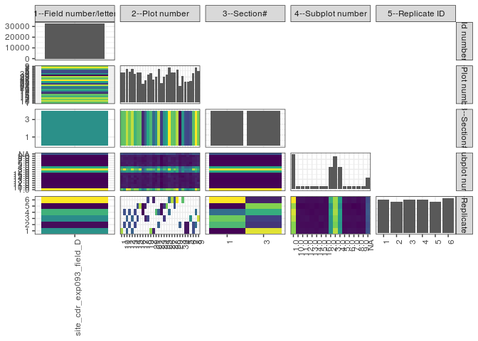

popler\_data\_organizatonal\_hierarchy
================
Hao Ye, Ellen Bledsoe
5/21/2019

``` r
library(tidyverse)

all_data <- readRDS("list_df_full.RDS")
df <- as_tibble(all_data[[params$dataset_index]])

cat("My project metadata key is ", 
    df$proj_metadata_key[1], "!!")
```

    ## My project metadata key is  287 !!

``` r
# figure out the spatial replication levels
df %>% 
  select(starts_with("spatial_replication_level")) %>%
  NCOL() %>%
  {./2} -> num_sr_levels
```

``` r
# transform the names of the variables
#   - get rid of the `spatial_replication_level_#_label` columns
sr_vars <- character(num_sr_levels)
for (i in seq(num_sr_levels))
{
  new_name <- paste0(i, "--", as.character(df[[1, paste0("spatial_replication_level_", i, "_label")]]))
  old_name <- paste0("spatial_replication_level_", i)
  sr_vars[i] <- new_name
  df <- rename(df, !!new_name := !!old_name)
}
```

``` r
# extract just the spatial replication level data
data_organization <- df %>%
  select(sr_vars)
```

``` r
# make pair-wise density plots to summarize organizational structure:
# 
library(GGally)
my_bin <- function(data, mapping, ...) {
  ggplot(data = data, mapping = mapping) +
    geom_bin2d(...) +
    scale_fill_viridis_c()
}

pm <- ggpairs(data_organization, 
                      lower = list(discrete = my_bin), 
                      upper = list(discrete = "blank"), 
              cardinality_threshold = NULL) + 
  theme_bw() + 
  theme(axis.text.x = element_text(angle = 90, hjust = 1))

print(pm)
```

    ## plot: [1,1] [=>-------------------------------------------] 4% est: 0s
    ## plot: [1,2] [===>-----------------------------------------] 8% est: 1s
    ## plot: [1,3] [====>----------------------------------------] 12% est: 1s
    ## plot: [1,4] [======>--------------------------------------] 16% est: 0s
    ## plot: [1,5] [========>------------------------------------] 20% est: 0s
    ## plot: [2,1] [==========>----------------------------------] 24% est: 0s
    ## plot: [2,2] [============>--------------------------------] 28% est: 1s
    ## plot: [2,3] [=============>-------------------------------] 32% est: 1s
    ## plot: [2,4] [===============>-----------------------------] 36% est: 1s
    ## plot: [2,5] [=================>---------------------------] 40% est: 1s
    ## plot: [3,1] [===================>-------------------------] 44% est: 1s
    ## plot: [3,2] [=====================>-----------------------] 48% est: 1s
    ## plot: [3,3] [======================>----------------------] 52% est: 1s
    ## plot: [3,4] [========================>--------------------] 56% est: 1s
    ## plot: [3,5] [==========================>------------------] 60% est: 1s
    ## plot: [4,1] [============================>----------------] 64% est: 1s
    ## plot: [4,2] [==============================>--------------] 68% est: 1s
    ## plot: [4,3] [===============================>-------------] 72% est: 1s
    ## plot: [4,4] [=================================>-----------] 76% est: 1s
    ## plot: [4,5] [===================================>---------] 80% est: 1s
    ## plot: [5,1] [=====================================>-------] 84% est: 1s
    ## plot: [5,2] [=======================================>-----] 88% est: 0s
    ## plot: [5,3] [========================================>----] 92% est: 0s
    ## plot: [5,4] [==========================================>--] 96% est: 0s
    ## plot: [5,5] [=============================================]100% est: 0s



``` r
# generate contingency tables to summarize organizational structure:
#   - level_i vs. level_j (i < j)

cols <- expand.grid(i = seq(num_sr_levels), 
                    j = seq(num_sr_levels)) %>%
  filter(i < j)

sr_tables <- purrr::pmap(cols, function(i, j) {
    data_organization %>%
      select(sr_vars[c(i, j)]) %>%
      table()
  })
```

``` r
# loop over tables and output
purrr::map(sr_tables, knitr::kable)
```

    ## [[1]]
    ## 
    ## 
    ##                               1     10     11     12     13     14     15     16    17    18     19      2    20     21     22    23     24     25     26     27     28     29     3     30     4     5     6      7      8      9
    ## ------------------------  -----  -----  -----  -----  -----  -----  -----  -----  ----  ----  -----  -----  ----  -----  -----  ----  -----  -----  -----  -----  -----  -----  ----  -----  ----  ----  ----  -----  -----  -----
    ## site_cdr_exp093_field_D    1174   1186   1314   1214   1310   1124   1168   1180   724   866   1092   1140   894   1000   1310   770   1022   1088   1386   1184   1174   1300   644   1026   818   802   836   1162   1386   1224
    ## 
    ## [[2]]
    ## 
    ## 
    ##                                1       3
    ## ------------------------  ------  ------
    ## site_cdr_exp093_field_D    16259   16259
    ## 
    ## [[3]]
    ## 
    ## 
    ##         1     3
    ## ---  ----  ----
    ## 1     587   587
    ## 10    593   593
    ## 11    657   657
    ## 12    607   607
    ## 13    655   655
    ## 14    562   562
    ## 15    584   584
    ## 16    590   590
    ## 17    362   362
    ## 18    433   433
    ## 19    546   546
    ## 2     570   570
    ## 20    447   447
    ## 21    500   500
    ## 22    655   655
    ## 23    385   385
    ## 24    511   511
    ## 25    544   544
    ## 26    693   693
    ## 27    592   592
    ## 28    587   587
    ## 29    650   650
    ## 3     322   322
    ## 30    513   513
    ## 4     409   409
    ## 5     401   401
    ## 6     418   418
    ## 7     581   581
    ## 8     693   693
    ## 9     612   612
    ## 
    ## [[4]]
    ## 
    ## 
    ##                             1.0   10.0   11.0   12.0   13.0   14.0   15.0   16.0    2.0    3.0    4.0   5.0   6.0   7.0   8.0   9.0     NA
    ## ------------------------  -----  -----  -----  -----  -----  -----  -----  -----  -----  -----  -----  ----  ----  ----  ----  ----  -----
    ## site_cdr_exp093_field_D    6988    652    648    630    614    604    644    630   4480   6674   4464   640   642   638   600   640   2330
    ## 
    ## [[5]]
    ## 
    ## 
    ##       1.0   10.0   11.0   12.0   13.0   14.0   15.0   16.0   2.0   3.0   4.0   5.0   6.0   7.0   8.0   9.0    NA
    ## ---  ----  -----  -----  -----  -----  -----  -----  -----  ----  ----  ----  ----  ----  ----  ----  ----  ----
    ## 1     234     20     26     20     18     18     16     24   156   246   184    20    20    26    30    24    92
    ## 10    180     22     30     26     24     22     30     24   166   312   162    22    22    26    20    24    74
    ## 11    316     32     28     30     36     32     28     24   182   230   178    20    30    28    20    28    72
    ## 12    300     18     22     20     22     20     16     22   170   216   188    28    24    26    22    22    78
    ## 13    228     30     26     20     28     20     34     26   190   304   198    24    30    26    22    24    80
    ## 14    274     24     24     14     12     24     14     22   162   244   162    14    14    20    12    20    68
    ## 15    270     20     22     22     24     14     24     24   148   238   160    30    24    20    20    28    80
    ## 16    204     24     24     24     26     24     24     26   176   306   136    22    22    18    20    28    76
    ## 17    136     18     16     18     18     20     22     16   100   112    94    24    16    12    14    22    66
    ## 18    170     18     16     20     20     16     18     18   124   184   110    16    20    12    18    14    72
    ## 19    246     18     28     20     18     18     24     18   140   248   124    24    22    24    22    24    74
    ## 2     218     22     26     30     26     24     28     30   130   252   140    26    32    26    22    26    82
    ## 20    192     16     14     12     16     14     20     16   112   224   116    14    14    18    12    16    68
    ## 21    246     28     20     16     10     14     14     10   152   190   126    20    18    14    14    16    92
    ## 22    276     26     22     24     26     24     20     26   178   274   194    22    28    28    24    20    98
    ## 23    210      4      6      4      8     10      6      8   106   186   110     6     6     6     4     6    84
    ## 24    230     16     14     18     16     16     16     22   130   222   164    12    16    18    22    14    76
    ## 25    264     18     18     20     18     18     20     18   148   204   152    18    20    16    18    20    98
    ## 26    266     30     30     28     20     22     36     30   186   316   198    26    24    34    30    24    86
    ## 27    248     26     24     26     28     28     28     18   190   214   148    30    22    24    20    28    82
    ## 28    278     20     20     18     26     14     22     20   148   264   146    24    24    20    18    30    82
    ## 29    312     28     30     22     26     26     26     20   200   222   192    30    28    32    24    28    54
    ## 3     134     14     14     16     16     18     12     12    92   114    86    14    12    14    12    14    50
    ## 30    256     26     20     20     14     18     10     16   170   158   150    22    20    20    18    14    74
    ## 4     190     20     18     18     14     16     18     18   104   152   104    22    20    18    18    14    54
    ## 5     140     24     22     22     18     20     22     22   116   146   104    14    18    20    16    26    52
    ## 6     178     12     18     12     14     16     18     12   126   162   114    18    10    18    18    14    76
    ## 7     202     18     18     16     22     20     22     28   142   288   164    26    26    22    28    16   104
    ## 8     328     34     26     32     32     32     26     32   192   238   190    22    28    24    28    28    94
    ## 9     262     26     26     42     18     26     30     28   144   208   170    30    32    28    34    28    92
    ## 
    ## [[6]]
    ## 
    ## 
    ##        1.0   10.0   11.0   12.0   13.0   14.0   15.0   16.0    2.0    3.0    4.0   5.0   6.0   7.0   8.0   9.0     NA
    ## ---  -----  -----  -----  -----  -----  -----  -----  -----  -----  -----  -----  ----  ----  ----  ----  ----  -----
    ## 1     3494    326    324    315    307    302    322    315   2240   3337   2232   320   321   319   300   320   1165
    ## 3     3494    326    324    315    307    302    322    315   2240   3337   2232   320   321   319   300   320   1165
    ## 
    ## [[7]]
    ## 
    ## 
    ##                               1      2      3      4      5      6
    ## ------------------------  -----  -----  -----  -----  -----  -----
    ## site_cdr_exp093_field_D    5464   5145   5446   5550   5130   5783
    ## 
    ## [[8]]
    ## 
    ## 
    ##          1     2      3      4      5      6
    ## ---  -----  ----  -----  -----  -----  -----
    ## 1     1174     0      0      0      0      0
    ## 10       0   593      0    593      0      0
    ## 11     657     0    657      0      0      0
    ## 12       0   607      0    607      0      0
    ## 13     655     0    655      0      0      0
    ## 14       0   562      0    562      0      0
    ## 15       0     0    584      0    584      0
    ## 16       0     0      0      0   1180      0
    ## 17       0     0      0    362    362      0
    ## 18       0     0    433      0    433      0
    ## 19       0     0    546      0      0    546
    ## 2     1140     0      0      0      0      0
    ## 20     447     0      0      0      0    447
    ## 21       0     0      0   1000      0      0
    ## 22       0   655      0    655      0      0
    ## 23       0     0      0    385    385      0
    ## 24       0     0    511      0    511      0
    ## 25       0     0      0      0   1088      0
    ## 26       0     0      0    693      0    693
    ## 27       0     0      0      0      0   1184
    ## 28       0     0      0      0    587    587
    ## 29       0     0      0      0      0   1300
    ## 3        0   644      0      0      0      0
    ## 30       0     0      0      0      0   1026
    ## 4      409   409      0      0      0      0
    ## 5      401   401      0      0      0      0
    ## 6        0     0    836      0      0      0
    ## 7      581   581      0      0      0      0
    ## 8        0   693      0    693      0      0
    ## 9        0     0   1224      0      0      0
    ## 
    ## [[9]]
    ## 
    ## 
    ##          1      2      3      4      5      6
    ## ---  -----  -----  -----  -----  -----  -----
    ## 1     1558   3222   3437   2447   1567   4028
    ## 3     3906   1923   2009   3103   3563   1755
    ## 
    ## [[10]]
    ## 
    ## 
    ##            1      2      3      4      5      6
    ## -----  -----  -----  -----  -----  -----  -----
    ## 1.0     1086   1079   1170   1231   1115   1307
    ## 10.0     112    107    105    116     90    122
    ## 11.0     115    105    111    108     89    120
    ## 12.0     109    102    119     99     94    107
    ## 13.0     111    101    103     91    100    108
    ## 14.0     103    107    100    101     87    106
    ## 15.0     116     96    120     99     98    115
    ## 16.0     121    109    106    100     98     96
    ## 2.0      709    707    727    782    702    853
    ## 3.0     1170   1049   1083   1139   1113   1120
    ## 4.0      756    720    751    775    680    782
    ## 5.0      106     99    111    102     96    126
    ## 6.0      121    102    113     99     95    112
    ## 7.0      118    106    110    102     78    124
    ## 8.0      110     96    114     91     86    103
    ## 9.0      112     99    108     99    105    117
    ## NA       389    361    395    416    404    365
