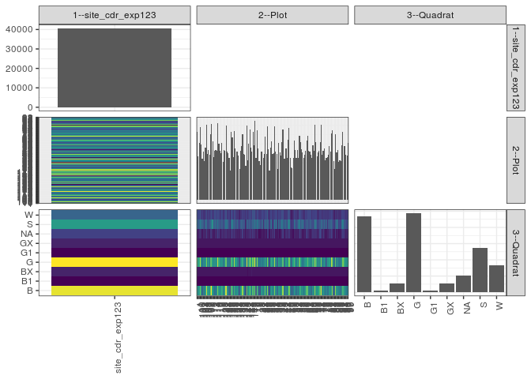

popler\_data\_organizatonal\_hierarchy
================
Hao Ye, Ellen Bledsoe
5/21/2019

``` r
library(tidyverse)

all_data <- readRDS("list_df_full.RDS")
df <- as_tibble(all_data[[params$dataset_index]])

cat("My project metadata key is ", 
    df$proj_metadata_key[1], "!!")
```

    ## My project metadata key is  290 !!

``` r
# figure out the spatial replication levels
df %>% 
  select(starts_with("spatial_replication_level")) %>%
  NCOL() %>%
  {./2} -> num_sr_levels
```

``` r
# transform the names of the variables
#   - get rid of the `spatial_replication_level_#_label` columns
sr_vars <- character(num_sr_levels)
for (i in seq(num_sr_levels))
{
  new_name <- paste0(i, "--", as.character(df[[1, paste0("spatial_replication_level_", i, "_label")]]))
  old_name <- paste0("spatial_replication_level_", i)
  sr_vars[i] <- new_name
  df <- rename(df, !!new_name := !!old_name)
}
```

``` r
# extract just the spatial replication level data
data_organization <- df %>%
  select(sr_vars)
```

``` r
# make pair-wise density plots to summarize organizational structure:
# 
library(GGally)
my_bin <- function(data, mapping, ...) {
  ggplot(data = data, mapping = mapping) +
    geom_bin2d(...) +
    scale_fill_viridis_c()
}

pm <- ggpairs(data_organization, 
                      lower = list(discrete = my_bin), 
                      upper = list(discrete = "blank"), 
              cardinality_threshold = NULL) + 
  theme_bw() + 
  theme(axis.text.x = element_text(angle = 90, hjust = 1))

print(pm)
```



``` r
# generate contingency tables to summarize organizational structure:
#   - level_i vs. level_j (i < j)

cols <- expand.grid(i = seq(num_sr_levels), 
                    j = seq(num_sr_levels)) %>%
  filter(i < j)

sr_tables <- purrr::pmap(cols, function(i, j) {
    data_organization %>%
      select(sr_vars[c(i, j)]) %>%
      table()
  })
```

``` r
# loop over tables and output
purrr::map(sr_tables, knitr::kable)
```

    ## [[1]]
    ## 
    ## 
    ##                      1    10   100   101   102   103   104   105   106   107   108   109    11   110   111   112   113   114   115   116   117   118   119    12   120   121   122   123   124   125   126   127   128   129    13   130   131   132   133   134   135   136   137   138   139    14   140   141   142   143   144   145   146   147    15    16    17    18    19     2    20    21    22    23    24    25    26    27    28    29     3    30    31    32    33    34    35    36    37    38    39     4    40    41    42    43    44    45    46    47    48    49     5    50    51    52    53    54    55    56    57    58    59     6    60    61    62    63    64    65    66    67    68    69     7    70    71    72    73    74    75    76    77    78    79     8    80    81    82    83    84    85    86    87    88    89     9    90    91    92    93    94    95    96    97    98    99
    ## ----------------  ----  ----  ----  ----  ----  ----  ----  ----  ----  ----  ----  ----  ----  ----  ----  ----  ----  ----  ----  ----  ----  ----  ----  ----  ----  ----  ----  ----  ----  ----  ----  ----  ----  ----  ----  ----  ----  ----  ----  ----  ----  ----  ----  ----  ----  ----  ----  ----  ----  ----  ----  ----  ----  ----  ----  ----  ----  ----  ----  ----  ----  ----  ----  ----  ----  ----  ----  ----  ----  ----  ----  ----  ----  ----  ----  ----  ----  ----  ----  ----  ----  ----  ----  ----  ----  ----  ----  ----  ----  ----  ----  ----  ----  ----  ----  ----  ----  ----  ----  ----  ----  ----  ----  ----  ----  ----  ----  ----  ----  ----  ----  ----  ----  ----  ----  ----  ----  ----  ----  ----  ----  ----  ----  ----  ----  ----  ----  ----  ----  ----  ----  ----  ----  ----  ----  ----  ----  ----  ----  ----  ----  ----  ----  ----  ----  ----  ----
    ## site_cdr_exp123    363   235   304   392   297   219   261   207   281   403   248   267   240   354   408   316   231   262   269   262   413   300   263   252   305   204   269   264   397   260   251   223   155   363   337   231   370   275   261   260   238   166   265   287   351   245   241   184   401   213   303   378   281   258   366   295   424   227   373   277   209   188   257   258   224   245   338   247   396   273   156   281   315   245   252   393   257   248   165   304   256   238   312   377   221   219   278   225   321   386   223   176   171   226   317   269   225   267   225   345   309   271   253   223   242   263   318   345   262   257   244   225   291   265   404   312   232   254   264   308   402   244   262   276   214   226   228   240   287   259   358   373   206   165   351   256   269   205   212   206   293   364   288   288   240   236   304
    ## 
    ## [[2]]
    ## 
    ## 
    ##                        B    B1     BX       G    G1     GX     NA      S      W
    ## ----------------  ------  ----  -----  ------  ----  -----  -----  -----  -----
    ## site_cdr_exp123    11695   294   1323   12160   294   1323   2533   6805   4140
    ## 
    ## [[3]]
    ## 
    ## 
    ##          B   B1   BX     G   G1   GX   NA    S    W
    ## ----  ----  ---  ---  ----  ---  ---  ---  ---  ---
    ## 1       97    2    9   115    2    9   23   69   37
    ## 10      64    2    9    73    2    9    5   38   33
    ## 100     85    2    9    94    2    9   19   52   32
    ## 101    111    2    9   131    2    9   22   64   42
    ## 102     86    2    9    88    2    9   19   57   25
    ## 103     49    2    9    60    2    9    9   51   28
    ## 104     75    2    9    77    2    9   18   46   23
    ## 105     52    2    9    67    2    9   16   30   20
    ## 106     85    2    9    79    2    9   16   52   27
    ## 107    139    2    9   121    2    9   28   56   37
    ## 108     85    2    9    68    2    9   15   35   23
    ## 109     85    2    9    81    2    9   14   37   28
    ## 11      76    2    9    62    2    9   10   46   24
    ## 110    115    2    9   108    2    9   26   52   31
    ## 111    149    2    9   111    2    9   27   61   38
    ## 112     91    2    9    84    2    9   15   77   27
    ## 113     59    2    9    70    2    9   10   44   26
    ## 114     59    2    9    81    2    9   11   51   38
    ## 115     62    2    9    78    2    9   19   53   35
    ## 116     75    2    9    78    2    9   17   41   29
    ## 117    119    2    9   139    2    9   33   63   37
    ## 118     82    2    9    95    2    9   22   46   33
    ## 119     71    2    9    85    2    9   21   41   23
    ## 12      84    2    9    72    2    9    6   40   28
    ## 120     96    2    9    82    2    9   22   48   35
    ## 121     58    2    9    58    2    9   15   33   18
    ## 122     84    2    9    70    2    9   21   42   30
    ## 123     78    2    9    75    2    9   17   45   27
    ## 124    140    2    9   112    2    9   22   61   40
    ## 125     79    2    9    64    2    9   17   54   24
    ## 126     73    2    9    61    2    9   16   53   26
    ## 127     53    2    9    64    2    9   19   36   29
    ## 128     38    2    9    44    2    9   11   25   15
    ## 129    110    2    9   110    2    9   26   55   40
    ## 13      99    2    9    94    2    9   24   66   32
    ## 130     55    2    9    67    2    9   18   46   23
    ## 131     98    2    9   131    2    9   26   53   40
    ## 132     75    2    9    88    2    9   17   44   29
    ## 133     74    2    9    86    2    9   15   41   23
    ## 134     86    2    9    64    2    9   13   53   22
    ## 135     65    2    9    72    2    9   15   38   26
    ## 136     46    2    9    38    2    9   13   32   15
    ## 137     80    2    9    74    2    9   19   47   23
    ## 138     89    2    9    84    2    9   17   51   24
    ## 139    127    2    9    97    2    9   29   47   29
    ## 14      76    2    9    67    2    9   11   42   27
    ## 140     63    2    9    65    2    9   20   43   28
    ## 141     42    2    9    64    2    9   11   20   25
    ## 142    120    2    9   145    2    9   23   58   33
    ## 143     56    2    6    64    2    9   12   42   20
    ## 144     92    2    9    97    2    9   19   43   30
    ## 145    112    2    9   131    2    9   24   52   37
    ## 146     84    2    9    93    2    9   22   32   28
    ## 147     63    2   12    79    2    9   16   47   28
    ## 15     106    2    9   119    2    9   26   52   41
    ## 16      81    2    9    89    2    9   15   51   37
    ## 17     118    2    9   152    2    9   26   64   42
    ## 18      48    2    9    70    2    9   11   50   26
    ## 19     108    2    9   125    2    9   21   63   34
    ## 2       78    2    9    73    2    9   13   57   34
    ## 20      45    2    9    63    2    9    6   48   25
    ## 21      36    2    9    59    2    9    6   39   26
    ## 22      88    2    9    74    2    9    9   38   26
    ## 23      77    2    9    64    2    9   12   50   33
    ## 24      68    2    9    70    2    9   10   24   30
    ## 25      81    2    9    65    2    9    8   42   27
    ## 26     113    2    9    95    2    9   18   56   34
    ## 27      67    2    9    66    2    9   10   48   34
    ## 28     124    2    9   122    2    9   28   55   45
    ## 29      68    2    9    81    2    9   27   51   24
    ## 3       36    2    9    40    2    9    8   28   22
    ## 30      74    2    9    81    2    9   21   50   33
    ## 31      90    2    9    96    2    9   14   60   33
    ## 32      70    2    9    80    2    9   21   26   26
    ## 33      74    2    9    72    2    9   17   39   28
    ## 34     119    2    9   131    2    9   29   63   29
    ## 35      73    2    9    71    2    9    9   49   33
    ## 36      63    2    9    62    2    9   11   57   33
    ## 37      52    2    9    47    2    9    9   15   20
    ## 38      84    2    9    91    2    9   15   60   32
    ## 39      80    2    9    76    2    9    7   41   30
    ## 4       57    2    9    68    2    9   13   50   28
    ## 40      93    2    9    78    2    9   18   63   38
    ## 41     128    2    9   106    2    9   27   57   37
    ## 42      65    2    9    61    2    9   16   31   26
    ## 43      56    2    9    50    2    9    8   61   22
    ## 44      73    2    9    89    2    9   22   46   26
    ## 45      55    2    9    68    2    9   19   37   24
    ## 46      91    2    9    83    2    9   19   66   40
    ## 47     117    2    9   117    2    9   25   67   38
    ## 48      65    2    9    71    2    9   14   32   19
    ## 49      53    2    9    50    2    9   10   26   15
    ## 5       45    2    9    57    2    9   14   24    9
    ## 50      59    2    9    89    2    9    6   29   21
    ## 51      83    2    9   104    2    9   17   59   32
    ## 52      73    2    9    85    2    9   15   48   26
    ## 53      58    2    9    66    2    9   14   39   26
    ## 54      73    2    9    90    2    9   16   45   21
    ## 55      54    2    9    63    2    9   10   56   20
    ## 56      85    2    9   113    2    9   25   63   37
    ## 57      99    2    9    90    2    9   23   42   33
    ## 58      73    2    9    74    2    9   19   53   30
    ## 59      77    2    9    62    2    9   10   56   26
    ## 6       60    2    9    67    2    9   11   45   18
    ## 60      75    2    9    78    2    9   15   31   21
    ## 61      80    2    9    80    2    9   11   39   31
    ## 62     107    2    9    87    2    9   28   45   29
    ## 63     111    2    9   108    2    9   22   48   34
    ## 64      66    2    9    82    2    9   20   38   34
    ## 65      66    2    9    80    2    9   13   42   34
    ## 66      59    2    9    67    2    9    9   54   33
    ## 67      52    2    9    74    2    9   19   35   23
    ## 68      78    2    9    99    2    9   24   38   30
    ## 69      73    2    9    79    2    9   21   40   30
    ## 7      126    2    9   132    2    9   23   71   30
    ## 70      82    2    9   100    2    9   22   55   31
    ## 71      72    2    9    67    2    9   15   33   23
    ## 72      90    2    9    78    2    9   16   32   16
    ## 73      89    2    9    72    2    9   19   38   24
    ## 74     107    2    9    75    2    9   34   42   28
    ## 75     141    2    9   123    2    9   34   53   29
    ## 76      72    2    9    67    2    9    8   54   21
    ## 77      80    2    9    69    2    9   23   42   26
    ## 78      70    2    9    84    2    9   17   56   27
    ## 79      58    2    9    63    2    9    9   37   25
    ## 8       70    2    9    50    2    9   10   48   26
    ## 80      59    2    9    82    2    9   15   25   25
    ## 81      59    2    9    77    2    9   14   44   24
    ## 82      81    2    9    88    2    9   22   46   28
    ## 83      72    2    9    67    2    9   21   49   28
    ## 84      85    2    9   135    2    9   31   53   32
    ## 85     125    2    9   123    2    9   26   45   32
    ## 86      54    2    9    67    2    9   11   32   20
    ## 87      48    2    9    50    2    9    9   25   11
    ## 88     126    2    9   107    2    9   27   44   25
    ## 89      80    2    9    67    2    9   11   55   21
    ## 9       72    2    9    75    2    9   16   58   26
    ## 90      69    2    9    59    2    9    6   29   20
    ## 91      65    2    9    60    2    9   10   35   20
    ## 92      51    2    9    69    2    9   12   30   22
    ## 93      83    2    9    76    2    9   22   59   31
    ## 94     100    2    9   118    2    9   28   65   31
    ## 95      73    2    9    99    2    9   24   41   29
    ## 96      88    2    9    84    2    9   21   45   28
    ## 97      63    2    9    81    2    9   12   40   22
    ## 98      63    2    9    75    2    9   17   33   26
    ## 99      76    2    9    95    2    9   17   59   35
