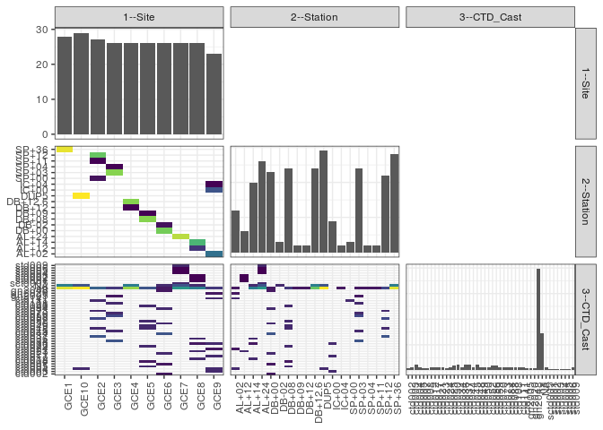

popler\_data\_organizatonal\_hierarchy
================
Hao Ye, Ellen Bledsoe
5/21/2019

``` r
library(tidyverse)

all_data <- readRDS("list_df_full.RDS")
df <- as_tibble(all_data[[params$dataset_index]])

cat("My project metadata key is ", 
    df$proj_metadata_key[1], "!!")
```

    ## My project metadata key is  300 !!

``` r
# figure out the spatial replication levels
df %>% 
  select(starts_with("spatial_replication_level")) %>%
  NCOL() %>%
  {./2} -> num_sr_levels
```

``` r
# transform the names of the variables
#   - get rid of the `spatial_replication_level_#_label` columns
sr_vars <- character(num_sr_levels)
for (i in seq(num_sr_levels))
{
  new_name <- paste0(i, "--", as.character(df[[1, paste0("spatial_replication_level_", i, "_label")]]))
  old_name <- paste0("spatial_replication_level_", i)
  sr_vars[i] <- new_name
  df <- rename(df, !!new_name := !!old_name)
}
```

``` r
# extract just the spatial replication level data
data_organization <- df %>%
  select(sr_vars)
```

``` r
# make pair-wise density plots to summarize organizational structure:
# 
library(GGally)
my_bin <- function(data, mapping, ...) {
  ggplot(data = data, mapping = mapping) +
    geom_bin2d(...) +
    scale_fill_viridis_c()
}

pm <- ggpairs(data_organization, 
                      lower = list(discrete = my_bin), 
                      upper = list(discrete = "blank"), 
              cardinality_threshold = NULL) + 
  theme_bw() + 
  theme(axis.text.x = element_text(angle = 90, hjust = 1))

print(pm)
```



``` r
# generate contingency tables to summarize organizational structure:
#   - level_i vs. level_j (i < j)

cols <- expand.grid(i = seq(num_sr_levels), 
                    j = seq(num_sr_levels)) %>%
  filter(i < j)

sr_tables <- purrr::pmap(cols, function(i, j) {
    data_organization %>%
      select(sr_vars[c(i, j)]) %>%
      table()
  })
```

``` r
# loop over tables and output
purrr::map(sr_tables, knitr::kable)
```

    ## [[1]]
    ## 
    ## 
    ##          AL+02   AL+12   AL+14   AL+24   DB+00   DB-02   DB+08   DB+09   DB+12   DB+12.6   DUP5   IC+00   IC+04   SP+00   SP+03   SP+04   SP+11   SP+12   SP+36
    ## ------  ------  ------  ------  ------  ------  ------  ------  ------  ------  --------  -----  ------  ------  ------  ------  ------  ------  ------  ------
    ## GCE1         0       0       0       0       0       0       0       0       0         0      0       0       0       0       0       0       0       0      28
    ## GCE10        0       0       0       0       0       0       0       0       0         0     29       0       0       0       0       0       0       0       0
    ## GCE2         0       0       0       0       0       0       0       0       0         0      0       0       0       3       0       0       2      22       0
    ## GCE3         0       0       0       0       0       0       0       0       0         0      0       0       0       0      24       2       0       0       0
    ## GCE4         0       0       0       0       0       0       0       0       2        24      0       0       0       0       0       0       0       0       0
    ## GCE5         0       0       0       0       0       0      24       2       0         0      0       0       0       0       0       0       0       0       0
    ## GCE6         0       0       0       0      23       3       0       0       0         0      0       0       0       0       0       0       0       0       0
    ## GCE7         0       0       0      26       0       0       0       0       0         0      0       0       0       0       0       0       0       0       0
    ## GCE8         0       6      20       0       0       0       0       0       0         0      0       0       0       0       0       0       0       0       0
    ## GCE9        12       0       0       0       0       0       0       0       0         0      0       9       2       0       0       0       0       0       0
    ## 
    ## [[2]]
    ## 
    ## 
    ##          ctd002   ctd003   ctd004   ctd005   ctd007   ctd008   ctd012   ctd017   ctd021   ctd023   ctd024   ctd025   ctd030   ctd034   ctd036   ctd037   ctd044   ctd045   ctd048   ctd049   ctd050   ctd052   ctd056   ctd059   ctd070   ctd073   ctd084   ctd088   ctd108   ctd111   ctd141   gn2005   gn2020   gn2048   na   NA   sctd005   std001   std002   std003   std004   std005   std006   std009
    ## ------  -------  -------  -------  -------  -------  -------  -------  -------  -------  -------  -------  -------  -------  -------  -------  -------  -------  -------  -------  -------  -------  -------  -------  -------  -------  -------  -------  -------  -------  -------  -------  -------  -------  -------  ---  ---  --------  -------  -------  -------  -------  -------  -------  -------
    ## GCE1          0        0        0        0        0        0        0        0        0        0        0        0        0        0        0        0        0        0        0        0        0        0        0        0        0        0        0        0        0        0        0        0        0        0   19    9         0        0        0        0        0        0        0        0
    ## GCE10         0        0        3        0        0        0        0        0        0        0        0        0        0        0        0        0        0        0        0        0        0        0        0        0        0        0        0        0        0        0        0        0        0        0   20    6         0        0        0        0        0        0        0        0
    ## GCE2          0        0        0        0        0        0        0        0        0        0        0        0        0        0        0        6        0        0        3        0        0        0        5        0        0        3        0        0        0        3        0        0        0        0    7    0         0        0        0        0        0        0        0        0
    ## GCE3          0        0        0        0        0        0        0        0        0        0        0        0        0        6        0        0        0        3        0        0        0        0        0        5        3        0        0        0        3        0        0        2        0        0    4    0         0        0        0        0        0        0        0        0
    ## GCE4          0        0        0        0        0        0        0        0        0        0        0        0        0        0        0        0        0        0        0        0        0        0        0        0        0        0        0        0        0        0        0        0        0        0   17    9         0        0        0        0        0        0        0        0
    ## GCE5          0        0        0        3        0        2        0        0        0        0        0        3        0        0        0        0        0        0        3        3        0        3        0        0        0        0        0        3        0        0        0        0        0        0    6    0         0        0        0        0        0        0        0        0
    ## GCE6          2        0        0        0        2        0        0        0        3        0        0        0        0        0        0        0        6        0        0        0        3        0        0        0        0        0        3        0        0        0        0        0        0        2    2    3         0        0        0        0        0        0        0        0
    ## GCE7          0        0        0        0        0        0        0        0        0        0        0        0        0        0        0        0        0        0        0        0        0        0        0        0        0        0        0        0        0        0        0        0        0        0   11    6         3        0        0        0        1        1        1        3
    ## GCE8          0        0        0        0        0        0        3        0        0        3        0        0        2        0        3        0        0        0        0        0        0        0        0        0        0        0        0        0        0        0        0        0        0        0    9    3         0        1        1        1        0        0        0        0
    ## GCE9          0        3        3        0        0        0        0        3        0        0        2        0        3        0        0        0        0        0        0        0        0        0        0        0        0        0        0        0        0        0        3        0        2        0    4    0         0        0        0        0        0        0        0        0
    ## 
    ## [[3]]
    ## 
    ## 
    ##            ctd002   ctd003   ctd004   ctd005   ctd007   ctd008   ctd012   ctd017   ctd021   ctd023   ctd024   ctd025   ctd030   ctd034   ctd036   ctd037   ctd044   ctd045   ctd048   ctd049   ctd050   ctd052   ctd056   ctd059   ctd070   ctd073   ctd084   ctd088   ctd108   ctd111   ctd141   gn2005   gn2020   gn2048   na   NA   sctd005   std001   std002   std003   std004   std005   std006   std009
    ## --------  -------  -------  -------  -------  -------  -------  -------  -------  -------  -------  -------  -------  -------  -------  -------  -------  -------  -------  -------  -------  -------  -------  -------  -------  -------  -------  -------  -------  -------  -------  -------  -------  -------  -------  ---  ---  --------  -------  -------  -------  -------  -------  -------  -------
    ## AL+02           0        0        3        0        0        0        0        0        0        0        2        0        0        0        0        0        0        0        0        0        0        0        0        0        0        0        0        0        0        0        3        0        2        0    2    0         0        0        0        0        0        0        0        0
    ## AL+12           0        0        0        0        0        0        0        0        0        3        0        0        0        0        0        0        0        0        0        0        0        0        0        0        0        0        0        0        0        0        0        0        0        0    0    0         0        1        1        1        0        0        0        0
    ## AL+14           0        0        0        0        0        0        3        0        0        0        0        0        2        0        3        0        0        0        0        0        0        0        0        0        0        0        0        0        0        0        0        0        0        0    9    3         0        0        0        0        0        0        0        0
    ## AL+24           0        0        0        0        0        0        0        0        0        0        0        0        0        0        0        0        0        0        0        0        0        0        0        0        0        0        0        0        0        0        0        0        0        0   11    6         3        0        0        0        1        1        1        3
    ## DB+00           2        0        0        0        2        0        0        0        3        0        0        0        0        0        0        0        6        0        0        0        3        0        0        0        0        0        3        0        0        0        0        0        0        2    2    0         0        0        0        0        0        0        0        0
    ## DB-02           0        0        0        0        0        0        0        0        0        0        0        0        0        0        0        0        0        0        0        0        0        0        0        0        0        0        0        0        0        0        0        0        0        0    0    3         0        0        0        0        0        0        0        0
    ## DB+08           0        0        0        3        0        2        0        0        0        0        0        3        0        0        0        0        0        0        3        3        0        3        0        0        0        0        0        3        0        0        0        0        0        0    4    0         0        0        0        0        0        0        0        0
    ## DB+09           0        0        0        0        0        0        0        0        0        0        0        0        0        0        0        0        0        0        0        0        0        0        0        0        0        0        0        0        0        0        0        0        0        0    2    0         0        0        0        0        0        0        0        0
    ## DB+12           0        0        0        0        0        0        0        0        0        0        0        0        0        0        0        0        0        0        0        0        0        0        0        0        0        0        0        0        0        0        0        0        0        0    2    0         0        0        0        0        0        0        0        0
    ## DB+12.6         0        0        0        0        0        0        0        0        0        0        0        0        0        0        0        0        0        0        0        0        0        0        0        0        0        0        0        0        0        0        0        0        0        0   15    9         0        0        0        0        0        0        0        0
    ## DUP5            0        0        3        0        0        0        0        0        0        0        0        0        0        0        0        0        0        0        0        0        0        0        0        0        0        0        0        0        0        0        0        0        0        0   20    6         0        0        0        0        0        0        0        0
    ## IC+00           0        3        0        0        0        0        0        3        0        0        0        0        3        0        0        0        0        0        0        0        0        0        0        0        0        0        0        0        0        0        0        0        0        0    0    0         0        0        0        0        0        0        0        0
    ## IC+04           0        0        0        0        0        0        0        0        0        0        0        0        0        0        0        0        0        0        0        0        0        0        0        0        0        0        0        0        0        0        0        0        0        0    2    0         0        0        0        0        0        0        0        0
    ## SP+00           0        0        0        0        0        0        0        0        0        0        0        0        0        0        0        0        0        0        0        0        0        0        0        0        0        0        0        0        0        3        0        0        0        0    0    0         0        0        0        0        0        0        0        0
    ## SP+03           0        0        0        0        0        0        0        0        0        0        0        0        0        6        0        0        0        3        0        0        0        0        0        5        3        0        0        0        3        0        0        2        0        0    2    0         0        0        0        0        0        0        0        0
    ## SP+04           0        0        0        0        0        0        0        0        0        0        0        0        0        0        0        0        0        0        0        0        0        0        0        0        0        0        0        0        0        0        0        0        0        0    2    0         0        0        0        0        0        0        0        0
    ## SP+11           0        0        0        0        0        0        0        0        0        0        0        0        0        0        0        0        0        0        0        0        0        0        0        0        0        0        0        0        0        0        0        0        0        0    2    0         0        0        0        0        0        0        0        0
    ## SP+12           0        0        0        0        0        0        0        0        0        0        0        0        0        0        0        6        0        0        3        0        0        0        5        0        0        3        0        0        0        0        0        0        0        0    5    0         0        0        0        0        0        0        0        0
    ## SP+36           0        0        0        0        0        0        0        0        0        0        0        0        0        0        0        0        0        0        0        0        0        0        0        0        0        0        0        0        0        0        0        0        0        0   19    9         0        0        0        0        0        0        0        0
