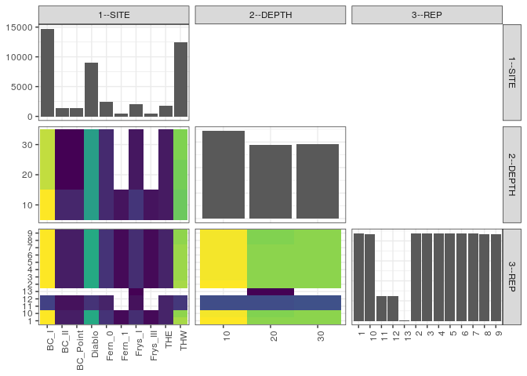

popler\_data\_organizatonal\_hierarchy
================
Hao Ye, Ellen Bledsoe
5/21/2019

``` r
library(tidyverse)

all_data <- readRDS("list_df_full.RDS")
df <- as_tibble(all_data[[params$dataset_index]])

cat("My project metadata key is ", 
    df$proj_metadata_key[1], "!!")
```

    ## My project metadata key is  15 !!

``` r
# figure out the spatial replication levels
df %>% 
  select(starts_with("spatial_replication_level")) %>%
  NCOL() %>%
  {./2} -> num_sr_levels
```

``` r
# transform the names of the variables
#   - get rid of the `spatial_replication_level_#_label` columns
sr_vars <- character(num_sr_levels)
for (i in seq(num_sr_levels))
{
  new_name <- paste0(i, "--", as.character(df[[1, paste0("spatial_replication_level_", i, "_label")]]))
  old_name <- paste0("spatial_replication_level_", i)
  sr_vars[i] <- new_name
  df <- rename(df, !!new_name := !!old_name)
}
```

``` r
# extract just the spatial replication level data
data_organization <- df %>%
  select(sr_vars)
```

``` r
# make pair-wise density plots to summarize organizational structure:
# 
library(GGally)
my_bin <- function(data, mapping, ...) {
  ggplot(data = data, mapping = mapping) +
    geom_bin2d(...) +
    scale_fill_viridis_c()
}

pm <- ggpairs(data_organization, 
                      lower = list(discrete = my_bin), 
                      upper = list(discrete = "blank"), 
              cardinality_threshold = NULL) + 
  theme_bw() + 
  theme(axis.text.x = element_text(angle = 90, hjust = 1))

print(pm)
```



``` r
# generate contingency tables to summarize organizational structure:
#   - level_i vs. level_j (i < j)

cols <- expand.grid(i = seq(num_sr_levels), 
                    j = seq(num_sr_levels)) %>%
  filter(i < j)

sr_tables <- purrr::pmap(cols, function(i, j) {
    data_organization %>%
      select(sr_vars[c(i, j)]) %>%
      table()
  })
```

``` r
# loop over tables and output
purrr::map(sr_tables, knitr::kable)
```

    ## [[1]]
    ## 
    ## 
    ##               10     20     30
    ## ---------  -----  -----  -----
    ## BC_I        5232   4752   4752
    ## BC_II        768    288    288
    ## BC_Point     768    288    288
    ## Diablo      3024   3024   3024
    ## Fern_0       816    816    816
    ## Fern_1       480      0      0
    ## Frys_I      1008    552    528
    ## Frys_III     480      0      0
    ## THE          576    576    576
    ## THW         4032   4152   4272
    ## 
    ## [[2]]
    ## 
    ## 
    ##                1     10    11    12   13      2      3      4      5      6      7      8      9
    ## ---------  -----  -----  ----  ----  ---  -----  -----  -----  -----  -----  -----  -----  -----
    ## BC_I        1416   1416   288   288    0   1416   1416   1416   1416   1416   1416   1416   1416
    ## BC_II        120    120    72    72    0    120    120    120    120    120    120    120    120
    ## BC_Point     120    120    72    72    0    120    120    120    120    120    120    120    120
    ## Diablo       864    864   216   216    0    864    864    864    864    864    864    864    864
    ## Fern_0       216    216   144   144    0    216    216    216    216    216    216    216    216
    ## Fern_1        48     48     0     0    0     48     48     48     48     48     48     48     48
    ## Frys_I       192    192    72    72   24    192    192    192    192    192    192    192    192
    ## Frys_III      48     48     0     0    0     48     48     48     48     48     48     48     48
    ## THE          144    144   144   144    0    144    144    144    144    144    144    144    144
    ## THW         1224   1176   240   240    0   1224   1200   1200   1200   1200   1200   1176   1176
    ## 
    ## [[3]]
    ## 
    ## 
    ##          1     10    11    12   13      2      3      4      5      6      7      8      9
    ## ---  -----  -----  ----  ----  ---  -----  -----  -----  -----  -----  -----  -----  -----
    ## 10    1656   1632   408   408    0   1656   1632   1632   1632   1632   1632   1632   1632
    ## 20    1368   1344   408   408   24   1368   1368   1368   1368   1368   1368   1344   1344
    ## 30    1368   1368   432   432    0   1368   1368   1368   1368   1368   1368   1368   1368
