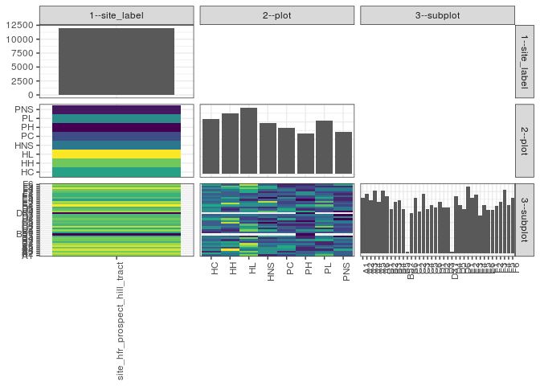

popler\_data\_organizatonal\_hierarchy
================
Hao Ye, Ellen Bledsoe
5/21/2019

``` r
library(tidyverse)

all_data <- readRDS("list_df_full.RDS")
df <- as_tibble(all_data[[params$dataset_index]])

cat("My project metadata key is ", 
    df$proj_metadata_key[1], "!!")
```

    ## My project metadata key is  402 !!

``` r
# figure out the spatial replication levels
df %>% 
  select(starts_with("spatial_replication_level")) %>%
  NCOL() %>%
  {./2} -> num_sr_levels
```

``` r
# transform the names of the variables
#   - get rid of the `spatial_replication_level_#_label` columns
sr_vars <- character(num_sr_levels)
for (i in seq(num_sr_levels))
{
  new_name <- paste0(i, "--", as.character(df[[1, paste0("spatial_replication_level_", i, "_label")]]))
  old_name <- paste0("spatial_replication_level_", i)
  sr_vars[i] <- new_name
  df <- rename(df, !!new_name := !!old_name)
}
```

``` r
# extract just the spatial replication level data
data_organization <- df %>%
  select(sr_vars)
```

``` r
# make pair-wise density plots to summarize organizational structure:
# 
library(GGally)
my_bin <- function(data, mapping, ...) {
  ggplot(data = data, mapping = mapping) +
    geom_bin2d(...) +
    scale_fill_viridis_c()
}

pm <- ggpairs(data_organization, 
                      lower = list(discrete = my_bin), 
                      upper = list(discrete = "blank"), 
              cardinality_threshold = NULL) + 
  theme_bw() + 
  theme(axis.text.x = element_text(angle = 90, hjust = 1))

print(pm)
```



``` r
# generate contingency tables to summarize organizational structure:
#   - level_i vs. level_j (i < j)

cols <- expand.grid(i = seq(num_sr_levels), 
                    j = seq(num_sr_levels)) %>%
  filter(i < j)

sr_tables <- purrr::pmap(cols, function(i, j) {
    data_organization %>%
      select(sr_vars[c(i, j)]) %>%
      table()
  })
```

``` r
# loop over tables and output
purrr::map(sr_tables, knitr::kable)
```

    ## [[1]]
    ## 
    ## 
    ##                                   HC     HH     HL    HNS     PC     PH     PL    PNS
    ## -----------------------------  -----  -----  -----  -----  -----  -----  -----  -----
    ## site_hfr_prospect_hill_tract    1593   1737   1917   1467   1341   1170   1530   1206
    ## 
    ## [[2]]
    ## 
    ## 
    ##                                  A1    A2    A3    A4    A5    A6    B1    B2    B3    B4    B5   B5?    B6    C1    C2    C3    C4    C5    C6    D1    D2    D3   D3?    D4    D5    D6    E1    E2    E3    E4    E5    E6    F1    F2    F3    F4    F5    F6
    ## -----------------------------  ----  ----  ----  ----  ----  ----  ----  ----  ----  ----  ----  ----  ----  ----  ----  ----  ----  ----  ----  ----  ----  ----  ----  ----  ----  ----  ----  ----  ----  ----  ----  ----  ----  ----  ----  ----  ----  ----
    ## site_hfr_prospect_hill_tract    360   387   342   405   333   405   369   288   333   342   288     9   261   360   270   387   288   315   297   333   297   297     9   369   315   288   432   360   378   243   315   279   279   306   333   414   315   360
    ## 
    ## [[3]]
    ## 
    ## 
    ##        A1   A2   A3   A4   A5   A6   B1   B2   B3   B4   B5   B5?   B6   C1   C2   C3   C4   C5   C6   D1   D2   D3   D3?   D4   D5   D6   E1   E2   E3   E4   E5   E6   F1   F2   F3   F4   F5   F6
    ## ----  ---  ---  ---  ---  ---  ---  ---  ---  ---  ---  ---  ----  ---  ---  ---  ---  ---  ---  ---  ---  ---  ---  ----  ---  ---  ---  ---  ---  ---  ---  ---  ---  ---  ---  ---  ---  ---  ---
    ## HC     36   63   18   54   36   54   45   54   36   45   45     0   18   27   54   54   36   36   36   63   45   36     0   54   54   45   63   45   36   45   36   45   36   54   36   54   36   63
    ## HH     45   45   54   99   27   63   54   63   18   54   36     0   36   18   27   45   36   90   54   81   36   45     0   36   18   27   63   90   45   45   63   36   36   36   45   63   72   36
    ## HL     81   54   81   45   63   81   90   27   45   81   18     0   36   81   63   54   72   27   45   27   27   45     0   54   54   27   54   54   45   18   45   36   27   63   63   81   63   90
    ## HNS    18   54   54   54   54   36   45   27   36   18   63     0   36   63   18   54   36    9   36   18   45   36     0   72   36   18   54   54   90   36    9   36   36   18   36   63   63   36
    ## PC     27   45   18   54   63   63   45   27   45   27   54     0   36   27   36   36   18   36   18   63   27   36     0   54   63   45   36   27   27   36   54   18   36   27   45   36   18   18
    ## PH     45   36   36   18   18   27   45   27   54   18   18     9   36   54   27   27   18   36    9   27   27   45     9   63   18   36   63   27   36    9   27   27   54   54   18   27   27   18
    ## PL     72   54   45   18   45   36   18   18   63   45   45     0   27   63   18   81   45   36   54   45   36   45     0   27   27   45   72   27   72   36   63   45   36   27   45   45   18   36
    ## PNS    36   36   36   63   27   45   27   45   36   54    9     0   36   27   27   36   27   45   45    9   54    9     0    9   45   45   27   36   27   18   18   36   18   27   45   45   18   63
