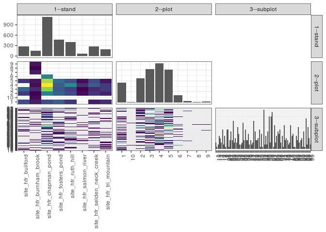

popler\_data\_organizatonal\_hierarchy
================
Hao Ye, Ellen Bledsoe
5/21/2019

``` r
library(tidyverse)

all_data <- readRDS("list_df_full.RDS")
df <- as_tibble(all_data[[params$dataset_index]])

cat("My project metadata key is ", 
    df$proj_metadata_key[1], "!!")
```

    ## My project metadata key is  408 !!

``` r
# figure out the spatial replication levels
df %>% 
  select(starts_with("spatial_replication_level")) %>%
  NCOL() %>%
  {./2} -> num_sr_levels
```

``` r
# transform the names of the variables
#   - get rid of the `spatial_replication_level_#_label` columns
sr_vars <- character(num_sr_levels)
for (i in seq(num_sr_levels))
{
  new_name <- paste0(i, "--", as.character(df[[1, paste0("spatial_replication_level_", i, "_label")]]))
  old_name <- paste0("spatial_replication_level_", i)
  sr_vars[i] <- new_name
  df <- rename(df, !!new_name := !!old_name)
}
```

``` r
# extract just the spatial replication level data
data_organization <- df %>%
  select(sr_vars)
```

``` r
# make pair-wise density plots to summarize organizational structure:
# 
library(GGally)
my_bin <- function(data, mapping, ...) {
  ggplot(data = data, mapping = mapping) +
    geom_bin2d(...) +
    scale_fill_viridis_c()
}

pm <- ggpairs(data_organization, 
                      lower = list(discrete = my_bin), 
                      upper = list(discrete = "blank"), 
              cardinality_threshold = NULL) + 
  theme_bw() + 
  theme(axis.text.x = element_text(angle = 90, hjust = 1))

print(pm)
```



``` r
# generate contingency tables to summarize organizational structure:
#   - level_i vs. level_j (i < j)

cols <- expand.grid(i = seq(num_sr_levels), 
                    j = seq(num_sr_levels)) %>%
  filter(i < j)

sr_tables <- purrr::pmap(cols, function(i, j) {
    data_organization %>%
      select(sr_vars[c(i, j)]) %>%
      table()
  })
```

``` r
# loop over tables and output
purrr::map(sr_tables, knitr::kable)
```

    ## [[1]]
    ## 
    ## 
    ##                                1   10     2     3     4     5     6    7    8    9
    ## ---------------------------  ---  ---  ----  ----  ----  ----  ----  ---  ---  ---
    ## site_hfr_builford             72    0    54   102     0    48     0    0    0    0
    ## site_hfr_burnham_brook        24   12     6    36    12    18     0   24    6   18
    ## site_hfr_chapman_pond         72    0   132   240   294   258   132    0    0    0
    ## site_hfr_fosters_pond         90    0    96    84    90   108     0    0    0    0
    ## site_hfr_ruth_hill            48    0    72    60   144    78     0    0    0    0
    ## site_hfr_salmon_river          0    0    12     6    42    12     0    0    0    0
    ## site_hfr_selden_neck_creek    24    0    48    36    90    72     0    0    0    0
    ## site_hfr_tri_mountain         42    0    30    54    54    18     0    0    0    0
    ## 
    ## [[2]]
    ## 
    ## 
    ##                                1   10   11   12   13   14   17   18   19    2   20   21   22   23   24   25   26   27   28   29    3   30   31   32   33   35   36   37   38   39    4   40   41   42   43   44   45   46   47   48   49    5   50   51   52   53   55   56   58   59    6   60    61   62   64   65   66   67   68   69    7   71   72   73   74   75   76   77   78    8   80   82   83   84   85   86   87   88    9   90   92   93   94   95   96   97   98   99
    ## ---------------------------  ---  ---  ---  ---  ---  ---  ---  ---  ---  ---  ---  ---  ---  ---  ---  ---  ---  ---  ---  ---  ---  ---  ---  ---  ---  ---  ---  ---  ---  ---  ---  ---  ---  ---  ---  ---  ---  ---  ---  ---  ---  ---  ---  ---  ---  ---  ---  ---  ---  ---  ---  ---  ----  ---  ---  ---  ---  ---  ---  ---  ---  ---  ---  ---  ---  ---  ---  ---  ---  ---  ---  ---  ---  ---  ---  ---  ---  ---  ---  ---  ---  ---  ---  ---  ---  ---  ---  ---
    ## site_hfr_builford              0    0    6   12    0    6    0    0    0    0   24    0    0    0    0    6   24    0    0    0    0    0    0    0    0    0    0    0    0    0    6    0    0    0    0    0    0    0    0    0   12    6    0    6   24    0    0    0    0   18    0   24     0    0    0    0    6    0    0    0    0   36    0   12    0    0    0    0    6    6    0    0    0    0    0    6    0    0    0    0    0    0    6   12   12    0    0    0
    ## site_hfr_burnham_brook         0    6    0    0    0    0    6    0    0    0    0   12    0    0    0    0    0    6    0    0   12    0    0    6    0    0    0    0    0    0    0    0    0    0    0    0    0   12    0    0    0    0   12    0    0    0    0    0    0    0   12    0     0    6   12    0    0    6    0   12    0    0    0    0    0    6    0    0    0    0    0    0    0    0    0    0    6    0    0    6    0   12    0    6    0    0    0    0
    ## site_hfr_chapman_pond          0    0    0    0   12    0   18    0    0    0    0   36    0    0   30   18    0    0   18   18   30   18    0    0    6   42    0    0    6    6    0    0    6    6    0   48    0    0    0   18   24    0    0    0   72   12   24    6   48   54    0   42   102    0   36    0    0    0    0   18    0    0    0   42    6   18    0    0   12   36    6   42    0    6   30    0   42   12    6   12    0   12    0   30    0   36    0    6
    ## site_hfr_fosters_pond         12    0    6   18   18    0    0    0    0    0   12    0    0   18    0    0   24    6    6    0    0    0    0    0    0   18   18   12   18    0    0    0    0    0    6   18   12    6    6    0    6    0    6    0   12    0    0    0    0    0    6   18     0    0   12    0   18   18   36   12    0    0    0    0   18    0    0    0    0    6    0    0    0    0    0    0    0    0   12   12    0   18    0    0    0   24    0    0
    ## site_hfr_ruth_hill             0    0    0    0    0    6   12   12    0    0    0    0    0    0   12    0   24    0    0    0   12    0   12    6    6   12    0   12    0    0   36    0    0    0    6    0   36    0   12    0    0    0   18    0    0    0    0    0    0   12    0    0     0    0    0    0   12    0    0    0    0    0    0   12    0    6   18    6    0    6   30    0    0    0    0    0    6    0    6    0    0    0    0   30    0    0   18    6
    ## site_hfr_salmon_river          0    0    0    0    0    0    0    0    0    0    0    0    0    0    6    0    0    0    0    0    6    6    0    0    6    0    0    0    0    0    0    0   12    0    0    0    0    0    0    0    0    0    6    0    0    0    0    0    0    6    0    6     0    0    6    0    0    0    6    0    0    0    0    0    0    0    0    0    0    0    0    0    6    0    0    0    0    0    0    0    0    0    0    0    0    0    0    0
    ## site_hfr_selden_neck_creek     6    0    0    0    0    0   12    0   24    0    0    6    0    0    0    0    0    0    0    0    0   18    0    0    0    0    6   18    0    0    0   12    0    6    0   12    0    6    0   12   12    0    0    0    0    0    6    6    0    0    0    0     0    0    0   18    0   24    0   12   12    0    0    0    0    0    0    0    0   12    0    0    0    0    6    0    6    6    0    0    0    0    0    0    0    0   12    0
    ## site_hfr_tri_mountain          0    0    0    6    0    6    6    0   12    6   18    0    6    6    0    0    6    6    6    0    0    0    0    0    0    0    0   12    0   18    0    0    6    0    6    0    0    0    6    0    0    0    0    0    0    0    6    0    0    0    0    0     0    0    0    0    0    0    0    0    6    0    6    0    0    0    6    6    0    0    0    0    0    0    0   18    0    0    0    0    6    6    0    6    0    0    0    0
    ## 
    ## [[3]]
    ## 
    ## 
    ##        1   10   11   12   13   14   17   18   19    2   20   21   22   23   24   25   26   27   28   29    3   30   31   32   33   35   36   37   38   39    4   40   41   42   43   44   45   46   47   48   49    5   50   51   52   53   55   56   58   59    6   60   61   62   64   65   66   67   68   69    7   71   72   73   74   75   76   77   78    8   80   82   83   84   85   86   87   88    9   90   92   93   94   95   96   97   98   99
    ## ---  ---  ---  ---  ---  ---  ---  ---  ---  ---  ---  ---  ---  ---  ---  ---  ---  ---  ---  ---  ---  ---  ---  ---  ---  ---  ---  ---  ---  ---  ---  ---  ---  ---  ---  ---  ---  ---  ---  ---  ---  ---  ---  ---  ---  ---  ---  ---  ---  ---  ---  ---  ---  ---  ---  ---  ---  ---  ---  ---  ---  ---  ---  ---  ---  ---  ---  ---  ---  ---  ---  ---  ---  ---  ---  ---  ---  ---  ---  ---  ---  ---  ---  ---  ---  ---  ---  ---  ---
    ## 1     18    0    6    6   12    0   18   12    0    0   12    0    0    0    0    0   24    0    0    6    0    0    0    6    6   24    0   12    6    0   12    0   12    6    6    0    6    0    6    0    0    0    6    0   12    0    0    6    0   18    0    0    0    6    0    0    0    0    0   12    0    6    0    0   12    0    6    6    0   12    6    0    0    0    0    0    0    0    0    0    6   12    0    0    0   24    0    6
    ## 10     0    0    0    0    0    0    0    0    0    0    0    6    0    0    0    0    0    0    0    0    0    0    0    0    0    0    0    0    0    0    0    0    0    0    0    0    0    0    0    0    0    0    0    0    0    0    0    0    0    0    0    0    0    0    0    0    0    6    0    0    0    0    0    0    0    0    0    0    0    0    0    0    0    0    0    0    0    0    0    0    0    0    0    0    0    0    0    0
    ## 2      0    0    0    0    6    0    0    0    0    0   42    6    0    0    0    0    0    6    6   12    0    0    0    6    0    0    0    0   18    0    6    0    0    0    0    0   12   12    6   12    0    6    0    0    0    0   24    0   18    0    0   42   18    0    0    0   12    6   12    0    0    0    0    0    6    0   18    0   12    0    0    6    6    0    0    6   12   12   18   12    0    6    6   18    6    0   12    6
    ## 3      0    6    0   30    0   18   24    0   12    0    0    6    0    0   42    0    6    6    0    0    0    6   12    0    0    0    6   12    0   18    6   12    0    0    0   18   12   12    0    0    6    0    0    6   42    0    6    0   30   18    0    0    0    0    0    6    6   18    0   18    0   24    0   24    0   12    0    6    0    6    0    0    0    0   30    0   30    0    0    0    0    0    0   12    0   36   18    0
    ## 4      0    0    6    0    0    0    0    0    0    0    0    0    6    6    6   18   24    0   24    0   30   12    0    0   12   48   18    6    0    0   18    0   12    0    6   60    0    0   12    0   12    0   18    0    0    0    6    6    0    6   18    0   54    0    6   12   12    0   30   24   12    0    6   30    0   18    0    0    0   36   24    0    0    6    0   18    0    0    0   12    0    0    0   36    0    0    0    0
    ## 5      0    0    0    0   12    0   12    0   24    6    0    0    0   18    0    6   24    6    0    0   18    6    0    0    0    0    0   24    0    0    0    0    0    0    6    0   18    0    0    0   36    0    6    0   48    0    0    0    0   48    0   36   30    0   36    0    6   18    0    0    6    6    0   12    6    0    0    0    6   12    0   36    0    0    6    0   18    6    6    6    0   18    0   18    6    0    0    0
    ## 6      0    0    0    0    0    0    0    0    0    0    0   36    0    0    0    0    0    0    0    0    0   18    0    0    0    0    0    0    0    6    0    0    0    6    0    0    0    0    0   18    0    0    0    0    6   12    0    0    0    0    0   12    0    0   12    0    0    0    0    0    0    0    0    0    0    0    0    0    0    0    6    0    0    0    0    0    0    0    0    0    0    0    0    0    0    0    0    0
    ## 7      0    0    0    0    0    0    0    0    0    0    0    0    0    0    0    0    0    0    0    0   12    0    0    0    0    0    0    0    0    0    0    0    0    0    0    0    0    0    0    0    0    0    0    0    0    0    0    0    0    0    0    0    0    0    0    0    0    0    0    0    0    0    0    0    0    0    0    0    0    0    0    0    0    0    0    0    0    0    0    0    0   12    0    0    0    0    0    0
    ## 8      0    0    0    0    0    0    0    0    0    0    0    0    0    0    0    0    0    0    0    0    0    0    0    0    0    0    0    0    0    0    0    0    0    0    0    0    0    0    0    0    0    0    0    0    0    0    0    0    0    0    0    0    0    0    6    0    0    0    0    0    0    0    0    0    0    0    0    0    0    0    0    0    0    0    0    0    0    0    0    0    0    0    0    0    0    0    0    0
    ## 9      0    0    0    0    0    0    0    0    0    0    0    0    0    0    0    0    0    0    0    0    0    0    0    0    0    0    0    0    0    0    0    0    0    0    0    0    0    0    0    0    0    0   12    0    0    0    0    0    0    0    0    0    0    0    6    0    0    0    0    0    0    0    0    0    0    0    0    0    0    0    0    0    0    0    0    0    0    0    0    0    0    0    0    0    0    0    0    0
