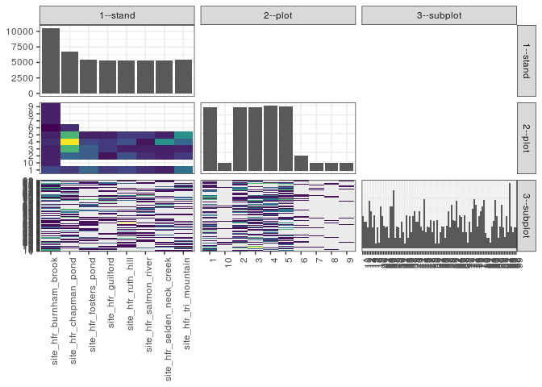

popler\_data\_organizatonal\_hierarchy
================
Hao Ye, Ellen Bledsoe
5/21/2019

``` r
library(tidyverse)

all_data <- readRDS("list_df_full.RDS")
df <- as_tibble(all_data[[params$dataset_index]])

cat("My project metadata key is ", 
    df$proj_metadata_key[1], "!!")
```

    ## My project metadata key is  410 !!

``` r
# figure out the spatial replication levels
df %>% 
  select(starts_with("spatial_replication_level")) %>%
  NCOL() %>%
  {./2} -> num_sr_levels
```

``` r
# transform the names of the variables
#   - get rid of the `spatial_replication_level_#_label` columns
sr_vars <- character(num_sr_levels)
for (i in seq(num_sr_levels))
{
  new_name <- paste0(i, "--", as.character(df[[1, paste0("spatial_replication_level_", i, "_label")]]))
  old_name <- paste0("spatial_replication_level_", i)
  sr_vars[i] <- new_name
  df <- rename(df, !!new_name := !!old_name)
}
```

``` r
# extract just the spatial replication level data
data_organization <- df %>%
  select(sr_vars)
```

``` r
# make pair-wise density plots to summarize organizational structure:
# 
library(GGally)
my_bin <- function(data, mapping, ...) {
  ggplot(data = data, mapping = mapping) +
    geom_bin2d(...) +
    scale_fill_viridis_c()
}

pm <- ggpairs(data_organization, 
                      lower = list(discrete = my_bin), 
                      upper = list(discrete = "blank"), 
              cardinality_threshold = NULL) + 
  theme_bw() + 
  theme(axis.text.x = element_text(angle = 90, hjust = 1))

print(pm)
```



``` r
# generate contingency tables to summarize organizational structure:
#   - level_i vs. level_j (i < j)

cols <- expand.grid(i = seq(num_sr_levels), 
                    j = seq(num_sr_levels)) %>%
  filter(i < j)

sr_tables <- purrr::pmap(cols, function(i, j) {
    data_organization %>%
      select(sr_vars[c(i, j)]) %>%
      table()
  })
```

``` r
# loop over tables and output
purrr::map(sr_tables, knitr::kable)
```

    ## [[1]]
    ## 
    ## 
    ##                                  1     10      2      3      4      5      6      7      8      9
    ## ---------------------------  -----  -----  -----  -----  -----  -----  -----  -----  -----  -----
    ## site_hfr_burnham_brook        1071   1050   1050   1050   1057   1050   1036   1050   1050   1050
    ## site_hfr_chapman_pond         1064      0   1092   1148   1204   1148   1057      0      0      0
    ## site_hfr_fosters_pond         1092      0   1085   1085   1071   1050      0      0      0      0
    ## site_hfr_guilford             1064      0   1043   1064   1064   1050      0      0      0      0
    ## site_hfr_ruth_hill            1071      0   1078   1050   1078   1064      0      0      0      0
    ## site_hfr_salmon_river         1057      0   1057   1050   1043   1064      0      0      0      0
    ## site_hfr_selden_neck_creek    1050      0   1050   1050   1120   1050      0      0      0      0
    ## site_hfr_tri_mountain         1099      0   1064   1050   1092   1120      0      0      0      0
    ## 
    ## [[2]]
    ## 
    ## 
    ##                                 1    10    11    12    13    14    15    17    18    19     2    20    21    22    23    24    25    26    27    28    29     3    30    31    32    33    34    35    36    37    38    39     4    40    41    42    43    44    45    46    47    48    49     5    50    51    52    53    54    55    56    57    58    59     6    60    61    62    64    65    66    67    68    69     7    70    71    72    73    74    75    76    77    78     8    80    81    82    83    84    85    86    87    88    89     9    90    91    92    93    94    95    96    97    98    99
    ## ---------------------------  ----  ----  ----  ----  ----  ----  ----  ----  ----  ----  ----  ----  ----  ----  ----  ----  ----  ----  ----  ----  ----  ----  ----  ----  ----  ----  ----  ----  ----  ----  ----  ----  ----  ----  ----  ----  ----  ----  ----  ----  ----  ----  ----  ----  ----  ----  ----  ----  ----  ----  ----  ----  ----  ----  ----  ----  ----  ----  ----  ----  ----  ----  ----  ----  ----  ----  ----  ----  ----  ----  ----  ----  ----  ----  ----  ----  ----  ----  ----  ----  ----  ----  ----  ----  ----  ----  ----  ----  ----  ----  ----  ----  ----  ----  ----  ----
    ## site_hfr_burnham_brook        105   315   315   105   105   210   315   105     0   105     0   105   315   105     0     0     0   210   315   210     0   105     0     0   105     0   105     0     0     0   105   210   105   210   105   105   105     0   105   105   105   105     0   105   210     0     0     0   105     0     0   105     0   105   210     0     0   217   315   105     0   210     0   119     0     0     0   105   210     0   322   105   105   105   301   210   210     0     0     0    98   105   322   210   105   105   315   105   105   105   210   315     0     0   210   105
    ## site_hfr_chapman_pond           0     0     0     0   105     0     0   119     0     0     0     0   112   126     0   119   112     0     0   112   210   112   105     0     0   105     0   224     0     0   105   105     0     0   105   105     0   126     0     0     0   105   112     0     0     0   343   105     0   105   105     0   231   224     0   224   357     0   217     0     0     0     0   112     0     0     0     0   252   105   119     0     0   105   119   105     0   217     0   119   112     0   231   112     0   105   105     0     0   119     0   224     0   112     0   105
    ## site_hfr_fosters_pond         112     0   105   105   210     0     0     0     0     0     0   105     0     0   105   105     0   105   210   203     0     0     0     0     0     0     0   217   105   105   105     0     0     0     0   105   105   119   112   105   112     0   105     0   119     0   105     0     0     0     0     0     0     0   210   210     0     0   105     0   217   105   210   217     0   112     0     0     0   336     0     0     0     0   105     0     0     0     0     0     0     0     0     0     0   119   112     0     0   105     0   112   112   112     0     0
    ## site_hfr_guilford             210     0   112   105     0   105   105   105     0     0     0   210     0     0     0     0   105   105     0   105     0     0     0   105   105     0     0     0     0     0     0     0   105     0     0     0     0     0   105     0     0   105   105   105     0   105   112     0     0     0   105   105     0   203     0   210     0     0     0     0   105     0     0     0   105     0   322     0   105   210   105     0     0   322   105   105     0     0     0     0   112   105     0     0     0     0   112     0     0   105   105   210   210     0     0     0
    ## site_hfr_ruth_hill              0     0     0     0     0   105     0   105   105   105     0   105   105     0     0   105     0   315     0   105     0   105     0   105   105   105     0   224     0   105     0   105   315     0     0   112   105     0   434     0   105     0   105     0   105     0     0     0   119     0     0     0     0   105     0   105     0     0     0     0   119     0     0     0     0     0     0     0   217     0   105   112   112     0   105   224     0     0   105     0     0     0    98     0     0   105     0     0     0     0     0   210     0     0   105   105
    ## site_hfr_salmon_river           0     0     0     0   210     0     0     0     0     0     0     0     0   105   105   105     0     0   105   210     0   112   105     0   105   105     0     0     0   105     0     0   210   105   105   105     0     0   105     0     0     0     0     0   112     0     0     0   105   105     0     0   217   105     0   112   210   210   210   105     0     0   105     0     0     0   105   105     0   105   210   105   105     0     0   315    98     0   105     0     0   105     0   105     0     0     0     0     0     0     0   105   105     0     0     0
    ## site_hfr_selden_neck_creek    105   105     0     0     0   210     0   105     0   105     0   105   105     0     0     0     0     0   105   105     0     0   210     0     0     0     0     0   105   217     0     0     0   210   105   210     0   112     0   105     0   105   140   105     0     0     0     0     0   112   112     0     0     0     0     0     0     0     0   210   105   315     0   217   105     0   105     0     0     0     0     0   105     0   105     0     0     0     0     0   105   105   210   105   105     0     0   210     0     0     0     0     0   105   105   105
    ## site_hfr_tri_mountain         105   112     0   105   315   105     0   119     0   105   119   210     0   112   210     0     0   105   105   105     0     0     0     0   105     0     0     0     0   112     0   217     0     0   112     0   112     0   119     0   105     0     0     0     0     0     0     0     0   105   105     0     0     0     0     0     0   119   105     0   105     0     0     0   112     0     0   105     0   217     0   112   210   210     0     0     0     0     0     0     0   119   105   105     0     0   224   105   119   210     0   119     0     0     0     0
    ## 
    ## [[3]]
    ## 
    ## 
    ##         1    10    11    12    13    14    15    17    18    19     2    20    21    22    23    24    25    26    27    28    29     3    30    31    32    33    34    35    36    37    38    39     4    40    41    42    43    44    45    46    47    48    49     5    50    51    52    53    54    55    56    57    58    59     6    60    61    62    64    65    66    67    68    69     7    70    71    72    73    74    75    76    77    78     8    80    81    82    83    84    85    86    87    88    89     9    90    91    92    93    94    95    96    97    98    99
    ## ---  ----  ----  ----  ----  ----  ----  ----  ----  ----  ----  ----  ----  ----  ----  ----  ----  ----  ----  ----  ----  ----  ----  ----  ----  ----  ----  ----  ----  ----  ----  ----  ----  ----  ----  ----  ----  ----  ----  ----  ----  ----  ----  ----  ----  ----  ----  ----  ----  ----  ----  ----  ----  ----  ----  ----  ----  ----  ----  ----  ----  ----  ----  ----  ----  ----  ----  ----  ----  ----  ----  ----  ----  ----  ----  ----  ----  ----  ----  ----  ----  ----  ----  ----  ----  ----  ----  ----  ----  ----  ----  ----  ----  ----  ----  ----  ----
    ## 1     322   105   217   105   315     0     0   224   105     0     0   210     0     0   105     0     0   210     0     0   105     0     0     0   210   105     0   315     0   112   105     0   210   105   217   210   105     0   105     0   112     0     0     0   119     0   105     0   224     0   210     0   112   105     0     0     0   112     0   105     0   105     0   231     0     0   105     0     0   315   105   112   322   210   315   210     0     0     0     0   210   210   112     0   105     0   105   105   119   119     0   105   105   112     0   105
    ## 10      0     0     0     0     0     0     0     0     0   105     0   105   105     0     0     0     0   105     0   105     0     0     0     0     0     0     0     0     0     0   105     0     0     0     0     0     0     0     0     0   105     0     0     0     0     0     0     0     0     0     0     0     0     0     0     0     0     0     0   105     0   105     0     0     0     0     0     0     0     0     0     0     0     0     0     0     0     0     0     0     0     0     0     0     0     0   105     0     0     0     0     0     0     0     0     0
    ## 2     210   105     0     0   315   105     0     0     0     0     0   315   105   126   105     0     0   105   210   203   105     0     0   105   210     0   105   112     0     0   105   105   105   105   210   112     0     0   322   210   105   105     0   105     0     0     0     0     0   105     0     0   217    98     0   322   105   119     0     0   119   210   105     0     0     0   105     0   105   126   105   217   105   105     0     0   105   105   105     0     0   105   308   217     0   224   210     0     0   105   105   217   105     0   105   105
    ## 3       0   105     0   210     0   420     0   329     0   105     0     0   105     0     0   224     0   105   315   210     0     0   105   105     0     0     0     0   105   105     0   105   210   210     0   105     0   119   112   105     0   105   210   105     0   105   231     0     0   105   105     0   119   112     0   105   105   210   105   105   315   105     0   217     0   112   217   105   322     0   210     0   105   105   105   210     0     0     0     0   112     0   112     0   105     0     0   105     0     0     0   322     0   217   105     0
    ## 4     105     0   210     0   105     0   210     0     0     0     0   105     0   217   105   210   112   210     0   427     0   112   105     0   105   210     0   238   105   112     0     0   105   105   105     0   105   238   105     0   105     0   140     0   105     0     0     0   105   217   112   105     0   210   210   105   126     0   210   105   112     0   210   217   210     0     0   105   140   217   231     0   105   112   119   224    98     0     0   119     0   119     0   105     0     0   224     0     0     0     0   329   112     0     0     0
    ## 5       0   217     0   105   210     0     0   105     0   210   119   105   105     0   105     0   105   105   105   105     0   217   105     0     0     0     0     0     0   315     0   217   105     0     0   210   112     0   231     0     0     0   217   105   112     0   119     0     0     0     0   105     0   217   210   224   231   105   322     0   105   105     0     0   112     0   105     0   112   315   105     0     0   105   105   105     0   112   105     0   105   105   329   210     0   105   224   105     0   315     0   217   105     0     0   105
    ## 6       0     0     0     0     0   105     0     0     0     0     0     0   112   105     0     0     0     0   105     0     0     0   105     0     0     0     0     0     0     0     0   105     0     0     0   105     0     0     0     0     0   105     0     0     0     0   105   105     0     0     0     0     0     0     0   105     0     0   105     0     0     0     0     0     0     0     0     0   105     0   105     0     0     0    91   105   105     0     0     0     0     0     0     0     0     0     0     0     0     0   105     0     0     0   105   105
    ## 7       0     0     0     0     0   105   105     0     0     0     0     0     0     0     0     0     0     0     0   105     0   105     0     0     0     0     0     0     0     0     0   105     0     0     0     0     0     0     0     0     0     0     0     0   105     0     0     0     0     0     0     0     0     0     0     0     0     0     0     0     0     0     0     0     0     0     0     0     0     0     0     0     0     0     0   105     0     0     0     0     0     0   105     0     0   105     0     0     0   105     0     0     0     0     0     0
    ## 8       0     0   105     0     0     0     0     0     0     0     0     0     0     0     0     0     0     0   105     0     0     0     0     0     0     0     0     0     0     0     0     0     0     0     0     0     0     0   105     0     0   105     0     0     0     0     0     0     0     0     0     0     0     0     0     0     0     0   105     0     0     0     0     0     0     0     0     0     0     0     0   105     0   105   105     0     0     0     0     0     0     0     0     0     0     0     0     0     0     0   105   105     0     0     0     0
    ## 9       0     0     0     0     0     0   105     0     0     0     0     0   105     0     0     0     0     0     0     0     0     0     0     0     0     0     0     0     0     0     0     0     0     0     0     0   105     0     0     0     0     0     0     0   105     0     0     0     0     0     0     0     0     0     0     0     0     0   105     0     0     0     0     0     0     0     0   105     0     0     0     0     0     0     0     0     0     0     0     0     0     0     0   105     0     0     0   105   105     0     0     0     0     0   105     0
