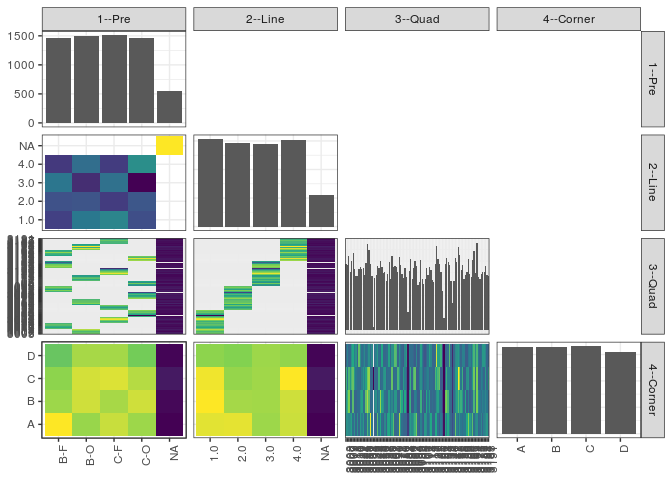

popler\_data\_organizatonal\_hierarchy
================
Hao Ye, Ellen Bledsoe
5/21/2019

``` r
library(tidyverse)

all_data <- readRDS("list_df_full.RDS")
df <- as_tibble(all_data[[params$dataset_index]])

cat("My project metadata key is ", 
    df$proj_metadata_key[1], "!!")
```

    ## My project metadata key is  27 !!

``` r
# figure out the spatial replication levels
df %>% 
  select(starts_with("spatial_replication_level")) %>%
  NCOL() %>%
  {./2} -> num_sr_levels
```

``` r
# transform the names of the variables
#   - get rid of the `spatial_replication_level_#_label` columns
sr_vars <- character(num_sr_levels)
for (i in seq(num_sr_levels))
{
  new_name <- paste0(i, "--", as.character(df[[1, paste0("spatial_replication_level_", i, "_label")]]))
  old_name <- paste0("spatial_replication_level_", i)
  sr_vars[i] <- new_name
  df <- rename(df, !!new_name := !!old_name)
}
```

``` r
# extract just the spatial replication level data
data_organization <- df %>%
  select(sr_vars)
```

``` r
# make pair-wise density plots to summarize organizational structure:
# 
library(GGally)
my_bin <- function(data, mapping, ...) {
  ggplot(data = data, mapping = mapping) +
    geom_bin2d(...) +
    scale_fill_viridis_c()
}

pm <- ggpairs(data_organization, 
                      lower = list(discrete = my_bin), 
                      upper = list(discrete = "blank"), 
              cardinality_threshold = NULL) + 
  theme_bw() + 
  theme(axis.text.x = element_text(angle = 90, hjust = 1))

print(pm)
```

    ## plot: [1,1] [==>------------------------------------------] 6% est: 0s
    ## plot: [1,2] [=====>---------------------------------------] 12% est:10s
    ## plot: [1,3] [=======>-------------------------------------] 19% est: 6s
    ## plot: [1,4] [==========>----------------------------------] 25% est: 4s
    ## plot: [2,1] [=============>-------------------------------] 31% est: 3s
    ## plot: [2,2] [================>----------------------------] 38% est: 3s
    ## plot: [2,3] [===================>-------------------------] 44% est: 2s
    ## plot: [2,4] [=====================>-----------------------] 50% est: 2s
    ## plot: [3,1] [========================>--------------------] 56% est: 1s
    ## plot: [3,2] [===========================>-----------------] 62% est: 2s
    ## plot: [3,3] [==============================>--------------] 69% est: 1s
    ## plot: [3,4] [=================================>-----------] 75% est: 1s
    ## plot: [4,1] [====================================>--------] 81% est: 1s
    ## plot: [4,2] [======================================>------] 88% est: 1s
    ## plot: [4,3] [=========================================>---] 94% est: 0s
    ## plot: [4,4] [=============================================]100% est: 0s



``` r
# generate contingency tables to summarize organizational structure:
#   - level_i vs. level_j (i < j)

cols <- expand.grid(i = seq(num_sr_levels), 
                    j = seq(num_sr_levels)) %>%
  filter(i < j)

sr_tables <- purrr::pmap(cols, function(i, j) {
    data_organization %>%
      select(sr_vars[c(i, j)]) %>%
      table()
  })
```

``` r
# loop over tables and output
purrr::map(sr_tables, knitr::kable)
```

    ## [[1]]
    ## 
    ## 
    ##        1.0   2.0   3.0   4.0    NA
    ## ----  ----  ----  ----  ----  ----
    ## B-F    351   367   401   345     0
    ## B-O    403   370   335   394     0
    ## C-F    417   347   397   347     0
    ## C-O    364   372   306   426     0
    ## NA       0     0     0     0   549
    ## 
    ## [[2]]
    ## 
    ## 
    ##        3003   3006   3007   3009   3011   3012   3018   3019   3020   3021   3022   3024   3026   3028   3030   3031   3032   3034   3038   3039   3040   3044   3045   3046   3048   3050   3052   3057   3058   3059   3060   3061   3062   3063   3070   3071   3072   3073   3076   3080   3081   3082   3083   3084   3086   3087   3092   3093   3094   3095   3099   3100   3104   3105   3106   3107   3111   3113   3114   3115   3117   3120   3121   3122   3125   3126   3127   3131   3133   3134   3135   3137   3138   3140   3141   3142   3147   3148   3152   3153   3155   3156   3158   3159   3160   3164   3166   3167   3169   3171   3174   3175   3177   3180   3181   3182   3184   3187   3188   3191
    ## ----  -----  -----  -----  -----  -----  -----  -----  -----  -----  -----  -----  -----  -----  -----  -----  -----  -----  -----  -----  -----  -----  -----  -----  -----  -----  -----  -----  -----  -----  -----  -----  -----  -----  -----  -----  -----  -----  -----  -----  -----  -----  -----  -----  -----  -----  -----  -----  -----  -----  -----  -----  -----  -----  -----  -----  -----  -----  -----  -----  -----  -----  -----  -----  -----  -----  -----  -----  -----  -----  -----  -----  -----  -----  -----  -----  -----  -----  -----  -----  -----  -----  -----  -----  -----  -----  -----  -----  -----  -----  -----  -----  -----  -----  -----  -----  -----  -----  -----  -----  -----
    ## B-F       0      0      0      0      0      0     61     53     55     61     63     58      0      0      0      0      0      0      0      0      0      0      0      0      0      0      0      0      0      0      0      0      0      0      0      0      0      0      0      0      0      0      0      0     57     69     51     59     68     63      0      0      0      0      0      0      0      0      0      0      0      0      0      0      0      0      0      0      0     67     72     69     66     49     29     49      0      0      0      0      0      0     52     55     57     72     55     54      0      0      0      0      0      0      0      0      0      0      0      0
    ## B-O      65     63     71     59     69     76      0      0      0      0      0      0      0      0      0      0      0      0      0      0      0      0      0      0      0      0      0      0      0      0      0     52     70     64     63     62     59      0      0      0      0      0      0      0      0      0      0      0      0      0      0      0      0      0      0      0     60     54     63     60     50     48      0      0      0      0      0      0      0      0      0      0      0      0      0      0      0      0      0      0      0      0      0      0      0      0      0      0     69     80     55     86     54     50      0      0      0      0      0      0
    ## C-F       0      0      0      0      0      0      0      0      0      0      0      0     62     56     67     84     81     67      0      0      0      0      0      0      0     63     57     56     49     56     66      0      0      0      0      0      0      0      0      0      0      0      0      0      0      0      0      0      0      0      0      0      0      0      0      0      0      0      0      0      0      0     68     83     72     65     57     39     13      0      0      0      0      0      0      0      0      0      0      0      0      0      0      0      0      0      0      0      0      0      0      0      0      0     57     58     58     64     56     54
    ## C-O       0      0      0      0      0      0      0      0      0      0      0      0      0      0      0      0      0      0     55      3     53     56     65     62     70      0      0      0      0      0      0      0      0      0      0      0      0     72     64     54     51     59     52     20      0      0      0      0      0      0     45     48     67     49     45     52      0      0      0      0      0      0      0      0      0      0      0      0      0      0      0      0      0      0      0      0     73     67     83     77     60     66      0      0      0      0      0      0      0      0      0      0      0      0      0      0      0      0      0      0
    ## NA        7      8      9      4      6      8      5      6      4      5      5      8      5      4      6      9      6      5      4      0      4      4      5      5      5      6      5      7      4      5      8      4     10      5      7      7      4      7      7      7      6      8      6      0      7      8      5      8      7      7      4      4      9      6      5      4      7      6      5      5      4      4      4      8      5      7      6      4      0      5      6      5      5      4      0      4      5      7      7      5      5      5      4      5      6      5      6      4      7      6      7      9      4      5      4      5      5      6      4      5
    ## 
    ## [[3]]
    ## 
    ## 
    ##        3003   3006   3007   3009   3011   3012   3018   3019   3020   3021   3022   3024   3026   3028   3030   3031   3032   3034   3038   3039   3040   3044   3045   3046   3048   3050   3052   3057   3058   3059   3060   3061   3062   3063   3070   3071   3072   3073   3076   3080   3081   3082   3083   3084   3086   3087   3092   3093   3094   3095   3099   3100   3104   3105   3106   3107   3111   3113   3114   3115   3117   3120   3121   3122   3125   3126   3127   3131   3133   3134   3135   3137   3138   3140   3141   3142   3147   3148   3152   3153   3155   3156   3158   3159   3160   3164   3166   3167   3169   3171   3174   3175   3177   3180   3181   3182   3184   3187   3188   3191
    ## ----  -----  -----  -----  -----  -----  -----  -----  -----  -----  -----  -----  -----  -----  -----  -----  -----  -----  -----  -----  -----  -----  -----  -----  -----  -----  -----  -----  -----  -----  -----  -----  -----  -----  -----  -----  -----  -----  -----  -----  -----  -----  -----  -----  -----  -----  -----  -----  -----  -----  -----  -----  -----  -----  -----  -----  -----  -----  -----  -----  -----  -----  -----  -----  -----  -----  -----  -----  -----  -----  -----  -----  -----  -----  -----  -----  -----  -----  -----  -----  -----  -----  -----  -----  -----  -----  -----  -----  -----  -----  -----  -----  -----  -----  -----  -----  -----  -----  -----  -----  -----
    ## 1.0      65     63     71     59     69     76     61     53     55     61     63     58     62     56     67     84     81     67     55      3     53     56     65     62     70      0      0      0      0      0      0      0      0      0      0      0      0      0      0      0      0      0      0      0      0      0      0      0      0      0      0      0      0      0      0      0      0      0      0      0      0      0      0      0      0      0      0      0      0      0      0      0      0      0      0      0      0      0      0      0      0      0      0      0      0      0      0      0      0      0      0      0      0      0      0      0      0      0      0      0
    ## 2.0       0      0      0      0      0      0      0      0      0      0      0      0      0      0      0      0      0      0      0      0      0      0      0      0      0     63     57     56     49     56     66     52     70     64     63     62     59     72     64     54     51     59     52     20     57     69     51     59     68     63      0      0      0      0      0      0      0      0      0      0      0      0      0      0      0      0      0      0      0      0      0      0      0      0      0      0      0      0      0      0      0      0      0      0      0      0      0      0      0      0      0      0      0      0      0      0      0      0      0      0
    ## 3.0       0      0      0      0      0      0      0      0      0      0      0      0      0      0      0      0      0      0      0      0      0      0      0      0      0      0      0      0      0      0      0      0      0      0      0      0      0      0      0      0      0      0      0      0      0      0      0      0      0      0     45     48     67     49     45     52     60     54     63     60     50     48     68     83     72     65     57     39     13     67     72     69     66     49     29     49      0      0      0      0      0      0      0      0      0      0      0      0      0      0      0      0      0      0      0      0      0      0      0      0
    ## 4.0       0      0      0      0      0      0      0      0      0      0      0      0      0      0      0      0      0      0      0      0      0      0      0      0      0      0      0      0      0      0      0      0      0      0      0      0      0      0      0      0      0      0      0      0      0      0      0      0      0      0      0      0      0      0      0      0      0      0      0      0      0      0      0      0      0      0      0      0      0      0      0      0      0      0      0      0     73     67     83     77     60     66     52     55     57     72     55     54     69     80     55     86     54     50     57     58     58     64     56     54
    ## NA        7      8      9      4      6      8      5      6      4      5      5      8      5      4      6      9      6      5      4      0      4      4      5      5      5      6      5      7      4      5      8      4     10      5      7      7      4      7      7      7      6      8      6      0      7      8      5      8      7      7      4      4      9      6      5      4      7      6      5      5      4      4      4      8      5      7      6      4      0      5      6      5      5      4      0      4      5      7      7      5      5      5      4      5      6      5      6      4      7      6      7      9      4      5      4      5      5      6      4      5
    ## 
    ## [[4]]
    ## 
    ## 
    ##          A     B     C     D
    ## ----  ----  ----  ----  ----
    ## B-F    406   364   358   336
    ## B-O    362   385   387   368
    ## C-F    382   368   391   367
    ## C-O    364   385   374   345
    ## NA     132   136   147   134
    ## 
    ## [[5]]
    ## 
    ## 
    ##          A     B     C     D
    ## ----  ----  ----  ----  ----
    ## 1.0    388   400   394   353
    ## 2.0    389   362   356   349
    ## 3.0    359   361   360   359
    ## 4.0    378   379   400   355
    ## NA     132   136   147   134
    ## 
    ## [[6]]
    ## 
    ## 
    ##          A    B    C    D
    ## -----  ---  ---  ---  ---
    ## 3003    18   19   22   13
    ## 3006    18   22   15   16
    ## 3007    17   27   23   13
    ## 3009    18   13   19   13
    ## 3011    20   14   23   18
    ## 3012    14   24   25   21
    ## 3018    18   13   19   16
    ## 3019    13   13   15   18
    ## 3020    18   14   14   13
    ## 3021    13   14   14   25
    ## 3022    19   18   13   18
    ## 3024    16   20   16   14
    ## 3026    19   14   19   15
    ## 3028    13   14   16   17
    ## 3030    14   25   20   14
    ## 3031    23   29   26   15
    ## 3032    17   24   28   18
    ## 3034    32   13   13   14
    ## 3038    15   14   13   17
    ## 3039     0    0    3    0
    ## 3040    13   16   14   14
    ## 3044    13   18   13   16
    ## 3045    24   14   13   19
    ## 3046    15   16   22   14
    ## 3048    21   28   13   13
    ## 3050    14   20   14   21
    ## 3052    13   18   18   13
    ## 3057    17   14   19   13
    ## 3058    13   13   13   14
    ## 3059    20   13   14   14
    ## 3060    21   19   14   20
    ## 3061    15   15   13   13
    ## 3062    20   17   25   18
    ## 3063    24   14   13   18
    ## 3070    13   19   14   24
    ## 3071    13   19   14   23
    ## 3072    14   13   23   13
    ## 3073    29   13   19   18
    ## 3076    19   23   14   15
    ## 3080    14   21   13   13
    ## 3081    13   13   19   12
    ## 3082    13   21   16   17
    ## 3083    13   13   13   19
    ## 3084     8    4    4    4
    ## 3086    16   19   14   15
    ## 3087    19   22   22   14
    ## 3092    17   12   13   14
    ## 3093    19   12   23   13
    ## 3094    22   16   25   12
    ## 3095    26   15   12   17
    ## 3099    13   12   12   12
    ## 3100    12   12   15   13
    ## 3104    16   22   18   20
    ## 3105    13   12   15   15
    ## 3106    12   14   12   12
    ## 3107    19   12   14   11
    ## 3111    18   21   15   13
    ## 3113    14   15   16   15
    ## 3114    16   19   13   20
    ## 3115    21   13   14   17
    ## 3117    13   14   14   13
    ## 3120    13   13   13   13
    ## 3121    21   14   23   14
    ## 3122    21   18   21   31
    ## 3125    14   20   23   20
    ## 3126    12   15   25   20
    ## 3127    15   14   12   22
    ## 3131    12    9   12   10
    ## 3133     4    3    3    3
    ## 3134    20   25   14   13
    ## 3135    16   27   22   13
    ## 3137    21   23   16   14
    ## 3138    16   15   16   24
    ## 3140    13   13   14   13
    ## 3141    10    6    7    6
    ## 3142    13   14   13   13
    ## 3147    25   17   19   17
    ## 3148    16   20   20   18
    ## 3152    14   24   33   19
    ## 3153    18   20   28   16
    ## 3155    15   22   15   13
    ## 3156    14   19   22   16
    ## 3158    15   13   12   16
    ## 3159    15   21   12   12
    ## 3160    21   12   18   12
    ## 3164    27   16   19   15
    ## 3166    20   12   13   16
    ## 3167    17   13   14   14
    ## 3169    24   14   19   19
    ## 3171    14   23   26   23
    ## 3174    17   14   14   17
    ## 3175    18   27   27   23
    ## 3177    13   17   13   15
    ## 3180    14   15   13   13
    ## 3181    17   14   16   14
    ## 3182    13   16   15   19
    ## 3184    16   15   13   19
    ## 3187    17   17   19   17
    ## 3188    19   15   13   13
    ## 3191    13   13   20   13
