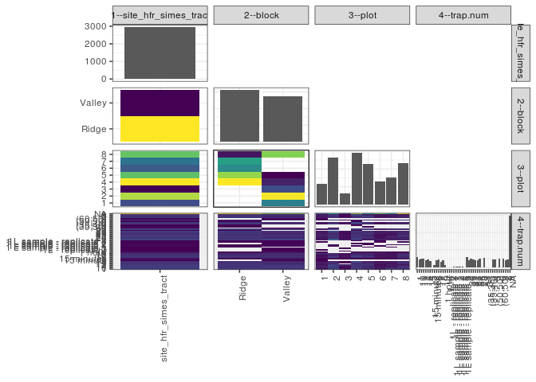

popler\_data\_organizatonal\_hierarchy
================
Hao Ye, Ellen Bledsoe
5/21/2019

``` r
library(tidyverse)

all_data <- readRDS("list_df_full.RDS")
df <- as_tibble(all_data[[params$dataset_index]])

cat("My project metadata key is ", 
    df$proj_metadata_key[1], "!!")
```

    ## My project metadata key is  465 !!

``` r
# figure out the spatial replication levels
df %>% 
  select(starts_with("spatial_replication_level")) %>%
  NCOL() %>%
  {./2} -> num_sr_levels
```

``` r
# transform the names of the variables
#   - get rid of the `spatial_replication_level_#_label` columns
sr_vars <- character(num_sr_levels)
for (i in seq(num_sr_levels))
{
  new_name <- paste0(i, "--", as.character(df[[1, paste0("spatial_replication_level_", i, "_label")]]))
  old_name <- paste0("spatial_replication_level_", i)
  sr_vars[i] <- new_name
  df <- rename(df, !!new_name := !!old_name)
}
```

``` r
# extract just the spatial replication level data
data_organization <- df %>%
  select(sr_vars)
```

``` r
# make pair-wise density plots to summarize organizational structure:
# 
library(GGally)
my_bin <- function(data, mapping, ...) {
  ggplot(data = data, mapping = mapping) +
    geom_bin2d(...) +
    scale_fill_viridis_c()
}

pm <- ggpairs(data_organization, 
                      lower = list(discrete = my_bin), 
                      upper = list(discrete = "blank"), 
              cardinality_threshold = NULL) + 
  theme_bw() + 
  theme(axis.text.x = element_text(angle = 90, hjust = 1))

print(pm)
```

    ## plot: [1,1] [==>------------------------------------------] 6% est: 0s
    ## plot: [1,2] [=====>---------------------------------------] 12% est: 1s
    ## plot: [1,3] [=======>-------------------------------------] 19% est: 0s
    ## plot: [1,4] [==========>----------------------------------] 25% est: 0s
    ## plot: [2,1] [=============>-------------------------------] 31% est: 0s
    ## plot: [2,2] [================>----------------------------] 38% est: 0s
    ## plot: [2,3] [===================>-------------------------] 44% est: 0s
    ## plot: [2,4] [=====================>-----------------------] 50% est: 0s
    ## plot: [3,1] [========================>--------------------] 56% est: 0s
    ## plot: [3,2] [===========================>-----------------] 62% est: 0s
    ## plot: [3,3] [==============================>--------------] 69% est: 0s
    ## plot: [3,4] [=================================>-----------] 75% est: 0s
    ## plot: [4,1] [====================================>--------] 81% est: 0s
    ## plot: [4,2] [======================================>------] 88% est: 0s
    ## plot: [4,3] [=========================================>---] 94% est: 0s
    ## plot: [4,4] [=============================================]100% est: 0s



``` r
# generate contingency tables to summarize organizational structure:
#   - level_i vs. level_j (i < j)

cols <- expand.grid(i = seq(num_sr_levels), 
                    j = seq(num_sr_levels)) %>%
  filter(i < j)

sr_tables <- purrr::pmap(cols, function(i, j) {
    data_organization %>%
      select(sr_vars[c(i, j)]) %>%
      table()
  })
```

``` r
# loop over tables and output
purrr::map(sr_tables, knitr::kable)
```

    ## [[1]]
    ## 
    ## 
    ##                         Ridge   Valley
    ## ---------------------  ------  -------
    ## site_hfr_simes_tract     1564     1377
    ## 
    ## [[2]]
    ## 
    ## 
    ##                           1     2     3     4     5     6     7     8
    ## ---------------------  ----  ----  ----  ----  ----  ----  ----  ----
    ## site_hfr_simes_tract    236   525   128   581   452   257   301   461
    ## 
    ## [[3]]
    ## 
    ## 
    ##             1     2     3     4     5     6     7     8
    ## -------  ----  ----  ----  ----  ----  ----  ----  ----
    ## Ridge       0     0     0   531   444   257   301    31
    ## Valley    236   525   128    50     8     0     0   430
    ## 
    ## [[4]]
    ## 
    ## 
    ##                           1   10    11   12   13   14   15   15 minute   15 minutes   16   17   18   19   1 hour   1 hr   1L - replicate 2   1L - replicate 3   1 L sample - replicate 1   1L sample - replicate 1   1 L sample - replicate 2   1L sample - replicate 2   1 L sample - replicate 3   1L sample - replicate 3     2   20   21   22   23   24    25   28     3   31   (35;35)   (35;40)    4    5   (50;50)    6   (60;50)    7    8    9    NA
    ## ---------------------  ----  ---  ----  ---  ---  ---  ---  ----------  -----------  ---  ---  ---  ---  -------  -----  -----------------  -----------------  -------------------------  ------------------------  -------------------------  ------------------------  -------------------------  ------------------------  ----  ---  ---  ---  ---  ---  ----  ---  ----  ---  --------  --------  ---  ---  --------  ---  --------  ---  ---  ---  ----
    ## site_hfr_simes_tract    118   87   103   96   77   86   75           1           24   82   90   66   79       24      1                  1                  1                          4                         6                          9                         4                          5                         2   118   82   96   92   78   82   100    2   105    1         1         2   93   89         1   97         1   99   77   87   597
    ## 
    ## [[5]]
    ## 
    ## 
    ##            1   10   11   12   13   14   15   15 minute   15 minutes   16   17   18   19   1 hour   1 hr   1L - replicate 2   1L - replicate 3   1 L sample - replicate 1   1L sample - replicate 1   1 L sample - replicate 2   1L sample - replicate 2   1 L sample - replicate 3   1L sample - replicate 3    2   20   21   22   23   24   25   28    3   31   (35;35)   (35;40)    4    5   (50;50)    6   (60;50)    7    8    9    NA
    ## -------  ---  ---  ---  ---  ---  ---  ---  ----------  -----------  ---  ---  ---  ---  -------  -----  -----------------  -----------------  -------------------------  ------------------------  -------------------------  ------------------------  -------------------------  ------------------------  ---  ---  ---  ---  ---  ---  ---  ---  ---  ---  --------  --------  ---  ---  --------  ---  --------  ---  ---  ---  ----
    ## Ridge     60   50   43   50   43   45   43           0            8   39   47   35   36       11      0                  0                  0                          4                         2                          4                         0                          1                         1   53   45   57   42   47   48   54    2   60    0         1         2   53   51         1   47         0   49   46   48   336
    ## Valley    58   37   60   46   34   41   32           1           16   43   43   31   43       13      1                  1                  1                          0                         4                          5                         4                          4                         1   65   37   39   50   31   34   46    0   45    1         0         0   40   38         0   50         1   50   31   39   261
    ## 
    ## [[6]]
    ## 
    ## 
    ##   1   10   11   12   13   14   15   15 minute   15 minutes   16   17   18   19   1 hour   1 hr   1L - replicate 2   1L - replicate 3   1 L sample - replicate 1   1L sample - replicate 1   1 L sample - replicate 2   1L sample - replicate 2   1 L sample - replicate 3   1L sample - replicate 3    2   20   21   22   23   24   25   28    3   31   (35;35)   (35;40)    4    5   (50;50)    6   (60;50)    7    8    9    NA
    ## ---  ---  ---  ---  ---  ---  ---  ----------  -----------  ---  ---  ---  ---  -------  -----  -----------------  -----------------  -------------------------  ------------------------  -------------------------  ------------------------  -------------------------  ------------------------  ---  ---  ---  ---  ---  ---  ---  ---  ---  ---  --------  --------  ---  ---  --------  ---  --------  ---  ---  ---  ----
    ##   8    6   12    6    8    8    4           1            2    8    4    4   13        3      0                  1                  0                          0                         0                          0                         0                          1                         0    8    6    7   11    9    8    6    0    8    0         0         0    3    7         0    8         1   10    7    8    40
    ##  26   15   25   22   12   15   10           0            2   20   16    8   14        0      0                  0                  0                          0                         2                          1                         0                          0                         0   36   15   17   16   13   14   23    0   23    1         0         0   24   12         0   19         0   20   13   17    74
    ##   5    2    4   11    0    1    3           0            1    3    7    3    4        0      1                  0                  1                          0                         0                          0                         0                          0                         0    8    4    3    6    2    3    5    0    0    0         0         0    5    6         0    2         0   10    2    3    23
    ##  19   20   18   19   12   22   24           0            2   15   22   13   12        5      0                  0                  0                          0                         2                          0                         3                          0                         1   21   21   14   18   16   15   20    2   20    0         0         2   18   27         1   15         0   15   15   25   107
    ##  14   14   13   17   19   10   13           0            3   13   16   11   12        5      0                  0                  0                          1                         0                          1                         1                          0                         0    9   15   20   11   19   16   16    0   22    0         1         0   17   14         0   17         0   12   20   11    69
    ##   7    7    6    4    8    7    2           0            2    6    6    4    7        5      0                  0                  0                          0                         2                          0                         0                          1                         1   11    4    7    4    5    8    8    0    6    0         0         0    7    3         0    8         0   11    4    6    90
    ##  20   10    7    9    4    8    6           0            4    5    5    5    5        2      0                  0                  0                          3                         0                          3                         0                          0                         0   13    7   16    7    5    6   12    0   12    0         0         0   10   10         0    9         0   10    6    8    74
    ##  19   13   18    8   14   15   13           0            8   12   14   18   12        4      0                  0                  0                          0                         0                          4                         0                          3                         0   12   10   12   19    9   12   10    0   14    0         0         0    9   10         0   19         0   11   10    9   120
