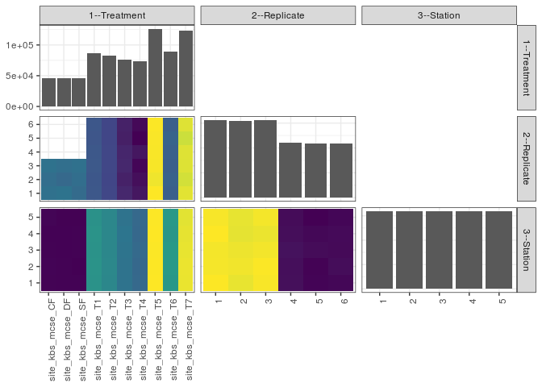

popler\_data\_organizatonal\_hierarchy
================
Hao Ye, Ellen Bledsoe
5/21/2019

``` r
library(tidyverse)

all_data <- readRDS("list_df_full.RDS")
df <- as_tibble(all_data[[params$dataset_index]])

cat("My project metadata key is ", 
    df$proj_metadata_key[1], "!!")
```

    ## My project metadata key is  501 !!

``` r
# figure out the spatial replication levels
df %>% 
  select(starts_with("spatial_replication_level")) %>%
  NCOL() %>%
  {./2} -> num_sr_levels
```

``` r
# transform the names of the variables
#   - get rid of the `spatial_replication_level_#_label` columns
sr_vars <- character(num_sr_levels)
for (i in seq(num_sr_levels))
{
  new_name <- paste0(i, "--", as.character(df[[1, paste0("spatial_replication_level_", i, "_label")]]))
  old_name <- paste0("spatial_replication_level_", i)
  sr_vars[i] <- new_name
  df <- rename(df, !!new_name := !!old_name)
}
```

``` r
# extract just the spatial replication level data
data_organization <- df %>%
  select(sr_vars)
```

``` r
# make pair-wise density plots to summarize organizational structure:
# 
library(GGally)
my_bin <- function(data, mapping, ...) {
  ggplot(data = data, mapping = mapping) +
    geom_bin2d(...) +
    scale_fill_viridis_c()
}

pm <- ggpairs(data_organization, 
                      lower = list(discrete = my_bin), 
                      upper = list(discrete = "blank"), 
              cardinality_threshold = NULL) + 
  theme_bw() + 
  theme(axis.text.x = element_text(angle = 90, hjust = 1))

print(pm)
```



``` r
# generate contingency tables to summarize organizational structure:
#   - level_i vs. level_j (i < j)

cols <- expand.grid(i = seq(num_sr_levels), 
                    j = seq(num_sr_levels)) %>%
  filter(i < j)

sr_tables <- purrr::pmap(cols, function(i, j) {
    data_organization %>%
      select(sr_vars[c(i, j)]) %>%
      table()
  })
```

``` r
# loop over tables and output
purrr::map(sr_tables, knitr::kable)
```

    ## [[1]]
    ## 
    ## 
    ##                         1       2       3       4       5       6
    ## -----------------  ------  ------  ------  ------  ------  ------
    ## site_kbs_mcse_CF    15356   15233   15406       0       0       0
    ## site_kbs_mcse_DF    15437   15056   15293       0       0       0
    ## site_kbs_mcse_SF    15154   15250   15361       0       0       0
    ## site_kbs_mcse_T1    14450   14439   14515   14466   14394   14439
    ## site_kbs_mcse_T2    13863   13825   13872   13866   13839   13828
    ## site_kbs_mcse_T3    12859   12664   12852   12806   12605   12665
    ## site_kbs_mcse_T4    12375   12200   12032   12367   11938   12082
    ## site_kbs_mcse_T5    21111   20901   21023   21036   21046   21083
    ## site_kbs_mcse_T6    14719   14834   14705   14789   14894   14704
    ## site_kbs_mcse_T7    20689   20460   20622   20640   20354   20630
    ## 
    ## [[2]]
    ## 
    ## 
    ##                         1       2       3       4       5
    ## -----------------  ------  ------  ------  ------  ------
    ## site_kbs_mcse_CF     9197    9223    9189    9154    9232
    ## site_kbs_mcse_DF     9174    9172    9153    9149    9138
    ## site_kbs_mcse_SF     9178    9109    9170    9169    9139
    ## site_kbs_mcse_T1    17321   17382   17361   17383   17256
    ## site_kbs_mcse_T2    16592   16690   16610   16600   16601
    ## site_kbs_mcse_T3    15246   15259   15307   15385   15254
    ## site_kbs_mcse_T4    14613   14568   14657   14540   14616
    ## site_kbs_mcse_T5    25265   25246   25210   25252   25227
    ## site_kbs_mcse_T6    17690   17780   17801   17622   17752
    ## site_kbs_mcse_T7    24761   24770   24699   24645   24520
    ## 
    ## [[3]]
    ## 
    ## 
    ##      1       2       3       4       5
    ## ------  ------  ------  ------  ------
    ##  31265   31152   31138   31276   31182
    ##  30937   31082   31022   30894   30927
    ##  31197   31246   31116   30988   31134
    ##  22008   21987   22060   21981   21934
    ##  21788   21773   21925   21855   21729
    ##  21842   21959   21896   21905   21829
