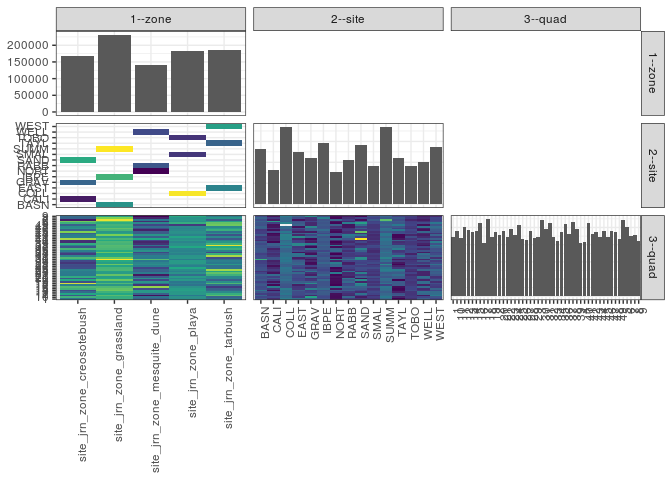

popler\_data\_organizatonal\_hierarchy
================
Hao Ye, Ellen Bledsoe
5/21/2019

``` r
library(tidyverse)

all_data <- readRDS("list_df_full.RDS")
df <- as_tibble(all_data[[params$dataset_index]])

cat("My project metadata key is ", 
    df$proj_metadata_key[1], "!!")
```

    ## My project metadata key is  679 !!

``` r
# figure out the spatial replication levels
df %>% 
  select(starts_with("spatial_replication_level")) %>%
  NCOL() %>%
  {./2} -> num_sr_levels
```

``` r
# transform the names of the variables
#   - get rid of the `spatial_replication_level_#_label` columns
sr_vars <- character(num_sr_levels)
for (i in seq(num_sr_levels))
{
  new_name <- paste0(i, "--", as.character(df[[1, paste0("spatial_replication_level_", i, "_label")]]))
  old_name <- paste0("spatial_replication_level_", i)
  sr_vars[i] <- new_name
  df <- rename(df, !!new_name := !!old_name)
}
```

``` r
# extract just the spatial replication level data
data_organization <- df %>%
  select(sr_vars)
```

``` r
# make pair-wise density plots to summarize organizational structure:
# 
library(GGally)
my_bin <- function(data, mapping, ...) {
  ggplot(data = data, mapping = mapping) +
    geom_bin2d(...) +
    scale_fill_viridis_c()
}

pm <- ggpairs(data_organization, 
                      lower = list(discrete = my_bin), 
                      upper = list(discrete = "blank"), 
              cardinality_threshold = NULL) + 
  theme_bw() + 
  theme(axis.text.x = element_text(angle = 90, hjust = 1))

print(pm)
```



``` r
# generate contingency tables to summarize organizational structure:
#   - level_i vs. level_j (i < j)

cols <- expand.grid(i = seq(num_sr_levels), 
                    j = seq(num_sr_levels)) %>%
  filter(i < j)

sr_tables <- purrr::pmap(cols, function(i, j) {
    data_organization %>%
      select(sr_vars[c(i, j)]) %>%
      table()
  })
```

``` r
# loop over tables and output
purrr::map(sr_tables, knitr::kable)
```

    ## [[1]]
    ## 
    ## 
    ##                                 BASN    CALI    COLL    EAST    GRAV    IBPE    NORT    RABB    SAND    SMAL    SUMM    TAYL    TOBO    WELL    WEST
    ## ----------------------------  ------  ------  ------  ------  ------  ------  ------  ------  ------  ------  ------  ------  ------  ------  ------
    ## site_jrn_zone_creosotebush         0   41381       0       0   55598       0       0       0   71068       0       0       0       0       0       0
    ## site_jrn_zone_grassland        65835       0       0       0       0   73121       0       0       0       0   92248       0       0       0       0
    ## site_jrn_zone_mesquite_dune        0       0       0       0       0       0   37961   52653       0       0       0       0       0   50061       0
    ## site_jrn_zone_playa                0       0   91694       0       0       0       0       0       0   46151       0       0   45715       0       0
    ## site_jrn_zone_tarbush              0       0       0   62284       0       0       0       0       0       0       0   55354       0       0   68551
    ## 
    ## [[2]]
    ## 
    ## 
    ##                                   1     10     11     12     13     14     15     16     17     18     19      2     20     21     22     23     24     25     26     27     28     29      3     30     31     32     33     34     35     36     37     38     39      4     40     41     42     43     44     45     46     47     48     49      5      6      7      8      9
    ## ----------------------------  -----  -----  -----  -----  -----  -----  -----  -----  -----  -----  -----  -----  -----  -----  -----  -----  -----  -----  -----  -----  -----  -----  -----  -----  -----  -----  -----  -----  -----  -----  -----  -----  -----  -----  -----  -----  -----  -----  -----  -----  -----  -----  -----  -----  -----  -----  -----  -----  -----
    ## site_jrn_zone_creosotebush     3154   4648   2543   4354   2972   2331   4625   4860   3447   6249   2361   4412   2551   4484   3289   3326   3323   3542   2372   2272   2380   1855   2204   4135   4802   3558   1979   2627   3414   4718   2504   3418   4499   1706   1759   5867   3492   3374   2755   5542   2799   3904   3736   2758   4594   5334   1359   2890   2970
    ## site_jrn_zone_grassland        4548   4523   4892   4356   4616   5244   5104   4810   3941   4797   4053   5213   4339   4127   5119   4074   4178   4755   4688   4277   5219   4148   4415   6641   5253   4410   4297   5187   4418   4741   4822   4891   4676   4758   4406   4717   4052   5466   4246   3962   4731   5041   4545   4668   4451   5133   6439   5548   4269
    ## site_jrn_zone_mesquite_dune    2744   3154   1179   2749   4011   4050   2335   5716   1807   3200   3915   2257   3828   2697   1307   3350   2707   2811   2146   3393   3775   3554   3234   4922   3336   3375   2899   2199   3850   3435   1898   3110   1753   1546   2129   4381   2714   3933   2657   2642   1452   2272   3034   2164   3617   1679   3208   1548   1003
    ## site_jrn_zone_playa            3771   3834   3287   4009   3998   4193   4097   3836   3137   3400   3202   3982   3538   4076   3013   3867   3439   3705   4386   3416   3669   4042   4033   3368   3975   3913   3476   3680   3486   3552   4380   3863   3831   3556   3979   3777   4292   3530   3791   3837   3641   3518   3611   1924   4517   3829   3970   3924   4410
    ## site_jrn_zone_tarbush          3149   2821   4939   4524   3654   2931   2739   1951   3020   4778   3835   2716   3545   3569   4601   5053   4265   5793   3143   3123   3997   3265   3433   3060   2326   5904   4566   2288   3468   4588   4387   6416   4670   3970   3490   2557   3633   2447   3759   3094   4561   4099   3620   5278   5095   4155   2635   3925   3354
    ## 
    ## [[3]]
    ## 
    ## 
    ##            1     10     11     12     13     14     15     16     17     18     19      2     20     21     22     23     24     25     26     27     28     29      3     30     31     32     33     34     35     36     37     38     39      4     40     41     42     43     44     45     46     47     48     49      5      6      7      8      9
    ## -----  -----  -----  -----  -----  -----  -----  -----  -----  -----  -----  -----  -----  -----  -----  -----  -----  -----  -----  -----  -----  -----  -----  -----  -----  -----  -----  -----  -----  -----  -----  -----  -----  -----  -----  -----  -----  -----  -----  -----  -----  -----  -----  -----  -----  -----  -----  -----  -----  -----
    ## BASN    1413   1185   1681   1008   1442   2009   1291   1216   1496   1360   1053   1539   1305   1330   1629   1109    801   1390   1338   1183   1240   1018   1006   3314   1268   1235   1034   1416   1483   1556   1416   1444   1206   1454    708   1004    874   1488    978   1002    898   1619   1679   1379   1426   1680   1327   1711   1194
    ## CALI     686   1199    826    869   1202    210    830   2239    154   1097    282    984   1596   1008   1891    272    638    928    635    222    755    631    480   1389   1425    836    688    958    802    505   1289   1625   1616    139    580    503    582    244    137   1276    231    813    301    268   1003   2857    428    955    297
    ## COLL    2210   1932   1767   2104   1964   1975   2217   1379   1432   1559   1644   1956   1780   1873   1615   1867   1989   1985   2068   1712   1658   1920   2117   2012   2124   1977   2008   1846   1684   1759   2109   1599   2154   2000   1825   2290   2278   2347   1711   2128   1450   1807   1849      0   2351   1777   1844   1882   2160
    ## EAST    1942    901   1113   1244   1260   1565    896    847    458   1955   1581   1150   1080   1233   1236   1853    948   1784   1050   1248   1912   1686   1558    868    450   1956   2057    280   1210    995    860   2457   2468   1042   1025    587   2566    597   1639    448    900   1286    265   1714   1499   1385    274   1271   1685
    ## GRAV    1672   3048    628   1469   1099    979   2310    943   1010   2537   1566    860    689   1760    436    734   2028   1397    463   1062    243    169    593    283    753   1862    238    570    927   1862    147    832   2203    393    541    142   1812   1077   1883    399   1632   1529   2449    607    614   1060    710    812   2566
    ## IBPE    1361   1203   1318   1544   1565   1385   1870   1509   1421   1404   1398   1802   1112   1339   1782   1435   1332   1123   1270   1490   1453   1781   1429   1547   1613   1304   1414   1718   1137   1541   1500   1755   1533   1418   1618   1616   1399   1870   1169   1468   1894   1451   1402   1512   1412   1505   1383   2310   1306
    ## NORT     213    182    198    212   1132   1583    301   2086     87    173    179    213    159    304    106   2205    131    318    107   1780   1781   2240    560   2427    171    865     72    688   1815   1673    154   2034    243     75    708   1756    129   1313   1262    148    274   1013    777   1642    115    273   1752    135    197
    ## RABB     965   1795    609    727    938   1649   1406   1751   1256   1115   1829   1512   2034    437    680    607   2063    738   1008   1089    523    439   1167   1887   1340    888    898   1102    718   1091    555    783   1000    617    951   1370   1934   2198    798    689    940    822    300    294   2274    645   1059    770    393
    ## SAND     796    401   1089   2016    671   1142   1485   1678   2283   2615    513   2568    266   1716    962   2320    657   1217   1274    988   1382   1055   1131   2463   2624    860   1053   1099   1685   2351   1068    961    680   1174    638   5222   1098   2053    735   3867    936   1562    986   1883   2977   1417    221   1123    107
    ## SMAL     809    977    665   1084   1205    960    801   1376    812   1001    759   1066    876   1298    740    935    795    934   1263    989    807   1217   1052    718    912    804    960    655    620    792   1134   1245    823    698    986    677    726    619    869    711   1021    872    854    849   1134   1083   1553   1120   1295
    ## SUMM    1774   2135   1893   1804   1609   1850   1943   2085   1024   2033   1602   1872   1922   1458   1708   1530   2045   2242   2080   1604   2526   1349   1980   1780   2372   1871   1849   2053   1798   1644   1906   1692   1937   1886   2080   2097   1779   2108   2099   1492   1939   1971   1464   1777   1613   1948   3729   1527   1769
    ## TAYL      88    497   1617   1373    507    167    110    202   1550   1518   1550     99   1521   1564   1936   1564   1808   2192    884    503    104    317    914    362   1146   2281   1262    942    848   2252   1767   1844    820    694   1646    342    133    129   1318   1243   2130   1092   1424   2144   1479   1574   1279   1530   1088
    ## TOBO     752    925    855    821    829   1258   1079   1081    893    840    799    960    882    905    658   1065    655    786   1055    715   1204    905    864    638    939   1132    508   1179   1182   1001   1137   1019    854    858   1168    810   1288    564   1211    998   1170    839    908   1075   1032    969    573    922    955
    ## WELL    1566   1177    372   1810   1941    818    628   1879    464   1912   1907    532   1635   1956    521    538    513   1755   1031    524   1471    875   1507    608   1825   1622   1929    409   1317    671   1189    293    510    854    470   1255    651    422    597   1805    238    437   1957    228   1228    761    397    643    413
    ## WEST    1119   1423   2209   1907   1887   1199   1733    902   1012   1305    704   1467    944    772   1429   1636   1509   1817   1209   1372   1981   1262    961   1830    730   1667   1247   1066   1410   1341   1760   2115   1382   2234    819   1628    934   1721    802   1403   1531   1721   1931   1420   2117   1196   1082   1124    581
